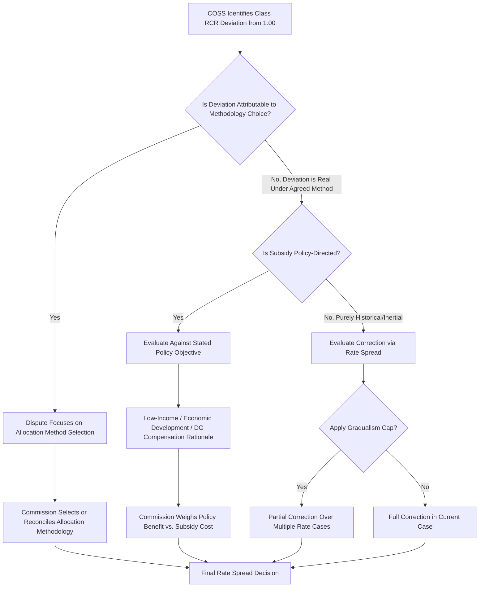

## Interclass Subsidization Debates

### Overview

Interclass subsidization refers to the condition in utility ratemaking where one customer class pays rates that recover more than its allocated cost of service (a net contributor), while another class pays rates that recover less than its allocated cost of service (a net recipient), effectively transferring cost recovery burden between classes. The "debate" framing reflects the fact that interclass subsidization is not merely a technical calculation but a contested policy question: reasonable parties disagree on whether a given subsidy is a flaw to be corrected, an intentional and defensible policy choice, or an unavoidable consequence of legitimate cost allocation methodology choices.

This topic sits downstream of Cost of Service Studies (COSS) and Revenue-to-Cost Ratio (RCR) analysis: the COSS and RCR calculations quantify the subsidy; the interclass subsidization debate concerns what, if anything, should be done about it.

### Defining and Quantifying the Subsidy

The dollar magnitude of subsidy for a class is calculated as:

$$Subsidy_{class} = Revenue_{class} - Cost_{class}$$

A positive value indicates the class is a net subsidizer (over-recovering, RCR > 1.00); a negative value indicates the class is a net subsidy recipient (under-recovering, RCR < 1.00). Across all classes, subsidies sum to approximately zero, since total revenue must equal (or closely approximate) the total authorized revenue requirement:

$$\sum_{i} Subsidy_i \approx 0$$

**Key Points**

- Subsidies are inherently relative to the specific COSS methodology used; a different classification or allocation method can shrink, grow, or even reverse the sign of a class's calculated subsidy.
- The existence of a nonzero subsidy is not itself proof of an actionable problem — it must be evaluated against the specific policy or economic rationale, if any, offered to justify it.
- Subsidies can exist not only between major customer classes (residential vs. commercial vs. industrial) but also between rate schedules within a class (e.g., time-of-use vs. standard residential rate) and between usage tiers within an inclining block rate design.

### Common Sources of Interclass Subsidization

**1. Cost Allocation Methodology Choices**

Different, all methodologically defensible, allocation methods can produce materially different cost assignments to the same class:

- Coincident Peak (CP) demand allocators assign demand-related costs based on a class's contribution to system peak, tending to allocate more cost to classes coincident with system peak (often residential/commercial in summer-peaking systems).
- Non-Coincident Peak (NCP) or Average and Excess (A&E) demand allocators assign more weight to a class's own individual peak, tending to shift more cost onto classes with poor load factors regardless of system coincidence.
- [Inference] Because no single allocation method is universally regarded as objectively "correct," the choice of method is itself frequently the substantive subject of interclass subsidy disputes rather than a settled input to them.

**2. Historical Rate Design Inertia**

Rates set in past rate cases persist and are adjusted incrementally; a class's rates may reflect cost relationships and consumption patterns that existed years or decades earlier and have since diverged from current cost causation.

**3. Explicit Policy-Driven Rate Design**

Commissions and legislatures sometimes intentionally set rates that deviate from strict cost causation to achieve non-cost-based policy objectives:

- **Low-income/lifeline rates**: Below-cost rates for low-usage or income-qualified residential customers, subsidized by other residential or commercial/industrial customers.
- **Economic development rates**: Discounted rates offered to attract or retain large industrial load, on the theory that the resulting system-wide fixed cost spreading benefits all other customers even though the specific class receiving the discount is priced below its allocated cost.
- **Renewable energy or energy efficiency program cost recovery**: Program costs allocated across all classes regardless of differential participation rates, creating a subsidy from non-participating to participating customers.
- **Net metering/distributed generation compensation**: Widely debated as creating a subsidy from non-DG customers to DG-owning customers, particularly where DG customers are compensated at retail rates that include allocated fixed distribution costs they no longer fully pay through volumetric charges.

**4. Rate Design Structure Within a Class**

Declining block rates, inclining block rates, minimum bills, and flat customer charges each redistribute cost recovery among high- and low-usage customers within a single class, creating "intraclass" subsidization that parallels the interclass debate at a finer grain.

**5. Gradualism/Rate Cap Policy**

As discussed in RCR and rate gradualism analysis, deliberate policy caps on how quickly a class's rates can move toward cost parity mean that even where a COSS clearly identifies a subsidy, correcting it is deferred, effectively perpetuating the subsidy across multiple rate cases by design.

### The Core Policy Debate: Efficiency vs. Other Ratemaking Objectives

**Arguments for Minimizing/Eliminating Interclass Subsidies (Cost-Causation View)**

- Aligns with Bonbright's principle that rates should reflect cost causation, promoting economically efficient consumption and investment decisions.
- Reduces price distortions that can lead to inefficient customer behavior (e.g., over-consumption by under-recovering classes, under-consumption or self-generation "flight" by over-recovering classes).
- Improves regulatory transparency and reduces the risk of large industrial/commercial customers seeking alternative energy supply arrangements (bypass) if they perceive themselves as subsidizing other classes.

**Arguments for Tolerating or Directing Certain Subsidies (Broader Public Interest View)**

- Universal service and affordability goals may justify below-cost residential or low-income rates as a matter of social policy, particularly for a service (electricity, water) considered essential.
- Rate stability and gradualism protect customers from sudden bill shock even where the underlying cause is a legitimate cost allocation correction rather than a policy subsidy.
- Economic development rationale: attracting/retaining large loads can lower the fixed-cost burden per unit for all remaining customers over the long run, arguably offsetting the direct subsidy.
- [Inference] Some jurisdictions treat certain classes of subsidy (e.g., a modest lifeline rate discount) as a legislatively or commission-mandated policy outcome not subject to the same cost-causation scrutiny applied in the technical COSS/RCR process.

### Bypass and Self-Generation as a Consequence of Subsidy

A frequently cited real-world consequence of interclass subsidization is customer bypass: large commercial/industrial customers who perceive themselves as significant net subsidizers (RCR meaningfully above 1.00) have both the scale and economic incentive to pursue alternatives such as:

- Self-generation or on-site cogeneration
- Direct access/retail choice arrangements where available
- Municipalization or relocation of load to a different utility service territory

[Inference] The bypass risk argument is often used by large customer intervenors in rate cases to argue for accelerated movement of their class toward cost parity, though the empirical magnitude of bypass risk for any specific utility is typically contested and difficult to verify with certainty.

### Debate Framework Diagram

### Subsidy Flow Illustration (svg_diagram)

<svg xmlns="http://www.w3.org/2000/svg" viewBox="0 0 720 360">
\<style\>
.title { font: bold 15px sans-serif; fill: #1a1a2e; }
.boxpos { fill: #eaf7ee; stroke: #1e7d3a; stroke-width: 1.5; }
.boxneg { fill: #fdecec; stroke: #b3261e; stroke-width: 1.5; }
.lbl { font: bold 12px sans-serif; fill: #1a1a2e; }
.sub { font: 11px sans-serif; fill: #333; }
.flow { stroke: #555; stroke-width: 2; marker-end: url(#arrow2); }
\</style\>
<text x="360" y="25" text-anchor="middle" class="title">Interclass Subsidy Flow — Net Contributors to Net Recipients (svg_diagram)</text>
<rect x="40" y="60" width="200" height="70" rx="6" class="boxpos" />
<text x="140" y="88" text-anchor="middle" class="lbl">Large C&amp;I Class</text>
<text x="140" y="105" text-anchor="middle" class="sub">RCR = 1.20 (over-recovers)</text>
<text x="140" y="120" text-anchor="middle" class="sub">Net Subsidizer</text>
<rect x="480" y="60" width="200" height="70" rx="6" class="boxneg" />
<text x="580" y="88" text-anchor="middle" class="lbl">Residential Class</text>
<text x="580" y="105" text-anchor="middle" class="sub">RCR = 0.86 (under-recovers)</text>
<text x="580" y="120" text-anchor="middle" class="sub">Net Recipient</text>
<line x1="240" y1="95" x2="480" y2="95" class="flow" />
<text x="360" y="85" text-anchor="middle" class="sub">Subsidy Transfer</text>
<rect x="260" y="180" width="200" height="90" rx="6" fill="#f5f0e6" stroke="#8a6d1e" stroke-width="1.5" />
<text x="360" y="205" text-anchor="middle" class="lbl">Justification Debate</text>
<text x="360" y="225" text-anchor="middle" class="sub">Methodology choice?</text>
<text x="360" y="240" text-anchor="middle" class="sub">Policy objective?</text>
<text x="360" y="255" text-anchor="middle" class="sub">Gradualism constraint?</text>
<line x1="140" y1="130" x2="300" y2="180" class="flow" />
<line x1="580" y1="130" x2="420" y2="180" class="flow" />
<rect x="260" y="300" width="200" height="45" rx="6" fill="#eef2f9" stroke="#2c3e6b" stroke-width="1.5" />
<text x="360" y="327" text-anchor="middle" class="lbl">Commission Rate Spread Decision</text>
<line x1="360" y1="270" x2="360" y2="300" class="flow" />
</svg>

### Legal and Regulatory Standards Applied

**Key Points**

- Most U.S. state commissions do not apply a rigid, mechanical rule requiring exact cost-of-service parity; instead, "just and reasonable" ratemaking standards (derived from statutory language and cases such as those following the *Hope Natural Gas* and *Bluefield Water Works* line of federal precedent on rate of return, applied analogously to rate design) afford commissions broad discretion in balancing cost causation against other ratemaking principles.
- Bonbright's classic criteria for a sound rate structure explicitly include both "fairness of the specific rates in the appropriment of total costs of service among different consumers" and considerations of rate stability, simplicity, and public acceptability — meaning cost causation is one criterion among several, not an overriding mandate.
- Some jurisdictions have adopted specific statutory or Commission-created rate design policies (e.g., formal gradualism bands, mandated low-income discount programs) that explicitly authorize certain subsidies as a matter of law or standing policy rather than leaving them purely to case-by-case litigation.

### Typical Parties and Positions in a Rate Case Subsidy Dispute

| Party | Typical Position |
| --- | --- |
| Large Industrial/Commercial Customer Groups | Advocate for accelerated movement toward cost parity; argue against subsidizing residential or low-income programs |
| Residential/Low-Income Advocacy Groups | Argue for continued or expanded subsidies protecting affordability; may argue methodology overstates residential cost causation |
| Utility | Often proposes a moderate, gradualism-constrained rate spread balancing competing interests; may have institutional interest in rate stability and customer/political goodwill |
| Commission Staff | Frequently presents an independent COSS and rate spread recommendation, often adopting a middle-ground position between utility and intervenor proposals |
| Environmental/DG Advocacy Groups | May argue additional or reduced fixed charges depending on position on DG compensation and its associated subsidy effects |

### Practical Resolution Approaches

1. **Adopt a single "reference" COSS methodology** as a matter of standing Commission policy to reduce recurring methodology-driven subsidy disputes across rate cases.
2. **Apply formal gradualism bands** to limit the pace of subsidy correction, providing predictability to all parties.
3. **Separate explicit policy subsidies from cost allocation subsidies** by identifying policy-driven discounts (e.g., low-income rates) as an explicit line-item cost recovered from all other classes, rather than embedding them invisibly within the general COSS/rate spread process.
4. **Periodic Cost of Service and Rate Design Dockets** independent of general rate cases, allowing focused examination of interclass equity issues without being bundled into the broader revenue requirement litigation.

### Related Topics

- Class Revenue to Cost Ratios and Rate Gradualism
- Embedded Cost of Service Study Classification and Allocation Methods
- Bonbright's Principles of Public Utility Rates
- Marginal and Incremental Cost of Service Studies
- Low-Income and Lifeline Rate Design Policy
- Net Metering and Distributed Generation Compensation Design
- Economic Development and Special Contract Rate Policy
- Rate Design Within Classes: Fixed vs. Volumetric Charge Debates