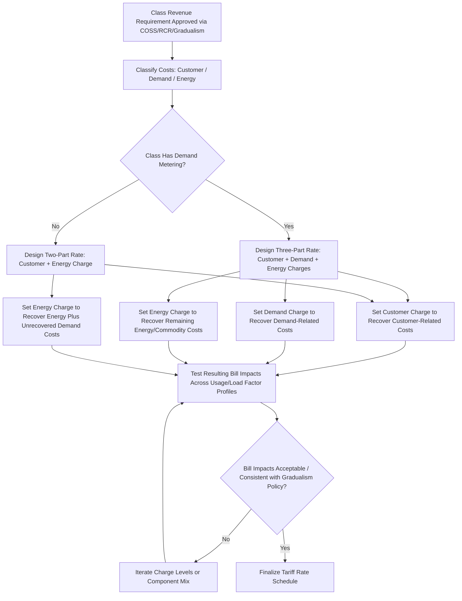

## Customer, Demand, and Energy Charge Design

### Overview

Customer, demand, and energy charge design refers to the process of structuring a utility rate schedule's three fundamental billing components — the fixed customer charge, the demand charge, and the volumetric energy (or commodity) charge — so that the resulting bill both recovers the class's allocated cost of service (as established by the Cost of Service Study) and sends economically meaningful signals to customers. This is the rate design step that follows class revenue allocation (informed by RCR and gradualism policy) and translates an approved class revenue requirement into an actual tariff that customers are billed under.

### The Three-Part Rate Structure

**1. Customer Charge**

A fixed, flat monthly (or billing-period) charge assessed regardless of usage, intended to recover customer-related costs identified in the COSS:

- Metering equipment (capital and maintenance)
- Service drops/connections
- Meter reading
- Billing and customer service/call center costs
- A portion of administrative and general costs allocated on a per-customer basis

**2. Demand Charge**

A charge based on the customer's measured peak demand (typically in kW) during the billing period or a specified measurement window, intended to recover demand-related (capacity) costs:

- Generation capacity
- Transmission capacity
- Distribution capacity sized to the customer's peak load contribution

Demand charges are typically applied only to commercial and industrial classes with demand metering capability, though advanced metering infrastructure (AMI) has expanded the feasibility of demand-based billing for residential customers in some jurisdictions.

**3. Energy (Volumetric) Charge**

A per-unit charge (e.g., $/kWh, $/Mcf, $/gallon) applied to actual consumption, intended to recover:

- Variable/commodity costs (fuel, purchased power, chemicals)
- Any residual demand-related or customer-related costs not recovered through the customer or demand charge (common where a utility chooses not to fully unbundle demand costs, particularly for residential rates lacking demand metering)

### Cost-to-Charge Mapping

| Cost Category (from COSS) | Typical Charge Component |
| --- | --- |
| Customer-related costs (meters, billing, service drops) | Customer Charge |
| Demand-related costs (generation, T&D capacity) | Demand Charge (where metered) or embedded in Energy Charge (where not) |
| Energy/commodity-related costs (fuel, variable O&M) | Energy Charge |

[Inference] The degree to which demand-related costs are recovered via an explicit demand charge versus embedded in the volumetric energy rate is one of the most consequential and debated rate design choices, since it directly affects both bill stability for customers and the price signal for peak-driving consumption behavior.

### Design Process Flow

### Calculating Charge Levels: Worked Example

Assume a commercial class has an approved annual revenue requirement of $10,000,000, comprised of the following allocated costs from the COSS:

| Cost Category | Allocated Annual Cost |
| --- | --- |
| Customer-related | $1,200,000 |
| Demand-related | $4,000,000 |
| Energy-related | $4,800,000 |
| **Total** | **$10,000,000** |

Class billing determinants: 10,000 customers (bills/year = 120,000), total billed demand = 800,000 kW-months/year, total billed energy = 480,000,000 kWh/year.

**Customer Charge**:

$$\frac{\$1{,}200{,}000}{120{,}000\ bills} = \$10.00/bill$$

**Demand Charge**:

$$\frac{\$4{,}000{,}000}{800{,}000\ kW\text{-}months} = \$5.00/kW$$

**Energy Charge**:

$$\frac{\$4{,}800{,}000}{480{,}000{,}000\ kWh} = \$0.01000/kWh$$

A customer with 50 kW of billed demand and 20,000 kWh of monthly usage would be billed:

$$Bill = \$10.00 + (50\ kW \times \$5.00/kW) + (20{,}000\ kWh \times \$0.01000/kWh) = \$10.00 + \$250.00 + \$200.00 = \$460.00$$

### Key Design Considerations by Component

**Customer Charge Design**

**Key Points**

- Setting the customer charge equal to the full customer-related cost of service ("fully unbundled" approach) is the theoretically cost-based position, but often results in a customer charge higher than what many residential customers or advocacy groups consider acceptable.
- A customer charge set below full customer-related cost recovers the residual through the energy or demand charge, effectively cross-subsidizing low-usage customers via high-usage customers within the same class.
- High customer charges reduce the bill-savings potential of energy efficiency and distributed generation (since a larger share of the bill becomes usage-independent), a frequently contested consequence in DG- and efficiency-policy-focused proceedings.
- [Inference] Because of this savings-potential effect, customer charge levels are one of the most litigated elements of tariff design in jurisdictions with active rooftop solar or net metering policy debates.

**Demand Charge Design**

**Key Points**

- **Measurement window**: Common approaches include billing (non-coincident) peak demand, ratchet clauses (billing based on a percentage of the highest demand in the past 11–12 months), and coincident peak demand (measured only during system peak hours).
- **Ratchet clauses**: Protect the utility from under-recovery from customers with highly variable, spiky demand profiles, but can result in customers being billed for demand capacity they are not currently using, and are a frequent subject of customer complaints and reform proposals.
- **Load factor sensitivity**: Customers with poor load factor (low average-to-peak demand ratio) pay proportionally more per kWh consumed under a demand charge structure than high-load-factor customers, reflecting the actual higher capacity cost imposed by their consumption pattern.
- **Alternative to demand charges**: Some jurisdictions and rate designs (particularly for smaller commercial or residential customers) substitute inclining block energy rates or time-of-use energy rates for an explicit demand charge, recovering demand-related costs implicitly through higher energy prices during high-cost periods rather than through a separate demand-based charge.

**Energy Charge Design**

**Key Points**

- **Flat/uniform energy rate**: A single $/kWh (or equivalent) rate regardless of time or usage level; simplest to understand and bill, but sends no temporal price signal.
- **Time-of-Use (TOU) energy rates**: Differentiate energy charges by time period (on-peak, mid-peak, off-peak) to better reflect the time-varying marginal cost of energy production and capacity.
- **Inclining block rates**: Energy charge increases with usage tiers within a billing period, often used for residential classes to encourage conservation and to recover more cost from higher-usage customers.
- **Declining block rates**: Energy charge decreases with usage tiers; historically common (reflecting historical marginal cost patterns and large-customer economies of scale) but increasingly disfavored in efficiency- and conservation-oriented rate design policy.

### Rate Structure Comparison

| Structure | Customer Charge | Demand Charge | Energy Charge | Common Use Case |
| --- | --- | --- | --- | --- |
| Two-Part (Customer + Energy) | Yes | No | Flat or block | Residential without demand metering |
| Three-Part (Customer + Demand + Energy) | Yes | Yes | Flat | Commercial/Industrial |
| Three-Part with TOU Energy | Yes | Yes | Time-differentiated | Large Commercial/Industrial |
| Two-Part with TOU Energy | Yes | No | Time-differentiated | Residential AMI-enabled TOU programs |
| Real-Time Pricing | Yes (typically) | Optional | Hourly market-reflective | Large Industrial, sophisticated load management customers |

### Component Interaction and Bill Stability (svg_diagram)

<svg xmlns="http://www.w3.org/2000/svg" viewBox="0 0 700 340">
\<style\>
.title { font: bold 15px sans-serif; fill: #1a1a2e; }
.axis { stroke: #333; stroke-width: 1.5; }
.barcust { fill: #7f8fa6; }
.bardem { fill: #4a69bd; }
.barenergy { fill: #60a3bc; }
.lbl { font: 11px sans-serif; fill: #333; }
.legend { font: 11px sans-serif; fill: #333; }
\</style\>
<text x="350" y="25" text-anchor="middle" class="title">Bill Composition Across Load Factor Profiles (svg_diagram)</text>
<line x1="80" y1="290" x2="620" y2="290" class="axis" />
<line x1="80" y1="60" x2="80" y2="290" class="axis" />

<text x="160" y="310" text-anchor="middle" class="lbl">Low Load Factor</text>

<text x="340" y="310" text-anchor="middle" class="lbl">Medium Load Factor</text>

<text x="500" y="310" text-anchor="middle" class="lbl">High Load Factor</text>

<rect x="130" y="270" width="60" height="20" class="barcust" />
<rect x="130" y="180" width="60" height="90" class="bardem" />
<rect x="130" y="150" width="60" height="30" class="barenergy" />
<rect x="310" y="270" width="60" height="20" class="barcust" />
<rect x="310" y="220" width="60" height="50" class="bardem" />
<rect x="310" y="120" width="60" height="100" class="barenergy" />
<rect x="470" y="270" width="60" height="20" class="barcust" />
<rect x="470" y="245" width="60" height="25" class="bardem" />
<rect x="470" y="90" width="60" height="155" class="barenergy" />
<rect x="560" y="70" width="14" height="14" class="barcust" />
<text x="580" y="82" class="legend">Customer Charge</text>
<rect x="560" y="90" width="14" height="14" class="bardem" />
<text x="580" y="102" class="legend">Demand Charge</text>
<rect x="560" y="110" width="14" height="14" class="barenergy" />
<text x="580" y="122" class="legend">Energy Charge</text>
</svg>

**Example**: As illustrated, a low load-factor customer's bill is proportionally more influenced by the demand charge (since they use relatively little energy for their peak demand), while a high load-factor customer's bill is dominated by the energy charge (since their consistent usage pattern makes energy charges the primary cost driver).

### Special Design Variants

- **Minimum Bill**: A floor on the total bill (or a specific component) ensuring the utility recovers a baseline amount even from very low-usage customers, often used where the customer charge alone is set below full cost-of-service recovery.
- **Standby/Backup Charges**: Applied to customers with on-site generation (e.g., cogeneration, backup generators) to recover the capacity cost of maintaining system readiness to serve their full load if their on-site generation fails.
- **Contract Demand vs. Billing Demand**: Some large customer tariffs bill on a pre-negotiated contract demand level (with penalties for exceeding it) rather than pure metered billing demand, providing revenue certainty to the utility and demand predictability to the customer.
- **Grid Access/Fixed Charge Reform Proposals**: [Inference] In several jurisdictions, particularly those with high distributed generation penetration, there is active policy debate over restructuring the customer charge into a broader "grid access" or "minimum bill" charge intended to more fully recover fixed distribution costs regardless of net energy consumption; this remains an evolving and jurisdiction-specific area of rate design policy.

### Regulatory Testing of Proposed Rate Designs

Commissions and Staff typically evaluate a proposed customer/demand/energy charge design against:

1. **Gradualism/bill impact analysis**: Modeling bill changes across a representative sample of customers within the class at various usage and load factor levels.
2. **Revenue neutrality/sufficiency**: Confirming that the three components, applied to forecast billing determinants, recover exactly the approved class revenue requirement.
3. **Consistency with COSS-derived cost causation**: Assessing whether the chosen split between customer, demand, and energy charges reasonably tracks the underlying cost classification, or whether policy considerations (customer charge caps, minimum bill floors) intentionally deviate from it.
4. **Conservation and price signal effects**: Evaluating whether the design supports or undermines energy efficiency, demand response, and other policy goals the commission is separately pursuing.

### Related Topics

- Class Revenue to Cost Ratios and Rate Gradualism
- Embedded Cost of Service Study Classification and Allocation Methods
- Time-of-Use and Critical Peak Pricing Design
- Marginal and Incremental Cost of Service Studies
- Net Metering and Distributed Generation Compensation Design
- Ratchet Clauses and Demand Billing Methodologies
- Minimum Bills and Fixed Charge Reform Debates
- Inclining and Declining Block Rate Structures