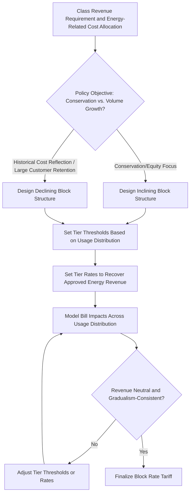

## Inclining and Declining Block Rate Structures

### Overview

Inclining and declining block rate structures are volumetric energy (or commodity) pricing designs in which the per-unit charge changes across successive "blocks" or tiers of consumption within a single billing period, rather than remaining flat across all usage. Inclining block rates charge progressively higher per-unit prices as usage increases; declining block rates charge progressively lower per-unit prices as usage increases. Both structures are alternatives to a uniform (flat) volumetric rate and are typically applied within the energy charge component of a customer/demand/energy rate design.

### Structural Mechanics

A block rate structure divides total usage in a billing period into defined consumption tiers ("blocks"), each with its own per-unit price. The customer's bill is calculated by applying each block's rate only to the usage falling within that block, not to total usage at a single rate.

**General Formula**

For $n$ blocks with thresholds $Q_1 < Q_2 < ... < Q_{n-1}$ and corresponding rates $r_1, r_2, ..., r_n$, and total usage $Q$:

$$Bill_{energy} = r_1 \cdot \min(Q, Q_1) + r_2 \cdot \max(0, \min(Q, Q_2) - Q_1) + ... + r_n \cdot \max(0, Q - Q_{n-1})$$

### Inclining Block Rate (IBR) Structure

**Key Points**

- Also called "increasing block rate" or "tiered rate."
- Rate increases as usage rises: $r_1 < r_2 < ... < r_n$.
- Predominantly used for residential electric and water rates.
- Common policy rationale: encourage conservation, protect low-usage/low-income customers (who tend to fall in lower, cheaper blocks) from higher relative bill impacts, and reflect the reality that very high usage often occurs during system peak periods.

**Illustrative Example — Residential Electric IBR**

| Block | Usage Range (kWh/month) | Rate ($/kWh) |
| --- | --- | --- |
| Tier 1 | 0 – 500 | $0.10 |
| Tier 2 | 501 – 1,000 | $0.14 |
| Tier 3 | 1,001+ | $0.20 |

For a customer using 1,200 kWh in a month:

$$Bill = (500 \times \$0.10) + (500 \times \$0.14) + (200 \times \$0.20) = \$50.00 + \$70.00 + \$40.00 = \$160.00$$

The average rate paid is $\$160.00 / 1{,}200\ kWh = \$0.1333/kWh$, higher than the Tier 1 rate but lower than the marginal Tier 3 rate — illustrating that IBR customers pay a blended average rate below their highest applicable marginal rate.

### Declining Block Rate (DBR) Structure

**Key Points**

- Rate decreases as usage rises: $r_1 > r_2 > ... > r_n$.
- Historically the dominant rate structure for commercial and industrial electric rates, and formerly common for residential rates as well, particularly in the mid-20th century.
- Original economic rationale: reflected genuine historical marginal/average cost patterns, including economies of scale in generation and the declining average fixed cost per unit as usage increases (since customer and demand-related fixed costs are spread over more energy units).
- Increasingly disfavored in residential rate design due to its conservation-discouraging price signal (higher usage costs less per unit), though still common and often better justified for commercial/industrial rates.

**Illustrative Example — Small Commercial DBR**

| Block | Usage Range (kWh/month) | Rate ($/kWh) |
| --- | --- | --- |
| Tier 1 | 0 – 2,000 | $0.12 |
| Tier 2 | 2,001 – 10,000 | $0.09 |
| Tier 3 | 10,001+ | $0.07 |

For a customer using 15,000 kWh in a month:

$$Bill = (2{,}000 \times \$0.12) + (8{,}000 \times \$0.09) + (5{,}000 \times \$0.07) = \$240.00 + \$720.00 + \$350.00 = \$1{,}310.00$$

The average rate paid is $\$1{,}310.00 / 15{,}000\ kWh \approx \$0.0873/kWh$, below the Tier 1 rate, reflecting the declining marginal price structure.

### Comparative Summary

| Attribute | Inclining Block Rate | Declining Block Rate |
| --- | --- | --- |
| Marginal price direction | Increases with usage | Decreases with usage |
| Typical class | Residential | Commercial/Industrial (historically also residential) |
| Conservation signal | Encourages reduced consumption | Discourages reduced consumption |
| Historical cost rationale | Reflects higher marginal cost of serving peak/high usage | Reflects historical economies of scale and fixed cost spreading |
| Equity framing | Often justified as protecting low-usage/low-income customers | Often criticized as regressive toward low-usage customers if applied broadly |
| Current regulatory trend | Increasingly favored, especially where conservation/climate policy goals apply | Increasingly scrutinized or phased out for residential use; more defensible for commercial/industrial where cost basis is stronger |

### Rate Design Determination Process

### Marginal vs. Average Price Under Block Rates (svg_diagram)

<svg xmlns="http://www.w3.org/2000/svg" viewBox="0 0 720 380">
\<style\>
.title { font: bold 15px sans-serif; fill: #1a1a2e; }
.axis { stroke: #333; stroke-width: 1.5; }
.inclining { stroke: #c0392b; stroke-width: 2.5; fill: none; }
.declining { stroke: #2980b9; stroke-width: 2.5; fill: none; }
.lbl { font: 12px sans-serif; fill: #333; }
.legend { font: 11px sans-serif; fill: #333; }
\</style\>
<text x="360" y="25" text-anchor="middle" class="title">Marginal Price by Usage Tier: Inclining vs. Declining Block (svg_diagram)</text>
<line x1="80" y1="320" x2="640" y2="320" class="axis" />
<line x1="80" y1="60" x2="80" y2="320" class="axis" />
<text x="360" y="350" text-anchor="middle" class="lbl">Usage (kWh)</text>
<text x="40" y="190" text-anchor="middle" transform="rotate(-90 40 190)" class="lbl">Price ($/kWh)</text>
<path d="M80,260 L240,260 L240,220 L400,220 L400,160 L560,160" class="inclining" />
<path d="M80,120 L240,120 L240,180 L400,180 L400,240 L560,240" class="declining" />

<text x="150" y="345" text-anchor="middle" class="lbl">Tier 1</text>

<text x="320" y="345" text-anchor="middle" class="lbl">Tier 2</text>

<text x="480" y="345" text-anchor="middle" class="lbl">Tier 3</text>

<line x1="450" y1="70" x2="470" y2="70" class="inclining" />
<text x="475" y="74" class="legend">Inclining Block (residential-typical)</text>
<line x1="450" y1="90" x2="470" y2="90" class="declining" />
<text x="475" y="94" class="legend">Declining Block (C&amp;I-typical)</text>
</svg>

### Setting Tier Thresholds and Rates

**Threshold Setting Methodologies**

- **Usage Distribution Percentiles**: Thresholds set at specific percentiles of the class's historical usage distribution (e.g., Tier 1 covers the median customer's baseline usage; Tier 3 begins at the 75th or 90th percentile of usage).
- **Climate Zone/Seasonal Adjustment**: For water and electric IBR, thresholds are sometimes adjusted seasonally or by climate zone to account for legitimate high-usage needs (e.g., irrigation in arid regions, air conditioning in hot climates) that would otherwise unfairly penalize customers with no discretionary high usage.
- **Baseline/Essential Use Allowance**: Tier 1 is often calibrated to approximate an "essential use" baseline (e.g., basic lighting, refrigeration, indoor water use), with higher tiers representing progressively more discretionary consumption.

**Rate Setting Within Blocks**

Given a total approved energy revenue requirement $R$ and a forecast usage distribution across tiers, tier rates $r_1, ..., r_n$ must satisfy:

$$R = \sum_{i=1}^{n} r_i \times Q_i^{billed}$$

where $Q_i^{billed}$ is the total forecast usage falling within tier $i$ across all customers in the class. Rate designers typically set tier differentials (the ratio between adjacent tier rates) based on policy objectives (e.g., a target Tier 3-to-Tier 1 ratio of 2:1 or 3:1) and then solve for the specific rate levels that satisfy revenue neutrality.

### Bill Impact and Distributional Effects

**Key Points**

- Low-usage customers benefit disproportionately from IBR structures (paying the low Tier 1 rate on all or most of their usage), while high-usage customers within the same class pay a materially higher effective average rate.
- [Inference] Because household size, medical equipment needs (e.g., in-home dialysis, respiratory equipment), and climate/geographic factors all influence usage independent of income, IBR structures can have uneven equity effects — very low-income large households or medically dependent customers may fall into higher tiers despite financial hardship, a frequently cited critique requiring targeted exemption or assistance program design to address.
- DBR structures, when applied to residential classes, have been critiized for disproportionately benefiting higher-usage (often higher-income or larger) households, which is a primary driver of the historical shift away from residential DBR in many jurisdictions.
- For commercial/industrial DBR, the equity critique is less prominent since the underlying justification (economies of scale in serving large, stable loads) is more directly tied to genuine cost causation rather than socioeconomic status.

### Relationship to Marginal Cost and Cost Causation

**Key Points**

- A rate design's fidelity to underlying marginal cost is a separate question from its inclining/declining structure: an IBR structure poorly calibrated to actual marginal cost patterns is not automatically "more cost-based" than a DBR structure, and vice versa.
- Where a Marginal Cost of Service study indicates that marginal costs of service rise with usage (e.g., very high usage disproportionately driving system peak or requiring incremental capacity), an inclining structure aligns rate design with cost causation.
- Where marginal costs genuinely decline with volume (e.g., substantial fixed-cost spreading benefits for very large, stable industrial loads with high load factor), a declining structure may better track actual cost causation for that specific class.
- [Inference] In practice, block rate design is frequently set based on policy objectives (conservation, equity, historical practice) rather than a rigorous re-derivation from a contemporaneous marginal cost study for each rate case, meaning the block structure and the underlying marginal cost signal can diverge over time absent periodic review.

### Water Utility-Specific Considerations

Inclining block rates are particularly prevalent in water utility rate design, often explicitly tied to conservation policy goals (especially in drought-prone or water-scarce regions):

- Tier thresholds are frequently set relative to average indoor household water use, with higher tiers capturing discretionary outdoor/irrigation use.
- Some water utilities implement "water budget-based" rate designs, a more granular variant of IBR that customizes tier thresholds per customer based on factors such as lot size, household size, and local climate/evapotranspiration data, rather than applying uniform thresholds across the entire class.

### Related Topics

- Customer, Demand, and Energy Charge Design
- Marginal and Incremental Cost of Service Studies
- Class Revenue to Cost Ratios and Rate Gradualism
- Time-of-Use and Critical Peak Pricing Design
- Low-Income and Lifeline Rate Design Policy
- Water Budget-Based Rate Design
- Interclass Subsidization Debates
- Minimum Bills and Fixed Charge Reform Debates