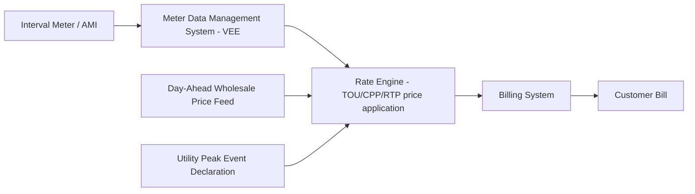

## Time of Use and Dynamic Pricing Tariffs

### Definition and Regulatory Context

Time of Use (TOU) and dynamic pricing tariffs are rate designs that vary the per-unit price of electricity based on the time period in which consumption occurs, in contrast to flat/uniform rates that charge a single $/kWh price regardless of when energy is consumed. These tariffs are a rate-design mechanism layered on top of the revenue requirement established through rate-basing (the process by which a utility's allowed revenue is determined from its rate base, cost of capital, and operating expenses); TOU and dynamic pricing do not change the total revenue requirement, they change how that requirement is collected across customers and time periods.

Regulators authorize TOU and dynamic pricing tariffs to achieve several policy objectives:

- **Price signals aligned with cost causation** — since generation, transmission, and distribution costs vary by time (due to fuel mix, congestion, and capacity constraints), TOU pricing attempts to charge customers closer to the marginal cost of service at the time of consumption.
- **Peak demand reduction** — shifting load away from system peaks reduces the need for peaking capacity and can defer transmission/distribution (T&D) capital expenditures, which in turn affects future rate base growth.
- **Grid integration of variable resources** — dynamic pricing (particularly real-time pricing) can incentivize consumption during periods of high renewable output and reduce curtailment.
- **Equity and rate stability trade-offs** — regulators weigh efficiency gains against bill volatility and disparate impacts on customers who cannot shift usage (e.g., medically vulnerable, low-income, or inflexible-schedule households).

### Taxonomy of Rate Structures

**Flat/Uniform Rate**

A single volumetric charge ($/kWh) applied to all consumption regardless of time. Serves as the baseline against which TOU/dynamic rates are compared for revenue-neutrality testing.

**Time of Use (TOU) Rate**

Pre-defined price blocks (e.g., on-peak, mid-peak/shoulder, off-peak) tied to fixed calendar/clock windows, typically set seasonally (summer/winter) and by day type (weekday/weekend/holiday). Prices are known in advance, often for the full tariff year, and do not change in response to real-time system conditions.

- Example structure:

  $$P(t) = \begin{cases} P_{on} & t \in [\text{peak hours}] \\ P_{mid} & t \in [\text{shoulder hours}] \\ P_{off} & t \in [\text{off-peak hours}] \end{cases}$$

**Critical Peak Pricing (CPP)**

A hybrid of TOU with an "event-based" overlay: a much higher price is charged during a limited number of utility-declared critical peak events per year (e.g., 10–15 days), usually called a day-ahead or day-of. The rest of the year follows a standard TOU or flat schedule.

**Critical Peak Rebate (CPR) / Peak Time Rebate (PTR)**

Functionally similar to CPP but structured as a rebate/credit for load reduction below a baseline during declared events, rather than a penalty price, avoiding the "opt-in to a penalty" framing that raises consumer acceptance concerns.

**Real-Time Pricing (RTP)**

Prices vary hourly (or sub-hourly) based on wholesale market prices or utility marginal cost, communicated to customers day-ahead or hour-ahead. This is the most granular and cost-reflective dynamic rate but imposes the highest information/technology burden on customers.

**Variable Peak Pricing (VPP)**

A blend of TOU and RTP: peak/off-peak period *timing* is fixed, but the peak-period *price* varies day to day based on system conditions.

### Comparative Structure Table

| Rate Type | Price Known In Advance | Granularity | Typical Use Case |
| --- | --- | --- | --- |
| Flat | Full billing cycle | None | Default residential rate |
| TOU | Full tariff year | 2–4 blocks/day | Standard peak-shifting incentive |
| CPP/CPR | Day-ahead (event only) | Event days only | Extreme peak/emergency events |
| VPP | Day-ahead | Hourly (peak price varies) | Moderate dynamic exposure |
| RTP | Hour-ahead/day-ahead | Hourly or sub-hourly | Large C&I, wholesale-linked exposure |

### Rate Design Mechanics

**Revenue Neutrality / Revenue Reconciliation**

Regulators typically require that a new TOU/dynamic tariff be revenue-neutral at the class level relative to the prior flat rate at the time of implementation — meaning that if the average customer's usage pattern did not change, their bill under the new rate design would approximate their bill under the old rate design. This is tested using a **bill impact analysis**, applying historical interval usage data against the proposed rate structure.

**Peak/Off-Peak Price Ratio**

A key design parameter is the ratio between on-peak and off-peak prices. A ratio too low provides weak price signals (insufficient load-shifting incentive); a ratio too high risks bill shock and disproportionate impact on inflexible customers. Regulatory staff and intervenors often scrutinize this ratio in rate case testimony.

$$r = \frac{P_{on}}{P_{off}}$$

**Cost of Service Study (COSS) Linkage**

TOU period boundaries and price differentials are ideally derived from a **time-differentiated cost of service study**, which allocates generation, transmission, and distribution costs to time periods based on when those costs are actually incurred (e.g., generation capacity costs allocated using loss-of-load-probability-weighted hours; distribution costs allocated using local feeder peak hours, which may differ from system peak hours).

**Rate Base Interaction**

While TOU/dynamic pricing is a downstream rate-design exercise, it interacts with rate base in two directions:

1. **Avoided capital** — effective peak-shaving from TOU/dynamic pricing can reduce or defer distribution capacity upgrades, lowering future additions to rate base (and thus future revenue requirement growth).
2. **Enabling infrastructure** — implementing granular TOU/RTP tariffs generally requires Advanced Metering Infrastructure (AMI); the capital cost of AMI deployment is itself added to rate base and recovered through the revenue requirement, creating a cost-benefit tension regulators evaluate in AMI business-case proceedings.

### AMI and Metering Prerequisites

TOU and dynamic pricing tariffs (beyond simple 2-period fixed schedules) generally require interval metering capable of recording consumption at sub-hourly or hourly resolution, plus a Meter Data Management System (MDMS) to validate, estimate, and edit ("VEE") the data before billing.

Without AMI, utilities historically approximated TOU pricing using **time-of-day switches or interval sub-metering pilots**, but full-scale rollout is generally contingent on regulator-approved AMI capital investment.

### Customer Protections and Regulatory Safeguards

Regulators commonly impose the following safeguards when approving TOU/dynamic tariffs:

- **Bill Protection** — a transition period (often 12 months) during which customers on a new mandatory TOU rate are guaranteed to pay no more than they would have under their prior flat rate; the utility absorbs (or later recovers through a balancing account) the shortfall.
- **Opt-out provisions** — particularly for medical baseline or vulnerable customers, allowing a return to a flat or tiered rate.
- **Default vs. opt-in design** — some jurisdictions mandate TOU as the *default* rate for residential customers (with opt-out to flat/tiered), based on behavioral-economics findings that opt-in enrollment yields low participation; this is a frequently litigated policy question in rate cases.
- **Notice and education requirements** — mandated customer communication (bill inserts, comparison tools, usage disaggregation) prior to and during transition.
- **Low-income program interaction** — ensuring TOU/dynamic rates do not conflict with or undermine discount program structures (e.g., CARE/FERA-type programs).

### Balancing Accounts and True-Up Mechanisms

Because bill protection guarantees and revenue-neutrality targets are based on *ex ante* projections, actual collections under a new TOU rate will diverge from the flat-rate baseline as customers respond to price signals. Utilities typically track this divergence in a **rate design/TOU balancing account**, which is trued up in a subsequent proceeding — conceptually similar to other regulatory balancing accounts (e.g., fuel or purchased power cost trackers) but specific to rate-design transition variance rather than commodity cost variance.

### Worked Example: Simple Bill Impact Calculation

Assume a residential customer with the following monthly usage profile under a proposed two-period TOU rate:

- On-peak usage: 150 kWh at $0.32/kWh
- Off-peak usage: 550 kWh at $0.14/kWh
- Prior flat rate: $0.18/kWh on total 700 kWh

**Flat rate bill:**

$$700 \times 0.18 = \$126.00$$

**TOU rate bill:**

$$(150 \times 0.32) + (550 \times 0.14) = 48.00 + 77.00 = \$125.00$$

In this case, the customer's usage pattern (21% on-peak share) results in a bill slightly below the flat-rate baseline, illustrating a scenario where the customer's existing consumption timing is favorable under TOU. A customer with a higher on-peak share (e.g., mid-afternoon air conditioning load in a summer-peaking system) would see a bill increase, which is the mechanism by which TOU rates create a peak-shifting incentive [Inference: the direction of bill impact depends on the customer's actual load shape relative to the defined peak window, which varies by customer and is not a fixed outcome of the rate design itself].

### Diagram: TOU Price Schedule (Illustrative Summer Weekday)

<svg xmlns="http://www.w3.org/2000/svg" viewBox="0 0 720 320">
<text x="360" y="24" font-family="sans-serif" font-size="16" font-weight="bold" text-anchor="middle" fill="#1a1a1a">Illustrative Summer Weekday TOU Price Schedule (svg_diagram)</text>
<line x1="60" y1="270" x2="680" y2="270" stroke="#333" stroke-width="2" />
<line x1="60" y1="270" x2="60" y2="50" stroke="#333" stroke-width="2" />
<text x="30" y="120" font-family="sans-serif" font-size="12" fill="#333">$/kWh</text>
<text x="10" y="90" font-family="sans-serif" font-size="11" fill="#333">0.32</text>
<line x1="55" y1="90" x2="60" y2="90" stroke="#333" stroke-width="1" />
<text x="10" y="175" font-family="sans-serif" font-size="11" fill="#333">0.20</text>
<line x1="55" y1="175" x2="60" y2="175" stroke="#333" stroke-width="1" />
<text x="10" y="245" font-family="sans-serif" font-size="11" fill="#333">0.14</text>
<line x1="55" y1="245" x2="60" y2="245" stroke="#333" stroke-width="1" />
<rect x="60" y="245" width="200" height="25" fill="#7fb3d5" />
<rect x="260" y="175" width="120" height="95" fill="#f5cba7" />
<rect x="380" y="90" width="160" height="180" fill="#e74c3c" />
<rect x="540" y="175" width="60" height="95" fill="#f5cba7" />
<rect x="600" y="245" width="80" height="25" fill="#7fb3d5" />
<text x="160" y="290" font-family="sans-serif" font-size="10" text-anchor="middle" fill="#333">12am-4pm</text>
<text x="320" y="290" font-family="sans-serif" font-size="10" text-anchor="middle" fill="#333">4-6pm</text>
<text x="460" y="290" font-family="sans-serif" font-size="10" text-anchor="middle" fill="#333">6-9pm</text>
<text x="570" y="290" font-family="sans-serif" font-size="10" text-anchor="middle" fill="#333">9-10pm</text>
<text x="640" y="290" font-family="sans-serif" font-size="10" text-anchor="middle" fill="#333">10pm-12am</text>
<text x="160" y="310" font-family="sans-serif" font-size="10" text-anchor="middle" fill="#333">Off-Peak</text>
<text x="320" y="310" font-family="sans-serif" font-size="10" text-anchor="middle" fill="#333">Mid-Peak</text>
<text x="460" y="310" font-family="sans-serif" font-size="10" text-anchor="middle" fill="#333">On-Peak</text>
<text x="580" y="310" font-family="sans-serif" font-size="10" text-anchor="middle" fill="#333">Mid-Peak</text>
</svg>

### Analytical and Ratemaking Considerations

- **Elasticity assumptions** — the projected peak-reduction benefits of a TOU/dynamic tariff depend on assumed price elasticity of demand, which is typically estimated from pilot program data or analogous jurisdictions' experience; actual elasticity realized post-implementation is subject to significant variation by customer segment, climate, and appliance saturation (e.g., presence of smart thermostats, EV chargers, or behind-the-meter storage) [Inference: elasticity estimates carry material uncertainty and are commonly revisited in subsequent rate proceedings].
- **Interaction with net metering / distributed energy resources (DER)** — TOU export rates for net-metered solar customers are a distinct but related design question, where export compensation may also vary by time period to reflect avoided-cost value at different hours.
- **Interaction with demand charges** — for commercial and industrial (C&I) classes, TOU energy pricing is frequently combined with a separate demand charge ($/kW) based on the customer's peak demand within defined periods; this is a related but analytically distinct rate-design element from volumetric TOU/dynamic energy pricing.
- **Standard Rate Design Manual references** — many jurisdictions and utilities follow methodologies analogous to those described in EPRI, NARUC's *Manual on Distributed Energy Resources Rate Design and Compensation*, or FERC's guidance on cost causation for time-differentiated rates.

**Related Topics**

- Cost of Service Studies and Time-Differentiated Allocation
- Advanced Metering Infrastructure (AMI) Cost Recovery and Business Case Analysis
- Demand Charges and Coincident/Non-Coincident Peak Billing
- Net Energy Metering and Time-Varying Export Compensation
- Balancing Accounts and Regulatory Asset/Liability Tracking
- Marginal Cost Pricing Theory in Utility Ratemaking
- Bill Impact Analysis Methodology and Customer Segmentation
- Demand Response Program Design and Load Flexibility Valuation