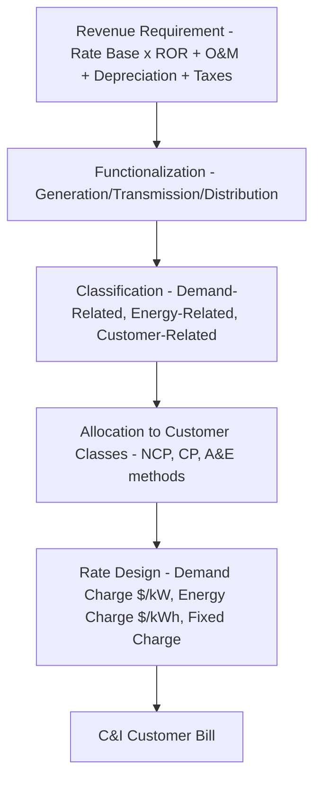

## Demand Charges for Commercial and Industrial Customers

### Definition and Purpose

A demand charge is a rate component billed on the basis of a customer's peak rate of electricity draw, measured in kilowatts (kW) or kilovolt-amperes (kVA), rather than on total energy consumed over the billing period (measured in kWh). It is typically assessed alongside — not instead of — a volumetric energy charge, producing a two-part (or multi-part) tariff structure common for commercial and industrial (C&I) customer classes.

The rationale is grounded in cost causation: a substantial share of utility distribution and transmission capital costs (poles, wires, transformers, substations) is sized to serve the *maximum instantaneous load* a customer or class can impose, not the total energy delivered. Two customers consuming identical monthly kWh but with different peak draw profiles impose different infrastructure sizing requirements on the utility, and demand charges are designed to allocate cost recovery accordingly. This directly connects demand-charge design to rate base: the distribution capacity sized to serve peak demand is capitalized into rate base, and demand-charge revenue is the mechanism by which that capacity-related revenue requirement is recovered from the customers who drive it.

### Demand Measurement Mechanics

**Measurement Window**

Demand is not an instantaneous reading but an average rate of consumption over a defined interval, most commonly 15 minutes (also seen as 30-minute or, less commonly, 5-minute intervals depending on jurisdiction and meter capability).

$$D = \frac{E_{\Delta t}}{\Delta t}$$

where $E_{\Delta t}$ is energy (kWh) consumed within the interval and $\Delta t$ is the interval length (hours).

**Example calculation:**

A facility consumes 50 kWh during a 15-minute interval.

$$D = \frac{50 \text{ kWh}}{0.25 \text{ h}} = 200 \text{ kW}$$

**Billing Demand Determination**

The interval meter records demand continuously throughout the billing period; the **billing demand** is generally the single highest 15-minute interval reading observed during that month (the "peak demand"), though several variations exist:

- **Non-Coincident Peak (NCP) demand** — the customer's own maximum demand interval during the billing period, regardless of when the utility system as a whole peaks.
- **Coincident Peak (CP) demand** — the customer's demand during the hour(s) the *utility system* (or a specific generation/transmission pool) experiences its peak, used for allocating certain capacity-related costs (e.g., transmission costs allocated on a 1-CP or 4-CP basis in some U.S. markets).
- **Ratchet demand** — a billing demand floor set as a percentage (commonly 50–90%) of the customer's highest demand in the preceding 11–12 months, ensuring that customers with sharp, infrequent demand spikes continue to pay based on the infrastructure sized for that spike even in subsequent lower-demand months.

$$D_{billing} = \max\left(D_{current}, \, k \times D_{max,12mo}\right)$$

where $k$ is the ratchet percentage.

### Comparative Table of Demand Billing Variants

| Variant | Basis | Purpose |
| --- | --- | --- |
| Non-Coincident Peak (NCP) | Customer's own monthly max interval | Recovers customer-specific distribution capacity costs |
| Coincident Peak (CP) | Customer's demand at system/regional peak hour | Allocates system-wide generation/transmission capacity costs |
| Ratchet | Percentage of trailing 11–12 month max | Smooths recovery for customers with occasional sharp peaks |
| Time-Differentiated Demand | NCP measured separately by TOU period (on-peak/off-peak) | Combines demand-charge cost causation with time-varying system conditions |

### Rate Structure Composition

A typical C&I tariff bill combines multiple charge types:

$$\text{Total Bill} = C_{fixed} + (P_{energy} \times E) + (P_{demand} \times D_{billing})$$

where:

- $C_{fixed}$ = fixed customer/service charge (recovers metering, billing, and minimum-system costs)
- $P_{energy}$ = volumetric energy price ($/kWh)
- $E$ = total energy consumed (kWh)
- $P_{demand}$ = demand charge price ($/kW)
- $D_{billing}$ = billing demand (kW), as determined above

**Worked example:**

A manufacturing customer has the following monthly bill inputs:

- Fixed charge: $150/month
- Energy consumption: 80,000 kWh at $0.09/kWh
- Billing demand: 300 kW at $12/kW

$$\text{Total Bill} = 150 + (0.09 \times 80{,}000) + (12 \times 300) = 150 + 7{,}200 + 3{,}600 = \$10{,}950$$

In this example, the demand charge ($3,600) represents roughly 33% of the total bill despite demand-related costs not scaling directly with the energy consumption figure — illustrating why C&I customers actively manage *load factor* (the ratio of average to peak demand) as a bill-management strategy distinct from simply reducing total kWh usage.

### Load Factor and Its Rate Implications

$$LF = \frac{E / \Delta T_{period}}{D_{peak}}$$

where $E$ is total period energy, $\Delta T_{period}$ is the number of hours in the billing period, and $D_{peak}$ is peak demand. A load factor closer to 1.0 indicates flat, consistent consumption relative to the customer's peak, while a low load factor indicates "peaky" usage — high demand spikes relative to average consumption. Customers with low load factors pay proportionally more per kWh delivered (since demand charges are spread over less total energy), which creates an economic incentive for **peak shaving** and **load leveling** strategies (e.g., battery storage discharge during demand-setting intervals, staggering equipment start-up sequences, on-site generation dispatch during anticipated peak windows).

### Interaction with Rate-Basing and Cost of Service

Demand charges are derived from the **demand-related cost allocation** performed in a utility's cost of service study (COSS), which classifies plant investment (transformers, feeders, substations) as demand-related, energy-related, or customer-related, then allocates demand-related costs to customer classes using their contribution to relevant peak(s) (class NCP, class CP, or a blended allocator such as the **average-and-excess (A&E)** method). The resulting class-level demand-related revenue requirement is translated into a per-kW rate design.

Because demand-related distribution plant is capital-intensive and long-lived, the demand charge is one of the more direct rate-design links back to rate base: capacity additions driven by growing peak demand from C&I customers become part of rate base, and the demand-charge mechanism is intended to ensure the customers driving that capacity need bear a cost-reflective share of its recovery [Inference: the degree of cost-reflectivity achieved in practice depends on the granularity and accuracy of the underlying cost allocation study, which varies by jurisdiction and utility].

### Demand Charge Design Variants and Emerging Alternatives

- **Contract demand / subscribed demand** — some tariffs (more common outside the U.S., e.g., certain European and Indian industrial tariffs) bill on a pre-contracted demand level with penalty charges for exceeding it, rather than metered actual peak.
- **Transmission and distribution (T&D) demand charges** — separately stated demand charges for T&D-related capacity versus generation-capacity-related demand charges, seen in unbundled/restructured markets.
- **Demand charge alternatives for DER-heavy customers** — as distributed solar and storage adoption grows, some regulators and utilities have explored replacing or supplementing demand charges with capacity-based subscription models, minimum bill mechanisms, or grid-use charges, motivated by criticism that traditional demand charges can create perverse incentives (e.g., discouraging storage dispatch optimization, or disproportionately penalizing customers with legitimate but infrequent high-power equipment needs) [Speculation: the degree to which any specific alternative structure will see broad regulatory adoption remains unsettled and varies significantly by jurisdiction].
- **Demand response and curtailable service riders** — tariff riders that offer reduced demand charges in exchange for the customer's contractual commitment to curtail load during utility-called events, blurring the line between rate design and demand-side management program design.

### Common Points of Contention in Rate Cases

- **Ratchet clause fairness** — intervenors frequently challenge high ratchet percentages as overcharging customers for capacity they no longer use in off-peak months.
- **NCP vs. CP allocation methodology** — the choice of allocator can materially shift cost responsibility between classes with different peak-coincidence patterns (e.g., an all-electric heating load peaking in winter vs. an air-conditioning-heavy load peaking in summer), making this a recurring litigated issue in cost-of-service proceedings.
- **Standby/backup service demand charges** — customers with on-site generation (e.g., combined heat and power, CHP) but retained utility interconnection for backup often dispute demand charges assessed on their full backup capacity requirement versus their actual utilization.
- **Minimum bill vs. demand charge trade-offs** — as an alternative to demand charges, some proceedings evaluate minimum bill riders (a floor dollar amount) as a less complex, though generally less cost-reflective, mechanism for recovering fixed/capacity costs from C&I customers.

**Related Topics**

- Cost of Service Studies and Class Cost Allocation Methods (NCP, CP, A&E)
- Coincident Peak Billing and Transmission Cost Allocation (1-CP/4-CP Methods)
- Load Factor, Peak Shaving, and Behind-the-Meter Storage Economics
- Standby and Backup Service Tariffs for Distributed/Self-Generation Customers
- Minimum Bill Riders and Fixed Cost Recovery Alternatives
- Time of Use and Dynamic Pricing Tariffs
- Demand Response Program Design and Curtailable Service Riders