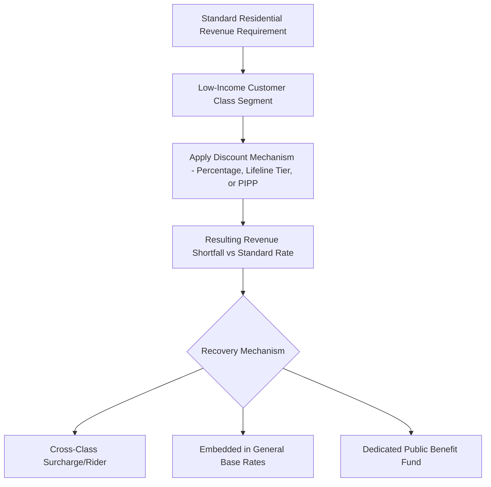

## Low Income and Lifeline Rate Programs

### Definition and Regulatory Rationale

Low income and lifeline rate programs are rate-design mechanisms that provide reduced electricity (or gas) rates, bill credits, or discounted fixed charges to qualifying low-income residential customers, distinguishing them from the standard rate schedule applied to the broader residential class. These programs sit within the rate-design layer of ratemaking: they do not alter a utility's overall revenue requirement (established through the rate base and cost-of-capital determination), but they redistribute how that revenue requirement is collected across the residential customer class, and in most jurisdictions the resulting revenue shortfall from discounted low-income bills is recovered from other ratepayers or through a dedicated funding mechanism.

The regulatory rationale draws on several distinct policy justifications, which are often treated separately in rate case testimony:

- **Affordability and energy burden mitigation** — low-income households frequently carry a disproportionately high **energy burden** (utility costs as a percentage of household income), and lifeline rates are intended to keep essential electricity/gas service affordable.
- **Universal service obligation** — many regulatory frameworks treat electricity as an essential service, giving commissions authority (and sometimes statutory mandate) to ensure a baseline level of access regardless of ability to pay.
- **Public health and safety** — protecting service continuity for customers dependent on electrically powered medical equipment or climate control during extreme weather.
- **Arrearage and shutoff reduction** — well-designed low-income rate programs can reduce payment delinquency, service disconnections, and the administrative/collections costs a utility would otherwise incur, partially offsetting the discount's revenue impact.

### Taxonomy of Program Mechanisms

**Percentage Bill Discount**

A fixed percentage reduction applied to the customer's total bill (e.g., 20–35% off), regardless of usage level. Simple to administer but does not directly address usage-driven bill volatility.

**Lifeline Rate / Baseline Tier Discount**

A discounted rate applied specifically to an initial "lifeline" block of consumption presumed necessary for basic needs (lighting, refrigeration, essential appliances), with usage above that block billed at the standard rate or a higher inclining-block rate. This ties the discount structurally to an inclining block rate design.

$$\text{Bill} = (P_{lifeline} \times \min(E, E_{threshold})) + (P_{standard} \times \max(0, E - E_{threshold}))$$

where $E_{threshold}$ is the lifeline consumption threshold (kWh), $P_{lifeline} < P_{standard}$.

**Percentage of Income Payment Plan (PIPP)**

Ties the customer's bill obligation to a defined percentage of household income (commonly 3–6% of income for electricity, sometimes higher when combined with heating), rather than to consumption-based rates directly. The difference between the income-based obligation and the actual cost-based bill is typically covered by an arrearage forgiveness mechanism, low-income assistance fund, or cross-subsidy from other customers.

$$\text{Customer Obligation} = k \times \text{Household Income}, \quad k \in [0.03, 0.06] \text{ (illustrative range)}$$

**Fixed Charge / Customer Charge Discount**

A reduced or waived monthly fixed service charge, leaving volumetric rates unchanged. Often used as a simpler-to-administer complement to a percentage discount.

**Categorical/Automatic Enrollment Discount**

A flat discount automatically applied to customers who are categorically eligible via enrollment in other means-tested programs (e.g., SNAP, Medicaid, or equivalent), reducing the administrative burden of separate income verification.

### Comparative Table

| Mechanism | Basis | Administrative Complexity | Bill Predictability for Customer |
| --- | --- | --- | --- |
| Percentage Bill Discount | % off total bill | Low | Moderate (scales with usage) |
| Lifeline/Baseline Tier | Discounted rate on first usage block | Moderate | Moderate |
| PIPP | % of household income | High (requires income verification, periodic recertification) | High |
| Fixed Charge Discount | Reduced/waived customer charge | Low | Low impact on volumetric bill |
| Categorical Enrollment Discount | Cross-program eligibility | Low (leverages existing verification) | Moderate |

### Funding and Cost Recovery Mechanisms

Because low-income discounts create a revenue shortfall relative to what the class would otherwise pay under standard rates, regulators must authorize a recovery mechanism. Common approaches include:

- **Cross-class or intra-class surcharge** — a per-kWh or per-customer surcharge applied to all other residential (or all) customers, recovered through a rider separate from base rates.
- **General rate base recovery** — the shortfall is embedded into the overall revenue requirement and recovered through standard rates across all customer classes, effectively socializing the cost.
- **Dedicated public benefit fund** — a statutorily created fund (sometimes financed through a small universal surcharge on all customers' bills, sometimes through state appropriations) that reimburses the utility for discount costs, keeping the mechanism more transparent and auditable than embedding it in base rates.
- **Ratepayer-funded arrearage management programs (AMPs)** — forgive a portion of a low-income customer's accumulated unpaid balance contingent on consistent on-time payment of their current (often discounted) bill, recovered through similar rider or base-rate mechanisms.

### Eligibility Determination and Verification

- **Income-based eligibility** — typically set as a percentage of the Federal Poverty Level (FPL) or Area Median Income (AMI) (commonly in the 150–200% FPL range in U.S. contexts), requiring income documentation or self-certification subject to audit.
- **Categorical eligibility** — automatic qualification based on enrollment in other verified means-tested programs, reducing duplicate verification burden on both the customer and the utility.
- **Periodic recertification** — most programs require re-verification (annually or biennially) to confirm continued eligibility, balancing administrative cost against the risk of ineligible customers remaining enrolled.
- **Data-matching and auto-enrollment** — some jurisdictions have moved toward automated eligibility determination via data-sharing agreements with state benefits agencies, intended to increase enrollment (**take-up rate**) among eligible but non-enrolled households, a persistent challenge across most low-income utility programs [Inference: take-up rate improvements from auto-enrollment initiatives are generally reported as positive in program evaluations, though the magnitude varies by jurisdiction and data-sharing infrastructure maturity].

### Worked Example: Lifeline Tier vs. Standard Rate

Assume a residential lifeline program with the following structure:

- Lifeline threshold: 400 kWh/month
- Lifeline rate: $0.10/kWh (for usage up to threshold)
- Standard rate above threshold: $0.19/kWh
- Standard (non-discounted) flat rate for comparison: $0.17/kWh across all usage

For a qualifying customer using 500 kWh in a month:

**Lifeline program bill:**

$$(400 \times 0.10) + (100 \times 0.19) = 40.00 + 19.00 = \$59.00$$

**Standard (non-discounted) bill:**

$$500 \times 0.17 = \$85.00$$

The customer saves $26.00 (approximately 31%) under the lifeline structure relative to the standard rate at this usage level. Note that the percentage savings *diminishes* as usage rises further above the threshold, since only the first 400 kWh benefits from the discounted rate — an inherent design characteristic of threshold-based lifeline structures, distinguishing them from flat percentage-discount programs where the savings percentage remains constant regardless of usage level.

### Interaction with Other Rate Design Elements

- **Inclining block rates** — lifeline tier discounts are structurally often the first block of a broader inclining block rate (IBR) design; the same tiered-rate architecture used for conservation price signals can be adapted to layer in an affordability discount at the lowest tier.
- **Time of Use (TOU) interaction** — some jurisdictions exempt low-income customers from mandatory TOU rate transitions, or provide a modified/protected TOU rate structure, out of concern that inflexible schedules (e.g., shift work, medical equipment needs) disproportionately expose low-income households to bill volatility under time-varying pricing; this is a frequently contested issue where affordability policy intersects with time-of-use rate-design rollouts.
- **Demand charges** — low-income residential customers are rarely subject to demand charges (a structure generally reserved for C&I classes), but where minimum bill or fixed-charge increases are proposed for residential rate reform, low-income program design is often cited by intervenors as a mitigating consideration.
- **Weatherization and energy efficiency program bundling** — lifeline/discount rate programs are frequently administered alongside (though structurally distinct from) low-income weatherization assistance programs, since bill discounts address affordability while efficiency measures address underlying consumption levels; regulators sometimes evaluate these as a combined portfolio in program-cost-effectiveness reviews.

### Common Points of Contention in Rate Cases

- **Cross-subsidy magnitude and allocation** — non-low-income residential customers (or, in some designs, all customer classes) bear the cost of the discount, and intervenors representing other customer segments frequently scrutinize the size of the surcharge or embedded cost and its allocation method.
- **Adequacy of discount level relative to energy burden** — advocacy groups often argue that discount percentages or PIPP income-percentage caps remain insufficient to bring energy burden down to sustainable levels (commonly benchmarked against a 6% affordability threshold), while utilities and other ratepayer representatives weigh this against overall rate impact.
- **Take-up rate and outreach funding** — the gap between income-eligible households and actual enrolled participants is a recurring audit and evaluation finding, prompting debate over how much outreach/enrollment infrastructure cost is appropriate to recover through rates.
- **Program cost-effectiveness evaluation methodology** — whether reduced arrearages, avoided shutoff/reconnection costs, and reduced collections expense are adequately quantified as offsetting benefits when regulators assess the net rate impact of a proposed low-income program design.

**Related Topics**

- Inclining Block Rate Design and Conservation Pricing
- Arrearage Management Programs and Bad Debt Cost Recovery
- Energy Burden Metrics and Affordability Benchmarking
- Cost of Service Studies and Residential Class Cost Allocation
- Time of Use and Dynamic Pricing Tariffs (Vulnerable Customer Protections)
- Public Benefit Funds and Systems Benefit Charges
- Service Disconnection and Reconnection Policy Regulation