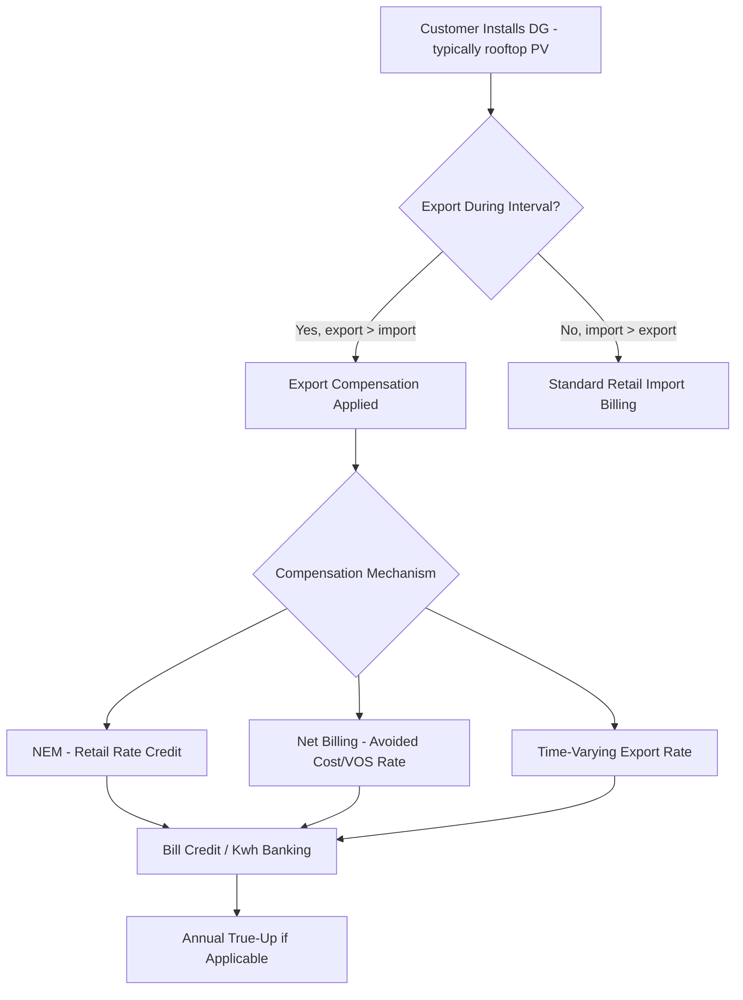

## Net Metering and Distributed Generation Compensation

### Definition and Regulatory Context

Net metering and distributed generation (DG) compensation refers to the set of rate mechanisms governing how customer-owned generation resources — most commonly rooftop or ground-mounted solar photovoltaic (PV) systems, but also small wind, combined heat and power (CHP), and behind-the-meter storage — are credited for electricity exported to the grid. This is a rate-design and interconnection-adjacent topic that sits at the intersection of tariff structure, cost of service allocation, and rate base impact: DG compensation mechanisms determine both what individual DG customers pay/receive and how the costs of maintaining grid infrastructure are shared between DG and non-DG customers.

The core ratemaking tension is that a DG customer typically remains connected to and reliant on the distribution grid (for import during low-generation periods and export during excess-generation periods) while reducing net purchases from the utility, which reduces the volumetric revenue the utility collects even though the grid infrastructure (rate base) sized to serve that customer's peak import need is largely unchanged. This has made DG compensation one of the most actively litigated rate-design areas in retail electricity regulation over the past decade.

### Taxonomy of Compensation Mechanisms

**Net Energy Metering (NEM) — Retail Rate Crediting**

The traditional and historically most common structure: exported energy is credited at the same retail volumetric rate the customer would otherwise pay for imported energy, effectively allowing the customer's meter to "run backward." Net consumption over the billing period (or an annual true-up period) determines the bill.

$$\text{Bill} = P_{retail} \times (E_{import} - E_{export})$$

Where $E_{export} > E_{import}$ within a period, many NEM tariffs carry the excess credit forward (kWh credit banking) to offset future bills, with an annual true-up settling any remaining balance (often at a lower "avoided cost" rate rather than retail rate).

**Net Billing / Buy-All-Sell-All**

Import and export are metered and priced separately rather than netted:

$$\text{Bill} = (P_{import} \times E_{import}) - (P_{export} \times E_{export})$$

where $P_{export}$ is typically set below the retail rate $P_{import}$, reflecting an avoided-cost, wholesale-equivalent, or separately determined "export compensation rate" rather than the full retail rate.

**Value of Solar (VOS) Tariff**

A compensation rate derived from a formal **value of solar study**, which attempts to quantify the marginal value of DG export across multiple cost/benefit components rather than defaulting to either retail or wholesale price:

$$P_{VOS} = P_{energy} + P_{capacity} + P_{T\&D\_deferral} + P_{losses} + P_{environmental} - P_{integration\_costs}$$

Each term represents a distinct avoided-cost or cost-imposed component (avoided energy cost, avoided generation capacity cost, avoided/deferred T&D capacity investment, avoided line losses, environmental/RPS compliance value, less any integration or administrative costs attributable to DG).

**Time-Varying Export Rates**

Export compensation that varies by time period (paralleling TOU tariff design), intended to value exports more highly during system peak or high-marginal-cost hours and less during periods of oversupply (e.g., midday solar oversupply in high-PV-penetration systems, sometimes producing near-zero or negative marginal value during those hours).

**Feed-in Tariff (FiT)**

A fixed, pre-determined per-kWh price paid for all generation (not just net export) over a long-term contract period, historically used to drive DG/renewable adoption in several international markets; distinguished from NEM/net billing by compensating gross generation rather than net export and by typically being set through an administrative price-setting process rather than derived from a cost/value study.

### Comparative Table

| Mechanism | Export Compensation Basis | Import/Export Netting | Typical Rate Impact Concern |
| --- | --- | --- | --- |
| NEM (retail rate) | Full retail rate | Netted (often monthly + annual true-up) | Largest potential cost-shift to non-DG customers |
| Net Billing | Separately priced, typically below retail | Not netted; billed separately | More cost-reflective; lower bill savings for DG customer |
| Value of Solar (VOS) | Derived from formal cost/benefit study | Not netted | Requires periodic VOS study updates; complex to administer |
| Time-Varying Export | Retail-adjacent, varies by period | Varies by design | Mitigates oversupply-period overcompensation |
| Feed-in Tariff | Fixed administered price, gross generation | Not netted (gross basis) | Budget/cost-cap exposure if adoption exceeds projections |

### Cost-Shift Debate and the "Cost Shift" Analytical Framework

The central controversy in DG compensation policy is the **cost-shift** (sometimes termed "cross-subsidization") question: because fixed and demand-related distribution costs are largely recovered through volumetric energy charges in most residential tariffs, a DG customer who reduces net kWh purchases while still relying on the grid can reduce their contribution to fixed-cost recovery, with volumetric-rate-based fixed cost potentially reallocated to non-DG customers through subsequent rate cases.

$$\text{Cost Shift} \approx (P_{retail} - P_{avoided\_cost}) \times E_{export}$$

This framing treats the retail rate as containing an implicit fixed-cost recovery component beyond the pure avoided energy cost, such that crediting exports at the full retail rate overcompensates DG customers relative to the cost they actually avoid causing the utility to incur [Inference: the magnitude of any cost shift is highly sensitive to underlying assumptions in the avoided-cost calculation, DG penetration levels, and the utility's specific cost structure, and is a frequently disputed empirical question between utility-sponsored and solar-industry-sponsored cost-benefit studies presented in the same proceedings]. Regulatory responses vary substantially by jurisdiction and have moved in different directions over time, including maintaining NEM, transitioning to net billing with reduced export rates, or introducing separate DG-specific fixed charges or minimum bills.

### Interconnection and Rate Base Interaction

DG compensation policy connects to rate base through several channels:

- **Grid modernization and hosting capacity investment** — accommodating growing DG penetration on distribution feeders (voltage regulation, protection coordination, hosting capacity analysis) can require utility capital investment, which is added to rate base and recovered through the revenue requirement; the allocation of these DG-integration-driven capital costs across DG and non-DG customers is itself contested.
- **Avoided T&D capacity deferral** — where DG output is well-correlated with system or local feeder peak, it can reduce or defer the need for future distribution capacity upgrades, a benefit sometimes explicitly monetized in VOS studies as the $P_{T\&D\_deferral}$ component.
- **Non-wires alternatives (NWA)** — a related and increasingly formalized mechanism where DG (often paired with storage) is procured or compensated specifically as an alternative to a traditional rate-base capital investment (e.g., a substation or feeder upgrade), with compensation structured through a distinct NWA solicitation/contract rather than the standard net metering tariff.
- **Standby/backup service charges** — DG customers who retain grid interconnection for backup power (rather than exporting regularly) may be subject to separate standby demand or capacity charges, a related but analytically distinct rate-design question from export compensation itself.

### Successor Tariff Design Patterns (Illustrative)

Where jurisdictions have transitioned away from traditional retail-rate NEM, common design elements in successor tariffs include:

- **Export compensation rate reduction** — moving export credit from full retail rate to an avoided-cost or ACC (avoided cost calculator)-derived rate, often substantially lower per kWh.
- **Grandfathering/legacy customer treatment** — existing DG customers enrolled under the prior tariff are frequently grandfathered for a defined transition period (commonly 10–20 years) to preserve the economics underlying their original investment decision, a recurring point of regulatory and legal contention when transition periods are proposed to be shortened.
- **Fixed charge or minimum bill increases** — introducing or raising a fixed monthly charge specific to (or disproportionately affecting) DG customers, intended to ensure continued contribution to fixed distribution cost recovery regardless of net energy purchased.
- **Storage adoption incentives** — export rate structures that pay more for exports during system peak hours (versus midday oversupply hours) create an economic incentive for pairing DG with battery storage to shift export timing, which several successor tariff designs explicitly intend as a behavioral outcome.

### Worked Example: NEM vs. Net Billing Comparison

Assume a residential solar customer with the following monthly profile:

- Total import (grid purchases): 300 kWh at retail rate $0.20/kWh
- Total export (excess solar to grid): 200 kWh
- Retail rate: $0.20/kWh
- Avoided-cost export rate (net billing alternative): $0.06/kWh

**Under NEM (retail rate crediting):**

$$\text{Bill} = 0.20 \times (300 - 200) = 0.20 \times 100 = \$20.00$$

**Under Net Billing (separate avoided-cost export rate):**

$$\text{Bill} = (0.20 \times 300) - (0.06 \times 200) = 60.00 - 12.00 = \$48.00$$

The customer's bill is $28.00 higher under net billing at this same usage/export profile, illustrating the direct financial mechanism behind the cost-shift debate: the same physical export volume produces substantially different bill outcomes — and substantially different implied compensation to the DG customer — purely as a function of which compensation mechanism the tariff employs.

### Common Points of Contention in Rate Cases and Policy Proceedings

- **Avoided cost calculation methodology** — the specific inputs and assumptions used to derive $P_{avoided\_cost}$ or the VOS components are frequently the most heavily litigated technical element, since small changes in avoided capacity or T&D deferral value assumptions can materially shift the resulting export rate.
- **Grandfathering duration and eligibility** — disputes over how long legacy NEM customers should retain original tariff terms when a successor tariff is adopted, balancing regulatory takings/reliance-interest concerns against ongoing cost-shift accumulation.
- **DG-specific fixed or demand charges** — proposals to apply higher fixed charges, minimum bills, or even demand charges specifically (or disproportionately) to DG-owning residential customers are contested as both a cost-recovery necessity (utility position) and a discriminatory or adoption-chilling measure (solar industry/advocate position).
- **Low-income and equity considerations** — since DG adoption has historically skewed toward higher-income households with the capital or financing access to install systems, cost-shift concerns intersect with the low-income rate program debate (see Low Income and Lifeline Rate Programs), with some analyses examining whether NEM-driven cost shifts disproportionately burden non-adopting, often lower-income ratepayers [Inference: empirical findings on the magnitude and distributional incidence of this effect vary across studies and jurisdictions].
- **Interconnection queue and hosting capacity constraints** — separate from compensation rate design, growing interconnection application volumes have raised related but distinct regulatory questions about hosting capacity map transparency, interconnection study timelines, and cost allocation for any required grid upgrades triggered by a specific interconnection request.

**Related Topics**

- Time of Use and Dynamic Pricing Tariffs (Time-Varying Export Rate Design)
- Cost of Service Studies and Distribution Cost Allocation
- Non-Wires Alternatives and Capital Deferral Valuation
- Low Income and Lifeline Rate Programs (Equity and Cost-Shift Intersection)
- Interconnection Standards and Hosting Capacity Analysis
- Demand Charges for Commercial and Industrial Customers
- Behind-the-Meter Storage Economics and Dispatch Optimization