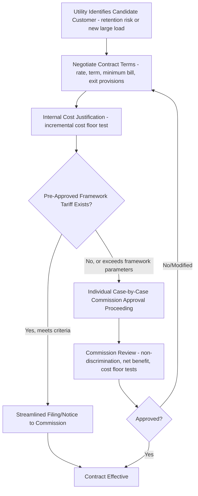

## Special Contracts and Negotiated Service Agreements

### Definition and Regulatory Framework

Special contracts (also termed negotiated service agreements, economic development rates, or flexible service agreements depending on jurisdiction) are customer-specific rate arrangements negotiated individually between a utility and a large customer — typically large industrial, commercial, or institutional load — that deviate from the standard, commission-approved tariff schedule otherwise applicable to that customer's class. Unlike general rate design (TOU, demand charges, lifeline rates), which applies uniformly to all customers within a defined class, special contracts are customer-specific instruments, making them an exception to the general ratemaking principle that rates should be uniformly applicable within a class.

Because special contracts depart from standard tariffs, they typically require **regulatory commission approval** (either individually or under a pre-approved framework/template establishing permissible terms), and are subject to statutory or commission-established standards intended to prevent undue discrimination among similarly situated customers — a core tension given that special contracts are, by definition, a form of customer-specific rate differentiation.

### Rationale for Special Contracts

- **Load retention** — preventing a large customer from relocating operations, self-generating, or switching to an alternative energy source (e.g., in states with retail choice, switching to a competitive supplier) by offering rate terms more competitive with the customer's alternatives.
- **Economic development and load attraction** — offering favorable rates to attract new large industrial/commercial load (e.g., data centers, manufacturing facilities) to the utility's service territory, often tied to job creation or capital investment commitments by the customer.
- **Accommodating unique load characteristics** — some large customers have load profiles, interruptibility tolerance, or service requirements sufficiently distinct from the standard tariff's designed customer profile that a standard rate poorly reflects the actual cost to serve them.
- **Risk allocation for large, uncertain loads** — particularly relevant for emerging large-load categories (e.g., data centers, hydrogen production facilities, large-scale electrification projects) where the utility faces asymmetric risk if it makes rate base investments to serve a load that later does not materialize as forecast.

### Standard Contract Provisions

**Minimum Take-or-Pay / Minimum Bill Provisions**

Guarantee the utility a minimum revenue level regardless of actual usage, protecting against the risk that the customer reduces or ceases load after utility-side infrastructure investment has been made.

$$\text{Minimum Bill} = \max\left(\text{Actual Bill}, \; k \times \text{Contract Demand} \times P_{demand}\right)$$

where $k$ is the minimum billing demand percentage specified in the contract (analogous in function to a ratchet clause but individually negotiated rather than tariff-standard).

**Contract Term and Exit Provisions**

Special contracts typically specify a defined term (often 5–20 years for large industrial/economic-development contracts) with early-termination or exit fee provisions designed to recover any stranded utility investment made specifically to serve that customer if the customer exits before the infrastructure cost is fully recovered.

**Step-Down / Escalation Clauses**

Rate discounts are often structured to decline over time (a "step-down" schedule) rather than remain fixed for the full contract term, reflecting a policy preference for special contracts to serve as a transitional bridge (e.g., while the customer's load grows to a scale that is separately cost-justified under standard tariffs) rather than a permanent subsidy.

**Load/Demand Commitment and True-Up**

Specifies the customer's committed minimum and/or maximum demand or energy off-take, often with periodic true-up provisions reconciling actual usage against forecast/contracted levels, and mechanisms for renegotiation if actual load diverges materially from the assumptions underlying the original contract's cost justification.

**Collateral and Credit Support Requirements**

For large-load or higher-risk customers (particularly relevant for new large-load categories without an established payment history), contracts frequently require credit support (letters of credit, security deposits, parent company guarantees) sized to the utility's exposure if the customer defaults or exits early, particularly where the utility has made customer-specific capital investment.

### Regulatory Standards Governing Special Contracts

**Incremental Cost / Cost-Floor Test**

Most jurisdictions require that a special contract rate, however discounted relative to standard tariffs, must at minimum recover the utility's incremental cost of serving that customer — commonly interpreted as marginal or avoidable cost — such that other ratepayers are not required to subsidize the discounted customer's service below the utility's actual cost to serve them.

$$P_{contract} \geq C_{incremental}$$

**Non-Discrimination / "Similarly Situated" Standard**

Regulatory frameworks generally require that special contract terms be available (or a comparable framework be available) to other customers who are "similarly situated" in terms of load characteristics, size, and competitive alternatives, to avoid arbitrary or discriminatory preferential treatment among comparable large customers.

**Public Interest / Net Benefit Test**

Many jurisdictions require the utility (or commission staff) to demonstrate that the special contract produces a net benefit to the remaining ratepayer base — typically framed as: the contract retains or attracts load and associated revenue contribution that would otherwise be lost entirely (load departure) or never realized (foregone economic development), and that this contribution, even at a discounted rate, exceeds the alternative of not having that load on the system at all.

$$\text{Net Ratepayer Benefit} = (\text{Contract Revenue} - \text{Cost to Serve}) \;-\; (\text{Revenue Loss if Load Departs/Never Materializes})$$

**Reporting and Periodic Review**

Commissions frequently require utilities to file special contracts (or a summary/notice) for review, and may require periodic reporting on aggregate special contract activity, cross-subsidization impact, and adherence to any pre-established template/framework parameters, particularly where a framework tariff pre-authorizes contracts meeting specified criteria without case-by-case individual approval.

### Approval Process Structure

### Comparative Table: Special Contract vs. Standard Tariff Service

| Dimension | Standard Tariff Service | Special Contract |
| --- | --- | --- |
| Applicability | Uniform within customer class | Customer-specific |
| Approval Basis | Rate case (class-wide) | Individual filing or pre-approved framework |
| Term Flexibility | Ongoing, subject to periodic rate cases | Fixed term with defined exit provisions |
| Price Determination | Cost of service study + class allocation | Negotiated, subject to incremental cost floor |
| Risk Allocation | Diffused across class | Explicitly negotiated (minimum bills, collateral, exit fees) |

### Interaction with Rate Base and Cost Allocation

Special contracts interact with rate-basing in several important respects:

- **Customer-specific capital investment** — where a utility must build dedicated infrastructure (a substation, dedicated feeder, or transmission interconnection) to serve a special-contract customer, that investment is generally added to rate base, and the special contract's minimum-bill and term provisions are structured specifically to ensure the customer's payments are sufficient to support recovery of (or a substantial contribution toward) that dedicated capital investment even if usage falls short of the original forecast.
- **Stranded cost risk** — if a special-contract customer exits early or reduces load materially below contracted levels, dedicated capital investment may become partially unrecoverable from that customer, creating a stranded cost that (absent adequate exit-fee/collateral protection) may ultimately be recovered from the general ratepayer base, which is precisely the outcome the non-discrimination and net-benefit regulatory tests are designed to guard against.
- **Large new-load categories and rate base risk** — the recent growth of very large, rapidly-developing load categories such as data centers/AI compute facilities has intensified regulatory attention on special contract design, given the scale of utility-side capital investment such loads can require and the risk profile if projected load growth does not fully materialize; several state commissions have opened or updated large-load tariff proceedings specifically addressing minimum-term commitments, exit fee sizing, and collateral requirements for this customer category [Unverified: the specific design parameters (minimum term length, collateral formulas) adopted vary significantly by jurisdiction and are an actively evolving area of ratemaking policy].

### Common Points of Contention in Regulatory Proceedings

- **Adequacy of the incremental cost floor test** — disputes over whether the utility's incremental cost calculation appropriately captures all costs the special-contract customer causes, including allocated share of common/shared infrastructure, versus a narrowly defined marginal cost that could understate true cost responsibility.
- **Net benefit test rigor and forecast risk** — challenges to the utility's "but-for" scenario (i.e., the assumption that load would otherwise depart or never materialize) as potentially overstated to justify a larger discount than necessary for retention/attraction.
- **Confidentiality and transparency tension** — special contracts often involve customer-competitively-sensitive information (production volumes, expansion plans), creating tension between commission and public-interest-intervenor demands for review transparency and the customer's legitimate confidentiality interests, frequently resolved through protective orders or redacted public filings.
- **Cross-subsidization concerns from other ratepayers/classes** — intervenors representing residential or other customer classes routinely scrutinize whether special contract discounts are fully cost-justified or represent an implicit subsidy shifted onto other rate classes.
- **Exit fee and collateral adequacy for large emerging loads** — given the scale and forecast uncertainty associated with categories like data centers, current proceedings frequently focus on whether proposed minimum-term and collateral provisions are sufficient to protect remaining ratepayers against stranded-cost risk if such loads underperform forecasts or relocate.

**Related Topics**

- Cost of Service Studies and Incremental/Marginal Cost Determination
- Stranded Cost Recovery and Utility Investment Risk Allocation
- Large Load / Data Center Interconnection and Tariff Design
- Demand Charges for Commercial and Industrial Customers
- Non-Discrimination Standards in Utility Rate Regulation
- Economic Development Rate Riders and Load Retention Policy
- Rate Base Prudence Review and Used-and-Useful Standards