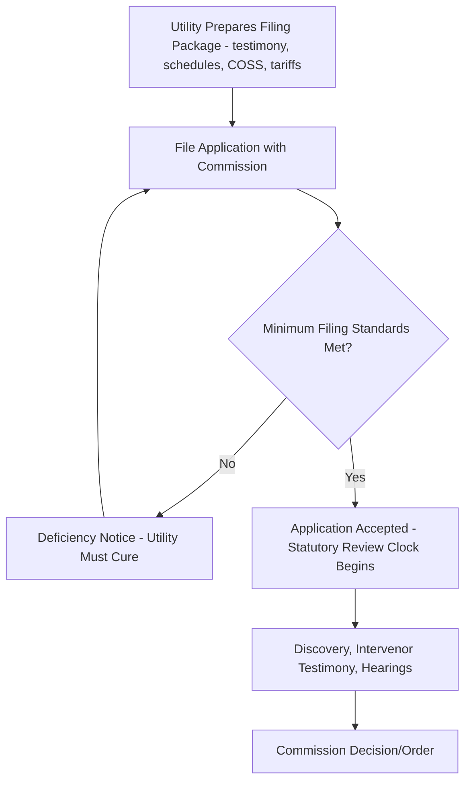

## Filing Requirements and Minimum Filing Standards

### Definition and Purpose

Minimum filing standards (also termed minimum filing requirements, MFRs, or filing guidelines depending on jurisdiction) are the codified set of documentation, data schedules, testimony, and procedural requirements a utility must satisfy when initiating a general rate case or other major ratemaking filing with a regulatory commission. These standards exist to ensure that a rate case application is administratively complete and technically sufficient for the commission, its staff, and intervenors to evaluate the utility's requested revenue requirement and proposed rate design without requiring extensive threshold discovery merely to understand what is being requested.

Minimum filing standards are typically established through commission rule, statute, or standing order (rather than negotiated case-by-case), and function as a gatekeeping mechanism: an application failing to meet minimum filing standards may be rejected, suspended, or deemed deficient/incomplete at the outset, which can delay the start of the statutory or regulatory review clock.

### Core Components of a Rate Case Filing

**Test Year Data**

The foundational financial and operational data package establishing the utility's revenue, expenses, and rate base for a defined **test year** — either a **historical test year** (a recently completed 12-month period, sometimes adjusted for known and measurable changes) or a **future/forecast test year** (a projected period, often the first year rates will be in effect), depending on jurisdictional practice.

**Direct Testimony and Supporting Schedules**

Written, pre-filed testimony from utility witnesses (typically organized by subject-matter area — revenue requirement, cost of service, rate design, capital structure/cost of capital, specific O&M expense categories) accompanied by detailed exhibits and workpapers substantiating the figures presented.

**Rate Base Schedules**

Detailed schedules documenting the components of the requested rate base: gross plant in service by function (generation, transmission, distribution, general plant), accumulated depreciation, construction work in progress (CWIP) treatment, working capital allowance, and any deductions (accumulated deferred income taxes, customer deposits, contributions in aid of construction).

**Revenue Requirement Calculation**

The full derivation connecting rate base, allowed rate of return, operating expenses, depreciation, and taxes into the total requested revenue requirement:

$$RR = (RB \times r) + O\&M + D + T$$

where $RB$ is rate base, $r$ is the allowed weighted average cost of capital/rate of return, $O\&M$ is operating and maintenance expense, $D$ is depreciation expense, and $T$ is taxes.

**Cost of Service Study**

The class cost allocation study supporting the utility's proposed distribution of the revenue requirement across customer classes, including functionalization, classification, and allocation methodology documentation (see related Cost of Service Studies topic).

**Proposed Tariff Sheets (Redlined and Clean)**

Both the current, effective tariff language and the proposed revised tariff sheets, typically provided in both clean and redlined/comparison format so reviewers can identify exactly what is changing.

**Capital Structure and Cost of Capital Testimony**

Documentation of the utility's actual and/or proposed capital structure (debt/equity ratio), embedded cost of debt, and requested return on equity (ROE), typically supported by expert testimony including comparable-company analyses (DCF, CAPM, risk premium models).

**Depreciation Studies**

Supporting analysis for proposed depreciation rates/service lives by plant account, often prepared by a depreciation specialist and filed as a discrete supporting study.

**Load Forecast and Sales Forecast**

Projected customer counts, energy sales, and peak demand by class, underpinning both the revenue-at-present-rates calculation and (where applicable) the forecast test year itself.

### Comparative Table: Test Year Approaches

| Test Year Type | Basis | Adjustment Practice | Common Jurisdictional Use |
| --- | --- | --- | --- |
| Historical Test Year | Most recently completed 12-month period | "Known and measurable" adjustments for post-test-year changes | Traditional approach in many jurisdictions |
| Fully Forecasted/Future Test Year | Projected 12-month period (often first rate-effective year) | Based on utility forecast models, subject to reasonableness review | Used where regulatory lag concerns are prioritized |
| Historical Test Year with Attrition/Formula Adjustment | Historical base plus a formulaic escalation | Adjustment factor set by rule or prior order | Hybrid approach balancing verifiability and currency |

### Filing Completeness and Procedural Consequences

**Deficiency Review**

Many commissions or their staff conduct an initial administrative/technical completeness review shortly after filing (often within a defined short window, e.g., 10–30 days) to determine whether the application satisfies minimum filing standards; a determination of deficiency can result in the filing being rejected or suspended until cured, which may reset or toll the statutory review clock.

**Suspension and Statutory Review Periods**

Many jurisdictions impose a statutory maximum period (commonly ranging roughly 7–12 months, varying significantly by jurisdiction) within which the commission must issue a final decision or the proposed rates take effect automatically (sometimes subject to bond/refund provisions); minimum filing standards compliance at the outset is directly relevant to preserving the commission's full use of this statutory review window rather than consuming part of it on preliminary completeness disputes.

**Interim/Bond Rate Provisions**

In some jurisdictions, if the commission does not act within the statutory period, the utility may be permitted to implement proposed rates on an interim basis subject to a refund obligation (with interest) if the final approved rates are lower — a mechanism that increases the practical importance of both timely minimum-filing-standard compliance and efficient case management.

### Data Request (Discovery) Process Following Filing

Once accepted, the filing becomes the basis for formal discovery: commission staff and intervenors submit **data requests (DRs)** seeking clarification, additional detail, or workpapers underlying the filed testimony and schedules. Minimum filing standards are designed to reduce (though not eliminate) the volume of foundational data requests needed simply to understand the case, allowing discovery to focus more on substantive disputes (e.g., ROE reasonableness, specific expense prudence) rather than basic data gathering.

### Standardized Schedule Conventions

Many jurisdictions specify standardized schedule numbering/lettering conventions (e.g., "Schedule B" for rate base, "Schedule C" for income statement/revenue requirement, "Schedule D" for cost of capital) to facilitate consistent review across successive rate cases from the same utility and comparability across different utilities' filings within the same jurisdiction. Filing standards commonly also specify required electronic format (searchable PDF, native spreadsheet with live formulas rather than pasted values) to facilitate staff and intervenor analysis.

### Special Filing Categories

- **Limited-issue riders and single-issue filings** — some proceedings (e.g., infrastructure replacement riders, storm cost recovery, fuel/purchased power cost trackers) have distinct, narrower minimum filing standards tailored to the specific single-issue nature of the filing rather than requiring a full general-rate-case-scope package.
- **Multi-year rate plans (MYRPs) / performance-based ratemaking (PBR) filings** — filings proposing a multi-year rate path or performance-based mechanisms typically require additional supporting documentation specific to that framework (e.g., proposed performance metrics, earnings-sharing mechanism design, off-ramp provisions), layered on top of standard minimum filing requirements.
- **Settlement filings** — where parties reach a negotiated settlement of some or all issues in a pending case, filing standards for the settlement documentation itself (joint stipulation, supporting testimony explaining why the settlement is in the public interest) are typically distinct from the standards governing the original application.

### Common Points of Contention

- **Test year currency and post-test-year adjustments** — disputes over which "known and measurable" changes should be reflected in a historical test year, or over the reasonableness of specific forecast assumptions in a future test year.
- **Workpaper accessibility and native format compliance** — intervenor complaints regarding utilities filing static/locked schedules rather than fully functional native spreadsheets, hindering independent verification of calculations.
- **Adequacy of minimum filing standards for emerging cost categories** — evolving cost areas (e.g., cybersecurity investment, large-load-driven capital programs, wildfire mitigation spending in some jurisdictions) sometimes prompt commission proceedings to update minimum filing standards to require more granular or specific supporting documentation than legacy standards contemplated [Unverified: the specific pace and scope of minimum filing standard updates for emerging cost categories varies considerably by jurisdiction and is not uniformly current across all commissions].
- **Deficiency determination disputes** — disagreement over whether an identified filing gap constitutes a true minimum-filing-standard deficiency (justifying rejection/suspension) versus a matter properly addressed through ordinary discovery during an otherwise-accepted case.

**Related Topics**

- Test Year Selection and Known-and-Measurable Adjustments
- Cost of Service Studies and Class Allocation Methodology
- Rate Case Procedural Timeline and Statutory Review Periods
- Discovery and Data Request Practice in Rate Proceedings
- Multi-Year Rate Plans and Performance-Based Ratemaking Filing Requirements
- Settlement Procedures and Stipulation Review Standards
- Depreciation Studies and Service Life Determination