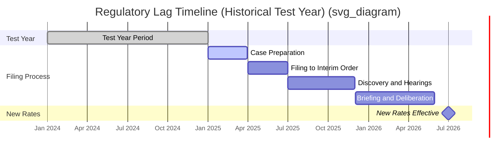

## Regulatory Lag and Its Financial Effects

### Definition and Conceptual Foundation

Regulatory lag is the time interval between when a utility incurs a change in its cost of service or investment base and when new rates reflecting that change take effect. It arises structurally from the rate case process itself: utilities cannot unilaterally change rates (in traditional cost-of-service regulation) and must instead file a rate case, undergo discovery, testimony, hearings, and a commission decision before new rates are effective.

Regulatory lag has two broad components:

- **Historical/Procedural Lag** — the time between the end of the test year (the period used to set the revenue requirement) and the effective date of new rates. This includes filing preparation, procedural schedule, intervenor discovery, hearings, briefing, and the commission's deliberation and order.
- **Regulatory Lag as an Incentive Mechanism** — even absent procedural delay, lag exists structurally because rates are fixed between cases while costs, sales volumes, and investment continue to change. This is sometimes called "regulatory lag" in the economic-incentive sense (distinct from mere administrative delay), and it is the mechanism traditionally credited with providing utilities an incentive to control costs under cost-of-service regulation.

### Why Regulatory Lag Exists Structurally

$$\text{Lag} = t_{\text{effective rates}} - t_{\text{cost incurred}}$$

Because rates are set using a **test year** — historical, future, or fully forecasted — and then held static until the next rate case, any divergence between test-year conditions and actual conditions during the period rates are in effect produces lag effects. Test year choice materially affects the magnitude of lag:

- **Historical Test Year** — uses fully completed, audited data from a past 12-month period, sometimes adjusted with "known and measurable" changes. Produces the longest effective lag because rates reflect conditions that are already stale by the time they take effect.
- **Future/Forecasted Test Year** — projects costs and revenues for a period after rates take effect, reducing lag but introducing forecast risk and increased scrutiny of assumptions.
- **Fully Forecasted Test Year with Attrition Adjustment** — attempts to bridge the gap between rate-effective date and the middle of the rate-effective period.

### Financial Effects on the Utility

**Key Points**

- **Earnings Erosion Between Cases**: If costs (O&M, depreciation, taxes) rise faster than sales growth between rate cases, actual earned ROE falls below the commission-authorized ROE. This is the single most cited financial consequence of regulatory lag.
- **Attrition**: The persistent, systematic decline in earned returns during the period between rate cases, distinct from one-time cost shocks. Attrition is especially severe for utilities undergoing rapid capital expenditure (e.g., grid modernization, generation buildout) because new plant is not earning a return until it is reflected in rate base.
- **Cash Flow Timing Mismatch**: Capital is spent (construction, plant additions) before it is recovered through rates, creating a funding gap that must be bridged with debt, equity, or internally generated cash — a phenomenon closely related to **Construction Work in Progress (CWIP)** and **Allowance for Funds Used During Construction (AFUDC)** treatment.
- **Asymmetric Risk**: Lag is asymmetric in practice — utilities generally cannot recover "lost" earnings from an under-earning period retroactively (no true-up), whereas a windfall from favorable conditions during the lag period is typically retained by the utility (subject to any earnings-sharing mechanisms). This asymmetry is central to why lag functions as a cost-control incentive but also as a source of financial risk that rating agencies monitor closely.
- **Credit Metric Pressure**: Prolonged or severe regulatory lag depresses funds from operations (FFO) relative to debt, a key metric in utility credit ratings (e.g., FFO/Debt ratios used by Moody's, S&P). Persistent lag issues in a jurisdiction can lead to a lower assessment of regulatory supportiveness, raising the utility's cost of capital across the board.

### Quantifying the Earnings Shortfall

The gap between authorized and earned ROE due to lag can be approximated conceptually as:

$$ROE_{\text{earned}} = ROE_{\text{authorized}} - \frac{\Delta \text{Cost of Service} - \Delta \text{Revenue at Current Rates}}{\text{Rate Base}}$$

Where $\Delta \text{Cost of Service}$ reflects growth in O&M, depreciation, and return requirements on new plant additions since the test year, and $\Delta \text{Revenue at Current Rates}$ reflects organic growth in billing units at existing (unchanged) rate schedules. When cost growth outpaces revenue growth under frozen rates, the earned ROE falls short of authorized ROE — this shortfall is the quantitative expression of attrition.

### Illustrative Example

**Example**

A vertically integrated electric utility completes a rate case using a historical test year ended December 31, Year 0. New rates become effective July 1, Year 1 (an 18-month procedural/historical lag). Between the test year and the new rate-effective date:

- Rate base grew 8% due to ongoing distribution capital expenditure not yet reflected in rates.
- O&M expense grew 5% due to inflation and vegetation management costs.
- Sales volume grew only 1%, insufficient to offset cost growth at existing rates.

Result: the utility's earned ROE for the 18-month lag period falls to approximately 8.2%, versus an authorized ROE of 9.8% — a 160 basis point shortfall attributable almost entirely to regulatory lag, since none of the new capital or cost growth was reflected in rates until the case concluded.

### Mechanisms Used to Mitigate Regulatory Lag

**Key Points**

- **Forward-Looking/Fully Forecasted Test Years**: Reduce lag by setting rates based on projected rather than historical costs.
- **Interim Rate Relief**: Some jurisdictions permit rates to go into effect (often under bond, subject to refund) before the final order, shifting risk temporarily but not eliminating true procedural lag.
- **Attrition Adjustments/Relief**: Formula-based adjustments (e.g., a fixed percentage escalator) applied between rate cases to approximate known cost growth.
- **Riders and Trackers**: Single-issue cost recovery mechanisms (fuel adjustment clauses, purchased power cost trackers, infrastructure replacement riders/trackers such as DSIC — Distribution System Improvement Charge) that allow specific, volatile, or capital-intensive costs to bypass the full rate case cycle and flow through to rates on a more frequent basis (monthly, quarterly, or annual true-up).
- **Formula Rate Plans (FRPs)**: Used extensively at FERC and in some state jurisdictions for transmission-owning utilities; rates are recalculated annually via a pre-approved formula using actual (often with a true-up) cost and rate base data, largely bypassing traditional rate case lag.
- **Multi-Year Rate Plans (MYRPs) / Performance-Based Ratemaking (PBR)**: Set rates or rate paths for multiple years in advance, sometimes indexed to inflation less a productivity offset (a "PBR" or "price cap" mechanism), reducing the frequency of full rate case filings and the associated lag exposure.
- **CWIP in Rate Base / AFUDC**: Including Construction Work in Progress directly in rate base (where permitted) allows a utility to earn a cash return during construction rather than relying solely on AFUDC (a non-cash, capitalized return added to plant cost and recovered later through depreciation), directly addressing the cash flow timing mismatch component of lag.

### Regulatory Lag as an Efficiency Incentive

[Inference] The traditional regulatory economics view — often associated with the Averch–Johnson framework's broader literature on rate-of-return regulation — holds that regulatory lag creates an incentive for utilities to reduce costs during the period between rate cases, since cost savings achieved while rates are frozen accrue to the utility as additional profit until the next case resets rates to reflect the lower costs. Conversely, cost increases during that period are borne by the utility until recovered. This dual-edged property is frequently cited in regulatory economics literature as the primary efficiency-promoting justification for retaining meaningful lag rather than moving to fully continuous, cost-tracking ratemaking. This characterization of lag as *purely* incentive-enhancing is a stylized model; in practice, jurisdictions balance it against the financial-viability concerns described above, which is why trackers, riders, and forecasted test years have proliferated even though they narrow the lag-driven incentive effect.

### Visualizing the Lag Timeline

### Attrition Gap Diagram

<svg xmlns="http://www.w3.org/2000/svg" viewBox="0 0 640 360">
<title>Cost vs. Revenue Growth During Regulatory Lag (svg_diagram)</title>
<rect x="0" y="0" width="640" height="360" fill="#ffffff" />
<line x1="60" y1="300" x2="600" y2="300" stroke="#333333" stroke-width="2" />
<line x1="60" y1="40" x2="60" y2="300" stroke="#333333" stroke-width="2" />
<text x="320" y="335" font-size="14" text-anchor="middle" fill="#333333">Time Since Test Year (Months)</text>
<text x="20" y="170" font-size="14" text-anchor="middle" fill="#333333" transform="rotate(-90 20 170)">Dollars</text>
<polyline points="60,260 180,230 300,195 420,155 540,110" fill="none" stroke="#c0392b" stroke-width="3" />
<text x="545" y="105" font-size="13" fill="#c0392b">Cost of Service</text>
<polyline points="60,260 180,250 300,238 420,222 540,205" fill="none" stroke="#2980b9" stroke-width="3" />
<text x="545" y="200" font-size="13" fill="#2980b9">Revenue at Frozen Rates</text>
<line x1="420" y1="222" x2="420" y2="155" stroke="#7f8c8d" stroke-width="2" stroke-dasharray="4,3" />
<text x="430" y="190" font-size="12" fill="#7f8c8d">Attrition Gap</text>
<circle cx="60" cy="260" r="4" fill="#333333" />
<text x="30" y="280" font-size="12" fill="#333333">Test Year End</text>
<circle cx="540" cy="300" r="4" fill="#333333" />
<text x="500" y="320" font-size="12" fill="#333333">New Rates Effective</text>
</svg>

### Jurisdictional and Policy Considerations

**Key Points**

- Commission-authorized ROE levels themselves implicitly (and sometimes explicitly) incorporate an allowance for regulatory lag risk — a utility subject to longer or more severe lag may argue for a higher authorized ROE as compensation for the additional risk borne between cases.
- Frequent use of trackers and riders is often criticized by consumer advocates as "de-risking" the utility (shifting cost-recovery certainty away from the utility and toward ratepayers) without a corresponding reduction in authorized ROE, since ROE levels are typically set assuming traditional lag-bearing risk.
- [Unverified] The precise magnitude of ROE reduction that should theoretically accompany expanded tracker usage is not standardized across jurisdictions and is frequently litigated as a contested issue in individual rate cases.
- Capital-intensive utilities (particularly those undertaking large infrastructure replacement programs, grid hardening, or generation transition investments) tend to advocate most strongly for lag-mitigating mechanisms, since their rate base growth rates make attrition most severe.

### Conclusion

Regulatory lag is a structural feature of cost-of-service ratemaking that creates a persistent gap between when a utility incurs costs or makes investments and when those amounts are reflected in rates paid by customers. Its financial effects — earnings attrition, cash flow timing mismatches, and credit metric pressure — are most severe for capital-intensive utilities with historical test years and infrequent rate case filings. While classical regulatory economics frames lag as a beneficial cost-control incentive, its financial risk has driven widespread adoption of lag-mitigating tools such as forecasted test years, formula rate plans, trackers/riders, and CWIP-in-rate-base treatment, each of which trades off the incentive-efficiency rationale for lag against utility financial stability and cost-recovery certainty.

**Related Topics**

- Test Year Selection (Historical, Future, Fully Forecasted, Hybrid)
- Attrition Relief Mechanisms and Formula Rate Plans
- Construction Work in Progress (CWIP) and AFUDC Accounting
- Riders and Cost Trackers (Fuel Adjustment Clauses, DSIC, Infrastructure Replacement Trackers)
- Multi-Year Rate Plans and Performance-Based Ratemaking (PBR)
- Return on Equity (ROE) Determination and Risk Premium Analysis
- Interim Rate Relief and Rates Subject to Refund
- Credit Rating Agency Treatment of Regulatory Lag (FFO/Debt Metrics)