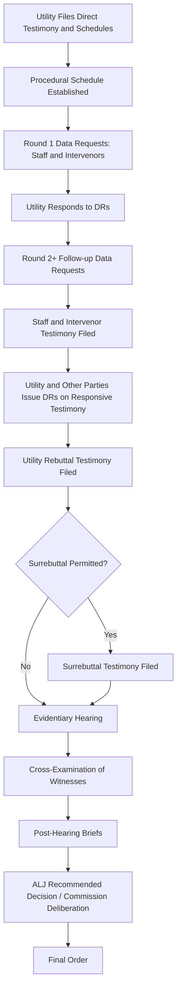

## Discovery, Data Requests, and Testimony

### Overview and Procedural Context

Discovery, data requests, and testimony constitute the evidentiary core of the rate case process — the mechanisms through which parties develop, test, and present the factual and expert basis for the commission's decision. Once a utility files a rate case (typically with initial direct testimony and supporting schedules), a procedural schedule is established that structures the exchange of information among the utility, commission staff, intervenors, and any other parties of record, culminating in an evidentiary hearing.

**Key Points**

- Rate cases are quasi-judicial administrative proceedings; discovery and testimony rules borrow heavily from civil litigation practice but are adapted to the pace and scope of regulatory dockets.
- The record built through discovery and testimony is the exclusive basis on which a commission (or hearing officer/administrative law judge) may lawfully render a decision — this is the **"on-the-record" evidentiary requirement** common to administrative law.
- Discovery in rate cases is typically broader and faster-paced than in general civil litigation, given statutory deadlines for commission decisions (statutory "suspension periods" after which rates may go into effect by operation of law absent a final order).

### The Parties Involved

- **Utility (Applicant)**: Bears the burden of proof to demonstrate that proposed rates are just and reasonable; sponsors direct testimony supporting its requested revenue requirement, rate base, cost of capital, and rate design.
- **Commission Staff**: An independent party (in most jurisdictions) that conducts its own investigation and often proposes adjustments; not an advocate for the utility or any intervenor.
- **Intervenors**: Parties granted standing to participate — commonly the state Attorney General/Office of Public Counsel (representing residential ratepayers), industrial/large-customer groups, environmental and consumer advocacy organizations, and competitive market participants.
- **Administrative Law Judge (ALJ) / Hearing Examiner**: Presides over discovery disputes, manages the procedural schedule, and often issues a recommended decision or proposed order.

### Data Requests (DRs) — Mechanics

**Key Points**

- A **Data Request (DR)**, also called an **Interrogatory** or **Information Request (IR)** depending on jurisdiction, is a formal written question or document request directed by one party to another (most often to the utility, but utilities and staff may also issue DRs to intervenors' witnesses).
- DRs are typically numbered sequentially by issuing party and round (e.g., "Staff DR 3-14" = Staff's Data Request, third round, question 14).
- Standard DR response deadlines range from 5 to 15 business days depending on jurisdiction and procedural schedule, often compressed as the hearing date approaches.
- DR responses must generally be provided under a **verification/certification** requirement — a company representative attests to the accuracy and completeness of the response, sometimes under oath.
- **Confidentiality/Protective Order**: Sensitive data (e.g., detailed cost data, customer information, competitively sensitive contracts) is typically produced subject to a protective order, restricting access to counsel and designated experts under a "Highly Confidential" or "Attorneys' Eyes Only" designation.

### Typical Categories of Data Requested

- Detailed workpapers underlying revenue requirement schedules (rate base, O&M, depreciation, taxes)
- General ledger detail and trial balances supporting test year expenses
- Cost of capital workpapers (capital structure detail, embedded debt cost schedules, DCF/CAPM/Risk Premium model inputs for ROE)
- Affiliate transaction records and cost allocation manuals (for holding company/affiliate cost allocations)
- Load research data and class cost-of-service study workpapers
- Depreciation study inputs (asset records, retirement data, survivor curves)
- Executive compensation and incentive compensation plan documents
- Prior audit reports, management/performance audits, and compliance filings

### Discovery Disputes and Motions to Compel

When a party believes a DR response is deficient (incomplete, non-responsive, or improperly withheld on privilege/confidentiality grounds), the standard escalation path is:

1. **Meet and Confer** — informal resolution attempt between counsel.
2. **Motion to Compel** — formal request to the ALJ/presiding officer to order a complete response.
3. **Ruling** — the ALJ issues an order either compelling response, sustaining an objection (e.g., attorney-client privilege, work product, irrelevance, undue burden), or crafting a middle-ground remedy (in camera review, redaction).
4. **Sanctions** (rare) — in cases of persistent non-compliance, an ALJ may strike testimony or draw adverse inferences.

### Testimony — Types and Structure

**Key Points**

- **Direct Testimony**: The utility's initial filed case, sponsored by named witnesses (each typically responsible for a discrete subject area — e.g., a revenue requirement witness, a cost of capital witness, a depreciation witness, a rate design witness, a class cost-of-service witness).
- **Intervenor/Staff Testimony**: Filed in response to the utility's direct case, proposing specific adjustments (e.g., disallowing a specific expense, recommending a lower ROE, adjusting depreciation rates) with supporting rationale and quantification.
- **Rebuttal Testimony**: The utility's (and sometimes other parties') response to adjustments proposed in intervenor/staff testimony, defending the original filing or partially conceding points.
- **Surrebuttal Testimony** (where permitted): A final round allowing the responding party to address new points raised in rebuttal — not universally allowed; scope is often restricted to genuinely new issues.
- **Cross-Answering Testimony**: In some jurisdictions, used when intervenors respond to each other's positions rather than only to the utility.

Each testimony document is typically structured in a **question-and-answer (Q&A) format**, with the witness's qualifications established at the outset (name, employer, position, educational/professional background — the foundation for the witness being accepted as an expert on the sponsored subject matter), followed by substantive Q&A addressing the witness's findings and recommendations, and concluding with a summary of recommendations.

### Prepared Testimony vs. Live Hearing Testimony

- Testimony is **pre-filed** — the full written Q&A document is submitted in advance of the hearing, not delivered live.
- At the evidentiary hearing, the witness typically:
  1. Is called and sworn.
  2. **Adopts** the pre-filed testimony into the record (confirms it is true, accurate, and was prepared by or under the witness's direction) and may offer a brief update or errata.
  3. Is subject to **cross-examination** by opposing counsel.
  4. May be subject to **redirect** by sponsoring counsel to clarify points raised on cross.
  5. May face questions directly from the ALJ or commissioners.

### Illustrative Example

**Example**

A utility's direct testimony proposes a depreciation rate for distribution poles based on a 45-year average service life. Staff issues a data request seeking the underlying survivor curve analysis and retirement data supporting that assumption. The utility's response includes an actuarial study using an Iowa-type curve fit. Staff's depreciation witness, in responsive testimony, argues the data supports a 50-year average life instead, reducing annual depreciation expense by $2.1 million. The utility's rebuttal testimony defends the original study's methodology, citing recent accelerated pole failure data in coastal service territories. The dispute is ultimately resolved through cross-examination at hearing, where both witnesses are questioned on the statistical robustness of their respective curve fits, and the ALJ's recommended decision adopts a compromise 47-year life.

### Discovery and Testimony Timeline

### Discovery Workflow Diagram

<svg xmlns="http://www.w3.org/2000/svg" viewBox="0 0 640 300">
<title>Data Request Lifecycle (svg_diagram)</title>
<rect x="0" y="0" width="640" height="300" fill="#ffffff" />
<rect x="20" y="120" width="130" height="60" rx="8" fill="#eaf2f8" stroke="#2980b9" stroke-width="2" />
<text x="85" y="145" font-size="13" text-anchor="middle" fill="#2c3e50">DR Issued</text>
<text x="85" y="163" font-size="11" text-anchor="middle" fill="#2c3e50">by Party</text>
<rect x="190" y="120" width="130" height="60" rx="8" fill="#eaf2f8" stroke="#2980b9" stroke-width="2" />
<text x="255" y="145" font-size="13" text-anchor="middle" fill="#2c3e50">Response Due</text>
<text x="255" y="163" font-size="11" text-anchor="middle" fill="#2c3e50">5-15 Business Days</text>
<rect x="360" y="120" width="130" height="60" rx="8" fill="#eafaf1" stroke="#27ae60" stroke-width="2" />
<text x="425" y="145" font-size="13" text-anchor="middle" fill="#1e8449">Response Verified</text>
<text x="425" y="163" font-size="11" text-anchor="middle" fill="#1e8449">and Produced</text>
<rect x="530" y="40" width="95" height="60" rx="8" fill="#fdecea" stroke="#c0392b" stroke-width="2" />
<text x="577" y="65" font-size="12" text-anchor="middle" fill="#943126">Deficient:</text>
<text x="577" y="82" font-size="12" text-anchor="middle" fill="#943126">Motion to</text>
<text x="577" y="97" font-size="10" text-anchor="middle" fill="#943126">Compel</text>
<rect x="530" y="200" width="95" height="60" rx="8" fill="#eafaf1" stroke="#27ae60" stroke-width="2" />
<text x="577" y="225" font-size="12" text-anchor="middle" fill="#1e8449">Sufficient:</text>
<text x="577" y="242" font-size="12" text-anchor="middle" fill="#1e8449">Used in</text>
<text x="577" y="257" font-size="10" text-anchor="middle" fill="#1e8449">Testimony</text>
<line x1="150" y1="150" x2="190" y2="150" stroke="#333333" stroke-width="2" marker-end="url(#arrow)" />
<line x1="320" y1="150" x2="360" y2="150" stroke="#333333" stroke-width="2" marker-end="url(#arrow)" />
<line x1="490" y1="135" x2="530" y2="90" stroke="#333333" stroke-width="2" marker-end="url(#arrow)" />
<line x1="490" y1="165" x2="530" y2="215" stroke="#333333" stroke-width="2" marker-end="url(#arrow)" />
</svg>

### Common Objections Raised in Rate Case Discovery

| Objection | Basis |
| --- | --- |
| Overly Broad / Unduly Burdensome | Request lacks reasonable scope or would require unreasonable effort to compile |
| Not Relevant to Rate Case Issues | Request seeks information outside the scope of the test year or approved issues list |
| Attorney-Client Privilege / Work Product | Request seeks legal advice or litigation strategy materials |
| Confidential / Proprietary | Request seeks trade secrets, competitively sensitive data, or third-party confidential information — typically resolved via protective order rather than outright denial |
| Calls for Speculation | Request asks a witness to opine outside their sponsored testimony or expertise |
| Already Provided | Request duplicates information already in the record or a prior DR response |

### Best Practices for Effective Data Requests

**Key Points**

- Frame requests to a **specific statement or schedule** in filed testimony to avoid overbreadth objections.
- Request **underlying workpapers and formulas** (not just summary schedules) — in electronic, unlocked spreadsheet format where feasible, to permit independent verification of calculations.
- Sequence follow-up DRs logically: broad initial requests to understand methodology, followed by targeted requests once analytical gaps or contestable assumptions are identified.
- Track DR responses against a **discovery matrix** cross-referenced to testimony line items, to ensure adjustments proposed in responsive testimony are fully supported by record evidence.

### Behavioral and Practical Considerations

[Inference] Because discovery response quality and timeliness materially affect a party's ability to build a credible evidentiary case within the compressed rate case schedule, well-resourced intervenors and Staff typically prioritize early, high-volume discovery on cost of capital, depreciation, and any newly introduced cost items, since these areas tend to be the most litigated and highest-dollar-impact issues in a typical rate case. Behavior in this respect may vary considerably by jurisdiction, case complexity, and the specific issues in dispute.

### Conclusion

Discovery, data requests, and testimony together form the structured, adversarial-yet-administrative process by which a commission develops the evidentiary record needed to evaluate a utility's requested revenue requirement and rate design. Data requests allow parties to probe and verify the utility's underlying workpapers and assumptions; pre-filed direct, responsive, rebuttal, and (where permitted) surrebuttal testimony organizes each party's position and analytical support into a Q&A record; and the evidentiary hearing — through witness adoption and cross-examination — tests that record before the presiding body reaches a final decision. Effective participation in this process, whether as the applicant utility, Staff, or an intervenor, depends on disciplined discovery practice and well-supported, internally consistent testimony.

**Related Topics**

- Burden of Proof and Evidentiary Standards in Rate Cases
- Protective Orders and Confidentiality Designations
- Cross-Examination Strategy in Administrative Hearings
- Post-Hearing Briefs and Proposed Findings of Fact
- Settlement Negotiations and Stipulations in Lieu of Litigated Hearings
- Administrative Law Judge Recommended Decisions vs. Commission Final Orders
- Class Cost-of-Service Study Methodology
- Cost of Capital Testimony (DCF, CAPM, Risk Premium Models)