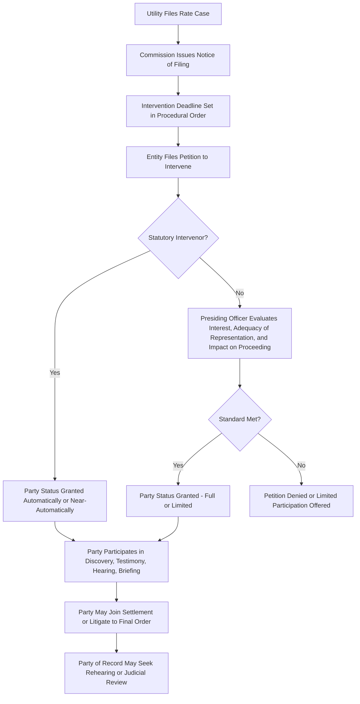

## Intervention and Party Status

### Definition and Procedural Function

Intervention is the formal process by which an entity other than the applicant utility and commission Staff becomes a recognized party to a rate case proceeding, gaining standing to conduct discovery, sponsor testimony, cross-examine witnesses, file briefs, and participate in settlement negotiations. Party status is the legal designation conferred once intervention is granted — it determines the scope of procedural rights an entity holds within the docket, as distinct from members of the public who may submit comments but cannot compel discovery or appeal a final order.

**Key Points**

- Intervention transforms a rate case from a two-party matter (utility applicant and Staff) into a multi-party administrative litigation, often the primary mechanism through which ratepayer and stakeholder interests are represented in the evidentiary record.
- Most jurisdictions require a **Petition to Intervene** (or "Motion to Intervene") filed within a specified window after the case is docketed, though many commissions retain discretion to permit late intervention for good cause.
- Party status is not automatic — it is granted (or denied) by the presiding officer or the commission itself, based on statutory and procedural rule criteria.

### Legal Basis for Intervention

- **Statutory Right**: Many jurisdictions grant automatic or near-automatic intervention rights to specific entities by statute — most commonly the state's Attorney General's office, a dedicated Office of Public Counsel/Ratepayer Advocate, and sometimes municipalities served by the utility.
- **Discretionary/Permissive Intervention**: Other entities must demonstrate to the commission's satisfaction that they meet the applicable standard, typically requiring a showing of:
  - **Interest**: A direct, substantial, and legally protectable interest in the outcome of the proceeding (e.g., as a ratepayer class, a competing service provider, or an entity whose operations are materially affected by the rates or terms of service at issue).
  - **No Adequate Representation**: The petitioner's interest is not already adequately represented by an existing party (this criterion is applied with varying strictness; commissions often permit overlapping interests to intervene separately to preserve fuller participation).
  - **No Undue Delay or Disruption**: Intervention will not unduly broaden the issues, delay the proceeding, or prejudice existing parties.

### Typical Categories of Intervenors

**Key Points**

- **Attorney General / Office of Public Counsel / Consumer Advocate**: Represents the interests of residential and small-commercial ratepayers as a class; frequently the most active intervenor on cost-of-service, ROE, and affordability issues.
- **Industrial and Large Commercial Customer Groups**: Organized coalitions of large energy users (often formed specifically for regulatory participation) focused on rate design, class cost allocation, and demand charge structures affecting their cost of service.
- **Environmental and Clean Energy Advocacy Organizations**: Focus on issues such as resource planning, renewable/distributed energy integration, decoupling mechanisms, and rate design impacts on electrification or demand-side management programs.
- **Low-Income and Consumer Protection Advocates**: Focus on affordability, shutoff/collections policy, low-income rate assistance programs, and bill impact analysis for vulnerable customer classes.
- **Competitive Market Participants**: Independent power producers, retail energy suppliers, or competing utilities with interests in interconnection terms, wholesale rates, or market rules embedded in the case.
- **Municipalities and Local Governments**: Particularly relevant where the utility serves franchise areas, or where municipal aggregation, franchise fees, or local infrastructure issues are implicated.
- **Federal Agencies**: In cases with jurisdictional overlap (e.g., certain FERC-related wholesale issues intersecting with state retail rate cases), federal agencies may intervene or file comments.

### The Petition to Intervene — Required Elements

A Petition to Intervene typically must state:

1. The petitioner's identity and organizational status (individual, association, corporation, government entity).
2. The specific nature of the petitioner's interest in the proceeding and how that interest may be affected by the outcome.
3. A statement that existing parties do not adequately represent that interest (where required).
4. The petitioner's proposed scope of participation (full party status vs. limited intervention on specified issues).
5. Contact information for counsel of record.

**Example**

An industrial customer coalition representing five large manufacturing facilities served at the utility's transmission-level rate schedule files a Petition to Intervene, stating its interest is that proposed changes to demand ratchet provisions and the allocation of transmission-related costs in the class cost-of-service study would materially increase its members' bills, and that neither the Attorney General (focused on residential impacts) nor Staff adequately represents transmission-class customer interests on rate design. The petition requests full party status, including the right to conduct discovery, sponsor testimony on cost allocation and rate design, and participate in any settlement conference.

### Full vs. Limited Intervention

- **Full Party Status**: Grants complete procedural rights — discovery, testimony sponsorship, cross-examination, briefing, and (where applicable) appeal rights — across all issues in the case.
- **Limited Intervention**: Some jurisdictions or specific grants restrict a party's participation to designated issues (e.g., a party interested only in low-income rate assistance programs may be granted party status limited to that issue, without rights to participate in cost of capital litigation).
- **Amicus/Public Comment Status**: A lesser form of participation, allowing written comments or limited oral statements at public hearings without full party rights (no discovery, no cross-examination, no standing to appeal).

### Rights and Obligations Conferred by Party Status

**Key Points**

- **Discovery Rights**: Ability to issue and respond to data requests (see Discovery, Data Requests, and Testimony).
- **Testimony Rights**: Ability to sponsor expert or fact witness testimony proposing adjustments or positions.
- **Cross-Examination Rights**: Ability to question witnesses of other parties at the evidentiary hearing.
- **Briefing Rights**: Ability to file initial and reply briefs summarizing the party's position and proposed findings.
- **Settlement Participation**: Standing to participate in settlement negotiations and to sign onto (or contest) any negotiated settlement/stipulation.
- **Appeal Rights**: In most jurisdictions, only a party of record has standing to seek rehearing or judicial review of the commission's final order — an entity that failed to intervene generally cannot appeal.
- **Reciprocal Obligations**: Parties are subject to the same discovery obligations they may impose on others, must comply with the procedural schedule, and are bound by confidentiality/protective order terms for information they receive.

### Intervention Process Flow

### Intervenor Landscape Diagram

<svg xmlns="http://www.w3.org/2000/svg" viewBox="0 0 640 340">
<title>Typical Rate Case Party Structure (svg_diagram)</title>
<rect x="0" y="0" width="640" height="340" fill="#ffffff" />
<rect x="260" y="10" width="120" height="50" rx="8" fill="#fdebd0" stroke="#e67e22" stroke-width="2" />
<text x="320" y="40" font-size="13" text-anchor="middle" fill="#8a5a12">Utility (Applicant)</text>
<rect x="260" y="90" width="120" height="50" rx="8" fill="#eaf2f8" stroke="#2980b9" stroke-width="2" />
<text x="320" y="120" font-size="13" text-anchor="middle" fill="#1b4f72">Commission Staff</text>
<rect x="30" y="180" width="140" height="50" rx="8" fill="#eafaf1" stroke="#27ae60" stroke-width="2" />
<text x="100" y="205" font-size="11" text-anchor="middle" fill="#1e8449">Attorney General /</text>
<text x="100" y="220" font-size="11" text-anchor="middle" fill="#1e8449">Public Counsel</text>
<rect x="190" y="180" width="140" height="50" rx="8" fill="#eafaf1" stroke="#27ae60" stroke-width="2" />
<text x="260" y="205" font-size="11" text-anchor="middle" fill="#1e8449">Industrial Customer</text>
<text x="260" y="220" font-size="11" text-anchor="middle" fill="#1e8449">Coalition</text>
<rect x="350" y="180" width="140" height="50" rx="8" fill="#eafaf1" stroke="#27ae60" stroke-width="2" />
<text x="420" y="205" font-size="11" text-anchor="middle" fill="#1e8449">Environmental /</text>
<text x="420" y="220" font-size="11" text-anchor="middle" fill="#1e8449">Clean Energy Group</text>
<rect x="510" y="180" width="120" height="50" rx="8" fill="#eafaf1" stroke="#27ae60" stroke-width="2" />
<text x="570" y="205" font-size="11" text-anchor="middle" fill="#1e8449">Low-Income</text>
<text x="570" y="220" font-size="11" text-anchor="middle" fill="#1e8449">Advocate</text>
<rect x="240" y="270" width="160" height="50" rx="8" fill="#f4ecf7" stroke="#8e44ad" stroke-width="2" />
<text x="320" y="295" font-size="12" text-anchor="middle" fill="#5b2c6f">Presiding ALJ /</text>
<text x="320" y="310" font-size="12" text-anchor="middle" fill="#5b2c6f">Commission</text>
<line x1="320" y1="60" x2="320" y2="90" stroke="#333333" stroke-width="2" />
<line x1="320" y1="140" x2="100" y2="180" stroke="#333333" stroke-width="1.5" />
<line x1="320" y1="140" x2="260" y2="180" stroke="#333333" stroke-width="1.5" />
<line x1="320" y1="140" x2="420" y2="180" stroke="#333333" stroke-width="1.5" />
<line x1="320" y1="140" x2="570" y2="180" stroke="#333333" stroke-width="1.5" />
<line x1="100" y1="230" x2="320" y2="270" stroke="#999999" stroke-width="1" stroke-dasharray="3,3" />
<line x1="260" y1="230" x2="320" y2="270" stroke="#999999" stroke-width="1" stroke-dasharray="3,3" />
<line x1="420" y1="230" x2="320" y2="270" stroke="#999999" stroke-width="1" stroke-dasharray="3,3" />
<line x1="570" y1="230" x2="320" y2="270" stroke="#999999" stroke-width="1" stroke-dasharray="3,3" />
</svg>

### Intervention Denial and Interlocutory Appeal

- If a Petition to Intervene is denied, the petitioner may typically seek reconsideration from the presiding officer or file an interlocutory appeal to the full commission.
- Denial of intervention is a final, appealable action in many jurisdictions distinct from the merits of the underlying rate case, since it forecloses the entity's participation entirely.
- [Inference] Commissions generally lean toward granting broad participation rights in rate cases given the public interest nature of the proceedings, and denials are relatively uncommon except where a petitioner's stated interest is duplicative, too attenuated, or the petition is untimely without good cause shown; the specific threshold applied varies by jurisdiction and is subject to each commission's own precedent.

### Settlement Dynamics Among Intervenors

**Key Points**

- Rate cases frequently resolve through **negotiated settlements/stipulations** among some or all parties rather than fully litigated hearings; party status is a prerequisite to signing a settlement.
- Settlements may be **unanimous** (all parties agree) or **partial/contested** (some parties settle while others litigate remaining issues), and commissions typically apply a "just and reasonable" or "public interest" standard rather than a contract-law standard when reviewing settlements, since non-signatory ratepayers are bound by the outcome.
- A party's leverage in settlement negotiations often correlates with the strength of its litigated case (i.e., the credibility of its testimony and discovery record) — reinforcing why the sponsored testimony discussed under discovery and testimony practice matters even when a case is likely to settle.

### Conclusion

Intervention and party status determine who has a formal voice in shaping the evidentiary record and ultimate outcome of a rate case beyond the utility applicant and commission Staff. Through statutory or discretionary intervention, entities such as consumer advocates, industrial customer coalitions, environmental organizations, and municipalities gain rights to discovery, testimony, cross-examination, briefing, settlement participation, and appeal — rights that collectively ensure the rate case record reflects a broader range of stakeholder interests than the utility's filing alone. Because party status is a gateway to nearly every other procedural right in the case, the intervention stage functions as a critical, often underappreciated, determinant of how contested and representative a rate case proceeding ultimately becomes.

**Related Topics**

- Discovery, Data Requests, and Testimony
- Settlement Negotiations and Stipulations in Lieu of Litigated Hearings
- Burden of Proof and Evidentiary Standards in Rate Cases
- Public Comment Hearings vs. Evidentiary Hearings
- Standing and Appeal Rights in Administrative Proceedings
- Protective Orders and Confidentiality Designations
- Class Cost-of-Service Study Methodology
- Rehearing and Judicial Review of Commission Orders