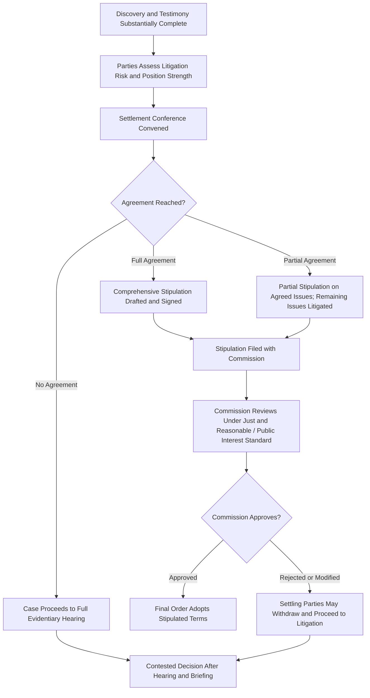

## Settlement Negotiations and Stipulations

### Definition and Role in the Rate Case Process

Settlement negotiations are formal or informal discussions among some or all parties to a rate case aimed at resolving contested issues without a fully litigated evidentiary hearing and adversarial decision. A **stipulation** (also called a settlement agreement) is the written document memorializing the terms the settling parties have agreed to, which is then submitted to the commission for review and approval. Settlements are a pervasive feature of utility rate case practice — in many jurisdictions, the substantial majority of rate cases resolve at least partially through settlement rather than full litigation to a contested decision.

**Key Points**

- Settlement does not bypass commission authority — the commission retains ultimate approval authority and applies its own standard of review rather than simply ratifying whatever the parties agree to, since non-signatory ratepayers are bound by the result.
- Settlements can be **unanimous** (all parties of record agree) or **partial/non-unanimous** (some parties settle while one or more contest remaining issues, which then proceed to litigation).
- Settlement negotiations typically occur after discovery and testimony have been substantially developed, since parties need the evidentiary record to assess litigation risk and value contested issues.

### Why Parties Settle

**Key Points**

- **Litigation Risk and Cost**: Full litigation to a contested decision is expensive (witness fees, legal costs, extended Staff and party resources) and outcome-uncertain; settlement converts that uncertainty into a negotiated, known result.
- **Regulatory Lag Mitigation**: Settlement can shorten the effective procedural timeline compared to full litigation through hearing, briefing, and a written decision, reducing the utility's exposure to further lag.
- **Preserving Regulatory Relationships**: Utilities and frequent-participant intervenors (Staff, Attorney General offices) often have ongoing, multi-case relationships; settlement can preserve goodwill and predictability for future proceedings.
- **Packaging Trade-offs Across Issues**: Settlement allows parties to trade concessions across otherwise unrelated issues (e.g., a utility may accept a lower ROE in exchange for approval of a specific rate design change or cost recovery mechanism) in ways a litigated decision, which resolves each issue independently on its own record, generally cannot.
- **Avoiding Precedent**: Settlements are frequently negotiated on a **non-precedential basis** — meaning the agreed treatment of a specific issue is not to be cited as precedent in future cases — which can make parties more willing to compromise on a position they would otherwise litigate strenuously to protect for future cases.

### Types of Settlements

- **All-Issue (Comprehensive) Settlement**: Resolves every contested issue in the case, including the overall revenue requirement, ROE, capital structure, rate design, and any tracker or rider mechanisms.
- **Partial Settlement**: Resolves some issues (e.g., depreciation rates, class cost allocation) while leaving others (e.g., ROE, a specific disputed expense) for litigation and commission decision.
- **Black-Box Settlement**: Parties agree to an aggregate revenue requirement or rate increase figure without specifying or agreeing on the individual component determinations (ROE, rate base, specific expense adjustments) that produce that figure — commonly used when parties can agree on a bottom-line number but not on the underlying methodology, avoiding the need to reconcile fundamentally different analytical approaches.
- **Full Settlement with Stipulated Findings**: Parties agree not only to the bottom-line result but also to specific findings on individual issues (e.g., a stipulated ROE, a stipulated depreciation rate), providing more precedential clarity than a black-box approach (subject to any non-precedential agreement language).

### The Settlement Negotiation Process

1. **Pre-Negotiation Assessment**: Each party evaluates the strength of its litigated position based on the developed record (discovery responses, direct/responsive/rebuttal testimony) and estimates likely litigation outcomes and costs.
2. **Settlement Conference(s)**: Formal or informal meetings among parties, often facilitated by the ALJ or a neutral settlement judge, to explore areas of potential agreement. Settlement discussions are typically conducted on a **confidential, without-prejudice basis** — positions taken in settlement talks generally cannot be used as admissions if the case proceeds to litigation.
3. **Issue-by-Issue or Global Bargaining**: Parties may negotiate issue-by-issue or attempt a global package resolving multiple issues simultaneously.
4. **Drafting the Stipulation**: Once terms are agreed, counsel drafts the formal stipulation document, specifying agreed revenue requirement, rate design, effective date, any tracker/rider terms, and any conditions or caveats (e.g., certain provisions contingent on commission approval without material modification).
5. **Execution**: Settling parties sign the stipulation; non-settling parties (if any) are typically noted as such, and the stipulation is filed with the commission.
6. **Commission Review**: The commission (or presiding ALJ, with a recommendation to the commission) reviews the settlement under the applicable standard (see below), which may include an additional hearing limited to the reasonableness of the settlement itself.
7. **Commission Order**: The commission approves, rejects, or approves with modifications; if rejected or materially modified, settling parties are often given an opportunity to withdraw from the settlement and proceed to litigation.

### Standard of Commission Review

**Key Points**

- Commissions do not apply ordinary contract law principles to settlements; because the outcome binds non-signatory ratepayers who did not agree to the terms, most jurisdictions apply a **"just and reasonable" and/or "public interest" standard**, independently assessing whether the settlement's rates and terms are just, reasonable, and in the public interest — not merely whether the settling parties consented.
- [Unverified] The precise procedural weight given to a stipulation — whether the commission must make the same detailed findings on each component issue as it would in a litigated decision, or may rely more heavily on the parties' agreement as evidence of reasonableness — varies by jurisdiction and is often the subject of its own body of commission precedent.
- A commission may reject a settlement it finds unreasonable even where all parties of record support it, since the commission's independent statutory obligation to ensure just and reasonable rates is not waivable by the parties.

### Illustrative Example

**Example**

A utility requests a $45 million annual revenue increase and a 10.2% ROE. After discovery and testimony, Staff recommends a $28 million increase at a 9.4% ROE, and the industrial customer coalition recommends specific class cost allocation changes shifting more of any increase to residential customers. Following a settlement conference, the utility, Staff, and the industrial coalition agree to a **black-box settlement**: a $33 million revenue increase effective in 90 days, with a specific stipulated rate design (including the class allocation changes the industrial coalition sought) but no stipulated ROE or rate base findings — since Staff and the utility used different depreciation methodologies that could not be reconciled on the record. The Attorney General's office, representing residential ratepayers, declines to join, arguing the $33 million increase remains too high, and litigates that single issue to a contested hearing. The commission ultimately approves the settlement as filed, finding the agreed revenue requirement and rate design just, reasonable, and in the public interest, notwithstanding the Attorney General's continued objection.

### Settlement Process Flow

### Settlement vs. Litigation Outcome Comparison Diagram

<svg xmlns="http://www.w3.org/2000/svg" viewBox="0 0 640 300">
<title>Settlement vs Litigated Path Characteristics (svg_diagram)</title>
<rect x="0" y="0" width="640" height="300" fill="#ffffff" />
<rect x="30" y="20" width="270" height="260" rx="10" fill="#eafaf1" stroke="#27ae60" stroke-width="2" />
<text x="165" y="50" font-size="15" text-anchor="middle" fill="#1e8449" font-weight="bold">Settlement Path</text>
<text x="50" y="85" font-size="12" fill="#1e8449">- Negotiated, known outcome</text>
<text x="50" y="110" font-size="12" fill="#1e8449">- Often faster to effective rates</text>
<text x="50" y="135" font-size="12" fill="#1e8449">- Lower litigation cost</text>
<text x="50" y="160" font-size="12" fill="#1e8449">- May be non-precedential</text>
<text x="50" y="185" font-size="12" fill="#1e8449">- Black-box option available</text>
<text x="50" y="210" font-size="12" fill="#1e8449">- Requires commission approval</text>
<text x="50" y="235" font-size="12" fill="#1e8449">- Binds non-signatory ratepayers</text>
<rect x="340" y="20" width="270" height="260" rx="10" fill="#fdecea" stroke="#c0392b" stroke-width="2" />
<text x="475" y="50" font-size="15" text-anchor="middle" fill="#943126" font-weight="bold">Litigated Path</text>
<text x="360" y="85" font-size="12" fill="#943126">- Outcome uncertain until order</text>
<text x="360" y="110" font-size="12" fill="#943126">- Longer procedural timeline</text>
<text x="360" y="135" font-size="12" fill="#943126">- Higher litigation cost</text>
<text x="360" y="160" font-size="12" fill="#943126">- Creates citable precedent</text>
<text x="360" y="185" font-size="12" fill="#943126">- Detailed findings per issue</text>
<text x="360" y="210" font-size="12" fill="#943126">- Full evidentiary hearing required</text>
<text x="360" y="235" font-size="12" fill="#943126">- Appeal rights on the merits</text>
</svg>

### Common Stipulation Provisions Beyond the Headline Revenue Requirement

- **Effective Date and Rate Implementation Schedule**: Including any phase-in provisions for large increases.
- **Rate Design Terms**: Agreed class cost allocation and rate structure changes.
- **Attrition/Earnings Sharing Mechanisms**: Provisions addressing regulatory lag risk during the period the settled rates remain in effect.
- **Amortization of Regulatory Assets/Liabilities**: Agreed treatment and amortization period for specific deferred balances.
- **Future Rate Case Moratorium or Filing Commitments**: Provisions committing the utility not to file a new general rate case before a specified date, or committing to file by a certain date.
- **Non-Precedent Clauses**: Express language stating the settlement's terms shall not be cited as precedent in future proceedings.
- **Withdrawal/Severability Provisions**: Terms governing what happens if the commission modifies or rejects specific provisions — whether the remaining settlement survives or the whole agreement unravels.

### Practical and Behavioral Considerations

[Inference] Because black-box settlements avoid the need to reconcile fundamentally inconsistent methodological positions among parties (for example, differing approaches to ROE estimation or rate base treatment), they are frequently used specifically to resolve cases where the underlying analytical disputes are unlikely to be bridgeable through negotiation, even though the parties can agree on an acceptable aggregate number; this practice may vary by jurisdiction, as some commissions disfavor black-box settlements precisely because they limit the precedential and analytical clarity of the resulting record.

### Conclusion

Settlement negotiations and stipulations provide the dominant alternative to fully litigated rate case decisions, allowing parties to convert litigation risk and cost into a negotiated outcome while preserving the commission's independent authority to assess whether the resulting rates are just, reasonable, and in the public interest. Whether structured as a comprehensive black-box agreement or a detailed stipulation with specific findings, settlements require the same evidentiary groundwork built through discovery and testimony, since a party's negotiating leverage typically tracks the strength of the litigated case it could otherwise present — making settlement not a bypass of the rate case process but a negotiated resolution built directly upon it.

**Related Topics**

- Discovery, Data Requests, and Testimony
- Intervention and Party Status
- Regulatory Lag and Its Financial Effects
- Rate Design and Class Cost Allocation
- Commission Final Orders and Findings of Fact
- Rehearing and Judicial Review of Commission Orders
- Phase-In Plans and Rate Moderation Mechanisms
- Attrition Relief and Earnings Sharing Mechanisms