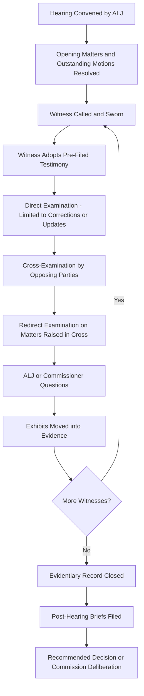

## Evidentiary Hearings and Cross Examination

### Definition and Procedural Position

The evidentiary hearing is the formal proceeding at which the pre-filed testimony of all parties is entered into the record, witnesses are examined and cross-examined under oath, and the commission (or its presiding ALJ) builds the complete factual and expert record on which the final decision will rest. It occurs after discovery and testimony rounds are complete and, where settlement is not reached on all issues, serves as the mechanism for testing the remaining contested evidence before a decision-maker.

**Key Points**

- The evidentiary hearing is distinct from a **public comment hearing** — the latter allows members of the public to make unsworn statements for the record but does not involve sworn testimony, exhibits, or cross-examination admissible as evidence supporting findings of fact.
- Evidentiary hearings are typically presided over by an Administrative Law Judge (ALJ) or hearing examiner, sometimes with one or more commissioners present, depending on jurisdictional practice.
- The hearing formally creates the **evidentiary record** — the exclusive universe of facts, exhibits, and testimony the commission may rely upon in its final order, consistent with the on-the-record requirement of administrative law.

### Structure of the Evidentiary Hearing

1. **Opening Matters**: Appearances of counsel are noted, procedural rulings on outstanding motions (e.g., unresolved motions to compel or to strike testimony) are addressed, and any stipulated exhibits or uncontested testimony may be admitted without cross-examination.
2. **Witness Adoption**: Each witness is called, sworn, and formally adopts their pre-filed direct, responsive, rebuttal, or surrebuttal testimony into the record — confirming it was prepared by or under their direction and is true and accurate to the best of their knowledge, sometimes with minor corrections noted via errata.
3. **Cross-Examination**: Opposing counsel questions the witness, typically proceeding party by party in an order set by the procedural schedule (commonly: parties opposing the utility's position examine the utility's witnesses first, followed by the utility's counsel examining opposing witnesses).
4. **Redirect Examination**: Sponsoring counsel may ask follow-up questions limited to matters raised on cross-examination, to clarify or rehabilitate the witness's testimony.
5. **Bench/ALJ Questions**: The presiding ALJ or commissioners may pose their own questions to witnesses, sometimes at any point during examination or reserved until after party examination concludes.
6. **Exhibit Admission**: Documents, workpapers, and demonstrative exhibits referenced during testimony or cross-examination are formally moved into evidence, subject to any objections.
7. **Closing of the Record**: Once all witnesses have testified, the evidentiary record is closed (sometimes with a limited window for post-hearing exhibits such as late-filed exhibits responding to a specific request made during the hearing).

### The Purpose and Techniques of Cross-Examination

**Key Points**

- **Testing Credibility and Methodology**: Cross-examination probes the factual basis, assumptions, and analytical methodology underlying a witness's testimony — for example, challenging the inputs used in a DCF or CAPM model, or the statistical basis for a depreciation survivor curve.
- **Impeachment**: Using prior inconsistent statements (from discovery responses, prior testimony in other dockets, or deposition-equivalent discovery) to undermine a witness's current position.
- **Eliciting Favorable Admissions**: A well-prepared cross-examiner seeks to obtain concessions from an opposing witness that support the cross-examiner's own party's position, rather than relying solely on discrediting the witness.
- **Building the Record for Briefing**: Because commissions decide cases based on the written record (transcript, exhibits, and briefs), cross-examination is conducted as much to create citable transcript testimony for use in post-hearing briefs as to persuade the ALJ or commissioners in the room.
- **Scope Limitations**: Cross-examination is generally limited to the scope of the witness's own testimony (direct examination scope), though ALJs vary in how strictly this is enforced in administrative practice compared to formal civil litigation.

### Illustrative Example

**Example**

A utility's cost of capital witness sponsors a 10.4% ROE recommendation based on a Discounted Cash Flow (DCF) analysis using a proxy group of eight comparable utilities. On cross-examination, Staff's counsel establishes through the witness's own discovery responses that two of the eight proxy companies had recently announced pending mergers, a condition often excluded from proxy groups because merger speculation can distort market-based cost of equity estimates. The witness concedes that excluding those two companies would lower the DCF-derived ROE result by approximately 30 basis points. Staff's counsel does not need to call its own witness to make this specific point in briefing — the utility witness's own cross-examination admission becomes citable record evidence supporting Staff's recommended ROE adjustment.

### Evidentiary Objections at Hearing

| Objection | Basis |
| --- | --- |
| Beyond the Scope | Question exceeds the scope of direct/redirect examination |
| Asked and Answered | Question duplicates one already answered |
| Calls for Speculation | Question asks the witness to opine outside sponsored expertise or personal knowledge |
| Argumentative | Question is framed as argument rather than a genuine request for information |
| Lack of Foundation | Question assumes facts not yet established in the record |
| Hearsay | Testimony relies on an out-of-court statement offered for its truth (administrative tribunals often apply hearsay rules more flexibly than courts, admitting hearsay but weighing it accordingly) |
| Leading (on Direct) | Direct examination questions suggest their own answer (leading questions are generally permitted on cross-examination) |

### Hearing Process Flow

### Cross-Examination Dynamics Diagram

<svg xmlns="http://www.w3.org/2000/svg" viewBox="0 0 640 320">
<title>Cross-Examination Objectives (svg_diagram)</title>
<rect x="0" y="0" width="640" height="320" fill="#ffffff" />
<circle cx="320" cy="160" r="70" fill="#eaf2f8" stroke="#2980b9" stroke-width="2" />
<text x="320" y="155" font-size="13" text-anchor="middle" fill="#1b4f72">Witness on</text>
<text x="320" y="172" font-size="13" text-anchor="middle" fill="#1b4f72">Cross-Examination</text>
<rect x="40" y="20" width="160" height="55" rx="8" fill="#eafaf1" stroke="#27ae60" stroke-width="2" />
<text x="120" y="42" font-size="11" text-anchor="middle" fill="#1e8449">Test Methodology</text>
<text x="120" y="58" font-size="11" text-anchor="middle" fill="#1e8449">and Assumptions</text>
<rect x="440" y="20" width="160" height="55" rx="8" fill="#fdecea" stroke="#c0392b" stroke-width="2" />
<text x="520" y="42" font-size="11" text-anchor="middle" fill="#943126">Impeach with Prior</text>
<text x="520" y="58" font-size="11" text-anchor="middle" fill="#943126">Inconsistent Statements</text>
<rect x="40" y="245" width="160" height="55" rx="8" fill="#fdebd0" stroke="#e67e22" stroke-width="2" />
<text x="120" y="267" font-size="11" text-anchor="middle" fill="#8a5a12">Elicit Favorable</text>
<text x="120" y="283" font-size="11" text-anchor="middle" fill="#8a5a12">Admissions</text>
<rect x="440" y="245" width="160" height="55" rx="8" fill="#f4ecf7" stroke="#8e44ad" stroke-width="2" />
<text x="520" y="267" font-size="11" text-anchor="middle" fill="#5b2c6f">Build Citable</text>
<text x="520" y="283" font-size="11" text-anchor="middle" fill="#5b2c6f">Record for Briefs</text>
<line x1="250" y1="160" x2="200" y2="55" stroke="#333333" stroke-width="1.5" />
<line x1="390" y1="160" x2="440" y2="55" stroke="#333333" stroke-width="1.5" />
<line x1="250" y1="160" x2="200" y2="270" stroke="#333333" stroke-width="1.5" />
<line x1="390" y1="160" x2="440" y2="270" stroke="#333333" stroke-width="1.5" />
</svg>

### Role of the Presiding Officer

**Key Points**

- Rules on evidentiary objections raised during examination, applying the jurisdiction's rules of evidence (often a relaxed administrative standard rather than strict judicial rules of evidence).
- Manages hearing scheduling and witness order, particularly in multi-day hearings involving numerous witnesses across several parties.
- May question witnesses directly to develop the record on points the ALJ finds unclear or insufficiently addressed by party examination.
- Issues a **Recommended Decision** or **Proposed Order** (in jurisdictions using this model) summarizing findings of fact and conclusions of law based on the hearing record, which the full commission then reviews, adopts, modifies, or rejects.

### Transcript and Its Use in Briefing

- The hearing is recorded by a court reporter, producing a certified **transcript** that becomes part of the formal record alongside admitted exhibits and pre-filed testimony.
- Post-hearing briefs cite specific transcript pages (e.g., "Tr. 412:14-18") to support proposed findings of fact, making precise, well-organized cross-examination critical since the transcript — not the hearing room impression alone — is what the commission and any reviewing court will examine.
- [Inference] Because commissions and reviewing courts rely on the written transcript rather than any subjective impression of witness demeanor to the same degree courts might in jury trials, cross-examination strategy in rate cases tends to prioritize extracting clear, quotable admissions and internally consistent chains of questions and answers over more theatrical or demeanor-based examination techniques common in some other litigation contexts; the degree to which this holds may vary with the presiding officer and jurisdiction.

### Practical Hearing Logistics

- **Hearing Length**: Contested rate cases with numerous witnesses and multiple intervenors can require multi-day or multi-week hearings, scheduled around witness availability and procedural deadlines.
- **Exhibit Numbering Conventions**: Exhibits are typically pre-marked and numbered by sponsoring party (e.g., "Company Exhibit 3," "Staff Exhibit 7") to maintain a clear record across a multi-party proceeding.
- **Remote/Virtual Hearings**: [Unverified] Many commissions have adopted procedures permitting virtual or hybrid evidentiary hearings, though the specific rules governing exhibit handling, witness sequestration, and remote cross-examination vary by jurisdiction and continue to evolve.

### Conclusion

Evidentiary hearings and cross-examination form the trial-like phase of the rate case process in which pre-filed testimony is formally entered into the record and tested through sworn examination before the presiding ALJ or commission. Cross-examination serves multiple simultaneous functions — testing methodology, impeaching inconsistent positions, eliciting favorable admissions, and building a citable transcript record for post-hearing briefing — making hearing preparation an extension of the discovery and testimony work that precedes it. Because the commission's final decision must rest exclusively on the evidentiary record built at this stage, the quality and precision of examination at hearing directly shapes the factual foundation available to support each party's proposed findings.

**Related Topics**

- Discovery, Data Requests, and Testimony
- Intervention and Party Status
- Settlement Negotiations and Stipulations
- Post-Hearing Briefs and Proposed Findings of Fact
- Administrative Law Judge Recommended Decisions vs. Commission Final Orders
- Rehearing and Judicial Review of Commission Orders
- Cost of Capital Testimony (DCF, CAPM, Risk Premium Models)
- Rules of Evidence in Administrative Proceedings