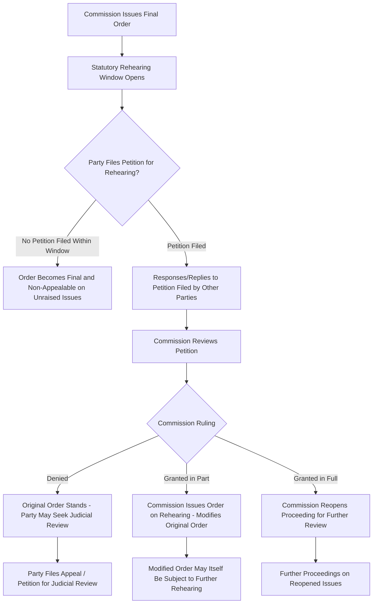

## Commission Orders and Rehearing Procedures

### Definition and Procedural Position

A Commission Order is the formal, written decision issued by a public utility commission resolving a rate case (or other docketed proceeding), setting forth findings of fact, conclusions of law, and the specific rates, terms, and conditions the utility is authorized or required to implement. Rehearing procedures are the mechanism by which a party dissatisfied with a commission order may seek reconsideration by the same commission before pursuing further appeal — typically a mandatory prerequisite (exhaustion of administrative remedies) to judicial review.

**Key Points**

- The commission order is the culmination of the rate case process — the point at which the evidentiary record built through discovery, testimony, hearings, and (where applicable) settlement negotiations is translated into legally binding rates.
- Orders are issued either following a fully litigated hearing (based on the ALJ's recommended decision or proposed order and the commission's own review) or following approval of a negotiated settlement/stipulation.
- Rehearing is generally a **jurisdictional prerequisite** to judicial appeal in most jurisdictions — a party that fails to seek rehearing on a specific issue typically waives its right to raise that issue on appeal to a reviewing court.

### Structure and Content of a Commission Order

A typical final order includes:

1. **Procedural History**: Summary of the case's filing, procedural schedule, intervention, discovery, hearing dates, and briefing.
2. **Findings of Fact**: The commission's factual determinations on each contested issue (rate base, cost of capital, individual expense items, depreciation rates, rate design), each supported by citation to record evidence (testimony, exhibits, transcript).
3. **Conclusions of Law**: Application of the applicable legal and regulatory standards to the findings of fact, including the "just and reasonable" standard governing rates.
4. **Discussion/Analysis**: The commission's reasoning addressing the parties' competing positions and explaining why particular adjustments were adopted or rejected — critical both for transparency and to withstand judicial review, since a reviewing court typically assesses whether the order is supported by substantial evidence and reasoned analysis rather than being merely arbitrary.
5. **Ordering Paragraphs**: The operative directives — the authorized revenue requirement, approved rate schedules, effective date, and any compliance filing requirements (e.g., directing the utility to file compliance tariffs within a specified number of days reflecting the approved rates).
6. **Dissenting or Concurring Opinions** (where applicable): Individual commissioner statements disagreeing with or qualifying support for the majority decision, in jurisdictions with multi-member commissions that permit such statements.

### Types of Commission Decisions

- **Final Order**: Fully resolves the docketed proceeding; not interlocutory or subject to further commission-level action absent rehearing.
- **Order Adopting Recommended Decision**: The commission adopts (with or without modification) an ALJ's recommended decision or proposed order following exceptions briefing, in which parties identify specific portions of the recommended decision they ask the commission to modify.
- **Order Approving Settlement**: Approves a negotiated stipulation, applying the applicable "just and reasonable"/public interest standard of review.
- **Interim Order**: Addresses a discrete procedural or substantive issue before the final resolution of the case (e.g., a ruling on interim rate relief, a discovery dispute, or a motion to bifurcate issues).
- **Compliance Order**: A follow-up order confirming that a utility's compliance tariff filings properly implement the terms of a prior substantive order.

### Rehearing — Purpose and Standard

**Key Points**

- A **Petition for Rehearing** (also called a Petition for Reconsideration or Application for Rehearing, depending on jurisdiction) asks the commission to reconsider some or all of its own final order, typically on grounds that the order is unlawful, unreasonable, unsupported by substantial evidence, or based on an error of law or fact.
- Rehearing petitions must generally be filed within a short statutory window after the order's issuance (commonly 10 to 30 days, varying significantly by jurisdiction).
- Rehearing petitions must typically specify with particularity the findings or conclusions challenged and the grounds for challenge — a general assertion of disagreement is usually insufficient to preserve an issue for appeal.
- Filing a rehearing petition may or may not **stay** (suspend) the effectiveness of the underlying order, depending on jurisdictional rules; in many jurisdictions the order remains in effect during the rehearing process unless the commission or a court grants a stay.

### Rehearing Process Flow

### Illustrative Example

**Example**

A commission issues a final order approving a $30 million revenue increase but adopting a 9.1% ROE rather than the 10.3% the utility requested, based on findings citing a DCF-based cost of equity analysis in the record. The utility files a timely Petition for Rehearing, arguing the commission's order failed to adequately address record evidence regarding elevated capital market volatility and comparable-utility awarded ROEs in other recent jurisdictions, and that the 9.1% finding is not supported by substantial evidence given the range of expert testimony presented. The Attorney General's office files a response opposing rehearing, arguing the commission's order adequately explained its reasoning. The commission denies rehearing on the ROE issue, finding its original order sufficiently supported, but grants rehearing on a narrower issue — the effective date of a specific tracker mechanism — correcting what it characterizes as a clerical/computational error in the ordering paragraphs. The utility, having exhausted rehearing on the ROE issue, may now seek judicial review of that specific issue before the appropriate reviewing court.

### Grounds Commonly Asserted in Rehearing Petitions

| Ground | Description |
| --- | --- |
| Lack of Substantial Evidence | The commission's finding is not supported by evidence in the record, or relies on evidence a reasonable mind would not accept as adequate |
| Error of Law | The commission misapplied the governing statute, regulation, or legal standard |
| Failure to Address Record Evidence | The order does not adequately discuss or distinguish significant contrary evidence or argument presented by the petitioning party |
| Due Process Violation | A party was denied adequate notice, opportunity to be heard, or improperly excluded from presenting evidence |
| Clerical/Computational Error | The order contains a mathematical, typographical, or clerical mistake in implementing an otherwise-intended finding |
| Newly Discovered Evidence | (Less common; usually requires showing the evidence could not reasonably have been discovered and presented during the original proceeding) |

### Post-Rehearing Judicial Review

- Once rehearing has been sought (or the rehearing window has passed without a petition, depending on jurisdictional exhaustion rules), a party may typically seek **judicial review** in the appropriate court (often a specific court of appeals or the state's court of general jurisdiction designated by statute for utility appeals).
- Judicial review of commission orders is typically governed by a **deferential standard** — courts generally do not reweigh evidence or substitute their judgment for the commission's on factual or policy matters within the commission's expertise, but instead ask whether the order is supported by substantial evidence, is not arbitrary or capricious, and is consistent with applicable law.
- [Unverified] The specific standard of review (e.g., "substantial evidence," "arbitrary and capricious," "clearly erroneous," or a hybrid formulation) and the scope of issues a court will consider varies meaningfully by jurisdiction and is generally set by the state's enabling statute or constitutional provisions governing utility commission appeals.
- Confiscation/constitutional claims (e.g., that authorized rates are so low as to be confiscatory, denying the utility a fair return in violation of due process) are sometimes treated under a distinct, less deferential standard given their constitutional dimension, though this varies by jurisdiction.

### Order Compliance and Implementation

**Key Points**

- Following a final (or rehearing-modified) order, the utility is typically directed to file **compliance tariffs** — the actual rate schedules implementing the commission's authorized rates — within a specified period (commonly 5 to 30 days).
- Commission Staff or the presiding office reviews compliance filings to confirm they accurately reflect the order's terms before the new rates take legal effect.
- Any dispute over whether a compliance filing properly implements the order is typically resolved through a further compliance order or, in more contested cases, an additional round of briefing on the implementation issue.

### Effect of Orders Pending Appeal

- In most jurisdictions, a commission order remains in effect and rates continue to be charged as authorized while a judicial appeal is pending, absent a specific stay granted by the commission or a reviewing court.
- If a reviewing court ultimately reverses or remands an order after new rates have been in effect and collected, jurisdictions vary considerably in whether and how any "true-up" or refund mechanism applies to reconcile rates charged during the appeal period with the ultimate corrected result — a complex area often addressed by specific statutory or regulatory refund provisions distinct from the general rate case process.

### Conclusion

Commission orders translate the evidentiary record built through discovery, testimony, hearings, and settlement into legally binding rates, findings of fact, and conclusions of law, while rehearing procedures provide the mandatory first avenue for a dissatisfied party to seek correction of a commission's own decision before pursuing judicial review. Because rehearing is typically both a substantive opportunity for reconsideration and a jurisdictional prerequisite to appeal, the specificity and timeliness with which a party frames its rehearing petition materially affects which issues remain available for later judicial challenge — making rehearing procedure a critical, often technical, gateway between the administrative and judicial phases of utility rate regulation.

**Related Topics**

- Evidentiary Hearings and Cross Examination
- Settlement Negotiations and Stipulations
- Post-Hearing Briefs and Proposed Findings of Fact
- Administrative Law Judge Recommended Decisions vs. Commission Final Orders
- Judicial Review Standards for Utility Commission Decisions
- Compliance Tariff Filings and Implementation
- Regulatory Lag and Its Financial Effects
- Constitutional Standards for Confiscatory Rates