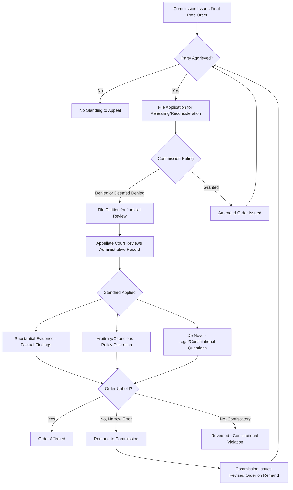

## Judicial Review of Rate Orders

### Overview

Judicial review of rate orders is the process by which a party dissatisfied with a final decision of a public utility commission (PUC) seeks review by a court of general or appellate jurisdiction. Because rate-setting is a quasi-legislative and quasi-judicial function delegated to an administrative agency, courts do not review PUC rate orders the way they review trial court verdicts. Instead, review is constrained by statutory standards of deference, a developed body of constitutional doctrine (principally under the Takings Clause and Due Process Clause), and procedural prerequisites that must be satisfied before a court will even hear the case.

### Statutory Basis for Review

**Enabling Statute Provisions**

Every U.S. state public utilities code and the Federal Power Act / Natural Gas Act (for FERC-jurisdictional matters) contain explicit provisions authorizing judicial review of commission orders. These provisions typically specify:

- Which court has jurisdiction (a specific appellate court, the state supreme court, or a designated business/administrative court)
- The time limit to file a petition for review (commonly 30–60 days from the order's effective date or from denial of rehearing)
- The standard of review the court must apply
- Whether the order is automatically stayed pending appeal or whether a stay must be separately sought

**Exhaustion of Administrative Remedies**

Before seeking judicial review, a party must ordinarily exhaust all administrative remedies. This means:

- Filing a timely application for rehearing, reconsideration, or clarification with the commission itself
- Raising every issue intended to be appealed during the administrative proceeding (the "raise-or-waive" rule) — issues not raised before the commission generally cannot be raised for the first time in court
- Waiting for the commission to act (or for the statutory period for action to lapse) before the order is deemed "final" for appeal purposes

Failure to exhaust remedies is one of the most common grounds on which appellate courts dismiss rate-case appeals outright, without ever reaching the merits.

### Standing to Seek Review

**Who May Appeal**

Standing generally requires:

- **Party status** in the underlying proceeding (the utility, intervenors such as consumer advocates, industrial customer groups, or competitors)
- **Aggrievement** — the party must show the order caused it concrete injury (e.g., a rate increase denial injures the utility; an approved increase injures ratepayers)
- Compliance with procedural intervention rules earlier in the case, since non-parties typically lack standing to appeal

**Common Appellants**

- The utility (when the commission denies or reduces a requested rate increase, disallows costs, or sets a return on equity (ROE) viewed as confiscatory)
- The state Attorney General's Office of Consumer Advocate or similarly designated public counsel
- Large industrial or commercial customer groups
- Competitive service providers challenging discriminatory rate treatment

### Standard of Review

**Deference to Agency Fact-Finding**

Courts apply a deferential standard to the commission's findings of fact and to matters within its technical expertise (rate design, cost allocation methodology, depreciation rates). The most common formulations are:

| Standard | Description | Typical Application |
| --- | --- | --- |
| Substantial evidence | Order upheld if supported by evidence a reasonable mind would accept as adequate | Findings of fact (e.g., test-year expense levels) |
| Arbitrary and capricious | Order overturned only if it reflects a clear error of judgment, ignores relevant factors, or lacks a rational basis | Policy choices within agency discretion |
| De novo | No deference; court decides independently | Pure questions of law, constitutional claims |
| Reasonableness / "just and reasonable" | Statutory catch-all inherited from *Hope Natural Gas* framework | Overall rate order outcome |

**The "End Result" Doctrine**

Under *FPC v. Hope Natural Gas Co.*, 320 U.S. 591 (1944), courts do not examine the theoretical soundness of any single ratemaking component (e.g., whether original cost or fair value was used for rate base) in isolation. Instead, the court asks whether the **total effect** of the order is just and reasonable. If the end result is not confiscatory and provides the utility a fair opportunity to earn a reasonable return, the order will be upheld even if individual methodological choices are debatable.

**Deference Does Not Mean Rubber-Stamping**

Courts will still reverse or remand where:

- The commission failed to make findings on a material, contested issue
- The order relies on evidence not in the record ("off-record" facts)
- The commission's stated rationale does not match the evidence (a "connect the dots" failure)
- The order is internally inconsistent or unexplained departure from established precedent without adequate justification

### Constitutional Limits: The Confiscation Doctrine

**Historical Arc**

- *Smyth v. Ames*, 169 U.S. 466 (1898): required rate base valuation at "fair value," inviting protracted litigation over reproduction cost vs. original cost
- *FPC v. Hope Natural Gas Co.* (1944): abandoned any single required methodology; adopted the end-result test
- *Duquesne Light Co. v. Barasch*, 488 U.S. 299 (1989): reaffirmed that the Constitution protects against confiscatory *results*, not against any particular ratemaking *theory*; a state's choice of methodology (including disallowing a component of rate base) is a legislative/administrative choice unreviewable on due process grounds unless the total effect is confiscatory

**The Confiscation Test**

A rate order is constitutionally confiscatory — a taking without just compensation and a due process violation — if it:

1. Denies the utility a reasonable opportunity to recover its prudently incurred operating costs, and
2. Denies the utility a fair rate of return on invested capital sufficient to maintain financial integrity, attract capital, and compensate investors for risk

$$ROE_{allowed} \geq ROE_{minimum\ constitutional\ threshold}$$

Where $ROE_{minimum\ constitutional\ threshold}$ is not a fixed number but is judged relative to comparable-risk investments (the "comparable earnings" and "capital attraction" standards from *Hope* and *Bluefield Waterworks v. Public Service Commission*, 262 U.S. 679 (1923)).

**Practical Reality**

Successful confiscation claims are rare. Courts require a showing that the utility, taken as a whole and over a reasonable period, cannot function as a viable enterprise under the order — a single low ROE figure or an isolated disallowance is almost never sufficient on its own.

### Scope of Review — What Is and Is Not Reviewable

**Reviewable**

- Legal errors (misinterpretation of the governing statute)
- Procedural due process violations (denial of hearing, denial of cross-examination, ex parte contacts)
- Constitutional confiscation
- Whether the order is supported by substantial evidence in the administrative record
- Whether the commission exceeded its statutory jurisdiction

**Generally Not Reviewable**

- The wisdom or economic merit of a policy choice within the commission's discretion (e.g., choice of a specific capital structure or decoupling mechanism, absent legal error)
- Weighing of conflicting expert testimony (courts do not re-weigh evidence or substitute their judgment for the commission's on credibility determinations)
- Ratemaking methodology choices that do not produce a confiscatory result

### The Administrative Record on Appeal

**Record Confinement**

Judicial review of rate orders is almost universally confined to the administrative record compiled below — testimony, exhibits, briefs, and the commission's order itself. Courts do not conduct evidentiary hearings or accept new evidence except in narrow circumstances (e.g., alleged procedural irregularity not otherwise reviewable on the existing record).

**Record Components**

- Direct, rebuttal, and surrebuttal testimony of all witnesses
- Data request responses ("discovery" in agency parlance) admitted into evidence
- The Administrative Law Judge's (ALJ) recommended decision, if any
- The commission's final order, including findings of fact and conclusions of law
- Any dissenting or concurring commissioner opinions

### Remedies on Review

**Possible Dispositions**

- **Affirm**: order stands as issued
- **Reverse**: order is vacated (rare for full reversal of a comprehensive rate case; more common for narrow, discrete issues)
- **Remand**: most common outcome when error is found — the court sends the matter back to the commission with instructions to make additional findings, reconsider a specific issue, or recalculate rates consistent with the court's opinion
- **Stay**: temporary suspension of the order's effect pending appeal, typically requiring the appellant to post a bond or agree to a refund mechanism if it is ultimately unsuccessful

**Refund and True-Up Mechanisms**

Because rate cases can take years to resolve through appeal, and rates are collected from customers in the interim, statutes commonly authorize:

- **Bonded rates**: the utility collects rates at the higher (appealed) level and posts a bond to refund the difference if it loses
- **Rate case surcharge/credit riders**: a subsequent tariff rider true-up applied once judicial review concludes, adjusting for the difference between interim and final rates

### Illustrative Procedural Flow

### Confiscation Analysis Structure (svg_diagram)

<svg xmlns="http://www.w3.org/2000/svg" viewBox="0 0 720 380" font-family="Arial, Helvetica, sans-serif">
<text x="360" y="28" text-anchor="middle" font-size="18" font-weight="bold" fill="#1a1a1a">Confiscation Analysis Structure (svg_diagram)</text>
<rect x="30" y="55" width="280" height="90" rx="8" fill="#eef3fb" stroke="#3b5b92" stroke-width="1.5" />
<text x="170" y="80" text-anchor="middle" font-size="13" font-weight="bold" fill="#1a1a1a">Operating Cost Recovery</text>
<text x="170" y="100" text-anchor="middle" font-size="11" fill="#333">Prudently incurred expenses</text>
<text x="170" y="117" text-anchor="middle" font-size="11" fill="#333">must be recoverable in rates</text>
<text x="170" y="134" text-anchor="middle" font-size="11" fill="#333">(no arbitrary disallowance)</text>
<rect x="410" y="55" width="280" height="90" rx="8" fill="#eef3fb" stroke="#3b5b92" stroke-width="1.5" />
<text x="550" y="80" text-anchor="middle" font-size="13" font-weight="bold" fill="#1a1a1a">Fair Rate of Return</text>
<text x="550" y="100" text-anchor="middle" font-size="11" fill="#333">Sufficient to maintain credit,</text>
<text x="550" y="117" text-anchor="middle" font-size="11" fill="#333">attract capital, and compensate</text>
<text x="550" y="134" text-anchor="middle" font-size="11" fill="#333">investors for risk (Bluefield/Hope)</text>
<line x1="170" y1="145" x2="330" y2="200" stroke="#666" stroke-width="1.5" />
<line x1="550" y1="145" x2="390" y2="200" stroke="#666" stroke-width="1.5" />
<rect x="230" y="200" width="260" height="70" rx="8" fill="#fdeeee" stroke="#a83232" stroke-width="1.5" />
<text x="360" y="228" text-anchor="middle" font-size="13" font-weight="bold" fill="#1a1a1a">End-Result Test</text>
<text x="360" y="248" text-anchor="middle" font-size="11" fill="#333">Total effect of order evaluated,</text>
<text x="360" y="263" text-anchor="middle" font-size="11" fill="#333">not individual methodology</text>
<line x1="360" y1="270" x2="360" y2="300" stroke="#666" stroke-width="1.5" />
<polygon points="355,300 365,300 360,312" fill="#666" />
<rect x="200" y="315" width="150" height="50" rx="8" fill="#eaf7ea" stroke="#2f7a2f" stroke-width="1.5" />
<text x="275" y="337" text-anchor="middle" font-size="11" font-weight="bold" fill="#1a1a1a">Not Confiscatory</text>
<text x="275" y="352" text-anchor="middle" font-size="10" fill="#333">Order Upheld</text>
<rect x="370" y="315" width="150" height="50" rx="8" fill="#fdeeee" stroke="#a83232" stroke-width="1.5" />
<text x="445" y="337" text-anchor="middle" font-size="11" font-weight="bold" fill="#1a1a1a">Confiscatory</text>
<text x="445" y="352" text-anchor="middle" font-size="10" fill="#333">Due Process/Takings Violation</text>
</svg>

### Worked Example: Appeal of a Return-on-Equity Disallowance

**Fact Pattern**

A utility requests a 10.5% ROE supported by discounted cash flow (DCF) and capital asset pricing model (CAPM) analyses. The commission's final order awards 8.75% ROE, citing a need to protect ratepayers from bill impacts, without addressing the utility's comparable-earnings evidence from a proxy group of similar-risk utilities.

**Grounds for Appeal**

1. **Procedural/evidentiary ground**: The order fails to make findings addressing the utility's comparable-earnings testimony — a potential "failure to explain departure from evidence" defect reviewable even under a deferential standard.
2. **Constitutional ground (weaker, fact-intensive)**: Utility argues 8.75% falls below the capital attraction threshold for its risk class, citing bond rating agency commentary and cost-of-debt trends.

**Likely Outcome**

- [Inference] Appellate courts more frequently grant relief on the procedural/evidentiary ground (remand for adequate findings) than on the constitutional confiscation ground, because the latter requires proof of enterprise-level financial harm, not merely a lower-than-requested return.
- On remand, the commission may reissue an order with the same 8.75% ROE, provided it now explicitly addresses and reasonably distinguishes the comparable-earnings evidence — satisfying the procedural defect without changing the substantive result.

### Key Points

- Judicial review of rate orders is deferential, record-confined, and governed by the "end result" doctrine from *Hope Natural Gas* — courts do not second-guess ratemaking methodology in isolation.
- Exhaustion of administrative remedies (rehearing/reconsideration) and the raise-or-waive rule are near-absolute procedural gatekeepers; failure to comply typically bars review regardless of merit.
- Constitutional confiscation claims require proof the utility, as a whole, cannot recover costs or earn a return sufficient to maintain financial integrity — a high bar rarely met by isolated disallowances.
- Remand, not reversal, is the most common remedy when a court finds error, since courts generally prefer to return ratemaking judgment to the expert agency.
- Bonded or interim rates with true-up riders manage the multi-year timing gap between order issuance and final judicial resolution.

**Related Topics**

- The *Hope Natural Gas* and *Bluefield* Doctrine in Depth
- Standard of Review: Substantial Evidence vs. Arbitrary-and-Capricious in Administrative Law
- Rehearing and Reconsideration Practice Before Utility Commissions
- Regulatory Takings Doctrine Beyond Utility Ratemaking
- Interim Rate Relief, Bonding, and Refund Mechanisms
- Prudence Review and Disallowed Cost Recovery
- Return on Equity Determination Methodologies (DCF, CAPM, Comparable Earnings)
- Stay Pending Appeal and Its Effect on Rate Implementation