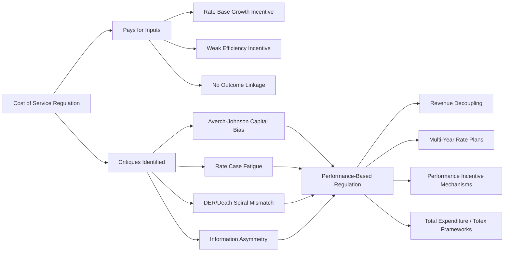

## Rationale for Moving Beyond Cost of Service Regulation

### Overview

Traditional cost-of-service regulation (COSR) sets rates by summing a utility's prudently incurred operating expenses and a return on its rate base, then dividing the resulting revenue requirement across customer classes. While COSR provided a durable framework for a century of monopoly utility regulation, regulators, utilities, and academics have identified structural weaknesses that create misaligned incentives, discourage innovation, and are increasingly mismatched to a grid undergoing rapid technological and structural change. This item surveys the core critiques driving the shift toward alternative and performance-based regulation (PBR).

### The Core Revenue Requirement Model (Baseline)

$$RR = O\&M + D + T + (RB \times r)$$

Where $RR$ is revenue requirement, $O\&M$ is operating and maintenance expense, $D$ is depreciation, $T$ is taxes, $RB$ is rate base, and $r$ is the allowed rate of return. Understanding the critiques below requires recognizing that under this formula, revenue is mechanically linked to the *inputs* (cost and capital) rather than to *outputs* (reliability, customer satisfaction, decarbonization, efficiency).

### The Averch-Johnson Effect (Capital Bias)

**The Core Problem**

The foundational academic critique of COSR is the **Averch-Johnson effect**, formalized in Averch and Johnson's 1962 paper. Because a utility earns its allowed return only on rate base (capital investment), and *not* directly on operating expenditure, a utility subject to COSR has a rational economic incentive to:

- Over-capitalize relative to the efficient input mix (substituting capital for labor/operating expense even when the reverse would be cheaper)
- Prefer capital solutions (building a new substation) over non-capital solutions (demand response, energy efficiency, deferred maintenance strategies) even when the latter is more cost-effective for society
- Expand rate base as an end in itself, since a larger rate base directly grows the earnings base

**Formal Intuition**

If the allowed return $r$ exceeds the utility's true cost of capital $c$, the utility earns economic rent on every additional dollar of rate base, creating a bias toward capital intensity regardless of the underlying engineering optimum:

$$\text{if } r > c, \quad \frac{\partial \Pi}{\partial RB} > 0 \text{ even when } RB \text{ exceeds the cost-minimizing level}$$

### Misaligned Incentives Beyond Capital Bias

**No Reward for Cost Efficiency**

Under COSR with a traditional test year and rate case, cost savings a utility achieves between rate cases accrue to the utility as additional profit only temporarily — the next rate case "resets" rates to match updated costs, effectively clawing back the benefit of efficiency gains. This creates:

- Weak incentive to pursue operational efficiency once a rate case has concluded, since savings will eventually be passed to customers regardless
- Incentive to *increase* costs just before a rate case's test year, since the test year becomes the new baseline

**Regulatory Lag as a Double-Edged Sword**

The gap between when costs are incurred and when a rate case updates rates ("regulatory lag") is sometimes credited with disciplining utilities to control costs (since they bear the risk of cost increases until the next case), but it is inconsistent and unpredictable as an incentive tool — it rewards or punishes utilities somewhat arbitrarily depending on the timing of rate cases relative to cost trends, rather than by design.

**Outputs Are Not Directly Compensated**

COSR pays for inputs, not outcomes. A utility that spends heavily on tree-trimming and pole replacement earns a return on that spending regardless of whether reliability (as measured by SAIDI/SAIFI) actually improves. There is no automatic financial reward for:

- Superior customer service or satisfaction
- Faster interconnection processing for distributed energy resources (DERs)
- Achieving decarbonization or electrification policy goals
- Grid modernization outcomes such as improved hosting capacity for solar/storage

### Administrative and Procedural Burdens

**Rate Case Frequency and Cost**

Full COSR rate cases are:

- Expensive — often costing utilities and intervenors millions of dollars in expert witness fees, discovery, and litigation costs per case, ultimately borne by ratepayers
- Time-consuming — typically 6–12 months from filing to final order, sometimes longer with appeals
- Resource-intensive for the commission itself, which must staff and adjudicate a full evidentiary proceeding

**"Rate Case Fatigue"**

Frequent, contentious rate cases strain the relationship between the utility, commission, and intervenors, and divert utility management attention toward litigation strategy rather than operations.

### Mismatch With Emerging Grid and Policy Needs

**Distributed Energy Resources (DERs) and the "Death Spiral" Concern**

As distributed generation (rooftop solar), energy efficiency, and demand response reduce utility throughput (kWh sales), COSR's dependence on volumetric sales to recover fixed costs creates two related problems:

- Under a traditional volumetric rate design layered on COSR, declining sales create pressure for even higher per-unit rates to recover the same fixed revenue requirement, which can further incentivize DER adoption/departure — the so-called "utility death spiral" concern
- The COSR framework has no native mechanism to compensate the utility fairly for enabling (rather than resisting) customer-sited DERs

**Rate Base Growth as the Wrong Signal in a Decarbonizing/Digitizing Grid**

Modern grid needs — such as software-based grid management, non-wires alternatives, flexible load management, and third-party DER integration — are frequently *not* capital-intensive in the traditional pole-and-wire sense. COSR's rate-base-return mechanism poorly compensates utilities for these lower-capital, higher-software/analytics solutions, reinforcing a bias toward traditional infrastructure investment even where non-traditional solutions would serve customers better and at lower cost.

**Multi-Year Planning Horizons**

Climate and reliability goals increasingly require utilities to plan capital deployment over 10–20 year horizons (e.g., grid hardening against extreme weather, transmission for decarbonized generation). Annual or biennial COSR rate cases are poorly suited to funding and reviewing such long-horizon capital programs efficiently.

### Information Asymmetry and Regulatory Capture Risk

**The Information Problem**

COSR requires the regulator to evaluate the prudence and reasonableness of thousands of individual cost and investment decisions, but the utility possesses vastly superior information about its own operations, cost structure, and investment opportunities than the commission or intervenors. This asymmetry:

- Increases the risk that inefficient costs are embedded in rates without detection
- Requires the commission to invest heavily in audit and discovery capability to police cost claims
- Creates opportunities, [Inference] documented in the regulatory economics literature, for strategic information withholding by the regulated utility

### Summary Comparison: COSR Critiques and Their Consequences

| Critique | Mechanism | Consequence |
| --- | --- | --- |
| Averch-Johnson effect | Return earned only on capital | Over-investment in rate base ("gold-plating") |
| Efficiency clawback | Test-year reset at each rate case | Weak ongoing incentive to cut costs |
| Input-based compensation | Revenue tied to cost, not outcomes | No reward for reliability, service quality, DER enablement |
| High transaction costs | Full litigated proceedings | Rate case fatigue; costly, slow proceedings |
| Volumetric throughput dependence | Fixed cost recovery tied to kWh sales | Utility "death spiral" risk as DER adoption grows |
| Information asymmetry | Utility knows more than regulator | Risk of imprudent costs passing review |

### Conceptual Shift Toward PBR

### Worked Illustration: Efficiency Incentive Under COSR vs. an Alternative

**Scenario**

A utility identifies a process improvement that saves $2,000,000 annually in O&M starting in Year 1 of a 4-year rate case cycle.

**Under Strict COSR**

- Years 1–3 (before next rate case): utility retains the full $2,000,000/year saving as additional earnings (a temporary efficiency incentive exists here due to lag)
- Year 4 rate case: the lower O&M level becomes the new test-year baseline, and rates are reduced accordingly — the utility's benefit disappears once the case resolves
- [Inference] Because the benefit is temporary and tied to unpredictable rate case timing, the *ex ante* incentive to pursue such savings is weaker and less reliable than a mechanism that shares savings on a defined, multi-year schedule

**Under an Illustrative Earnings-Sharing Alternative**

- A multi-year rate plan might specify that savings beyond a benchmark are shared, e.g., 50% to shareholders / 50% to ratepayers, for the life of a 5-year plan, giving a stable, predictable, longer-duration incentive to pursue the same $2,000,000 saving

### Key Points

- COSR's structural flaw, formalized as the Averch-Johnson effect, biases utilities toward capital investment (rate base growth) over operating efficiency because returns are earned only on capital.
- Efficiency gains achieved under COSR are only temporarily retained by the utility; the next rate case resets rates to the new (lower) cost baseline, weakening the long-run incentive to cut costs.
- COSR compensates utilities for *inputs* (costs incurred), not *outputs* (reliability, service quality, DER integration, decarbonization), leaving policy and performance goals unfunded by the core ratemaking mechanism.
- Rising DER penetration exposes COSR's dependence on volumetric sales to recover fixed costs, raising "death spiral" concerns as throughput declines.
- High administrative costs, rate case frequency, and information asymmetry between utility and regulator compound the case for alternative mechanisms.
- These critiques collectively motivate the shift toward Performance-Based Regulation (PBR): revenue decoupling, multi-year rate plans, performance incentive mechanisms (PIMs), and total expenditure ("totex") approaches, each addressing one or more of the specific misalignments identified above.

**Next Steps**

- Performance-Based Regulation (PBR): Core Design Principles
- Revenue Decoupling Mechanisms
- Multi-Year Rate Plans (MRPs) and Rate Case Cadence Reform
- Performance Incentive Mechanisms (PIMs) and Scorecards
- Totex vs. Capex/Opex Bifurcation in Ratemaking
- Earnings Sharing Mechanisms (ESMs)
- International PBR Precedents (UK RIIO Model, Australian AER Framework)
- Integrated Distribution Planning and Non-Wires Alternatives Under PBR