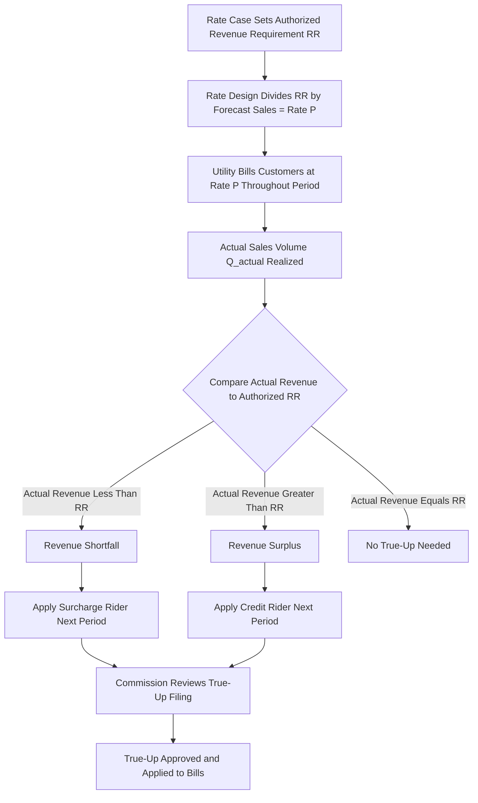

## Revenue Decoupling Mechanisms

### Overview

Revenue decoupling breaks the mechanical link between a utility's sales volume (kWh or therms delivered) and the revenue it collects, allowing the utility to recover its commission-authorized revenue requirement regardless of fluctuations in usage. Decoupling directly addresses the volumetric throughput dependence identified as a core weakness of cost-of-service regulation, particularly the incentive it creates for utilities to resist energy efficiency, demand response, and distributed generation because those programs erode volumetric sales and, with them, utility earnings.

### The Problem Decoupling Solves

**Throughput Incentive Under Volumetric Rates**

Under a traditional volumetric rate design, a utility's actual revenue collected is:

$$Rev_{actual} = P \times Q_{actual}$$

Where $P$ is the per-unit rate ($/kWh) set in the last rate case and $Q_{actual}$ is actual usage. Because $P$ was calculated by dividing the authorized revenue requirement $RR$ by a *forecast* sales volume $Q_{forecast}$:

$$P = \frac{RR}{Q_{forecast}}$$

any deviation between forecast and actual sales causes the utility to over- or under-recover its authorized revenue requirement:

$$Rev_{actual} - RR = P \times (Q_{actual} - Q_{forecast})$$

If $Q_{actual} < Q_{forecast}$ — for example, because customers installed rooftop solar or participated in an efficiency program — the utility under-recovers and has a rational financial disincentive to support the very efficiency and DER programs that regulators and legislators want it to promote.

### Core Mechanism Design

**Decoupling Formula**

A basic revenue decoupling mechanism establishes a fixed authorized revenue-per-customer or total authorized revenue target, then true-ups the difference between actual collected revenue and the target via a surcharge or credit applied in a subsequent billing period:

$$\text{True-up} = RR_{authorized} - Rev_{actual\ collected}$$

- If $\text{True-up} > 0$ (revenue shortfall): a surcharge is applied to future bills to recover the difference
- If $\text{True-up} < 0$ (revenue over-collection): a credit is applied to future bills to refund the difference

**Typical Components**

- **Revenue-per-customer target**: often normalized on a per-customer rather than aggregate basis, so that customer growth (adding new customers) still increases total revenue naturally, while decoupling addresses only *per-customer usage* variability
- **True-up period**: commonly annual, though some mechanisms true up quarterly or semi-annually
- **True-up cap**: many mechanisms cap the surcharge/credit (e.g., ±3–5% of billed revenue in a given period) to limit bill volatility and smooth the customer impact
- **Weather normalization interaction**: decoupling is sometimes bundled with, or substitutes for, a separate weather normalization adjustment (WNA), since weather-driven usage variation is one of the largest sources of the volatility decoupling addresses

### Comparison of Related Mechanisms

| Mechanism | What It Adjusts | Addresses Weather Risk? | Addresses DER/EE Erosion? | Relative Complexity |
| --- | --- | --- | --- | --- |
| Full revenue decoupling | Total or per-customer revenue vs. authorized target | Yes | Yes | High |
| Weather normalization adjustment (WNA) | Billing determinants for weather-driven usage only | Yes | No | Moderate |
| Lost revenue adjustment mechanism (LRAM) | Revenue lost specifically to known EE program participation | No (unless combined) | Partially (EE only) | Moderate |
| Straight fixed-variable rate design (SFV) | Rate design itself (shifts fixed cost recovery to fixed charge) | No | Yes (structurally) | Low–Moderate |
| Traditional volumetric rate (no mechanism) | None | No | No | Low |

**Decoupling vs. Straight Fixed-Variable (SFV) Rate Design**

Decoupling and SFV rate design both address the same underlying problem — fixed cost recovery riding on variable usage — but by different means. SFV rate design shifts most fixed-cost recovery into the customer charge itself (reducing the volumetric component going forward), while decoupling keeps the existing rate design but reconciles collected revenue to the authorized target after the fact through a separate rider. [Inference] Regulators sometimes favor decoupling over SFV because SFV's higher fixed charges are more visible to customers and can face political resistance, particularly from low-usage or low-income customer advocates; decoupling's true-up mechanism is comparatively less visible on a bill, though this can also raise transparency and customer-understanding concerns.

### Design Variants

**Full Decoupling**

Applies to a utility's entire base revenue requirement (or the full distribution revenue requirement for a "wires" utility), true-ing up the total regardless of the *source* of usage variation (weather, economy, efficiency, DER adoption, or behavioral change) — the most comprehensive and simplest variant conceptually, but also the one most exposed to criticism that it dulls the utility's cost-consciousness across the board, not just its DER/EE-related concerns.

**Partial or Targeted Decoupling**

Applies only to a specific customer class (e.g., residential) or to a specific revenue category (e.g., only the portion of revenue attributable to energy efficiency program impacts, as in an LRAM), leaving other classes or drivers of usage variability under traditional volumetric exposure.

**Symmetric vs. Asymmetric Decoupling**

- **Symmetric**: true-ups flow both directions — surcharges for shortfalls and credits for over-collections — and is the standard, balanced design
- **Asymmetric**: in some early or politically constrained designs, only shortfall recovery (surcharge) was authorized, without a corresponding customer credit for over-collection; this design is now generally disfavored by regulators and consumer advocates as inequitable

### Illustrative Numeric Example

**Setup**

A distribution utility has an authorized annual revenue requirement of $120,000,000, translated into a volumetric rate based on a forecast sales volume of 2,400,000,000 kWh, yielding $P = \$0.05/\text{kWh}$.

**Actual Outcome**

Due to a combination of a mild summer and expanded rooftop solar adoption, actual sales come in at 2,280,000,000 kWh (5% below forecast).

**Without Decoupling**

$$Rev_{actual} = 0.05 \times 2{,}280{,}000{,}000 = \$114{,}000{,}000$$

The utility under-recovers by $6,000,000 relative to its authorized revenue requirement, with no mechanism to true this up — a direct earnings impact traceable to the very solar adoption that regulators may be trying to encourage.

**With Decoupling**

The $6,000,000 shortfall is calculated at year-end and applied as a per-kWh (or per-customer) surcharge on the following year's bills, restoring the utility to its authorized $120,000,000 while leaving customers who reduced usage most to see comparatively smaller *net* bill increases than customers who did not reduce usage, since the surcharge is typically spread across a broader billing determinant.

### Stakeholder Positions and Trade-offs

**Utility Perspective**

- Reduces earnings volatility and the "regulatory lag" risk tied to weather and economic cycles
- Removes the disincentive to actively promote customer-side energy efficiency, demand response, and DER interconnection, since utility revenue is no longer put at risk by supporting these programs
- Simplifies utility financial planning and can support a stronger credit profile, [Inference] which rating agencies have at times cited as a credit-positive factor for utilities with decoupling mechanisms in place

**Consumer/Ratepayer Advocate Perspective**

- Some advocates support decoupling as removing the utility's structural opposition to efficiency programs that lower customer bills
- Other advocates raise concerns that decoupling reduces the utility's incentive to control costs broadly (since revenue is guaranteed regardless of sales performance) and may increase bill volatility or reduce the price signal that encourages conservation, since a customer's own usage reduction is partially offset system-wide by the true-up mechanism
- The "who benefits from whose conservation" distributional question — heavy users effectively subsidizing the true-up caused by light users' reduced consumption, or vice versa — is a recurring point of contention in decoupling proceedings

**Commission Perspective**

- Decoupling must be evaluated alongside other mechanisms in a comprehensive PBR framework; regulators [Inference] generally view it as most justifiable when paired with demonstrable, mandated energy efficiency or DER integration policy goals, rather than adopted in isolation purely for utility earnings stabilization

### Mechanism Architecture

### Implementation and Filing Requirements

**Typical Regulatory Filing Elements**

- Annual (or periodic) reconciliation filing showing actual billing determinants vs. authorized revenue target, by rate class
- Calculation workpapers demonstrating the true-up amount and proposed surcharge/credit rate
- Confirmation that any decoupling-related revenue changes are separately itemized on customer bills (a common condition of approval, to preserve price-signal transparency)
- Audit or verification procedures the commission or its staff applies to confirm the accuracy of billing determinant data underlying the true-up

**Common Approval Conditions**

- Caps on the annual true-up rate impact to limit bill shock
- Sunset or periodic re-evaluation provisions requiring the commission to revisit whether the decoupling mechanism continues to serve its intended purpose
- Exclusion of certain revenue categories (e.g., off-system sales, new large customer additions) from the true-up calculation to avoid decoupling from capturing unrelated revenue dynamics

### Key Points

- Decoupling severs the link between a utility's collected revenue and its actual sales volume, using a periodic true-up rider to reconcile actual billed revenue to the commission-authorized revenue requirement.
- Its primary policy purpose is removing the utility's financial disincentive to support energy efficiency, demand response, and distributed generation, which otherwise erode volumetric throughput and utility earnings.
- Decoupling differs from related mechanisms like WNA (weather-only) and LRAM (efficiency-program-specific losses only) in its comprehensiveness — full decoupling addresses all sources of usage variability, not just one.
- Design choices — full vs. partial scope, symmetric vs. asymmetric true-up, true-up caps, and per-customer vs. aggregate revenue targets — significantly affect both the mechanism's effectiveness and its distributional and price-signal implications.
- Consumer advocates are divided: some view decoupling as pro-efficiency, while others raise concerns about reduced cost-control incentives and blunted conservation price signals.

**Related Topics**

- Weather Normalization Adjustments (WNAs)
- Lost Revenue Adjustment Mechanisms (LRAMs) for Energy Efficiency
- Straight Fixed-Variable (SFV) Rate Design
- Multi-Year Rate Plans and Their Interaction With Decoupling
- Performance Incentive Mechanisms (PIMs) Paired With Decoupling
- Rate Design Fundamentals: Fixed vs. Variable Cost Recovery
- Distributional Equity in Decoupling True-Up Allocation
- Credit Rating Agency Treatment of Regulatory Mechanisms