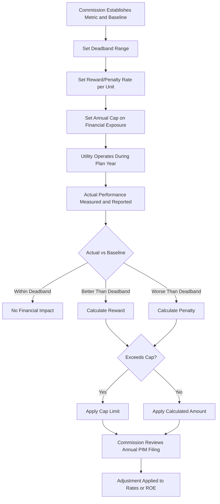

## Performance Incentive Mechanisms (PIMs) and Metric Design

### Overview

Performance incentive mechanisms (PIMs) are financial reward-and-penalty structures layered onto a rate plan that tie a portion of a utility's earnings directly to measured performance outcomes, rather than solely to cost or capital deployment. PIMs are the component of performance-based regulation (PBR) most directly aimed at the "no reward for outcomes" critique of cost-of-service regulation: they create an explicit financial consequence for exceeding or falling short of specific, quantifiable performance targets in areas such as reliability, customer service, safety, and increasingly, decarbonization and DER integration.

### Purpose and Placement Within a PBR Framework

**Where PIMs Fit**

PIMs are typically one component of a broader multi-year rate plan (MRP) that may also include revenue decoupling, an inflation-indexed revenue cap or price cap, and an earnings sharing mechanism. PIMs specifically address the risk that, once base rates are set for a multi-year period, a utility's incentive to maintain or improve *service quality* could weaken if it is no longer subject to annual rate case scrutiny — PIMs substitute a targeted financial incentive for that lost scrutiny.

**Relationship to Cost of Service Regulation**

Under COSR, cost recovery is largely delinked from performance outcomes: a utility recovers prudently incurred costs for reliability-related capital and maintenance spending regardless of whether SAIDI/SAIFI actually improves. PIMs close this gap by attaching a symmetric (or sometimes asymmetric) financial reward or penalty to the outcome metric itself, independent of the spending that produced it.

### Core Structural Elements of a PIM

**1. Metric Selection**

The performance dimension being measured — e.g., System Average Interruption Duration Index (SAIDI), customer satisfaction survey score, DER interconnection processing time, or a safety incident rate.

**2. Baseline / Benchmark**

The reference performance level against which actual results are measured, commonly set as:

- A historical average (e.g., trailing 3–5 year average of the utility's own performance)
- A peer benchmark (comparison against similarly situated utilities)
- A regulator-imposed target reflecting policy aspirations rather than historical performance

**3. Deadband**

A range around the baseline within which no financial consequence applies, intended to avoid penalizing/rewarding for statistically insignificant or immaterial variation.

**4. Reward/Penalty Rate**

The dollar (or basis-point ROE) consequence per unit of performance above or below the deadband, often capped at a maximum annual exposure.

**5. Cap (Maximum Exposure)**

A ceiling on the total dollar reward or penalty in a given year, typically expressed as a percentage of revenue or a fixed dollar/ROE-equivalent amount, to bound the utility's and ratepayers' financial exposure to the mechanism.

**Formal Structure**

$$\text{Financial Impact} = \max\left(-Cap,\ \min\left(Cap,\ (Actual - Baseline) \times Rate\right)\right)$$

Applied only when $|Actual - Baseline|$ exceeds the deadband threshold.

### Metric Design Principles

**SMART-Style Criteria Adapted for PIMs**

Well-designed PIM metrics are generally expected to be:

- **Objectively measurable**: derived from verifiable, auditable data (e.g., outage management system records) rather than subjective assessment
- **Within utility control**: the utility must have a meaningful ability to influence the outcome (a metric significantly driven by exogenous factors like storm frequency should incorporate normalization or exclusions)
- **Aligned with policy priorities**: tied to outcomes the commission and stakeholders have identified as important (reliability, safety, customer service, equity, DER integration, decarbonization)
- **Resistant to gaming**: designed so a utility cannot improve the measured metric without improving the underlying performance it is meant to proxy (e.g., a call-center "average hold time" metric might be gamed by disconnecting calls, so complementary metrics or audits are needed)
- **Stable and comparable over time**: using consistent measurement methodology across the plan period so trend analysis remains valid

**Metric Categories Commonly Used**

| Category | Example Metrics | Typical Data Source |
| --- | --- | --- |
| Reliability | SAIDI, SAIFI, CAIDI | Outage management system (OMS) |
| Safety | Employee/contractor incident rate, public safety incidents | Utility safety reporting, OSHA data |
| Customer service | Call center answer time, customer satisfaction (J.D. Power-style surveys), billing accuracy | CRM/call center systems, third-party surveys |
| DER/interconnection | Average interconnection application processing time, hosting capacity map accuracy | Interconnection queue tracking systems |
| Affordability/equity | Low-income program participation rate, disconnection rate | Customer billing/assistance program data |
| Decarbonization/electrification | EV charging infrastructure deployment, beneficial electrification program enrollment | Utility program tracking systems |

### Reward-Only, Penalty-Only, and Symmetric Designs

**Symmetric PIMs**

Provide both an upside reward for exceeding the benchmark and a downside penalty for falling short — generally viewed as the most balanced design, since it creates incentive in both directions and avoids one-sided risk allocation.

**Penalty-Only PIMs**

Common for safety and compliance-oriented metrics, where regulators may judge that only a downside penalty is appropriate (a utility should not be financially "rewarded" merely for meeting baseline safety expectations, but should face consequences for falling short).

**Reward-Only PIMs**

Sometimes used to incentivize adoption of new, discretionary initiatives (e.g., an emerging DER integration practice) where the commission wants to encourage experimentation without penalizing utilities for a new metric's early-stage results.

### Worked Numeric Example: Reliability PIM

**Design Parameters**

- Metric: SAIDI (minutes of average customer interruption duration per year, major-event-day excluded)
- Baseline: 90 minutes (5-year historical average)
- Deadband: ±5 minutes (no financial impact between 85–95 minutes)
- Reward/penalty rate: $50,000 per minute outside the deadband
- Cap: ±$2,000,000 annually

**Scenario A — Improved Performance**

Actual SAIDI = 78 minutes.

$$\text{Minutes outside deadband} = 85 - 78 = 7 \text{ minutes}$$

$$\text{Reward} = 7 \times \$50{,}000 = \$350{,}000$$

Since $350,000 is below the $2,000,000 cap, the utility earns the full $350,000 reward, typically realized as a revenue adjustment or an ROE adder in the next rate proceeding.

**Scenario B — Degraded Performance**

Actual SAIDI = 140 minutes.

$$\text{Minutes outside deadband} = 140 - 95 = 45 \text{ minutes}$$

$$\text{Uncapped penalty} = 45 \times \$50{,}000 = \$2{,}250{,}000$$

Because this exceeds the $2,000,000 cap, the applied penalty is capped at $2,000,000.

### PIM Mechanism Flow

### Governance and Review Process

**Annual Reporting and True-Up**

PIMs typically require an annual compliance filing in which the utility reports actual performance against each metric, with supporting data and calculation of any resulting reward or penalty, subject to commission staff audit or verification.

**Mid-Plan Metric Review**

Because a multi-year rate plan may run 3–5 years, commissions often reserve the right to review and, if necessary, recalibrate metrics, baselines, or caps at a mid-plan checkpoint, since a metric's relevance or an appropriate baseline can shift due to changed circumstances (e.g., a major storm year distorting the historical baseline, or a new state policy mandate emerging mid-plan).

**Portfolio Approach to Multiple PIMs**

Regulators generally avoid relying on a single PIM in isolation, preferring a portfolio of several PIMs spanning different performance dimensions (reliability, safety, customer service, DER) so that the utility cannot improve its financial position by optimizing one metric at the expense of others not being measured. [Inference] This portfolio approach is a direct response to the risk that any single metric, however well designed, can be gamed or over-optimized if it is the only one carrying financial consequences.

### Design Pitfalls and Critiques

**Metric Gaming Risk**

Any metric can potentially be optimized in ways that improve the *measured number* without improving the *underlying outcome* it is meant to represent (e.g., reclassifying outages, adjusting call routing to manipulate hold-time statistics). Robust metric design, independent audit, and metric-pairing (using a complementary metric to detect gaming) are standard mitigations.

**Baseline-Setting Disputes**

Because financial consequences hinge on the baseline, utilities and consumer advocates frequently dispute the appropriate baseline period, normalization for major storm events, and whether a peer benchmark or the utility's own historical trend is the fairer reference point — baseline-setting is often the most contested element of PIM design in regulatory proceedings.

**Materiality of Financial Incentive**

[Inference] If the reward/penalty rate and cap are set too low relative to the utility's overall earnings, the PIM may have limited practical influence on utility behavior, regardless of how well the metric itself is designed; conversely, caps set too high risk creating outsized earnings volatility disconnected from the utility's broader financial performance.

**Interaction With Existing Compliance Obligations**

Some metrics (e.g., certain safety or reliability minimums) may already be subject to independent regulatory compliance requirements or penalties outside the PBR framework; PIM design must avoid inadvertent double-penalization or, conversely, diluting an existing compliance obligation by treating it merely as a financial trade-off.

### Key Points

- PIMs attach explicit financial rewards or penalties to measured performance outcomes, directly compensating for the absence of outcome-based incentives under cost-of-service regulation.
- Core structural elements — metric, baseline, deadband, reward/penalty rate, and cap — must all be specified for a PIM to function, and each is a distinct point of regulatory negotiation.
- Metrics should be objectively measurable, within the utility's control, aligned with policy priorities, resistant to gaming, and stable over the plan period.
- Symmetric PIMs balance risk in both directions; penalty-only designs are common for safety/compliance metrics, while reward-only designs can encourage adoption of new initiatives.
- A portfolio of multiple PIMs across different performance dimensions is generally preferred over reliance on a single metric, reducing the risk of single-metric gaming or unintended trade-offs.
- Baseline-setting and metric-gaming risk are the most common sources of contention and require ongoing governance, including annual compliance review and periodic mid-plan recalibration.

**Related Topics**

- Multi-Year Rate Plans (MRPs) — Structural Overview
- Revenue Decoupling Mechanisms
- Earnings Sharing Mechanisms (ESMs)
- Total Expenditure (Totex) Frameworks
- Reliability Metrics: SAIDI, SAIFI, CAIDI Methodology
- Data Auditing and Verification in Performance-Based Regulation
- International PBR Precedent: UK RIIO Output Delivery Incentives
- Stakeholder Process for Metric and Baseline Negotiation