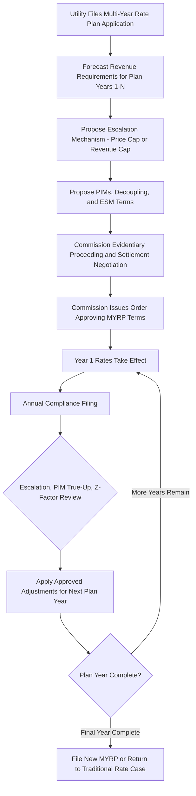

## Multi Year Rate Plans (MYRPs)

### Overview

A multi-year rate plan (MYRP), also called a multi-year rate plan (MRP) or forward test-year plan, sets a utility's rates for a period of typically three to five years through a single regulatory proceeding, rather than through the traditional annual or biennial cost-of-service rate case cycle. MYRPs are the structural backbone into which other performance-based regulation (PBR) tools — revenue decoupling, performance incentive mechanisms (PIMs), and earnings sharing mechanisms (ESMs) — are typically embedded, since those tools generally presuppose a multi-year rate-setting horizon rather than a single-year test year.

### Rationale Within the PBR Framework

**Addressing Rate Case Frequency and Cost**

MYRPs directly respond to the administrative burden and "rate case fatigue" critique of cost-of-service regulation by consolidating what would otherwise be three to five separate contested rate proceedings into a single, more comprehensive proceeding, reducing aggregate litigation cost and regulatory staff burden over the plan horizon.

**Enabling Forward-Looking Investment Planning**

Because MYRPs set revenue levels multiple years in advance, they allow both the utility and the commission to evaluate a multi-year capital and operating plan holistically — better suited to long-horizon needs such as grid modernization, resilience investment, and decarbonization-related infrastructure than a single test year focused on near-term costs.

**Creating Space for Efficiency Incentives**

Because rates are fixed (subject to the index adjustments described below) for the multi-year period rather than reset annually to actual costs, a utility that achieves cost efficiencies during the plan period retains the resulting benefit for a longer, more predictable duration than under strict annual COSR — directly addressing the "efficiency clawback" critique, since the utility is not immediately penalized at the next rate case for the previous period's savings.

### Core Structural Components

**1. Forward Test Year(s)**

Instead of basing rates on a single historical or near-term test year, an MYRP typically requires the utility to forecast revenue requirements for each year of the multi-year period, subject to commission review and adjustment.

**2. Attrition or Escalation Mechanism**

Because costs generally rise over a multi-year period (inflation, customer growth, capital additions), MYRPs commonly include an annual adjustment mechanism to update rates in years 2 through N without a full rate case, most often structured as:

- **Inflation-indexed escalation**: rates adjusted by a published index (e.g., a consumer price index or a utility-specific input cost index), sometimes offset by a productivity factor (see the price-cap/X-factor discussion below)
- **Formula rate adjustments**: predetermined formulas updating specific cost categories (e.g., known and measurable capital additions) based on updated data, without relitigating the underlying methodology

**3. Off-Ramp / True-Up Provisions**

To manage the risk that actual conditions diverge significantly from forecasts over a multi-year period, MYRPs often include:

- **Z-factor mechanisms**: allowing rate adjustment for extraordinary, unforeseeable cost events outside the utility's control (e.g., a new legal mandate, a major storm) that fall outside the ordinary escalation formula
- **Reopener provisions**: contractual triggers allowing either party to request an early reopening of the plan if specified conditions are met (e.g., earnings falling far outside an expected band)
- **Earnings sharing mechanisms (ESMs)**: sharing of returns above or below an authorized ROE band between utility and ratepayers, addressing the risk that the forward-looking forecast proves systematically too generous or too conservative

**4. Performance Metrics and PIMs**

As discussed in PIM design, MYRPs frequently incorporate performance incentive mechanisms to maintain accountability for service quality across the plan period, substituting for the more frequent scrutiny an annual rate case would otherwise provide.

**5. Reconciliation and Annual Compliance Filings**

Even though full rate cases are not conducted annually, MYRPs typically still require annual compliance filings to true up known and measurable cost changes, verify PIM performance, and process any decoupling true-up, keeping the commission informed without requiring a full litigated proceeding each year.

### Price Cap vs. Revenue Cap MYRP Design

**Price Cap (RPI-X) Approach**

Adapted from UK-style utility regulation, a price cap MYRP indexes the *per-unit rate* to inflation, minus an efficiency offset ("X-factor") reflecting expected productivity gains:

$$P_{t+1} = P_t \times (1 + RPI - X)$$

Where $RPI$ is a retail price (or other inflation) index and $X$ is the productivity offset determined during the proceeding based on historical productivity trends for the utility or sector.

**Revenue Cap Approach**

A revenue cap MYRP indexes the utility's *total allowed revenue* (rather than the per-unit price) to a similar inflation-minus-productivity formula, then divides by actual (or forecast) volumes to derive the per-unit rate each year:

$$RR_{t+1} = RR_t \times (1 + I - X) \pm \text{Z-factor adjustments}$$

**Design Trade-off**

- A revenue cap is inherently compatible with (and often bundled with) revenue decoupling, since both mechanisms detach the utility's revenue from sales volume
- A price cap leaves the utility's revenue still linked to sales volume unless a separate decoupling mechanism is layered on top, meaning price-cap-only MYRPs retain some throughput-driven earnings risk

| Design Element | Price Cap | Revenue Cap |
| --- | --- | --- |
| What is indexed | Per-unit rate | Total revenue requirement |
| Volume risk borne by utility | Yes, unless separately decoupled | No (inherently decoupled) |
| Typical productivity offset (X-factor) | Set via historical total factor productivity (TFP) studies | Set via similar TFP or benchmarking studies |
| Common pairing | Often paired with separate decoupling rider | Often self-contained, no separate decoupling needed |

### Worked Numeric Example: Revenue Cap Escalation

**Setup**

A commission approves a 4-year MYRP beginning with a Year 1 authorized revenue requirement of $200,000,000, an inflation index (I) of 2.5% annually, and an X-factor of 0.7% (reflecting expected annual productivity gains).

**Annual Escalation Calculation**

$$\text{Net escalation factor} = I - X = 2.5\% - 0.7\% = 1.8\%$$

| Plan Year | Formula | Authorized Revenue Requirement |
| --- | --- | --- |
| Year 1 | Base (set in proceeding) | $200,000,000 |
| Year 2 | $200{,}000{,}000 \times 1.018$ | $203,600,000 |
| Year 3 | $203{,}600{,}000 \times 1.018$ | $207,265,000 (rounded) |
| Year 4 | $207{,}265{,}000 \times 1.018$ | $210,996,000 (rounded) |

**Z-Factor Adjustment Example**

If, in Year 3, a new state-mandated wildfire mitigation program imposes $8,000,000 in unforeseeable incremental costs outside the ordinary escalation formula, the utility would file a Z-factor request; if approved, Year 3's authorized revenue requirement would be adjusted to $207,265,000 + $8,000,000 = $215,265,000, without reopening the entire MYRP.

### MYRP Lifecycle

### Comparison: MYRP vs. Traditional Annual Rate Case Cadence

| Dimension | Traditional Annual/Biennial COSR | Multi-Year Rate Plan |
| --- | --- | --- |
| Rate-setting frequency | Every 1–2 years, full litigated proceeding each time | Full proceeding every 3–5 years; annual compliance filings in between |
| Efficiency incentive duration | Short (until next rate case resets baseline) | Extended across full plan term |
| Administrative cost | Recurring high cost each cycle | Front-loaded cost, lower recurring cost |
| Forecast risk borne by utility | Low (near-term test year) | Higher (multi-year forecast risk), mitigated by Z-factors/reopeners |
| Outcome accountability mechanism | Implicit, via next rate case | Explicit, via embedded PIMs |
| Volume/throughput risk | Full utility exposure (absent separate decoupling) | Often addressed structurally (revenue cap) or via paired decoupling (price cap) |

### Design and Implementation Challenges

**Forecast Accuracy Over Multi-Year Horizons**

[Inference] The core risk in any MYRP is that a multi-year forecast, particularly of capital expenditure needs, proves systematically inaccurate — either too high (over-earning for the utility) or too low (under-recovery risking financial distress) — which is precisely why Z-factor, reopener, and ESM provisions are treated as essential rather than optional design elements.

**Stakeholder Capacity and Front-Loaded Complexity**

An MYRP proceeding is typically more complex and resource-intensive than a single traditional rate case, since it must simultaneously resolve forecast revenue requirements, escalation methodology, PIM design, and ESM terms in one proceeding — potentially disadvantaging intervenors and commission staff with limited resources relative to utility staff dedicated to the filing.

**Political and Customer Communication Considerations**

Because rates change annually within the plan (via escalation, true-ups, and PIM adjustments) even without a new rate case, commissions and utilities must maintain clear customer communication distinguishing routine, pre-approved annual adjustments from the type of contested rate increase associated with a traditional rate case, to avoid customer confusion or the perception that "rate cases" are happening more often than they are.

### Key Points

- MYRPs set rates for a multi-year period (typically 3–5 years) through a single proceeding, using an escalation mechanism (price cap or revenue cap) to update rates annually without a full rate case in intervening years.
- They serve as the structural foundation for embedding revenue decoupling, PIMs, and ESMs, since these mechanisms generally require a multi-year rate-setting horizon to function as intended.
- Revenue cap designs are inherently decoupled from sales volume, while price cap designs retain volume risk unless separately paired with a decoupling mechanism.
- Z-factor provisions, reopeners, and ESMs are essential risk-management tools addressing the core MYRP risk: multi-year forecast inaccuracy.
- MYRPs extend the duration over which a utility retains the benefit of achieved cost efficiencies, directly addressing the "efficiency clawback" limitation of annual cost-of-service regulation.
- Successful MYRP implementation depends on embedded performance accountability (PIMs) to substitute for the service-quality scrutiny that would otherwise occur through more frequent rate cases.

**Next Steps**

- Performance Incentive Mechanisms (PIMs) and Metric Design
- Revenue Decoupling Mechanisms
- Earnings Sharing Mechanisms (ESMs) — Design and Banding
- Total Factor Productivity (TFP) Studies and X-Factor Determination
- Z-Factor and Force Majeure Cost Recovery Provisions
- International PBR Precedent: UK RIIO Price Control Framework
- Attrition Relief Mechanisms in Traditional Rate Case Contexts
- Stakeholder Settlement Processes in Multi-Year Rate Proceedings