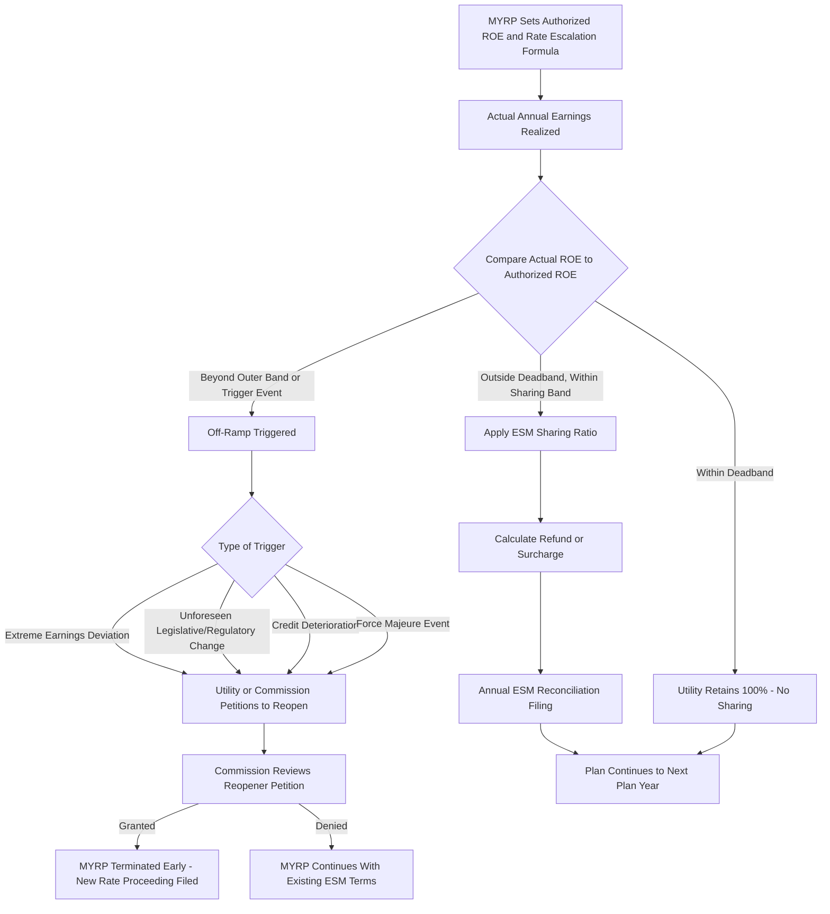

## Earnings Sharing Mechanisms and Off Ramps

### Overview

Earnings sharing mechanisms (ESMs) and off-ramp provisions are the risk-management backbone of multi-year rate plans (MYRPs), designed to bound the financial consequences of forecast error over a multi-year horizon. Because an MYRP fixes rates (subject to escalation) for several years based on forward-looking forecasts, actual earnings can diverge materially from the authorized return on equity (ROE) if costs, sales, or other conditions differ from assumptions. ESMs share the resulting over- or under-earnings between the utility and ratepayers within defined bands, while off-ramps provide an escape valve — a trigger allowing the plan to be reopened or terminated early — when earnings deviate so far from expectations that ordinary sharing is no longer an adequate remedy.

### The Problem: Forecast Risk Under Multi-Year Rates

**Why Earnings Can Diverge From the Authorized ROE**

An MYRP authorizes a target ROE (e.g., 9.5%) at the outset, but actual realized ROE depends on how actual costs, sales, and capital spending compare to the forecasts embedded in the plan:

$$ROE_{actual} = \frac{Net\ Income_{actual}}{Common\ Equity_{actual}}$$

If actual O&M costs come in below forecast, or sales exceed forecast (in a price-cap design without full decoupling), $ROE_{actual}$ can exceed the authorized ROE. Conversely, unexpected cost increases or sales shortfalls can push $ROE_{actual}$ below the authorized level. Because the plan does not adjust rates annually to match actual costs (unlike traditional COSR), this divergence can persist and compound across the multi-year term without a corrective mechanism.

### Earnings Sharing Mechanism (ESM) Design

**Basic Structure**

An ESM defines a **deadband** around the authorized ROE within which the utility retains all earnings variation, and one or more **sharing bands** outside the deadband within which excess or shortfall earnings are split between the utility and ratepayers according to a specified sharing ratio.

$$\text{Shareholder Retention} = \begin{cases} 100\% & \text{if } |ROE_{actual} - ROE_{authorized}| \leq Deadband \\ Sharing\ Ratio \times Excess & \text{if } |ROE_{actual} - ROE_{authorized}| > Deadband \end{cases}$$

**Typical Parameters**

- **Deadband**: commonly ±50 to ±100 basis points around the authorized ROE, within which no sharing occurs
- **Sharing ratio**: frequently 50/50 between shareholders and ratepayers within a first band, sometimes shifting to a more ratepayer-favorable split (e.g., 25/75) in a second, more extreme band
- **Hard cap / off-ramp trigger**: a further threshold beyond which the ESM's proportional sharing no longer applies and an off-ramp provision is triggered instead

**Tiered ESM Example Structure**

| ROE Band (relative to authorized 9.5%) | Utility Share | Ratepayer Share |
| --- | --- | --- |
| Within ±75 bps (8.75%–10.25%) | 100% | 0% |
| 75–200 bps above/below (10.25%–11.75% or 6.75%–8.75%) | 50% | 50% |
| Beyond 200 bps (>11.75% or <6.75%) | 25% (or off-ramp triggered) | 75% (or off-ramp triggered) |

### Worked Numeric Example: ESM Calculation

**Setup**

Authorized ROE = 9.5%. Deadband = ±75 basis points (8.75%–10.25%). First sharing band = 75–200 bps beyond the deadband, split 50/50. Common equity for the test year = $500,000,000.

**Scenario: Over-Earning**

Actual ROE = 10.8% for the year.

Step 1 — Determine excess above the deadband threshold (10.25%):

$$\text{Excess ROE} = 10.8\% - 10.25\% = 0.55\% = 55 \text{ bps}$$

Step 2 — This falls within the 50/50 sharing band (75–200 bps beyond deadband, i.e., up to 11.75%), so the full excess is shared 50/50:

$$\text{Ratepayer Share of Excess} = 0.55\% \times 50\% = 0.275\%$$

Step 3 — Convert to a dollar refund:

$$\text{Refund} = 0.275\% \times \$500{,}000{,}000 = \$1{,}375{,}000$$

The utility retains earnings up to a 10.525% effective ROE for the year (9.5% authorized threshold logic varies by jurisdiction's exact mechanics), and $1,375,000 is returned to ratepayers via a subsequent rate credit or rider, typically determined through an annual ESM reconciliation filing.

### Off-Ramp Provisions

**Purpose**

Off-ramps are triggers that allow either the utility or the commission (or, less commonly, ratepayer representatives) to reopen or terminate the MYRP before its scheduled end, addressing situations where the ordinary escalation and ESM mechanisms are no longer adequate to manage the divergence between plan assumptions and actual conditions.

**Common Off-Ramp Triggers**

- **Extreme earnings deviation**: actual ROE falling outside a wide outer band (e.g., more than 300–400 basis points from authorized ROE) for a sustained period
- **Material, unforeseen regulatory or legislative change**: a new law, tax change, or accounting standard materially altering the utility's cost structure in a way the Z-factor mechanism was not designed to address
- **Credit rating deterioration**: a ratings agency downgrade attributable to conditions within the MYRP's scope, signaling financial distress the ESM alone has not remedied
- **Force majeure events**: catastrophic events (major storms, wildfires, pandemics) with system-wide cost or revenue impacts beyond the scope of ordinary Z-factor treatment

**Off-Ramp Mechanics**

- **Utility-initiated reopener**: the utility petitions the commission to terminate the MYRP early and file a new traditional or multi-year rate case, typically requiring a showing that continued operation under the existing plan would be financially unsustainable
- **Commission-initiated reopener**: less common, but some MYRP designs allow the commission to reopen the plan if it determines ratepayers are bearing excessive cost due to systematic over-earning not adequately captured by the ESM
- **Automatic trigger**: some designs specify that breaching a defined outer ROE band automatically triggers a reopening proceeding, rather than requiring a discretionary petition

### ESM and Off-Ramp Interaction Within the MYRP

### Design Trade-offs and Stakeholder Considerations

**Utility Perspective**

- A well-calibrated deadband preserves meaningful efficiency incentive, since earnings within the deadband are fully retained
- Off-ramps provide critical downside protection against catastrophic or unforeseen cost events that would otherwise threaten the utility's financial integrity over a multi-year commitment
- [Inference] Utilities generally prefer wider deadbands and higher off-ramp trigger thresholds, since these preserve more upside from efficiency gains while limiting exposure to being locked into an increasingly unfavorable plan

**Ratepayer/Consumer Advocate Perspective**

- ESMs are viewed as a necessary check against a utility retaining excessive over-earnings that might result from overly conservative forecasts submitted at the outset of the MYRP
- Narrower deadbands and lower sharing ratios (more ratepayer-favorable splits) are typically advocated to ensure ratepayers benefit promptly from favorable variance, not just in extreme scenarios
- Advocates often scrutinize off-ramp provisions carefully to prevent them from becoming an easy escape valve for utilities seeking to abandon an MYRP whenever performance modestly underperforms expectations, rather than reserving off-ramps for genuinely extraordinary circumstances

**Commission Perspective**

- The deadband width, sharing ratios, and off-ramp trigger thresholds are all negotiated (or litigated) elements of the MYRP proceeding, requiring the commission to balance the goal of preserving efficiency incentives against the goal of protecting ratepayers from windfall utility earnings
- [Inference] Commissions often calibrate ESM bands based on the specific forecast risk profile of the plan — a plan with larger or less certain capital forecasts may warrant wider deadbands to avoid punishing the utility for ordinary forecast variance, while a plan with well-established, predictable cost trends may warrant narrower bands

### Comparison: ESM/Off-Ramp vs. Related Risk-Sharing Tools

| Mechanism | What It Addresses | Trigger Basis | Typical Remedy |
| --- | --- | --- | --- |
| Earnings sharing mechanism (ESM) | Ordinary earnings variance from forecast | Deviation of actual ROE from authorized ROE | Proportional refund/surcharge via annual filing |
| Z-factor | Discrete, unforeseeable cost events | Specific qualifying cost event outside utility control | Direct revenue requirement adjustment for the event |
| Off-ramp/reopener | Extreme or sustained earnings deviation, or plan-invalidating events | Breach of outer ROE band or defined trigger event | Early termination or renegotiation of the entire MYRP |
| Traditional rate case | End of a plan term, or as the default absent PBR | Scheduled filing requirement or off-ramp outcome | Full revenue requirement reset |

### Key Points

- ESMs share earnings variance from the authorized ROE between utility and ratepayers within defined deadband and sharing-band structures, addressing the forecast risk inherent in fixing rates over a multi-year period.
- The deadband preserves an efficiency incentive by allowing the utility to retain earnings variance within a defined range before any sharing applies.
- Off-ramps function as an escape valve distinct from ordinary ESM sharing, triggered by extreme or sustained earnings deviation, major unforeseen regulatory change, credit deterioration, or force majeure events, allowing early termination or renegotiation of the MYRP.
- ESM and off-ramp calibration — deadband width, sharing ratios, and trigger thresholds — are central, heavily negotiated design parameters that balance efficiency incentives against ratepayer protection from windfall earnings or utility financial distress.
- These mechanisms work alongside Z-factor provisions but serve a different function: Z-factors adjust the revenue requirement for discrete cost events, while ESMs address the aggregate earnings outcome, and off-ramps address plan-level unsustainability.

**Related Topics**

- Multi-Year Rate Plans (MYRPs) — Structural Overview
- Performance Incentive Mechanisms (PIMs) and Metric Design
- Z-Factor and Force Majeure Cost Recovery Provisions
- Return on Equity (ROE) Determination Methodologies
- Credit Rating Agency Treatment of Regulatory Mechanisms
- Rate Case Reopener Litigation and Precedent
- Total Factor Productivity (TFP) Studies and X-Factor Determination
- Settlement Negotiation Dynamics in Multi-Year Rate Proceedings