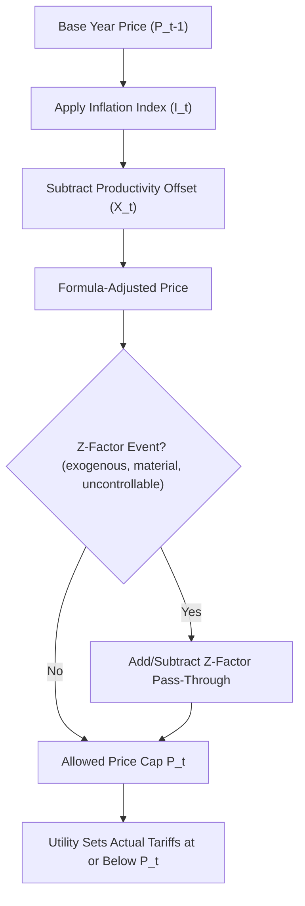
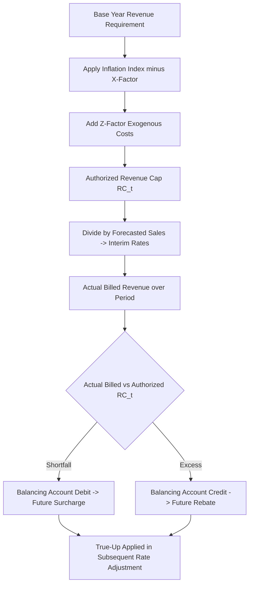
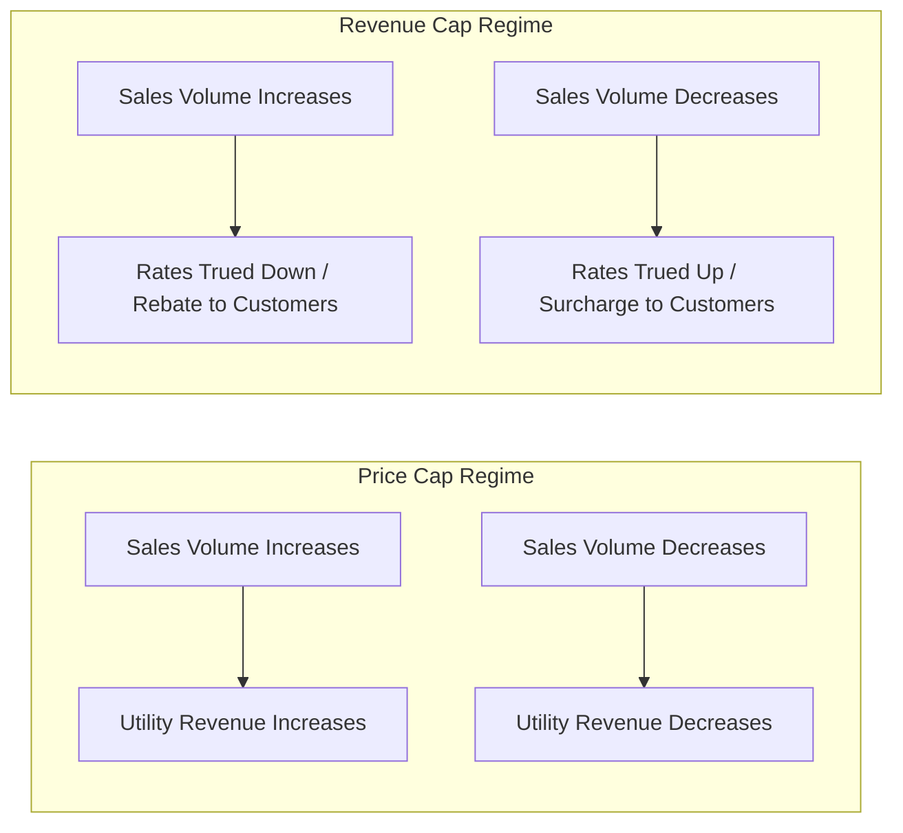
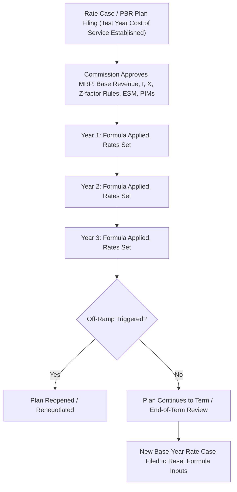

## Price Cap and Revenue Cap Regulation

### Overview

Price cap and revenue cap regulation are the two dominant forms of Alternative Regulation (Alt-Reg) or Performance-Based Regulation (PBR) used in place of, or alongside, traditional cost-of-service/rate-of-return regulation. Both mechanisms attempt to weaken the direct link between a utility's allowed revenue and its actual embedded costs, replacing annual or periodic full rate cases with formula-driven adjustments over a multi-year plan period (typically 3-5 years). The core distinction between the two lies in what variable is capped: price caps constrain the **per-unit price** a utility may charge, while revenue caps constrain the **total revenue** a utility may collect, independent of sales volume.

### Regulatory Context and Motivation

Traditional cost-of-service regulation, discussed elsewhere in this chapter, sets rates by dividing a utility's revenue requirement by forecasted sales. This creates several incentive problems:

- **Regulatory lag asymmetry**: Under cost-of-service regulation, cost reductions achieved by the utility are eventually passed to customers in the next rate case, giving utilities limited long-term incentive to cut costs.
- **Throughput incentive**: Utility profits rise with sales volume, creating a bias toward promoting consumption, which conflicts with energy efficiency and conservation policy goals.
- **Frequent litigation costs**: Rate cases are administratively expensive and adversarial for both the utility and the regulator.

Price cap and revenue cap regulation were developed, first prominently in UK telecommunications privatization (RPI-X regulation under Stephen Littlechild in the 1980s) and later adapted extensively for U.S. and Canadian electric, gas, and water utilities, to address these incentive problems by decoupling *allowed revenue/price* from *embedded cost* for the duration of the plan.

### Price Cap Regulation

#### Core Mechanism

Under price cap regulation, the regulator sets a maximum allowable price (or price index) per unit of service. The utility may charge up to this cap but is free to price below it. The cap is typically adjusted annually using a formula rather than through a litigated rate case.

The canonical price cap formula, derived from the UK "RPI-X" model, is:

$$P_t = P_{t-1} \times (1 + RPI_t - X)$$

Where:

- $P_t$ = allowed price in year $t$
- $RPI_t$ = inflation index (Retail Price Index, or in U.S. practice, GDP Price Index or CPI) for year $t$
- $X$ = the productivity offset factor, reflecting expected efficiency gains the utility must achieve

A more complete formulation used in U.S. multi-year rate plans (MRPs) often includes a Z-factor for exogenous cost changes:

$$P_t = P_{t-1} \times (1 + I_t - X_t) + Z_t$$

Where $Z_t$ captures cost changes outside management control (e.g., new legal mandates, storm costs, tax law changes) that are excluded from the productivity-adjusted formula and passed through separately.

#### Components of the Price Cap Formula

**Inflation Index ($I$)**

Reflects general economy-wide input cost inflation. Common choices:

- GDP Price Index (GDP-PI) — broad, often preferred because it is less volatile than sector-specific indices
- Consumer Price Index (CPI)
- A custom-weighted basket of input prices (labor, materials, capital)

**Productivity Offset ($X$)**

The X-factor is the most contested element of price cap design. It represents the utility's expected total factor productivity (TFP) growth relative to the broader economy, sometimes stretched with an additional "stretch factor" to induce extra efficiency. X-factors are typically derived from:

- Historical TFP studies (utility-specific or industry benchmarking)
- Econometric benchmarking against peer utilities
- Negotiated settlements between the utility and intervenors

If $X$ is set too high, the utility faces earnings erosion; too low, and customers overpay relative to achievable efficiency.

**Exogenous/Z-Factor Adjustments**

Costs meeting Z-factor criteria are typically required to be: (1) beyond management control, (2) not already reflected in the inflation index, (3) material in magnitude (above a materiality threshold, e.g., 0.5%-1% of revenue requirement), and (4) not offset by other cost changes.

#### Price Cap Basket Structure

Price caps are rarely applied to a single price; regulated services are usually grouped into "baskets" with a **weighted average price cap** or "tariff basket" constraint:

$$\sum_{i} w_i \times \frac{P_{i,t}}{P_{i,t-1}} \leq (1 + I_t - X_t)$$

Where $w_i$ is the revenue-weighting of service $i$ in the basket. This allows the utility flexibility to rebalance individual rates within the basket (raise some, lower others) as long as the weighted average satisfies the cap — a feature that promotes efficient relative pricing (Ramsey-style flexibility) while still constraining overall price growth.

#### Price Cap Diagram

### Revenue Cap Regulation

#### Core Mechanism

Revenue cap regulation sets a maximum allowable **total revenue** the utility may collect in a given period, independent of the number of units sold. Because total revenue is fixed by formula, per-unit rates are simply total allowed revenue divided by actual (or forecasted) sales:

$$RC_t = RC_{t-1} \times (1 + I_t - X_t) + Z_t \pm D_t$$

Where $RC_t$ is the allowed revenue in year $t$, and $D_t$ represents a **decoupling/reconciliation adjustment** (discussed below) that true-ups for volume variance.

Rates charged to customers are then derived as:

$$\text{Rate}_t = \frac{RC_t}{\text{Forecasted or Actual Sales}_t}$$

This means that if actual sales fall short of forecast, per-unit rates rise in a subsequent true-up (or are trued up via a rider) so the utility still collects its allowed revenue; if sales exceed forecast, rates fall.

#### Revenue Cap vs. Price Cap: Core Structural Difference

| Dimension | Price Cap | Revenue Cap |
| --- | --- | --- |
| Capped variable | Per-unit price | Total revenue |
| Sales volume risk | Borne by utility (revenue varies with sales) | Borne largely by customers (via true-up) |
| Throughput incentive | Retained (utility gains from higher sales) | Eliminated (utility indifferent to sales volume) |
| Compatibility with energy efficiency (EE) goals | Weaker — utility resists EE/DSM programs that reduce sales | Stronger — utility profit-neutral to conservation |
| Rate volatility for customers | Lower (price itself is stable) | Can be higher (true-up mechanisms cause rate adjustments) |
| Typical use | Telecom, some gas distribution, water | Electric distribution (especially where decoupling/EE goals are prioritized), gas distribution in decoupling states |
| Weather/economic sensitivity | Utility bears risk | Risk shifted to ratepayers |

#### Revenue Cap and Decoupling

Revenue caps are frequently paired with, or functionally equivalent to, **revenue decoupling mechanisms (RDMs)**. Decoupling breaks the link between a utility's revenue and its sales volume, typically implemented through:

- **Full revenue decoupling**: Actual revenue is trued up to the authorized revenue requirement via a balancing account, with surcharges/rebates applied to customer bills in a subsequent period.
- **Partial decoupling / weather normalization adjustment (WNA)**: Only volume variance attributable to weather is trued up, leaving other volume risk (e.g., economic conditions) with the utility.

The true-up mechanism commonly uses a **balancing account**:

$$BA_t = (RC_t^{authorized} - Revenue_t^{actual\ billed})$$

The balance $BA_t$ accrues (often with carrying charges/interest) until the next rate adjustment, when it is amortized into rates, either as a rider or embedded in the next formula-year rate.

#### Revenue Cap Diagram

### Earnings Sharing Mechanisms (ESM)

Both price cap and revenue cap plans are frequently paired with an **Earnings Sharing Mechanism** to mitigate the risk of the utility earning excessively above (or below) its authorized return during the plan period, since the formula is disconnected from actual costs. A typical ESM structure:

- A **deadband** around the authorized ROE (e.g., ±50-100 basis points) within which the utility retains all earnings variance.
- Outside the deadband, earnings above/below the band are shared between the utility and customers using a specified sharing ratio (e.g., 50/50 or 60/40), often in tiered bands (wider bands may have different sharing percentages).

**Example ESM tiering:**

| Band (relative to authorized ROE) | Sharing Ratio (Utility/Customer) |
| --- | --- |
| Within ±50 bps (deadband) | 100% / 0% |
| 50-200 bps above/below | 50% / 50% |
| Beyond 200 bps | 25% / 75% |

### Off-Ramps and Reopener Provisions

Multi-year price/revenue cap plans typically include contractual "off-ramp" provisions allowing the plan to be reopened before its scheduled expiration if:

- Earned ROE falls outside a specified band (e.g., below authorized ROE minus 300 bps, or above plus 300 bps) for a sustained period
- A material, unforeseen event occurs that the Z-factor mechanism does not adequately address
- Statutory or regulatory changes fundamentally alter cost structure

### Productivity (X-Factor) Determination Methods

**[Inference]** The choice of X-factor methodology is often the most litigated element of a PBR filing, since small changes materially affect utility earnings over a multi-year term.

1. **Total Factor Productivity (TFP) Studies**: Measure output growth relative to weighted input growth (labor, capital, materials/services) over a historical study period, often 10-20 years, to estimate an industry or company-specific productivity trend.
2. **Partial Factor Productivity**: Simpler single-input measures (e.g., output per labor hour), less common in modern filings due to distortion risk.
3. **Benchmarking/Econometric Cost Models**: Statistical frontier analysis (e.g., Stochastic Frontier Analysis, Data Envelopment Analysis) comparing the utility's costs to a peer group to estimate an efficiency gap and expected catch-up productivity.
4. **Negotiated/Settled X-Factors**: Many jurisdictions ultimately set X through multi-party settlement rather than pure econometric derivation, blending technical analysis with negotiation.

### Numerical Example: Price Cap Calculation

**Example**

Assume a gas distribution utility's base-year allowed price is $8.00 per Mcf. The plan uses GDP-PI inflation and a negotiated X-factor of 1.2%, with a 0.3% stretch factor (total X = 1.5%). In Year 1, GDP-PI inflation is 2.8%.

$$P_1 = 8.00 \times (1 + 0.028 - 0.015) = 8.00 \times 1.013 = \$8.104 \text{ per Mcf}$$

If in Year 1 a new state-mandated pipeline safety inspection program adds $2 million in costs meeting Z-factor materiality criteria, and total throughput is 40 million Mcf, the Z-factor adder is:

$$Z_1 = \frac{\$2{,}000{,}000}{40{,}000{,}000\ \text{Mcf}} = \$0.05 \text{ per Mcf}$$

$$P_1^{final} = \$8.104 + \$0.05 = \$8.154 \text{ per Mcf}$$

### Numerical Example: Revenue Cap Calculation

**Example**

An electric distribution utility has an authorized base-year revenue requirement of $500 million. Inflation (I) is 2.5%, X-factor is 1.0%, and there is a $3 million Z-factor addition for storm hardening compliance costs.

$$RC_1 = 500{,}000{,}000 \times (1 + 0.025 - 0.010) + 3{,}000{,}000$$

$$RC_1 = 500{,}000{,}000 \times 1.015 + 3{,}000{,}000 = 507{,}500{,}000 + 3{,}000{,}000 = \$510{,}500{,}000$$

If forecasted sales are 10,000 GWh, the interim rate is:

$$\text{Rate}_1 = \frac{\$510{,}500{,}000}{10{,}000{,}000\ \text{MWh}} = \$51.05 / \text{MWh}$$

If actual sales come in at only 9,700 GWh due to a mild summer, actual billed revenue is:

$$Revenue_1^{actual} = 9{,}700{,}000 \times \$51.05 = \$495{,}185{,}000$$

The resulting shortfall relative to the authorized cap:

$$BA_1 = \$510{,}500{,}000 - \$495{,}185{,}000 = \$15{,}315{,}000\ (\text{deficit, recovered via future surcharge})$$

### Comparative Diagram: Sales Volume Risk Allocation

### Advantages and Disadvantages

**Key Points**

*Price Cap Advantages:*

- Simple for customers to understand (stable, predictable per-unit price)
- Retains some utility exposure to volume/demand risk, arguably preserving a market-like discipline
- Administratively simpler for services with relatively stable per-unit cost drivers

*Price Cap Disadvantages:*

- Preserves the throughput incentive, working against energy efficiency and demand-side management goals
- Vulnerable to "gaming" via basket rebalancing if weighting rules are loosely defined
- Utility revenue can be volatile due to weather, economic cycles, or demand response

*Revenue Cap Advantages:*

- Eliminates the throughput incentive; aligns utility financial interest with conservation and grid modernization goals
- Provides utility with more stable, predictable revenue (reduces cost of capital risk premium, [Inference] though the magnitude of any resulting capital cost reduction is jurisdiction- and market-specific)
- Facilitates integration of decoupling and performance incentive mechanisms (PIMs) tied to non-volume metrics (reliability, safety, customer satisfaction)

*Revenue Cap Disadvantages:*

- Shifts volume risk to customers, potentially increasing rate volatility through true-up surcharges
- More complex to administer due to balancing account tracking and reconciliation
- Can be politically contentious when large true-up surcharges appear on customer bills, especially after unexpected sales declines

### Interaction with Performance Incentive Mechanisms (PIMs)

**[Inference]** Because both mechanisms decouple revenue/price from cost and (in revenue cap's case) from volume, regulators often layer PIMs on top to guard against service quality degradation, since the utility's profit motive to cut costs could otherwise erode reliability or customer service if not monitored. Common PIM metrics layered onto price/revenue caps include:

- SAIDI/SAIFI (electric reliability indices)
- Customer service metrics (call center response time, billing accuracy)
- Safety metrics (leak rates for gas utilities, safety incident rates)
- Interconnection timeliness for distributed energy resources

Each PIM typically carries a symmetric or asymmetric financial reward/penalty, often capped at a percentage of ROE (e.g., ±50 bps), layered on top of the base price/revenue cap formula outcome.

### Illustrative Multi-Year Plan Timeline

### SVG Illustration: Price Cap vs Revenue Cap Rate Behavior (svg_diagram)

<svg xmlns="http://www.w3.org/2000/svg" viewBox="0 0 720 380" font-family="Helvetica, Arial, sans-serif">
<text x="360" y="24" text-anchor="middle" font-size="16" font-weight="bold" fill="#1a1a1a">Price Cap vs Revenue Cap: Effect of Sales Volume Change (svg_diagram)</text>

<line x1="80" y1="320" x2="680" y2="320" stroke="#333" stroke-width="2" />
<line x1="80" y1="320" x2="80" y2="60" stroke="#333" stroke-width="2" />
<text x="380" y="355" text-anchor="middle" font-size="13" fill="#333">Sales Volume (relative to forecast)</text>
<text x="30" y="190" text-anchor="middle" font-size="13" fill="#333" transform="rotate(-90 30 190)">Utility Revenue Collected</text>

<line x1="380" y1="60" x2="380" y2="320" stroke="#999" stroke-dasharray="4,4" />
<text x="380" y="335" text-anchor="middle" font-size="11" fill="#666">Forecast Volume</text>

<line x1="120" y1="270" x2="640" y2="110" stroke="#2563eb" stroke-width="3" />
<text x="600" y="95" font-size="12" fill="#2563eb" font-weight="bold">Price Cap</text>

<line x1="120" y1="150" x2="640" y2="150" stroke="#dc2626" stroke-width="3" />
<text x="600" y="140" font-size="12" fill="#dc2626" font-weight="bold">Revenue Cap</text>

<circle cx="380" cy="150" r="5" fill="#111" />
<text x="390" y="145" font-size="10" fill="#111">Authorized Revenue Cap Level</text>
<circle cx="380" cy="190" r="5" fill="#111" />
<text x="390" y="205" font-size="10" fill="#111">Price Cap Revenue at Forecast Volume</text>
</svg>

### Jurisdictional Notes

**[Unverified]** Specific formula parameters (index choice, X-factor magnitude, deadband width, Z-factor materiality threshold) vary significantly by jurisdiction and by proceeding; the values used in the numerical examples above are illustrative rather than reflective of any single currently-approved plan. Readers should consult the specific commission order or settlement agreement governing a given utility's PBR/MRP plan for exact parameters. Notable historical/structural examples include:

- UK Ofgem's RIIO framework (Revenue = Incentives + Innovation + Outputs), a revenue-cap-based model with extensive output-based incentives
- Numerous U.S. state commissions (e.g., in California, New York, and Massachusetts) have approved multi-year rate plans combining revenue decoupling with formula-based rate adjustments and PIMs for major electric and gas utilities
- Ontario Energy Board's Renewed Regulatory Framework for electricity distributors, using a price-cap-based Incentive Regulation (IR) approach with an IR Index (inflation minus a stretch factor)

### Conclusion

Price cap and revenue cap regulation both aim to shift regulatory focus from prescriptive cost review toward formula-based, incentive-compatible rate-setting over multi-year plan periods. Price caps preserve a link between utility revenue and sales volume, retaining a throughput incentive and volume risk for the utility, while revenue caps sever that link, shifting volume risk to customers via true-up mechanisms and eliminating the utility's financial disincentive toward energy efficiency. Both are commonly supplemented by earnings sharing mechanisms, Z-factor exogenous cost pass-throughs, and performance incentive mechanisms to balance efficiency incentives against service quality and earnings stability. The choice between the two approaches is fundamentally a policy decision about how sales volume risk should be allocated and how strongly the regulator wishes to align utility incentives with demand-side and conservation objectives.

**Related Topics**

- Multi-Year Rate Plans (MRPs) and Rate Plan Design
- Revenue Decoupling Mechanisms and Weather Normalization Adjustments
- Performance Incentive Mechanisms (PIMs) and Scorecards
- Earnings Sharing Mechanisms and Deadband Design
- Total Factor Productivity Benchmarking Methodologies
- Z-Factor and Exogenous Cost Treatment
- Cost-of-Service Regulation (contrast case)
- UK RIIO Framework and International PBR Models
- Formula Rate Plans (FRPs) for Transmission-Owning Utilities
- Ratemaking Treatment of Capital Expenditure Trackers under PBR