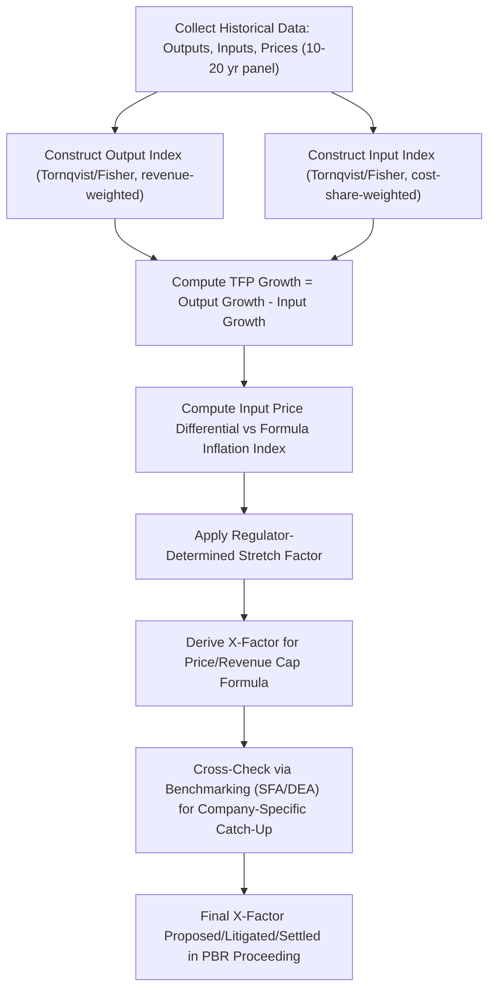

## Total Factor Productivity and Efficiency Benchmarking

### Overview

Total Factor Productivity (TFP) and efficiency benchmarking are the analytical methods regulators and utilities use to quantify expected or realized productivity growth, most critically to derive the X-factor used in price cap and revenue cap formulas. TFP measures how efficiently a firm converts a weighted bundle of inputs (labor, capital, materials/services) into a weighted bundle of outputs (units delivered, customers served, system capacity). Efficiency benchmarking compares an individual utility's cost or productivity performance against a peer group to identify a relative efficiency gap. Together these techniques provide the empirical foundation that is meant to replace the cost-verification function of a traditional rate case within a multi-year Alt-Reg/PBR plan.

### Why TFP Matters in Rate-Basing

Under cost-of-service regulation, the regulator verifies costs directly through a test-year rate case. Under price cap or revenue cap regulation, the formula substitutes an index-based adjustment (inflation minus X) for that direct cost verification. The X-factor is therefore the single number that stands in for the entire expected efficiency trajectory of the utility over the plan term. If X is understated, customers overpay relative to achievable efficiency; if overstated, the utility's earnings erode before the plan's scheduled reopening. TFP studies and benchmarking analyses are the primary evidentiary basis regulators rely on to set that number with some empirical grounding rather than pure negotiation.

### Conceptual Definition of TFP

TFP is defined as the ratio of an output index to an input index:

$$TFP_t = \frac{Output\ Index_t}{Input\ Index_t}$$

TFP *growth* between two periods is the growth rate of outputs minus the growth rate of inputs:

$$\%\Delta TFP = \%\Delta Output - \%\Delta Input$$

A positive TFP growth rate means the firm (or industry) is producing more output per unit of weighted input over time — i.e., becoming more productive. The X-factor in a price/revenue cap formula is generally set equal to the utility's (or industry's) expected TFP growth rate, sometimes adjusted by a "stretch factor" reflecting additional efficiency the regulator wants captured for customers, and by an input price differential term if the utility's input price inflation diverges from the general economy-wide inflation index used in the cap formula.

### The Full X-Factor Decomposition

In rigorous PBR filings, the X-factor is not simply "TFP growth" — it is typically decomposed as:

$$X = \Delta TFP_{industry} + \Delta I_{diff} + Stretch$$

Where:

- $\Delta TFP_{industry}$ = expected industry (or company-specific) total factor productivity growth
- $\Delta I_{diff}$ = the difference between the utility's own input price inflation trend and the general economy-wide inflation index used in the cap formula (captures the fact that utility-specific input costs, e.g., labor and materials for network construction, may inflate faster or slower than GDP-PI)
- $Stretch$ = an additional productivity increment imposed by the regulator to share expected efficiency gains with customers beyond the historically demonstrated trend

**Example**

If historical industry TFP growth is measured at 0.8% per year, the utility's input price inflation trend is running 0.4 percentage points above the general inflation index used in the formula, and the regulator applies a 0.3% stretch factor:

$$X = 0.8\% + 0.4\% + 0.3\% = 1.5\%$$

### Output and Input Index Construction

**Output Index**

Utility output is rarely a single homogeneous product, so the output index is a weighted composite, commonly using a Tornqvist or Fisher index formula, of variables such as:

- Number of customers/connections served
- Units delivered (kWh, MWh, Mcf, gallons)
- System capacity (miles of line, peak demand served)
- Number of services performed (new connections, meter reads)

**Input Index**

Similarly a weighted composite of:

- Labor (hours or FTE-equivalent, weighted by wage share of total cost)
- Capital (a service-flow measure derived from the utility's capital stock, typically constructed using the perpetual inventory method, weighted by capital cost share)
- Materials, supplies, and purchased services (deflated by an appropriate price index, weighted by expenditure share)

The index number formula used to aggregate multiple outputs or inputs into a single index matters materially to the result. The **Tornqvist index** (a discrete approximation to the continuous Divisia index) is the most common choice in utility TFP studies because it uses period-to-period average expenditure/revenue shares as weights and satisfies desirable index-number properties (it is "superlative," meaning it exactly matches a flexible underlying production/cost function to a second-order approximation):

$$\ln\left(\frac{Y_t}{Y_{t-1}}\right) = \sum_i \bar{s}_i \ln\left(\frac{y_{i,t}}{y_{i,t-1}}\right)$$

Where $\bar{s}_i$ is the average revenue (or cost) share of component $i$ across the two periods, and $y_i$ is the quantity of component $i$.

### TFP Estimation Methodologies

#### 1. Growth Accounting / Index Number Approach

The traditional and most transparent method: construct output and input indices directly from historical data (typically 10-20 years) using the Tornqvist or Fisher formula, then compute the historical TFP growth trend as the geometric mean annual growth rate.

**Key Points**

- Transparent and replicable — regulators and intervenors can audit the underlying data series
- Requires long, consistent time series of quantity and price/cost data, which can be difficult for individual utilities with limited history or frequent M&A activity
- Sensitive to the choice of study period (start/end year selection can materially shift the measured trend — a known point of litigation)

#### 2. Econometric Cost Function / Frontier Approaches

Rather than direct index construction, econometric approaches estimate a cost or production function statistically across a panel of utilities, then derive TFP growth as a byproduct of the estimated technology parameters (e.g., the rate of technical change coefficient in a translog cost function).

**Stochastic Frontier Analysis (SFA)**

Estimates a parametric cost or production frontier with a composed error term separating: (1) statistical noise, and (2) a one-sided inefficiency term representing each firm's distance from the efficient frontier.

$$\ln C_{it} = f(y_{it}, w_{it}, t;\ \beta) + v_{it} + u_{it}$$

Where $v_{it}$ is the standard symmetric noise term and $u_{it} \geq 0$ is the inefficiency term (for a cost frontier). SFA produces both a TFP growth estimate (via the time trend term) and a relative efficiency score for each firm in the panel.

**Data Envelopment Analysis (DEA)**

A non-parametric, linear-programming-based method that constructs a "best practice" frontier from the observed data itself (no functional form assumed) and measures each utility's distance from that frontier.

$$\theta^* = \min \theta \quad \text{s.t.} \quad \sum_j \lambda_j x_{ij} \leq \theta x_{i0},\ \sum_j \lambda_j y_{rj} \geq y_{r0},\ \lambda_j \geq 0$$

DEA is attractive because it makes no assumption about the underlying cost/production function shape, but it is sensitive to sample size, outliers, and measurement error since every deviation from the frontier is attributed to inefficiency rather than partly to noise. **[Inference]** SFA is generally preferred by regulators over DEA in contested proceedings specifically because SFA's explicit noise term makes it more defensible against claims that a single anomalous cost year unfairly penalizes a utility's efficiency score, though the appropriate choice remains dependent on the underlying data panel and jurisdictional analytical convention.

#### 3. Multilateral Total Factor Productivity (MTFP) Studies

Common in regulatory practice (widely used in Canadian and some U.S. gas/electric proceedings): a panel of multiple utilities' data is pooled and TFP indices are calculated relative to a common reference point across firms and years, using a multilateral extension of the Tornqvist formula (e.g., the Caves-Christensen-Diewert multilateral index). This produces an industry-wide TFP trend that smooths out firm-specific noise and is often used as the baseline for setting the X-factor across multiple utilities in a jurisdiction, sometimes supplemented by a company-specific adjustment.

### Efficiency Benchmarking (Cross-Sectional Comparison)

While TFP measures productivity *change over time*, efficiency benchmarking measures a utility's *relative position* against peers at a point in time (or across a panel). The two are complementary: TFP informs the trend embedded in X, while benchmarking informs whether the "stretch factor" or a company-specific catch-up adjustment is warranted (i.e., is this utility already efficient, or does it have room to close a gap to the frontier?).

**Common Benchmarking Techniques**

| Method | Type | Key Characteristic |
| --- | --- | --- |
| Data Envelopment Analysis (DEA) | Non-parametric | Frontier built from observed data; no functional form; sensitive to outliers |
| Stochastic Frontier Analysis (SFA) | Parametric, econometric | Separates noise from inefficiency; requires functional form assumption |
| Corrected Ordinary Least Squares (COLS) | Parametric | Shifts an OLS-estimated average cost function down to envelope the most efficient observation |
| Partial Productivity Indicators | Simple ratio | E.g., customers per employee, O&M cost per customer — easy to compute but ignores input substitution and scale effects |
| Unit Cost Comparisons | Simple ratio | Cost per unit of output (e.g., $/MWh delivered); useful screening tool, not a full efficiency measure |

### Illustrative Numerical Example: TFP Growth Accounting

**Example**

A gas distribution utility's output index (weighted composite of customers served and volume delivered) grows by 1.9% annually over a 15-year study period. Its input index (weighted composite of labor, capital, and materials) grows by 1.1% annually over the same period.

$$\%\Delta TFP = 1.9\% - 1.1\% = 0.8\%\ \text{per year}$$

If the input price differential term adds 0.2% (utility input prices rising faster than the formula's general inflation index) and the regulator imposes a 0.25% stretch factor:

$$X = 0.8\% + 0.2\% + 0.25\% = 1.25\%$$

This X-factor of 1.25% then flows directly into the price cap or revenue cap formula discussed elsewhere in this chapter.

### TFP Study Workflow Diagram

### Benchmarking Frontier Diagram

```mermaid
flowchart LR
    subgraph Frontier["Efficient Cost Frontier"]
    F1["Utility A (on frontier, fully efficient)"]
    F2["Utility B (on frontier, fully efficient)"]
    end
    subgraph Inefficient["Utilities Above Frontier"]
    U1["Utility C: Cost Gap = Inefficiency + Noise (SFA decomposes both)"]
    U2["Utility D: Larger Cost Gap -> Greater Catch-Up Potential"]
    end
    F1 -.->|"Benchmark Comparison"| U1
    F2 -.->|"Benchmark Comparison"| U2
```

### SVG Illustration: Cost Frontier and Efficiency Gap (svg_diagram)

<svg xmlns="http://www.w3.org/2000/svg" viewBox="0 0 720 380" font-family="Helvetica, Arial, sans-serif">
<text x="360" y="24" text-anchor="middle" font-size="16" font-weight="bold" fill="#1a1a1a">Efficient Frontier and Utility Efficiency Gaps (svg_diagram)</text>
<line x1="80" y1="320" x2="680" y2="320" stroke="#333" stroke-width="2" />
<line x1="80" y1="320" x2="80" y2="60" stroke="#333" stroke-width="2" />
<text x="380" y="355" text-anchor="middle" font-size="13" fill="#333">Output Scale (customers/volume served)</text>
<text x="30" y="190" text-anchor="middle" font-size="13" fill="#333" transform="rotate(-90 30 190)">Total Cost</text>

<path d="M 100 300 Q 300 260 500 180 T 660 100" stroke="#16a34a" stroke-width="3" fill="none" />
<text x="520" y="165" font-size="12" fill="#16a34a" font-weight="bold">Efficient Frontier (SFA/DEA)</text>

<circle cx="220" cy="280" r="6" fill="#16a34a" />
<text x="230" y="278" font-size="11" fill="#111">Utility A (efficient)</text>
<circle cx="480" cy="192" r="6" fill="#16a34a" />
<text x="490" y="190" font-size="11" fill="#111">Utility B (efficient)</text>

<circle cx="300" cy="220" r="6" fill="#dc2626" />
<line x1="300" y1="220" x2="300" y2="256" stroke="#dc2626" stroke-width="2" stroke-dasharray="3,3" />
<text x="308" y="215" font-size="11" fill="#dc2626">Utility C</text>
<text x="308" y="240" font-size="10" fill="#dc2626">Efficiency Gap</text>
<circle cx="560" cy="150" r="6" fill="#dc2626" />
<line x1="560" y1="150" x2="560" y2="188" stroke="#dc2626" stroke-width="2" stroke-dasharray="3,3" />
<text x="568" y="145" font-size="11" fill="#dc2626">Utility D</text>
<text x="568" y="170" font-size="10" fill="#dc2626">Larger Gap</text>
</svg>

### Data Requirements and Practical Challenges

**Key Points**

- **Time series consistency**: Utility mergers, divestitures, accounting changes, and regulatory reclassifications can break the continuity of long historical panels required for TFP studies.
- **Capital measurement**: Capital input is the most methodologically contentious component, requiring construction of a capital service-flow measure (via the perpetual inventory method with assumed asset lives and depreciation patterns) rather than simply using the rate base, since rate base reflects regulatory accounting conventions rather than an economic input-service flow.
- **Output quality adjustment**: Reliability improvements, safety enhancements, and service quality gains are difficult to capture in a simple output quantity index, creating debate over whether TFP studies adequately reward or penalize quality-related capital investment.
- **Small-sample bias in benchmarking**: Jurisdictions with few comparable peer utilities (e.g., small provinces or states with limited utility count) face weaker statistical power in SFA/DEA benchmarking, increasing reliance on multilateral or international panels.
- **Behavior may vary**: [Inference] The relative ranking of methodologies (TFP growth accounting vs. SFA vs. DEA) in terms of which produces the most "regulator-preferred" or litigation-resistant X-factor is jurisdiction-dependent and evolves with case law and commission precedent; no single method has universal primacy across all regulatory bodies.

### Regulatory Use in Practice

**[Unverified]** The specific TFP study provider, panel composition, and study period vary by jurisdiction and proceeding. Common institutional patterns include:

- Canadian regulators (e.g., National Energy Board/Canada Energy Regulator successor proceedings, various provincial boards) have historically relied heavily on multilateral TFP studies for gas and electric distribution X-factors.
- U.S. state commissions often commission independent expert TFP/benchmarking studies as part of a contested PBR filing, with dueling expert witnesses presenting competing TFP estimates subject to cross-examination.
- UK's Ofgem RIIO framework uses a combination of econometric benchmarking (including SFA-based cost assessment models) across the GB network operators to inform allowed totex (total expenditure) efficiency assumptions.

### Conclusion

TFP measurement and efficiency benchmarking supply the empirical backbone for the X-factor at the center of price cap and revenue cap regulation. Growth accounting index-number methods (Tornqvist/Fisher) establish the historical productivity trend, econometric frontier methods (SFA) and non-parametric methods (DEA) supply cross-sectional efficiency comparisons and can decompose or corroborate that trend, and multilateral TFP studies extend both approaches across panels of utilities to increase statistical robustness. Because the resulting X-factor directly determines whether customers or utility shareholders capture the benefit of productivity growth over a multi-year plan, the choice of methodology, data panel, and study period is frequently the most heavily litigated technical question in a PBR/Alt-Reg proceeding.

**Related Topics**

- Price Cap and Revenue Cap Regulation (formula application of X-factor)
- Multilateral TFP Index Construction (Caves-Christensen-Diewert methodology)
- Stochastic Frontier Analysis in Utility Cost Modeling
- Data Envelopment Analysis Applications in Rate Cases
- Capital Service-Flow Measurement and the Perpetual Inventory Method
- Output Quality Adjustment in Productivity Studies
- Stretch Factors and Sharing of Productivity Gains
- Formula Rate Plans and Cost Trend Indices
- International PBR Benchmarking (Ofgem RIIO Efficiency Assessment Models)
- Econometric Panel Data Methods in Regulatory Economics