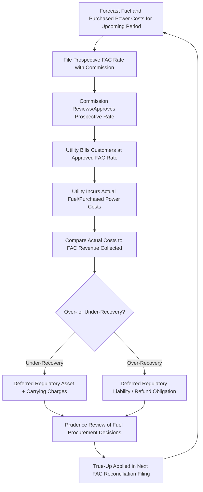
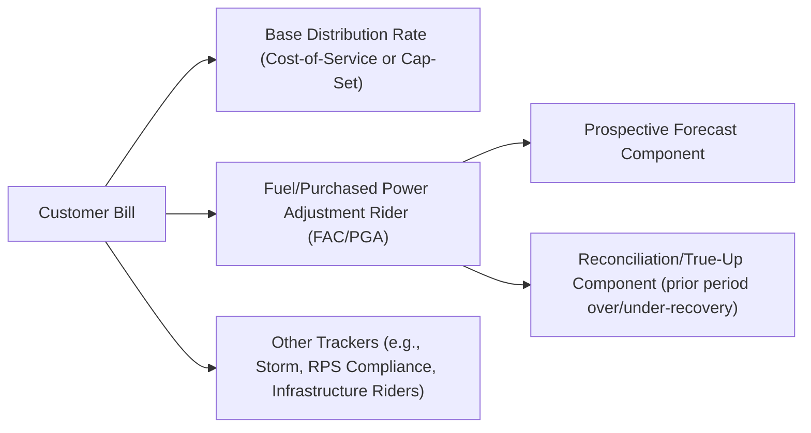

## Fuel and Purchased Power Adjustment Clauses

### Overview

Fuel and Purchased Power Adjustment Clauses (FAC/PPAC, also called fuel adjustment clauses, energy cost adjustment clauses, or purchased power cost recovery mechanisms) are single-issue ratemaking tools that allow a utility to recover the cost of fuel and purchased power outside of a full base rate case, through a periodically adjusted rider or surcharge. These mechanisms exist because fuel and purchased power costs are volatile, driven by commodity markets, weather, and dispatch conditions largely outside utility management control, and can constitute a large share of total revenue requirement (particularly for generation-owning electric utilities and gas local distribution companies).

### Regulatory Rationale

Under strict cost-of-service ratemaking, fuel costs would be embedded in base rates and remain frozen between rate cases. Because fuel and purchased power prices fluctuate far more rapidly and unpredictably than base O&M or capital costs, a frozen embedded fuel rate creates two problems:

- **Utility solvency/cash-flow risk**: If fuel prices rise sharply between rate cases, the utility may be forced to buy fuel at a cost far above what is embedded in frozen rates, straining liquidity and threatening financial integrity.
- **Ratepayer overpayment risk**: If fuel prices fall, customers would continue paying an embedded rate reflecting higher historical costs until the next rate case.

FACs address this by allowing near-real-time (monthly, quarterly, or annual) pass-through of actual, prudently incurred fuel and purchased power costs, subject to regulatory review, without requiring a full base rate proceeding for this single cost category. This is the archetypal "single-issue ratemaking" mechanism referenced throughout this chapter — it isolates one volatile cost element from the broader revenue requirement and allows it to move independently and more frequently than other rate components.

### Basic Mechanical Structure

#### Components Recovered

Typically includes:

- Cost of fuel burned at utility-owned generating stations (coal, natural gas, oil, nuclear fuel amortization)
- Cost of purchased power (energy purchased from the wholesale market, power purchase agreements, or affiliate transactions)
- Transportation/transmission costs associated with delivering fuel to generating stations (sometimes included, sometimes separately trackered)
- Costs/proceeds from off-system sales and wholesale market transactions (often netted against fuel costs)
- Hedging/derivative gains and losses related to fuel procurement (subject to prudence review of the hedging program itself)

#### Typical Exclusions

- Base O&M costs of generation, transmission, and distribution
- Capital costs (depreciation, return on rate base) — these remain in base rates
- Costs associated with imprudent fuel procurement, environmental violations, or excessive plant outages attributable to utility mismanagement (subject to prudence review, described below)

#### Basic Formula

$$FAC_t = \frac{Actual\ Fuel\ \&\ Purchased\ Power\ Cost_t - Base\ Fuel\ Cost\ Embedded\ in\ Rates_t}{Forecasted\ or\ Billed\ Sales_t}$$

The resulting per-unit adjustment ($/kWh or $/Mcf) is added to (or subtracted from) the customer's base energy charge as a separate line-item rider, commonly labeled on the bill as a "fuel adjustment charge," "energy cost adjustment," or "purchased gas adjustment" (PGA) for gas utilities.

### Reconciliation and True-Up Mechanics

Because the adjustment is typically set prospectively using a forecast (to avoid billing lag), FACs almost universally include a **true-up/reconciliation mechanism** to correct for forecast error, structured much like the balancing accounts used in revenue cap decoupling:

$$Deferred\ Balance_t = Actual\ Fuel\ Cost_t - Revenue\ Collected\ via\ FAC_t$$

This deferred (or over-collected) balance is carried on the utility's books, typically accruing carrying charges (interest) at a rate set by the commission (often the utility's short-term borrowing rate or authorized rate of return), and is refunded to or recovered from customers in a subsequent reconciliation period.

**Example**

A gas LDC's Purchased Gas Adjustment (PGA) rider is set prospectively at $0.42/therm based on a forecast NYMEX-linked gas price. Over the reconciliation period, actual weighted average gas supply cost comes in at $0.47/therm on billed volume of 50 million therms.

$$Under\text{-}recovery = (\$0.47 - \$0.42) \times 50{,}000{,}000\ \text{therms} = \$2{,}500{,}000$$

This $2.5 million under-recovery is deferred as a regulatory asset and recovered from customers in the subsequent PGA reconciliation filing, typically with interest accrued at the commission-approved carrying charge rate.

### FAC Cycle Diagram

### Prudence Review

**Key Points**

Because FACs allow largely automatic pass-through of costs, regulators typically retain a **prudence review** function, either through periodic FAC reconciliation proceedings or dedicated fuel procurement audits, to ensure costs were reasonably incurred. Common elements of prudence review include:

- Evaluation of fuel procurement strategy (spot market purchases vs. long-term contracts vs. hedging instruments) against a "reasonable utility management" standard at the time decisions were made (not with hindsight)
- Review of plant heat rates, outage rates, and dispatch decisions affecting fuel consumption efficiency
- Review of affiliate transactions (fuel supplied by an affiliated mining, production, or marketing entity) for evidence of self-dealing or above-market pricing
- Disallowance of costs found imprudent — these costs are excluded from recovery and absorbed by shareholders rather than passed to customers

**[Inference]** The prudence standard is generally applied retrospectively but judged against the information reasonably available to utility management at the time the decision was made, rather than through hindsight bias, though the precise evidentiary standard and burden of proof allocation varies by jurisdiction.

### Fuel Cost Hedging Programs

Many utilities operate commission-approved hedging programs (using futures, forwards, swaps, or options on natural gas or fuel oil) to reduce fuel price volatility passed through the FAC. Hedging program treatment typically involves:

- Pre-approval of a hedging plan/strategy (percentage of load hedged, instrument types, counterparty credit standards)
- Recovery of hedging costs (premiums, realized losses) and pass-through of hedging gains through the FAC
- Prudence review of hedging outcomes based on adherence to the approved strategy rather than after-the-fact profitability (since hedging is explicitly a volatility-reduction tool, not a profit center)

### Purchased Power Cost Recovery Nuances

For utilities with significant purchased power (as opposed to owned generation), the FAC/PPAC must also address:

- **Capacity payments vs. energy payments**: Purchased power agreements often bifurcate fixed capacity charges (payment for available capacity regardless of dispatch) from variable energy charges (payment for actual energy delivered); jurisdictions vary on whether capacity payments are recovered through the FAC or through base rates.
- **Affiliate power purchases**: Purchases from affiliated generation subsidiaries receive heightened scrutiny for above-market pricing (self-dealing risk), often subject to competitive bidding or benchmark pricing requirements.
- **Renewable energy purchase agreements**: Costs of PPAs for wind, solar, or other renewable resources are frequently recovered through the FAC or a dedicated renewable energy rider, especially where such purchases stem from a renewable portfolio standard (RPS) compliance obligation, discussed in the trackers/riders context of RPS compliance cost recovery.

### Variants Across Utility Types

| Utility Type | Mechanism Name (Common) | Key Feature |
| --- | --- | --- |
| Vertically integrated electric utility | Fuel Adjustment Clause (FAC) / Energy Cost Recovery (ECR) | Recovers fuel burned at owned plants plus purchased power |
| Restructured/retail-choice electric utility (distribution-only) | Power Supply Cost Recovery / Standard Offer Service rider | Recovers wholesale energy procurement cost for default/standard service customers only |
| Gas local distribution company (LDC) | Purchased Gas Adjustment (PGA) / Gas Cost Recovery (GCR) | Recovers commodity gas supply cost; distribution margin remains in base rates |
| Utility with significant renewable PPA portfolio | Renewable Energy Adjustment / Green Tariff Rider | Often separately trackered from conventional fuel costs |

### Diagram: Bill Component Structure with FAC

### SVG Illustration: FAC Volatility vs Base Rate Stability (svg_diagram)

<svg xmlns="http://www.w3.org/2000/svg" viewBox="0 0 720 380" font-family="Helvetica, Arial, sans-serif">
<text x="360" y="24" text-anchor="middle" font-size="16" font-weight="bold" fill="#1a1a1a">Fuel Adjustment Clause Rate vs Base Rate Over Time (svg_diagram)</text>
<line x1="80" y1="320" x2="680" y2="320" stroke="#333" stroke-width="2" />
<line x1="80" y1="320" x2="80" y2="60" stroke="#333" stroke-width="2" />
<text x="380" y="355" text-anchor="middle" font-size="13" fill="#333">Time (Monthly Billing Periods)</text>
<text x="30" y="190" text-anchor="middle" font-size="13" fill="#333" transform="rotate(-90 30 190)">Rate Component ($/unit)</text>

<line x1="120" y1="250" x2="380" y2="250" stroke="#2563eb" stroke-width="3" />
<line x1="380" y1="250" x2="380" y2="230" stroke="#2563eb" stroke-width="3" stroke-dasharray="2,2" />
<line x1="380" y1="230" x2="640" y2="230" stroke="#2563eb" stroke-width="3" />
<text x="450" y="215" font-size="12" fill="#2563eb" font-weight="bold">Base Rate (adjusts only at rate case)</text>

<polyline points="120,180 150,160 180,190 210,140 240,175 270,120 300,150 330,200 360,170 390,130 420,160 450,110 480,145 510,190 540,155 570,100 600,140 630,175" stroke="`#dc2626`" stroke-width="2.5" fill="none" />

<text x="450" y="90" font-size="12" fill="`#dc2626`" font-weight="bold">FAC/PGA Rider (adjusts monthly/quarterly with commodity cost)</text>

<line x1="380" y1="60" x2="380" y2="320" stroke="#999" stroke-dasharray="4,4" />
<text x="380" y="335" text-anchor="middle" font-size="11" fill="#666">Rate Case Reset</text>
</svg>

### Interaction with Alternative Regulation Mechanisms

**[Inference]** Fuel and purchased power costs are typically excluded from price cap and revenue cap formula indices (discussed elsewhere in this chapter) and carved out into a separate FAC/PPAC pass-through, since including a volatile, largely uncontrollable commodity cost inside a productivity-adjusted formula index would distort the formula's intended incentive properties; jurisdictions vary in exactly how the carve-out is implemented (fully separate rider vs. partial inclusion with a commodity-specific Z-factor treatment).

### Consumer Protection and Transparency Provisions

**Key Points**

- Many jurisdictions require the FAC/PGA rate and its components to be itemized separately on customer bills for transparency, distinguishing the volatile pass-through from the stable base rate.
- Some jurisdictions cap the frequency or magnitude of FAC rate changes (e.g., no more than quarterly adjustment, or a percentage cap on single-period rate change) to limit bill volatility/"rate shock," with any excess deferred to a subsequent period.
- Low-income and vulnerable customer protections (payment plans, arrearage management, winter disconnection moratoria) are frequently linked administratively to FAC-driven bill spikes during high fuel-price periods.
- Annual or periodic comprehensive fuel cost audits (sometimes performed by independent outside auditors on behalf of the commission) supplement the ongoing prudence review function.

### Common Points of Regulatory Dispute

- **Forecast accuracy incentives**: Because the FAC is typically cost-plus with reconciliation, the utility bears limited risk from forecast error (customers absorb over/under-recovery with interest), which critics argue weakens forecasting discipline and cost-minimization incentive; some jurisdictions address this by disallowing carrying charges on utility forecast errors exceeding a materiality threshold.
- **Sharing mechanisms**: Some jurisdictions impose an incentive/sharing mechanism on fuel procurement performance (e.g., utility retains a percentage of savings achieved below a benchmark index price, or absorbs a percentage of costs above the benchmark) to restore some cost-minimization incentive within an otherwise pass-through mechanism — effectively grafting a performance incentive onto a purely cost-based tracker.
- **Definitional scope creep**: Disputes frequently arise over whether certain costs (e.g., environmental compliance costs tied to fuel combustion, transportation/pipeline demand charges, or trading desk overhead) properly belong in the FAC or in base rates.

### Conclusion

Fuel and Purchased Power Adjustment Clauses are the paradigmatic single-issue ratemaking mechanism: they isolate a specific, volatile, largely uncontrollable cost category from the broader base rate structure and allow near-real-time, formula-driven recovery subject to periodic reconciliation and prudence review. This protects utility financial integrity from commodity price swings while aiming to ensure customers pay actual incurred costs rather than a stale embedded estimate. The mechanism's core tension is between administrative efficiency (avoiding a full rate case for a volatile cost) and maintaining sufficient cost-minimization incentive and prudence oversight, which regulators address through reconciliation with carrying charges, periodic audits, and in some jurisdictions explicit performance-sharing provisions layered onto the pass-through.

**Related Topics**

- Prudence Review Standards in Cost Recovery Proceedings
- Renewable Portfolio Standard Compliance Cost Trackers
- Storm Cost and Catastrophe Cost Recovery Riders
- Revenue Decoupling and Balancing Account Mechanics
- Hedging Program Design and Prudence Evaluation
- Affiliate Transaction Review and Cost Allocation Manuals
- Capital Cost Trackers (Infrastructure Replacement Riders)
- Price Cap and Revenue Cap Regulation (index exclusions for fuel costs)
- Rate Shock Mitigation and Deferral Mechanisms
- Low-Income Customer Protections and Arrearage Management Programs