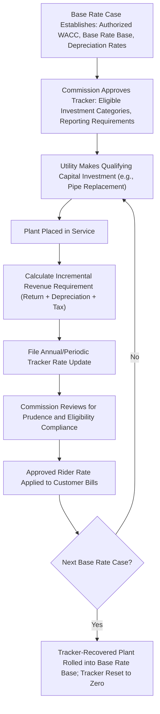
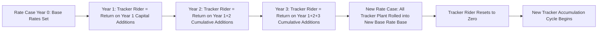
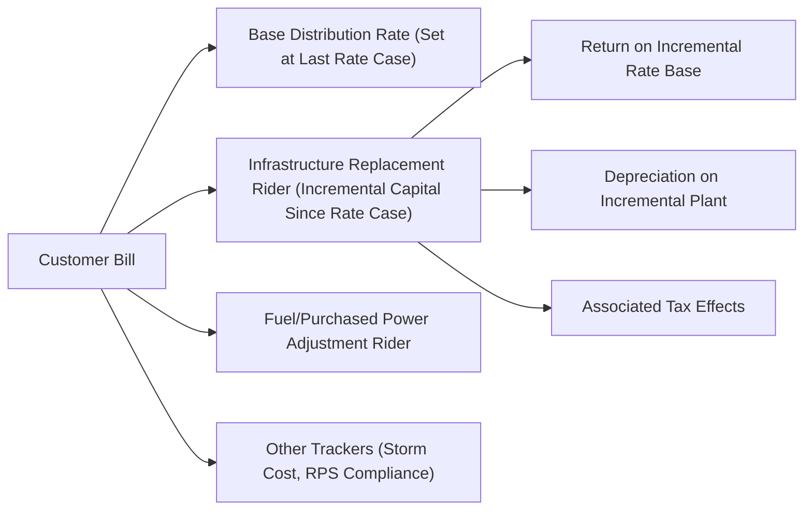

## Infrastructure Replacement Riders and Capital Trackers

### Overview

Infrastructure Replacement Riders and Capital Trackers are single-issue ratemaking mechanisms that allow a utility to recover the revenue requirement associated with specific, defined categories of capital investment — most commonly pipe replacement, distribution system hardening, and grid modernization — outside of a full base rate case, through periodic (typically annual) rider adjustments. Unlike the Fuel and Purchased Power Adjustment Clauses discussed elsewhere in this chapter, which pass through volatile operating costs, capital trackers address a different regulatory lag problem: the multi-year gap between when a utility makes qualifying capital expenditures and when those investments are reflected in base rates through a traditional rate case.

### Regulatory Rationale

Between base rate cases, a utility's rate base is effectively frozen at the level established in the last approved case, even though the utility continues to invest capital in plant that provides safety, reliability, and service benefits to customers. This creates a structural problem specific to capital-intensive infrastructure replacement programs:

- **Regulatory lag discourages accelerated replacement**: If a utility cannot earn a current return on new infrastructure investment until the next full rate case (which may be several years away), it faces a strong financial disincentive to accelerate replacement of aging, leaking, or unsafe infrastructure (most acutely relevant for aging cast-iron and bare-steel gas distribution mains).
- **Public safety urgency**: Certain infrastructure categories (leak-prone gas pipe, aging water mains, storm-vulnerable overhead distribution lines) carry safety and reliability urgency that regulators wish to accelerate rather than leave to the discretion of rate case timing.
- **Rate case cost/frequency tradeoff**: Filing a full rate case every time a discrete capital program needs cost recovery is administratively inefficient; a tracker allows the specific, well-defined capital category to be reviewed and adjusted on a lighter administrative track while base rates remain stable for other cost elements.

Capital trackers directly respond to this lag by allowing the utility to earn a return on and recover depreciation of new, qualifying capital investment as it is placed in service, without waiting for the next general rate case.

### Basic Mechanical Structure

#### Eligible Investment Categories (Illustrative)

- Gas distribution: replacement of cast-iron, bare-steel, and other leak-prone pipe (often mandated or incentivized by pipeline safety statutes)
- Electric distribution: grid modernization, advanced metering infrastructure (AMI), distribution automation, vegetation management tied to reliability, storm hardening/resiliency investment
- Water/wastewater: main replacement, treatment plant upgrades, lead service line replacement
- Transmission: reliability-driven transmission investment (sometimes recovered through FERC-jurisdictional formula rates rather than state trackers)

#### Revenue Requirement Formula for the Tracker

The incremental revenue requirement associated with tracker-eligible capital is calculated using the standard rate base/rate of return formula, applied specifically to the incremental (post-base-rate-case) capital additions:

$$RR_{tracker,t} = (RB_{tracker,t} \times WACC) + D_{tracker,t} + T_{tracker,t}$$

Where:

- $RB_{tracker,t}$ = incremental net rate base attributable to tracker-eligible plant placed in service since the last base rate case, net of accumulated depreciation on that plant
- $WACC$ = the utility's commission-authorized weighted average cost of capital (established in the base rate case and typically held fixed for the tracker's duration)
- $D_{tracker,t}$ = depreciation expense on the incremental tracker-eligible plant
- $T_{tracker,t}$ = associated income tax effects (grossed-up for taxes on the return component)

The resulting incremental revenue requirement is divided by billed units (or number of customers) to produce a per-unit or per-customer rider charge, similar in form to the FAC rider but tied to capital cost recovery rather than commodity fuel cost pass-through.

$$Rider\ Rate_t = \frac{RR_{tracker,t}}{Billed\ Units_t\ (or\ Customers_t)}$$

### Numerical Example

**Example**

A gas LDC's approved Infrastructure Replacement Rider covers cast-iron main replacement completed since the last base rate case. In the current tracker year, the utility places $40 million of qualifying pipe replacement into service (net of $3 million in retired plant removal costs recovered separately). The commission-authorized WACC from the last rate case is 7.2%, and the composite depreciation rate for the replaced pipe is 2.5% annually. The utility's effective tax gross-up factor for the return component is 1.28 (reflecting federal and state income tax effects).

$$Return\ Component = \$40{,}000{,}000 \times 7.2\% \times 1.28 = \$3{,}686{,}400$$

$$Depreciation\ Component = \$40{,}000{,}000 \times 2.5\% = \$1{,}000{,}000$$

$$RR_{tracker} = \$3{,}686{,}400 + \$1{,}000{,}000 = \$4{,}686{,}400$$

If the utility serves 800,000 customers, the incremental monthly rider charge per customer is:

$$Rider\ Rate = \frac{\$4{,}686{,}400}{800{,}000\ \text{customers} \times 12\ \text{months}} \approx \$0.49\ \text{per customer per month}$$

### Capital Tracker Mechanics Diagram

### Rolling Tracker Investment into Base Rates

A defining structural feature of capital trackers is the **periodic reset mechanism**: at each subsequent full base rate case, the plant that had been recovered through the tracker is rolled into the base rate base, the tracker rider is reset to zero, and the tracker begins accumulating new incremental investment made since that rate case. This prevents indefinite rider growth and ensures the full revenue requirement (including the tracker-recovered plant) is periodically re-examined comprehensively, including updated depreciation studies, updated cost of capital, and a fresh test-year review of all cost elements together.

### Eligibility Caps and Programmatic Limits

**Key Points**

- **Annual investment caps**: Many tracker statutes/orders impose an annual dollar cap on eligible investment (e.g., a maximum $X million per year) to prevent the tracker from becoming a substitute for comprehensive rate case review of the utility's entire capital program.
- **Percentage-of-revenue caps**: Some jurisdictions cap the tracker rider at a maximum percentage of a customer's bill (e.g., no more than 3-5% surcharge) to limit bill impact/rate shock outside the scrutiny of a full rate case.
- **Sunset provisions**: Many infrastructure replacement rider statutes include sunset dates or mandatory rate case filing triggers (e.g., a base rate case must be filed within a specified number of years of tracker implementation) to ensure the mechanism does not permanently substitute for comprehensive review.
- **Eligibility scope limitations**: Trackers are typically restricted to specific, statutorily or commission-defined investment categories (e.g., "safety-related pipe replacement" only, excluding general system expansion, new customer connections, or discretionary growth capital), to prevent scope creep into ordinary capital additions that should await a base rate case.

### Prudence and Reasonableness Review

Similar in principle to FAC prudence review, capital trackers are subject to periodic audit and reasonableness review, typically addressing:

- Whether investment was made within the statutorily/commission-defined eligible category
- Whether costs were reasonably and prudently incurred (competitive procurement, project management, cost overrun review)
- Whether the pace and prioritization of replacement follows a commission-approved long-term infrastructure replacement plan (many jurisdictions require utilities to file a multi-year replacement plan, e.g., a "Long-Term Infrastructure Improvement Plan" or "Distribution System Improvement Charge" plan, identifying which segments of pipe or grid assets will be replaced and in what sequence)
- Reconciliation of forecasted vs. actual capital spending, with disallowance of costs found imprudent

### Naming Conventions Across Jurisdictions

| Utility Type | Common Mechanism Name | Typical Scope |
| --- | --- | --- |
| Gas distribution | Distribution System Improvement Charge (DSIC) | Cast-iron/bare-steel main replacement, leak-prone pipe |
| Gas distribution | Infrastructure Replacement Rider / Pipeline Safety Rider | Similar scope, safety-driven replacement |
| Electric distribution | Grid Modernization / Grid Resiliency Charge | AMI, automation, storm hardening |
| Water/wastewater | Distribution System Improvement Charge (DSIC), Qualified Infrastructure Plant (QIP) | Main replacement, lead service line removal |
| Transmission (FERC) | Formula Rate with capital cost true-up | Reliability-driven transmission investment |

### Relationship to Formula Rate Plans

**[Inference]** Capital trackers share conceptual DNA with the Formula Rate Plans referenced in the price cap/revenue cap chapter — both substitute a lighter-weight, periodic formula-driven update for a full rate case — but they differ in that trackers are typically narrowly scoped to a specific, defined capital investment category (e.g., pipe replacement only), while formula rate plans generally reset the *entire* revenue requirement (all costs, not just a single capital program category) annually using a formulaic template; jurisdictions vary in how cleanly this distinction is maintained in practice, and some formula rate plans effectively subsume what would otherwise be a standalone capital tracker.

### Diagram: Bill Component Structure with Capital Tracker

### SVG Illustration: Capital Tracker Rider Growth Between Rate Cases (svg_diagram)

<svg xmlns="http://www.w3.org/2000/svg" viewBox="0 0 720 380" font-family="Helvetica, Arial, sans-serif">
<text x="360" y="24" text-anchor="middle" font-size="16" font-weight="bold" fill="#1a1a1a">Infrastructure Tracker Rider Accumulation and Reset (svg_diagram)</text>
<line x1="80" y1="320" x2="680" y2="320" stroke="#333" stroke-width="2" />
<line x1="80" y1="320" x2="80" y2="60" stroke="#333" stroke-width="2" />
<text x="380" y="355" text-anchor="middle" font-size="13" fill="#333">Time (Years)</text>
<text x="30" y="190" text-anchor="middle" font-size="13" fill="#333" transform="rotate(-90 30 190)">Cumulative Rider Revenue Requirement</text>

<line x1="120" y1="300" x2="280" y2="230" stroke="#dc2626" stroke-width="3" />
<line x1="280" y1="230" x2="280" y2="300" stroke="#999" stroke-width="2" stroke-dasharray="3,3" />
<text x="180" y="290" font-size="10" fill="#dc2626">Tracker accumulates</text>

<line x1="280" y1="300" x2="440" y2="200" stroke="#dc2626" stroke-width="3" />
<line x1="440" y1="200" x2="440" y2="300" stroke="#999" stroke-width="2" stroke-dasharray="3,3" />
<text x="340" y="270" font-size="10" fill="#dc2626">Tracker accumulates again</text>

<line x1="440" y1="300" x2="620" y2="170" stroke="#dc2626" stroke-width="3" />

<line x1="280" y1="60" x2="280" y2="320" stroke="#2563eb" stroke-dasharray="5,3" />
<text x="280" y="345" text-anchor="middle" font-size="10" fill="#2563eb">Rate Case (roll-in)</text>
<line x1="440" y1="60" x2="440" y2="320" stroke="#2563eb" stroke-dasharray="5,3" />
<text x="440" y="345" text-anchor="middle" font-size="10" fill="#2563eb">Rate Case (roll-in)</text>
</svg>

### Consumer Protection and Policy Debate

**Key Points**

- **Return-only-on-plant-in-service concern**: Consumer advocates frequently argue that trackers grant utilities a "one-way ratchet" — recovering return and depreciation on new capital promptly, while offsetting cost reductions, revenue growth, or expense savings that would otherwise offset the need for the increase are not symmetrically trued up until the next full rate case.
- **Earnings test / cap on tracker utilization**: Some jurisdictions require that a tracker rider be suspended or reduced if the utility's overall earned ROE (across base rates plus all trackers) exceeds its authorized ROE by a specified margin, to prevent trackers from becoming a vehicle for consistent over-earning.
- **Mandatory infrastructure replacement plans**: To justify tracker treatment, many statutes require utilities to file and receive approval for a long-term (often 10-20 year) infrastructure replacement plan identifying the full scope, sequencing, and total cost of the replacement program, providing the commission a comprehensive planning-level review even though individual annual tracker filings are administratively lighter.
- **Accelerated safety benefit**: Proponents (including safety regulators) point to the demonstrated acceleration of leak-prone pipe replacement in jurisdictions that adopted infrastructure trackers as the primary policy justification, given the public safety consequences of gas pipeline leaks specifically. **[Unverified]** The magnitude of replacement-pace acceleration attributable specifically to tracker adoption versus other contemporaneous safety regulation varies by study and jurisdiction and is not asserted here as a fixed figure.

### Conclusion

Infrastructure Replacement Riders and Capital Trackers address the capital-cost analog of the regulatory lag problem that Fuel and Purchased Power Adjustment Clauses address for operating costs: they allow timely recovery of return and depreciation on a narrowly defined category of ongoing capital investment without waiting for the next full base rate case. The mechanism is structurally periodic and self-resetting — tracker-recovered plant is rolled into base rates at each subsequent rate case, and the tracker begins accumulating anew — which distinguishes it from a permanent, open-ended surcharge. Its design tensions center on eligibility scope (preventing scope creep into ordinary capital additions), earnings symmetry (preventing one-way ratchets that decouple tracker recovery from overall earnings performance), and the balance between administrative efficiency and the comprehensive scrutiny a full rate case provides.

**Related Topics**

- Distribution System Improvement Charges (DSIC) in Gas and Water Utilities
- Long-Term Infrastructure Replacement Plan Filings
- Formula Rate Plans and Their Relationship to Capital Trackers
- Earnings Test and ROE Symmetry Provisions on Trackers
- Rate Base and Weighted Average Cost of Capital Fundamentals
- Depreciation Study Methodology for Tracker-Eligible Plant
- Fuel and Purchased Power Adjustment Clauses (operating-cost analog)
- Prudence Review Standards in Capital Cost Recovery
- Pipeline Safety Regulation and Leak-Prone Pipe Replacement Mandates
- Rate Case Sunset and Mandatory Filing Trigger Provisions