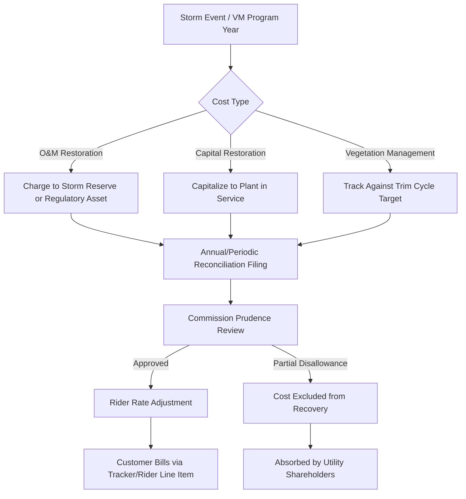

## Storm Cost and Vegetation Management Trackers

### Overview

Storm cost and vegetation management trackers are single-issue ratemaking mechanisms that allow utilities to recover specific, often volatile, categories of expense outside the constraints of a traditional base rate case. Both mechanisms address costs that are difficult to forecast accurately in a test year (storm costs) or that regulators want to incentivize and monitor separately due to public safety implications (vegetation management, i.e., tree trimming and right-of-way clearing near power lines).

These trackers exist because traditional cost-of-service ratemaking, which sets rates based on a historical or forward test year, performs poorly when costs are (a) highly variable year-to-year, (b) driven by exogenous events outside utility control, or (c) tied to public safety outcomes that regulators want to track with granularity exceeding what a general rate case affords.

### Regulatory Rationale

**Key Points**

- **Matching principle**: Storm costs in particular violate the matching principle underlying test-year ratemaking. A single major hurricane or ice storm can generate restoration costs equal to several years of "normal" O&M, making any single test year unrepresentative.
- **Symmetry and regulatory lag**: Without a tracker, a utility facing an unusually severe storm year absorbs the cost until the next rate case (creating cash flow and earnings pressure), while a utility with an unusually mild storm year enjoys a windfall it did not need to justify to anyone. Trackers correct this asymmetry in both directions when properly designed.
- **Wildfire and safety pressure**: In wildfire-prone jurisdictions (California, and increasingly the Pacific Northwest, Colorado, and parts of Texas), vegetation management has shifted from an ordinary O&M line item to a safety-critical, heavily scrutinized program subject to its own tracker, compliance filing, and sometimes a dedicated Wildfire Mitigation Plan (WMP) proceeding.
- **Prudence review substitutes for forecasting risk**: Trackers shift the regulatory question from "was the *forecast* reasonable?" (asked in a rate case) to "was the *spending* prudent and the *amount* accurate?" (asked in a reconciliation or prudence proceeding).

### Storm Cost Trackers

#### Defining "Storm Costs"

Storm costs typically fall into two accounting buckets, and the tracker's design depends heavily on which bucket applies:

- **O&M storm restoration costs** — labor (including mutual aid crews from other utilities), contractor costs, equipment rental, and materials consumed in emergency restoration. These are expensed in the period incurred under GAAP/FERC USofA unless capitalized.
- **Capital storm restoration costs** — replacement of poles, transformers, conductors, and other plant destroyed or damaged by the storm. These are capitalized and enter rate base through normal (or accelerated) depreciation, sometimes with a separate storm-capital rider.

#### Mechanism Types

**Storm Reserve (Accrual) Mechanism**

The utility accrues a normalized annual amount into a regulatory liability (a "storm reserve") based on a rolling historical average of storm costs (e.g., 5- or 10-year average). Actual storm costs are charged against the reserve as incurred.

- If actual costs exceed the reserve balance, the utility records a regulatory asset (deferred storm costs) for the shortfall, to be recovered from customers later (often via securitization or a rate case).
- If actual costs run below the accrual, the reserve balance grows, cushioning future storm years.
- This mechanism smooths customer rates and stabilizes utility cash flow but requires an ongoing account reconciliation and audit process.

**Storm Cost Deferral with Rider Recovery**

Rather than pre-funding a reserve, some jurisdictions allow the utility to defer major storm costs as they occur (recording a regulatory asset under ASC 980 / FERC accounting) and then recover the deferred balance through a dedicated rider over a specified amortization period (commonly 3–10 years), subject to a prudence review.

**Securitization (Storm Recovery Bonds)**

For catastrophic events (major hurricanes, ice storms), several states (Florida, Louisiana, Texas) authorize utilities to securitize storm restoration costs — issuing utility-backed bonds at a low, asset-backed interest rate, repaid via a dedicated, non-bypassable tariff charge over 10–20 years. This lowers the carrying cost to customers relative to recovery through the utility's weighted average cost of capital (WACC), because securitized debt is rated based on the tariff's legal structure rather than the utility's general credit.

$$\text{Securitized Rate Component} = \frac{\text{Bond Debt Service}}{\text{Billing Determinant (kWh or customer count)}}$$

**Storm Cost Cap / Deductible Mechanisms**

Some tracker designs impose a materiality threshold (a "deductible") below which storm costs are absorbed in normal base rates, and only costs above the threshold flow into the tracker. This discourages the tracker from becoming a catch-all for routine weather-related maintenance.

#### Prudence Review Elements

**Key Points**

- **Classification review**: auditors verify costs are genuinely storm-related and correctly split between O&M and capital, since misclassification shifts costs between immediate expensing and rate-base treatment.
- **Mutual aid cost review**: confirms rates paid to visiting utility crews are consistent with industry mutual-aid agreements (e.g., Edison Electric Institute mutual assistance frameworks) and not inflated.
- **Restoration performance review**: some commissions tie recovery partially to restoration-time benchmarks (e.g., percentage of customers restored within 48/72/96 hours), introducing a performance-based element into an otherwise cost-based tracker.
- **Duplicate recovery check**: ensures costs aren't recovered twice — once through insurance proceeds or FEMA reimbursement, and again through the tracker.

### Vegetation Management Trackers

#### Why Vegetation Management Gets Separate Treatment

Vegetation management (VM) — tree trimming, herbicide application, right-of-way (ROW) clearing — is one of the largest controllable O&M categories for a T&D utility and is directly linked to two adverse outcomes regulators care about intensely:

1. **Reliability**: tree contact with lines is consistently among the top causes of unplanned outages (SAIDI/SAIFI degradation).
2. **Wildfire ignition risk**: vegetation contact with energized conductors is a leading ignition cause in wildfire-prone service territories.

Because underspending on VM produces deferred, difficult-to-observe risk (a "ticking clock" problem) while overspending is easy for auditors to flag as imprudent, regulators increasingly prefer a dedicated tracker with an associated performance obligation over folding VM into general O&M.

#### Mechanism Types

**Cost Tracker with Cycle-Based Trim Targets**

The utility commits to a trim cycle (e.g., trim each circuit-mile every 3–5 years) and recovers costs via a tracker tied to miles trimmed and/or circuits addressed, rather than a flat dollar allowance. Under-trimming relative to the committed cycle can result in disallowance of the associated cost recovery or a penalty in the next rate case.

**Enhanced Vegetation Management (EVM) Riders**

In wildfire-risk areas, utilities may run two parallel VM programs: (1) routine/base VM funded in normal rates, and (2) an "enhanced" program (wider clearance distances, more frequent cycles in high-fire-threat districts) funded through an incremental rider, often tied to a state-approved Wildfire Mitigation Plan.

**Performance-Based Vegetation Management Metrics**

**Key Points**

- **Circuit-miles trimmed** vs. **planned circuit-miles** — completion ratio
- **Tree-related outage count/SAIFI contribution** — trend and target
- **Cost per circuit-mile** — benchmarked against comparable utilities to detect cost escalation
- **Backlog aging** — miles overdue relative to the committed cycle, an indicator of deferred risk accumulation

**Example**

A utility commits to trimming 2,000 circuit-miles annually under a 4-year cycle (8,000 total circuit-miles). The tracker mechanism might work as follows:

- Approved unit cost: $8,500 per circuit-mile (established in the tracker filing)
- Annual target: 2,000 circuit-miles × $8,500 = $17,000,000 recoverable revenue requirement
- Actual completion: 1,850 circuit-miles at $9,100,000 actual cost
- Completion shortfall: 150 circuit-miles (7.5% under target)
- Regulatory treatment: commission may allow full actual cost recovery if shortfall is explained by a documented cause (e.g., permitting delays, contractor labor shortage) but flag the backlog for accelerated completion the following year; alternatively, it may apply a proportional disallowance if the shortfall reflects discretionary deferral.

#### Cost Recovery Structure

Both O&M-based VM tracker costs and capital costs associated with VM programs (e.g., LiDAR-based vegetation encroachment surveys, GIS asset mapping) may be split:

$$\text{Total VM Revenue Requirement} = \text{O\&M Trim Costs} + \left( \text{Capital Additions} \times \text{Revenue Requirement Factor} \right)$$

Where the revenue requirement factor incorporates return on rate base, depreciation, and taxes for capitalized VM-related assets (e.g., aerial LiDAR systems, vegetation management software).

### Combined Storm and Vegetation Trackers in Practice

Several jurisdictions have moved toward integrated "Storm and Wildfire Mitigation" trackers that jointly cover:

- Storm hardening capital (undergrounding, pole strengthening, covered conductor)
- Enhanced vegetation management in high-fire-threat districts
- Storm restoration O&M
- Wildfire liability insurance cost recovery (in states like California, insurance premium increases are themselves sometimes trackable)

This bundling reflects the reality that storm resilience and vegetation management are functionally linked: a well-vegetation-managed system experiences fewer storm-related outages and lower restoration costs, so some commissions evaluate the two programs' cost-effectiveness jointly rather than in isolation.

### Process Flow

### Illustrative Storm Reserve Mechanics (SVG)

<svg xmlns="http://www.w3.org/2000/svg" viewBox="0 0 700 400">
<text x="350" y="25" font-size="16" font-weight="bold" text-anchor="middle" fill="#1a1a1a">Storm Reserve Balance Over Time (svg_diagram)</text>
<line x1="60" y1="340" x2="650" y2="340" stroke="#333" stroke-width="2" />
<line x1="60" y1="340" x2="60" y2="50" stroke="#333" stroke-width="2" />
<text x="30" y="345" font-size="11" fill="#333">$0</text>
<text x="20" y="200" font-size="11" fill="#333">Reserve</text>
<text x="355" y="375" font-size="12" fill="#333" text-anchor="middle">Year</text>

<polyline points="60,250 150,220 240,180 330,340 420,300 510,260 600,230" fill="none" stroke="`#2166ac`" stroke-width="2.5" />

<circle cx="60" cy="250" r="4" fill="#2166ac" />
<circle cx="150" cy="220" r="4" fill="#2166ac" />
<circle cx="240" cy="180" r="4" fill="#2166ac" />
<circle cx="330" cy="340" r="4" fill="#b2182b" />
<circle cx="420" cy="300" r="4" fill="#2166ac" />
<circle cx="510" cy="260" r="4" fill="#2166ac" />
<circle cx="600" cy="230" r="4" fill="#2166ac" />

<text x="60" y="365" font-size="10" text-anchor="middle" fill="#333">Yr 1</text>

<text x="150" y="365" font-size="10" text-anchor="middle" fill="#333">Yr 2</text>

<text x="240" y="365" font-size="10" text-anchor="middle" fill="#333">Yr 3</text>

<text x="330" y="365" font-size="10" text-anchor="middle" fill="#333">Yr 4</text>

<text x="420" y="365" font-size="10" text-anchor="middle" fill="#333">Yr 5</text>

<text x="510" y="365" font-size="10" text-anchor="middle" fill="#333">Yr 6</text>

<text x="600" y="365" font-size="10" text-anchor="middle" fill="#333">Yr 7</text>

<text x="330" y="365" font-size="10" text-anchor="middle" fill="`#b2182b`" dy="14">Major Storm</text>

<line x1="60" y1="200" x2="650" y2="200" stroke="#888" stroke-width="1" stroke-dasharray="4,4" />
<text x="600" y="195" font-size="10" fill="#666">Target Reserve Level</text>

<text x="80" y="70" font-size="11" fill="#666">Annual accrual builds reserve; major</text>

<text x="80" y="85" font-size="11" fill="#666">storm draws it down below target,</text>

<text x="80" y="100" font-size="11" fill="#666">triggering deferral or rider recovery.</text>

</svg>

### Key Distinctions from General Rate Case Treatment

| Dimension | General Rate Case | Storm/VM Tracker |
| --- | --- | --- |
| Cost basis | Forecasted test-year average | Actual costs, reconciled periodically |
| Review frequency | Every 2–5 years (rate case cycle) | Annually or semi-annually |
| Regulatory lag | High (full test-year lag) | Low to minimal |
| Prudence review timing | Prospective (forecast reasonableness) | Retrospective (actual spending review) |
| Rate impact visibility | Bundled into base rates | Often a separate line-item rider |
| Earnings risk to utility | Volume/cost variance absorbed by shareholders until next case | Largely insulated via tracker true-up |

### Criticisms and Regulatory Tensions

**Key Points**

- **Erosion of regulatory lag as a discipline mechanism**: Traditional regulatory lag incentivizes cost control between rate cases. Trackers that provide near-dollar-for-dollar recovery reduce this incentive for the tracked cost category, a concern raised by consumer advocates and some commission staff.
- **Single-issue ratemaking objections**: Some parties argue trackers violate the principle that rates should be set holistically (matching all revenues and costs together), since a tracker adjusts one cost category outside the context of the utility's overall earned return.
- **Definitional creep risk**: Vegetation management or storm cost categories can expand over time to absorb costs that were previously funded through base rates, effectively increasing revenue without a full rate case (sometimes called "backdoor rate increases" by advocates).
- **Asymmetric risk allocation debate**: Critics argue some tracker designs protect utility earnings from downside risk (bad storm years) without a symmetric sharing mechanism for upside (mild storm years), unless an explicit sharing band or reserve true-down provision is included.

[Inference] Jurisdictions with more consumer-advocate influence in rate proceedings tend to pair storm/VM trackers with earnings sharing mechanisms or hard expenditure caps more often than jurisdictions with less adversarial rate case processes, though the specific mix varies significantly by state and is not governed by a single national standard.

### Typical Filing and Reconciliation Cycle

1. **Tracker establishment** — commission approves the tracker mechanism, base O&M allowance, and reconciliation methodology in a rate case or standalone proceeding.
2. **Annual/periodic cost accrual** — utility incurs and records storm/VM costs against the tracker.
3. **Reconciliation filing** — utility files actual costs, supporting documentation (invoices, mutual aid logs, trim-cycle completion reports), and a proposed rider rate adjustment.
4. **Intervenor discovery and audit** — commission staff and intervenors (consumer advocates, industrial customer groups) review cost detail, sometimes with a third-party audit.
5. **Prudence determination** — commission issues an order approving, disallowing, or modifying the requested recovery.
6. **Rate implementation** — approved rider rate takes effect, typically flowing through as a separate bill line item or embedded volumetric charge.

**Next Steps**

- Wildfire Mitigation Plans (WMPs) and Their Interaction with Cost Recovery
- Earnings Sharing Mechanisms and Symmetric Risk-Sharing Trackers
- Securitization of Extraordinary Utility Costs (Storm Recovery Bonds)
- Performance-Based Ratemaking (PBR) and Reliability Metrics (SAIDI/SAIFI) as Recovery Conditions
- Prudence Review Standards and Burden of Proof in Cost Recovery Proceedings
- Decoupling Mechanisms and Their Relationship to Single-Issue Trackers
- Capital Trackers for Grid Hardening and Resilience Investment