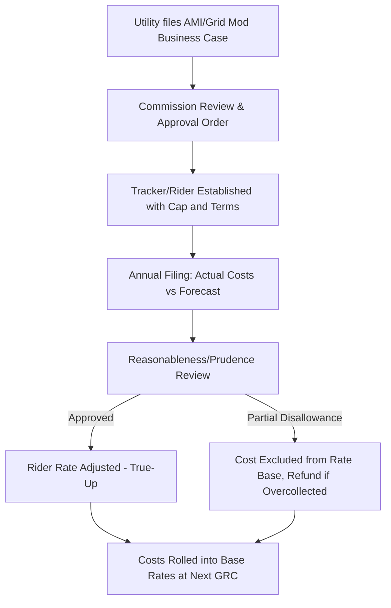

## Grid Modernization and AMI Cost Recovery Mechanisms

### Definition and Regulatory Context

Grid Modernization and AMI (Advanced Metering Infrastructure) Cost Recovery Mechanisms are specialized ratemaking tools that allow utilities to recover the costs of smart grid investments—advanced meters, distribution automation, sensors, communication networks, and grid software—outside of, or on an accelerated basis relative to, a traditional general rate case (GRC). These mechanisms exist because grid modernization capital programs are large, multi-year, and technologically dynamic, creating regulatory lag and stranded-investment risk that standard ratemaking handles poorly.

**Key Points**

- These mechanisms are a subcategory of single-issue ratemaking, alongside fuel adjustment clauses and other trackers/riders covered elsewhere in this chapter.
- They typically bypass or supplement the traditional test-year rate case, allowing near-real-time or annual cost recovery.
- They are usually authorized by statute or commission order as an exception to the general prohibition on piecemeal ratemaking (the rule that costs should be reviewed comprehensively in a GRC).

### Why Grid Modernization Needs Special Ratemaking Treatment

**Regulatory Lag Mismatch**

Traditional ratemaking sets rates based on a historical test year, then holds them fixed until the next rate case (often 3–5 years). Grid modernization investment does not fit this model well:

- Capital is front-loaded (meter deployment, network build-out) but benefits (reduced meter reading costs, outage detection, demand response enablement) accrue over many years.
- Costs escalate mid-cycle without an "attrition" adjustment mechanism.
- Absent a tracker, the utility bears the carrying cost of assets not yet in rate base, weakening the incentive to invest.

**Technology and Obsolescence Risk**

AMI meters and communication modules have functional lives (often 15–20 years) shorter than traditional T&D assets (30–50+ years). [Inference] Regulators often view standard 30+ year depreciation schedules as inappropriate for AMI assets, which creates pressure for accelerated depreciation or true-up trackers, though the specific treatment varies significantly by jurisdiction and is not a universal rule.

**Policy-Driven Deployment**

Many grid modernization programs originate from a legislative or commission policy mandate—for example, decarbonization goals requiring two-way meter communication for distributed energy resource (DER) integration, or resilience mandates following major storm events. Regulators frequently pair a policy mandate with a dedicated cost-recovery mechanism to make the mandate financeable.

### Common Mechanism Types

**1. AMI-Specific Rider / Tracker**

A dedicated rate rider that recovers the revenue requirement (return on and of capital, plus incremental O&M) associated with an AMI deployment, calculated and adjusted periodically (often annually) between rate cases.

- **Example**: A utility deploys 2 million smart meters over five years. Rather than wait for a GRC to true up capital additions each year, the commission authorizes an "AMI Cost Recovery Rider" that adjusts annually based on actual meters placed in service, subject to a revenue requirement cap and an annual reasonableness review.

**2. Grid Modernization Tracker / Rider (Broader Scope)**

Some jurisdictions authorize a broader "grid modernization" or "distribution grid plan" tracker that bundles AMI with distribution automation (reclosers, sensors, fault location), volt/VAR optimization, and grid communication/cybersecurity infrastructure, recovered through a single mechanism.

**3. Rate Base Offset / Deferral Mechanism**

Rather than a standalone rider, some commissions authorize:

- Deferred accounting treatment (a regulatory asset) for AMI costs incurred between rate cases, to be recovered (with carrying costs) in the next GRC.
- This avoids a new tracer rate line but still solves the timing mismatch by preserving the utility's right to earn a return on the deferred balance.

**4. Multi-Year Rate Plans (MYRPs) with Capital Trackers**

Under a Multi-Year Rate Plan, the commission pre-approves a capital spending forecast (including grid modernization) for a 3–5 year period, with an annual "K-factor" or formulaic true-up for actual versus forecast capital additions, often combined with a productivity offset (see the Performance-Based Regulation chapter).

**5. AMI Cost Recovery Combined with Benefit Sharing**

Because AMI enables cost savings (reduced manual meter reading, reduced truck rolls, faster outage detection), some mechanisms require the utility to net projected or realized operational savings against the capital cost recovery, either as a direct offset in the rider calculation or through an Earnings Sharing Mechanism.

### Typical Cost Recovery Formula

A simplified AMI rider revenue requirement calculation:

$$RR_{AMI} = (RB_{AMI} \times r) + D_{AMI} + O\&M_{incremental} - Savings_{O\&M}$$

Where:

- $RB_{AMI}$ = net AMI rate base (capital additions less accumulated depreciation)
- $r$ = authorized weighted average cost of capital (WACC)
- $D_{AMI}$ = depreciation expense on AMI assets
- $O\&M_{incremental}$ = incremental operating costs directly tied to AMI (e.g., meter data management system hosting, communication network fees)
- $Savings_{O\&M}$ = avoided costs attributable to AMI (e.g., eliminated manual meter reading labor)

**Example**

A utility's AMI program has:

- Net rate base: $150 million
- Authorized WACC: 7%
- Annual depreciation: $12 million
- Incremental O&M: $3 million
- Avoided meter-reading O&M: $4 million

$$RR_{AMI} = (\$150M \times 0.07) + \$12M + \$3M - \$4M = \$10.5M + \$12M + \$3M - \$4M = \$21.5M$$

This $21.5 million is the annual revenue requirement recovered through the rider, allocated across customer classes (often via a per-meter or per-kWh charge) and trued up annually against actual costs.

### Rate Design: How AMI/Grid Mod Costs Reach the Bill

**Key Points**

- **Per-meter fixed charge**: A flat monthly rider charge per metered customer (e.g., $0.85/month), common because AMI benefits (meter reading, remote connect/disconnect) scale with meter count, not usage.
- **Volumetric rider ($/kWh or $/therm)**: Spreads costs proportional to consumption; may be used when the commission wants the mechanism to mirror base rate design.
- **Class-differentiated allocation**: Cost causation studies may allocate more of the AMI investment to residential classes (where AMI enables time-of-use and demand response) versus large commercial/industrial customers who may already have interval metering.

### Regulatory Review and Prudence Standards

Because these mechanisms sit outside a full GRC, commissions typically impose safeguards:

1. **Pre-approval / Certificate requirements**: A separate proceeding (e.g., a Certificate of Public Convenience and Necessity or a specific AMI business case docket) establishes the scope, budget, and expected benefits before the tracker begins collecting revenue.
2. **Annual reasonableness or prudence review**: Commission staff or intervenors review actual spending against the approved plan; imprudently incurred costs can be disallowed even after interim recovery (subject to potential refund).
3. **Cost caps or collars**: A maximum annual rider increase (e.g., capped at 2–3% of base distribution revenue) to prevent bill shock.
4. **Sunset and rebasing provisions**: The tracker typically terminates and is "rolled into" base rates at the next GRC, preventing indefinite single-issue ratemaking.
5. **Performance metrics tied to recovery**: Some jurisdictions condition a portion of recovery (or allow a return adder) on meeting deployment milestones, data accuracy, or customer service metrics (e.g., reduced estimated bills, faster outage restoration times).

**Example**

A commission order might state: "The Company may recover AMI-related capital costs through the AMI Cost Recovery Rider, subject to (a) an annual cap of $25 million in incremental revenue requirement, (b) an independent audit of deployment costs, and (c) demonstration that at least 95% of deployed meters are successfully transmitting interval data, failing which recovery on the shortfall shall be deferred pending cause shown."

### Interaction with Depreciation and Stranded Cost Risk

AMI deployments frequently *replace* existing electromechanical or early-generation AMR (Automated Meter Reading) meters before the end of their depreciable life. This raises the issue of **stranded plant**:

- The net book value of retired legacy meters becomes a regulatory asset (or is written off), and commissions must decide whether to allow continued recovery of the undepreciated balance, often through the same grid modernization tracker.
- [Inference] Utilities generally argue for accelerated depreciation approval concurrent with AMI tracker authorization to avoid a mismatch where old meters are still being paid for while new meter costs are simultaneously recovered, though the specific accounting treatment is jurisdiction-specific and subject to commission discretion.

$$NBV_{stranded} = Original\ Cost - Accumulated\ Depreciation$$

This stranded balance is either:

- Amortized over a short period (e.g., 5 years) via the tracker, or
- Deferred and recovered as a lump-sum regulatory asset in the next GRC.

### Cybersecurity and Data Management Cost Recovery

Grid modernization trackers increasingly must address costs that are adjacent to but distinct from physical hardware:

- **Meter Data Management Systems (MDMS)**: Software platforms that ingest, validate, and store interval data; often capitalized as intangible assets within the same rider.
- **Cybersecurity hardening**: NERC CIP-adjacent (for transmission-connected utilities) or state-mandated distribution cybersecurity investments, sometimes recovered through the grid modernization tracker rather than a separate mechanism.
- **Data privacy compliance costs**: Costs of complying with customer energy usage data privacy rules (e.g., restricting third-party access without consent) may be bundled into O&M recovered through the tracker.

### Illustrative Process Flow

### Illustration: AMI Rider Revenue Requirement Waterfall (svg_diagram)

<svg xmlns="http://www.w3.org/2000/svg" viewBox="0 0 760 340">
<text x="380" y="28" text-anchor="middle" font-size="16" font-weight="bold" fill="#1a1a1a">AMI Rider Revenue Requirement Waterfall (svg_diagram)</text>

<line x1="60" y1="290" x2="720" y2="290" stroke="#333" stroke-width="1.5" />

<rect x="80" y="220" width="90" height="70" fill="#4a7fb5" />
<text x="125" y="215" text-anchor="middle" font-size="12">$10.5M</text>
<text x="125" y="308" text-anchor="middle" font-size="11">Return on</text>
<text x="125" y="321" text-anchor="middle" font-size="11">Rate Base</text>

<rect x="200" y="140" width="90" height="150" fill="#6fa8dc" />
<text x="245" y="135" text-anchor="middle" font-size="12">+$12M</text>
<text x="245" y="308" text-anchor="middle" font-size="11">Depreciation</text>

<rect x="320" y="100" width="90" height="40" fill="#93c47d" />
<text x="365" y="95" text-anchor="middle" font-size="12">+$3M</text>
<text x="365" y="308" text-anchor="middle" font-size="11">Incremental</text>
<text x="365" y="321" text-anchor="middle" font-size="11">O&amp;M</text>

<rect x="440" y="100" width="90" height="40" fill="#e06666" />
<text x="485" y="95" text-anchor="middle" font-size="12">-$4M</text>
<text x="485" y="308" text-anchor="middle" font-size="11">Avoided</text>
<text x="485" y="321" text-anchor="middle" font-size="11">O&amp;M</text>

<line x1="170" y1="220" x2="200" y2="220" stroke="#999" stroke-dasharray="4" />
<line x1="290" y1="140" x2="320" y2="140" stroke="#999" stroke-dasharray="4" />
<line x1="410" y1="100" x2="440" y2="100" stroke="#999" stroke-dasharray="4" />

<rect x="580" y="60" width="110" height="230" fill="#2e5f8a" />
<text x="635" y="55" text-anchor="middle" font-size="13" font-weight="bold">$21.5M</text>
<text x="635" y="308" text-anchor="middle" font-size="11" font-weight="bold">Total Rider</text>
<text x="635" y="321" text-anchor="middle" font-size="11" font-weight="bold">Revenue Req.</text>
<line x1="530" y1="100" x2="580" y2="100" stroke="#999" stroke-dasharray="4" />
</svg>

### Jurisdictional Variation

**Key Points**

- [Unverified] Specific mechanism names, caps, and procedural requirements vary considerably by state/provincial commission and are subject to frequent legislative and regulatory change; utilities and analysts should consult the current tariff and enabling statute for any specific jurisdiction rather than relying on generalized descriptions.
- Some jurisdictions require competitive procurement or independent cost-benefit analysis (e.g., a formal AMI Business Case with a benefit-cost ratio threshold) before authorizing a tracker.
- Federal-level policy (e.g., infrastructure or grid resilience grant programs) can also interact with state cost-recovery mechanisms, sometimes requiring cost allocation between grant funds and ratepayer-funded amounts.

### Common Analytical and Exam-Relevant Distinctions

| Concept | Traditional GRC Recovery | Grid Mod/AMI Tracker |
| --- | --- | --- |
| Timing | Test year, then fixed until next case | Annual or periodic true-up |
| Scope | All utility costs reviewed together | Single-issue, specific to grid mod/AMI |
| Regulatory Lag | High | Low (mechanism designed to minimize it) |
| Prudence Review | Comprehensive, at time of case | Ongoing annual review, often lighter-touch |
| Risk Allocation | Utility bears lag risk between cases | Risk shifted toward ratepayers via faster recovery |
| Sunset | N/A (each case resets rates) | Typically rolled into rate base at next GRC |

### Next Steps

**Next Steps**

- Performance-Based Regulation (PBR) and Multi-Year Rate Plans
- Earnings Sharing Mechanisms and Symmetric/Asymmetric Sharing Bands
- Depreciation Studies and Accelerated Depreciation for Technology Assets
- Cost-Benefit Analysis Frameworks for AMI Business Cases
- Data Privacy and Third-Party Access Rules for Interval Meter Data
- Distribution System Planning and Non-Wires Alternatives (NWA) Cost Recovery
- Storm/Resilience Cost Recovery Riders
- Stranded Asset Recovery and Regulatory Asset Treatment