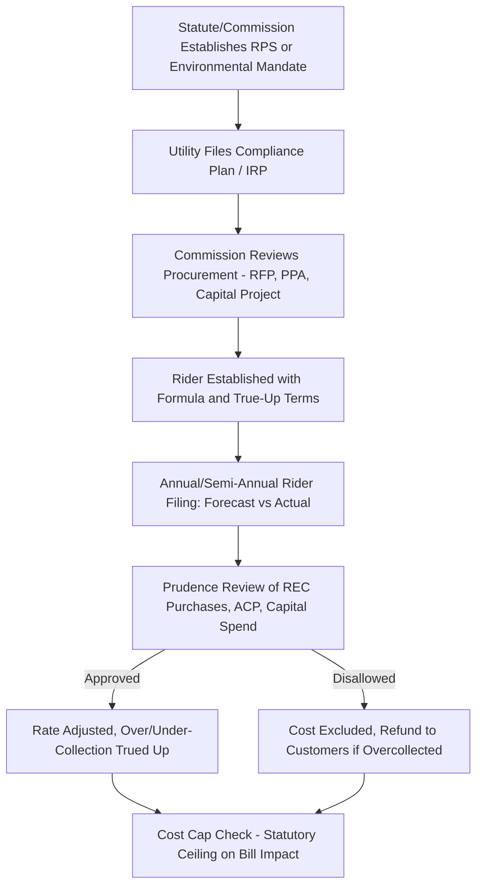

## Renewable Energy and Environmental Compliance Riders

### Definition and Regulatory Context

Renewable Energy and Environmental Compliance Riders are single-issue ratemaking mechanisms that allow a utility to recover, outside of a general rate case (GRC), the costs of complying with renewable portfolio standards (RPS), clean energy mandates, and environmental regulations (air, water, waste, and emissions control). These riders separate policy-driven or regulatory-driven costs—often volatile, externally mandated, and outside utility control—from the base rate structure.

**Key Points**

- These riders sit alongside fuel adjustment clauses and grid modernization trackers as a category of cost-specific recovery mechanisms.
- They are typically authorized by statute (e.g., an RPS-enabling law) or commission rule, because they represent an exception to the general principle that costs should be reviewed comprehensively in a GRC.
- They serve a dual purpose: cost recovery for the utility and cost transparency for ratepayers and regulators, since environmental/renewable costs are often politically salient and subject to public scrutiny.

### Why Environmental and Renewable Costs Receive Special Treatment

**Externally Mandated and Volatile Costs**

Unlike discretionary capital investment, RPS compliance costs (renewable energy certificate purchases, above-market power purchase agreement premiums) and environmental compliance costs (scrubber installation, coal ash remediation, carbon allowance purchases) are often:

- Driven by legislative or regulatory mandates the utility cannot avoid.
- Subject to market price volatility (e.g., REC prices, carbon allowance auction prices) that can swing significantly year to year.
- Structurally similar to fuel costs in that they are largely a pass-through of externally determined prices rather than a utility management decision.

**Compliance Deadline Risk**

Environmental regulations (e.g., limits on SO2, NOx, mercury, or CO2 emissions) typically carry statutory compliance deadlines with penalties for non-compliance. [Inference] A dedicated rider is often viewed by regulators as reducing regulatory lag risk that could otherwise discourage timely capital investment needed to meet a hard compliance deadline, though the degree of emphasis placed on this rationale varies by jurisdiction and specific rulemaking.

**Policy Cost Transparency**

Separating renewable/environmental costs onto a distinct bill line item allows:

- Legislators and regulators to monitor the cost of policy mandates independently of the utility's general cost structure.
- Ratepayer advocates to scrutinize specific compliance costs without triggering a full rate case.
- Sunset or cost-cap provisions to be applied narrowly to the policy-driven cost category.

### Common Mechanism Types

**1. Renewable Portfolio Standard (RPS) Compliance Rider**

Recovers the incremental cost of meeting a state or provincial renewable energy mandate, including:

- Above-market costs of renewable power purchase agreements (PPAs).
- Renewable Energy Certificate (REC) purchase costs when the utility buys RECs rather than physical energy to meet compliance.
- Alternative compliance payments (ACPs) — penalty-like payments made in lieu of physical compliance when renewable supply is insufficient or uneconomic.

**Example**: A utility's RPS mandate requires 30% renewable energy by a target year. It signs long-term wind PPAs at a price above the wholesale market price. The rider recovers the difference between the PPA price and an assumed market price benchmark, since that above-market cost would otherwise depress earnings if absorbed in base rates.

**2. Environmental Compliance Cost Recovery Rider (ECCR)**

Recovers capital and O&M costs of environmental control equipment and compliance programs, such as:

- Flue gas desulfurization (scrubbers) for SO2 control.
- Selective catalytic reduction (SCR) for NOx control.
- Coal combustion residuals (CCR)/coal ash pond closure and remediation.
- Water discharge permit compliance (e.g., cooling water intake structure upgrades).

**3. Carbon/Emissions Cost Pass-Through**

In jurisdictions with a cap-and-trade or carbon pricing program, a rider may pass through:

- The cost of purchasing emissions allowances.
- Proceeds from allowance auctions (as a credit against the rider, often returned to customers).

$$Rider_{carbon} = (Allowances_{purchased} \times Price_{allowance}) - Proceeds_{auction,\ returned}$$

**4. Green Tariff / Voluntary Renewable Rider**

Distinct from mandatory compliance riders, some utilities offer an opt-in rider allowing customers to pay a premium for renewable energy attributes (e.g., a "green power" program), with costs recovered only from participating customers rather than the general customer base.

**5. Decommissioning and Retirement Cost Riders**

Related mechanisms recover the cost of retiring fossil generation early to meet environmental or clean energy mandates, including undepreciated plant balances (stranded costs) and site remediation.

### Typical Cost Recovery Formula

A simplified RPS/environmental rider calculation:

$$Rider_{\$/kWh} = \frac{RR_{compliance} - Credits_{offset}}{Forecast\ kWh\ Sales}$$

Where:

- $RR_{compliance}$ = total revenue requirement for renewable/environmental compliance costs (capital return, depreciation, O&M, REC/ACP costs)
- $Credits_{offset}$ = any offsetting revenues (e.g., auction proceeds, REC sales if the utility has a surplus, federal tax credits monetized)
- $Forecast\ kWh\ Sales$ = projected billing determinant for the rider period

**Example**

A utility's RPS compliance costs for the coming year:

- Above-market renewable PPA costs: $40 million
- REC purchases (shortfall coverage): $8 million
- Federal Production Tax Credit pass-through (credit to customers): -$5 million
- Forecast retail sales: 10,000,000,000 kWh (10 TWh)

$$Rider_{\$/kWh} = \frac{\$40M + \$8M - \$5M}{10,000,000,000\ kWh} = \frac{\$43,000,000}{10,000,000,000} = \$0.0043/kWh$$

This equates to $0.43 per 100 kWh, itemized as a separate line on the customer bill (e.g., "Renewable Energy Compliance Charge").

### Rate Design Considerations

**Key Points**

- **Volumetric ($/kWh) allocation** is most common for RPS riders, since renewable compliance obligations are typically defined as a percentage of retail sales (kWh), making usage-based allocation consistent with cost causation.
- **Class allocation** may differ from base rates if large industrial customers have separate self-supply or opt-out provisions (common in RPS statutes that allow large customers to self-certify renewable compliance).
- **True-up mechanisms**: Because REC prices and PPA settlement costs are volatile and known imperfectly at the time rates are set, most RPS/environmental riders include an annual or semi-annual true-up reconciling projected versus actual costs, with any over/under-collection carried forward.

### Regulatory Review and Prudence Standards

1. **Integrated Resource Plan (IRP) linkage**: Renewable PPAs and environmental capital projects recovered through a rider are often required to have been reviewed and approved (or at least not disapproved) in the utility's IRP process, establishing a prudence baseline before cost recovery begins.
2. **Competitive procurement requirements**: Many RPS statutes require competitive solicitation (RFPs) for renewable PPAs to establish that contract prices are reasonable, which supports (but does not guarantee) prudence findings for rider recovery.
3. **Annual reconciliation and audit**: Commission Staff or an independent auditor typically reviews actual REC purchases, ACP payments, and environmental compliance spending against forecast, with disallowance possible for imprudent or non-compliant costs.
4. **Cost caps**: Some statutes include a ratepayer cost cap (e.g., RPS compliance costs may not exceed X% of a customer's bill), which can trigger a suspension of the RPS mandate itself if breached, distinguishing this from typical utility-cost trackers.
5. **Sunset and GRC rebasing**: As with other trackers, environmental compliance riders are periodically rebased into general rates at the next GRC, particularly for capital costs (as opposed to ongoing REC/ACP costs, which may remain in a permanent rider given their recurring, market-driven nature).

**Example**

A commission order might state: "The Company's Renewable Energy Compliance Rider shall be trued up annually based on actual REC purchase costs and Alternative Compliance Payments, subject to the statutory cost cap of 3% of average residential bills. Costs associated with renewable PPAs shall be presumed prudent if procured through the Commission-approved competitive solicitation process; costs from bilaterally negotiated contracts are subject to case-specific prudence review."

### Interaction with Federal Tax Incentives

Renewable riders frequently interact with federal tax credit mechanisms (Production Tax Credit / Investment Tax Credit), which affects the net cost passed to ratepayers:

- If the utility owns renewable generation directly (rather than purchasing under a PPA), it typically must flow through the value of PTC/ITC benefits to ratepayers, reducing the net rider revenue requirement.
- If renewable energy is purchased under a PPA, the tax credit value is typically already embedded in the PPA price negotiated with the third-party developer, and is not separately trued up by the utility.

$$RR_{net} = RR_{gross} - PTC/ITC_{flow\text{-}through}$$

### Illustrative Process Flow

### Illustration: RPS Rider Cost Stack and Offsets (svg_diagram)

<svg xmlns="http://www.w3.org/2000/svg" viewBox="0 0 760 340">
<text x="380" y="28" text-anchor="middle" font-size="16" font-weight="bold" fill="#1a1a1a">RPS Compliance Rider Cost Stack (svg_diagram)</text>
<line x1="60" y1="290" x2="720" y2="290" stroke="#333" stroke-width="1.5" />

<rect x="90" y="110" width="110" height="180" fill="#4a7fb5" />
<text x="145" y="105" text-anchor="middle" font-size="12">$40M</text>
<text x="145" y="308" text-anchor="middle" font-size="11">Above-Market</text>
<text x="145" y="321" text-anchor="middle" font-size="11">PPA Cost</text>

<rect x="230" y="70" width="110" height="40" fill="#6fa8dc" />
<text x="285" y="65" text-anchor="middle" font-size="12">+$8M</text>
<text x="285" y="308" text-anchor="middle" font-size="11">REC</text>
<text x="285" y="321" text-anchor="middle" font-size="11">Purchases</text>

<rect x="370" y="70" width="110" height="40" fill="#e06666" />
<text x="425" y="65" text-anchor="middle" font-size="12">-$5M</text>
<text x="425" y="308" text-anchor="middle" font-size="11">PTC</text>
<text x="425" y="321" text-anchor="middle" font-size="11">Flow-Through</text>

<line x1="200" y1="110" x2="230" y2="110" stroke="#999" stroke-dasharray="4" />
<line x1="340" y1="70" x2="370" y2="70" stroke="#999" stroke-dasharray="4" />

<rect x="560" y="90" width="120" height="200" fill="#2e5f8a" />
<text x="620" y="85" text-anchor="middle" font-size="13" font-weight="bold">$43M</text>
<text x="620" y="308" text-anchor="middle" font-size="11" font-weight="bold">Net Rider</text>
<text x="620" y="321" text-anchor="middle" font-size="11" font-weight="bold">Revenue Req.</text>
<line x1="480" y1="110" x2="560" y2="110" stroke="#999" stroke-dasharray="4" />
</svg>

### Jurisdictional Variation

**Key Points**

- [Unverified] Specific rider names (e.g., "Renewable Energy Standard Rebate Rider," "Environmental Cost Recovery Factor," "Clean Energy Adjustment Mechanism"), cost caps, and procedural rules vary substantially by state/provincial jurisdiction and change frequently with legislative amendments; current tariffs and enabling statutes should be consulted for jurisdiction-specific detail.
- Some jurisdictions do not permit a separate rider at all and instead require renewable/environmental costs to be addressed exclusively in the GRC — reflecting differing state policy views on single-issue ratemaking.
- Interaction with regional carbon markets (e.g., cap-and-trade programs) or federal environmental rules (e.g., EPA regulations) can create overlapping compliance obligations requiring careful rider design to avoid double-counting.

### Common Analytical and Exam-Relevant Distinctions

| Concept | RPS Compliance Rider | Environmental Compliance Rider (ECCR) | Fuel Adjustment Clause (for comparison) |
| --- | --- | --- | --- |
| Cost Driver | Renewable mandate compliance (PPA premium, REC, ACP) | Emissions control capital/O&M | Fuel and purchased power commodity cost |
| Cost Type | Mostly market-based/contractual | Mostly capital-intensive | Commodity price pass-through |
| True-Up Frequency | Annual/semi-annual typical | Annual typical, tied to capital in-service dates | Monthly/quarterly typical |
| Prudence Anchor | IRP approval, competitive procurement | Environmental permit/regulation compliance plan | Least-cost dispatch/procurement practices |
| Cost Cap | Often statutory (% of bill) | Less commonly capped | Rarely capped (near-total pass-through) |

### Next Steps

**Next Steps**

- Fuel Adjustment Clauses and Purchased Power Cost Trackers
- Integrated Resource Planning (IRP) and Prudence Review Standards
- Multi-Year Rate Plans and Capital Tracker Mechanisms
- Stranded Asset and Early Retirement Cost Recovery
- Federal Tax Credit Monetization (PTC/ITC) in Utility Ratemaking
- Cap-and-Trade and Carbon Pricing Pass-Through Mechanisms
- Green Tariffs and Voluntary Renewable Energy Programs
- Cost Allocation and Rate Design for Policy-Driven Riders