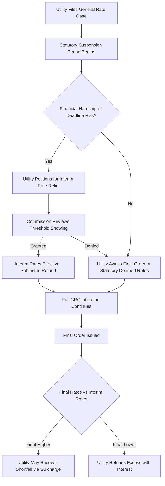
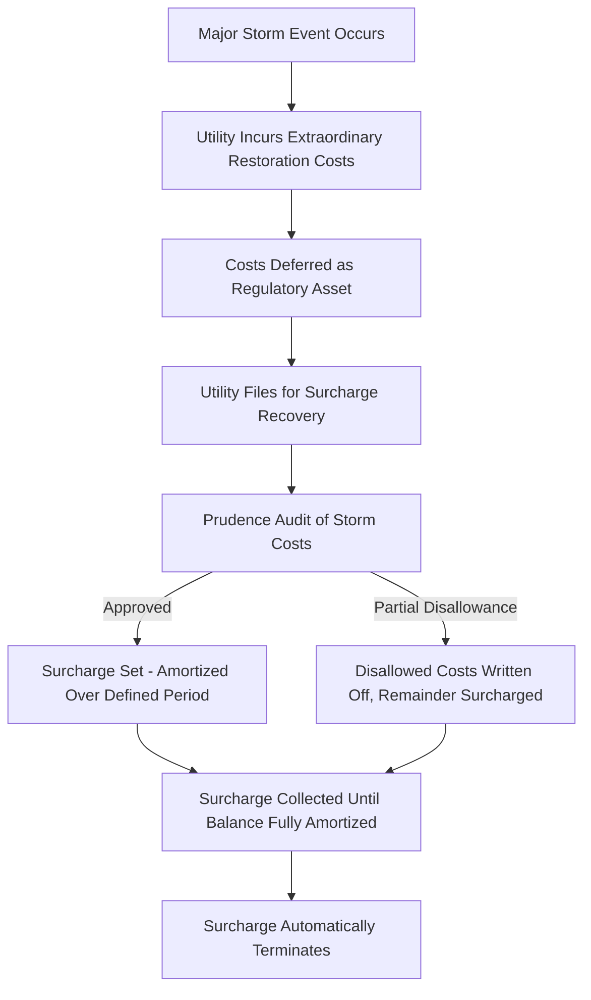

## Interim Rate Relief and Surcharge Mechanisms

### Definition and Regulatory Context

Interim Rate Relief and Surcharge Mechanisms are procedural and rate-design tools that allow a utility to begin collecting revenue at adjusted levels before a general rate case (GRC) is fully litigated and decided, or to recover a specific, time-limited cost item through a temporary bill surcharge. These mechanisms address the mismatch between when a utility incurs a cost or files a rate request and when a final, fully-litigated rate order takes effect.

**Key Points**

- Interim relief is fundamentally a *timing* mechanism — it does not change the ultimate revenue requirement determination, but changes *when* the utility begins collecting toward it.
- Surcharges are typically *temporary, cost-specific, and self-liquidating* rate riders, distinguishable from permanent base rate adjustments.
- Both mechanisms are used, subject to refund or true-up, precisely because full GRC litigation can take many months to over a year, during which the utility's actual cost of service may diverge materially from rates in effect.

### Interim Rate Relief: Core Concepts

**Purpose and Legal Basis**

When a utility files a GRC, statutory or commission procedural rules often specify a maximum suspension period (e.g., 6, 9, or 12 months) before rates must go into effect, either as filed, as modified, or as a placeholder subject to refund. Interim rate relief allows partial or full implementation of requested rates before the final order, typically justified by:

- Demonstrated, severe financial hardship or emergency circumstances (e.g., a credit rating downgrade risk, imminent inability to access capital markets).
- Statutory "file and suspend" frameworks where rates take effect automatically after the suspension period unless the commission acts, subject to refund with interest if the final rates are lower.

**Mechanism Design**

1. **Subject-to-Refund Interim Rates**: The commission allows some or all of the requested rate increase to take effect immediately (or after a short review), with the utility posting a bond, letter of credit, or accounting reserve to guarantee refund (with interest) of any amount ultimately found excessive.

$$Refund_{owed} = \sum_{t} (Rate_{interim} - Rate_{final}) \times Sales_t \times (1 + interest\ rate)$$

2. **Emergency/Extraordinary Relief**: A more stringent standard, typically reserved for demonstrable financial distress (e.g., risk of default, credit downgrade, inability to fund essential operations), requiring an expedited but still evidentiary showing.
3. **Statutory Deemed-Effective Rates**: In some jurisdictions, if the commission does not act within the statutory suspension period, the filed rates take effect by operation of law, subject to true-up once a final order issues.

**Example**

A utility files a GRC requesting a $50 million annual revenue increase. The statutory suspension period is 10 months. At month 6, facing a pending bond covenant test tied to interest coverage ratios, the utility petitions for interim relief. The commission grants 50% of the requested increase ($25 million annually) as an interim rate, subject to refund with interest, while the full case continues to be litigated on the merits.

### Distinguishing Interim Relief from Surcharges

| Feature | Interim Rate Relief | Surcharge Mechanism |
| --- | --- | --- |
| Trigger | Pending GRC awaiting final decision | Specific, often one-time or short-duration cost event |
| Duration | Temporary, until final GRC order | Temporary, until specific cost is fully recovered |
| Subject to Refund | Yes, typically with interest | Sometimes, depending on true-up design |
| Scope | Reflects a portion of the full requested revenue requirement | Narrowly tied to a specific, identified cost |
| Typical Trigger Events | Financial hardship, statutory suspension expiration | Storm restoration, one-time regulatory-mandated cost, deferred balance amortization |

### Surcharge Mechanisms: Core Concepts

**Purpose**

A surcharge is a separately identified, temporary rate addition designed to recover a specific, bounded cost, typically amortized over a defined period rather than embedded permanently in base rates. Unlike ongoing trackers (fuel clauses, AMI riders), a surcharge is designed to terminate once the specific cost is fully recovered.

**Common Applications**

1. **Storm Cost Recovery Surcharge**: Recovers extraordinary storm restoration costs (major hurricane, ice storm, or wildfire response) that exceed normal operating budgets and are deferred as a regulatory asset pending recovery.

$$Surcharge_{\$/kWh} = \frac{Deferred\ Storm\ Costs + Carrying\ Costs}{Amortization\ Period \times Forecast\ Annual\ Sales}$$

2. **Rate Case Expense Surcharge**: Recovers the utility's own cost of prosecuting a rate case (legal, expert witness, consulting fees), often amortized over 3–5 years as a small, separately identified charge.
3. **Deferred Balance True-Up Surcharge**: Recovers (or refunds, as a negative surcharge/credit) an accumulated over/under-collection from another tracker mechanism (e.g., a fuel clause under-collection) as a distinct line item rather than folding it into the ongoing tracker rate.
4. **One-Time Regulatory Mandate Surcharge**: Recovers costs of a specific, non-recurring regulatory compliance action (e.g., a one-time cybersecurity audit mandate, a specific safety compliance order following an incident).

**Example**

Following a major hurricane, a utility incurs $120 million in incremental storm restoration costs beyond its normal O&M budget and storm reserve. The commission authorizes:

- Securitization or deferred accounting treatment for the $120 million as a regulatory asset.
- A five-year storm cost recovery surcharge, amortizing $120 million plus carrying costs (at a debt-like rate, often lower than full WACC) evenly over five years.

$$Annual\ Surcharge\ Revenue = \frac{\$120M + Carrying\ Costs}{5\ years} \approx \$25M-\$27M\ per\ year$$

This appears as a distinct "Storm Cost Recovery Charge" line on customer bills, separate from base distribution rates, and automatically terminates when the amortization period ends.

### Securitization as an Alternative to Traditional Surcharges

**Key Points**

- For very large, one-time costs (major storm damage, plant decommissioning, wildfire liabilities), some jurisdictions authorize **securitization**: issuing utility-backed bonds against a dedicated, irrevocable surcharge (a "securitization charge" or "system restoration charge") pledged to bondholders.
- Securitization typically achieves a lower cost of capital than traditional equity-return-based recovery, because the surcharge is structured as a stable, non-bypassable revenue stream with a true-up mechanism to guarantee bond debt service, which materially reduces investor risk and thus the interest rate charged.
- [Inference] Regulators often favor securitization for extraordinary costs specifically because it is generally understood to lower the *net* cost to ratepayers relative to traditional cost-of-capital recovery, even though it commits customers to a fixed charge over a multi-year bond term; however, whether securitization is available depends entirely on jurisdiction-specific enabling legislation.

$$Total\ Ratepayer\ Cost_{securitized} < Total\ Ratepayer\ Cost_{traditional}\ (typically,\ due\ to\ lower\ effective\ financing\ rate)$$

### Regulatory Review and Prudence Standards

1. **Threshold showing for interim relief**: Commissions typically require a heightened evidentiary showing (financial distress, statutory deadline, or a clear likelihood of success on the underlying rate request) before granting relief prior to full litigation.
2. **Bonding/refund guarantee**: Interim relief is almost universally conditioned on a mechanism (bond, letter of credit, or booked reserve with interest accrual) to protect ratepayers if final rates are lower than interim rates.
3. **Prudence review of the underlying cost (for surcharges)**: Storm costs, rate case expenses, and other surcharge-eligible costs are subject to a reasonableness/prudence audit, often by an independent auditor, before final surcharge approval — even though interim deferred accounting may begin before that review is complete.
4. **Sunset by design**: Unlike an ongoing tracker, a surcharge's built-in termination (once the deferred balance is fully amortized) is a defining structural feature; regulators watch for and generally disfavor a surcharge that is repeatedly extended or effectively converted into a permanent tracker without a new prudence finding.
5. **Cost allocation methodology**: Storm and one-time surcharges may use a different allocator (e.g., per-customer basis reflecting restoration cost causation) than the class allocation used in base rates.

**Example**

A commission order might state: "Interim rates reflecting 60% of the Company's requested revenue increase shall take effect May 1, subject to refund with interest at the Company's authorized short-term borrowing rate, pending issuance of a final order in this proceeding. The Company shall maintain a refund reserve account and file quarterly accounting of amounts collected under interim rates."

### Illustrative Process Flow — Interim Relief

### Illustrative Process Flow — Storm Surcharge

### Illustration: Interim Rate Relief Timeline and Refund Exposure (svg_diagram)

<svg xmlns="http://www.w3.org/2000/svg" viewBox="0 0 760 340">
<text x="380" y="26" text-anchor="middle" font-size="15" font-weight="bold" fill="#1a1a1a">Interim Rate Relief Timeline and Refund Exposure (svg_diagram)</text>

<line x1="60" y1="180" x2="700" y2="180" stroke="#333" stroke-width="1.5" />
<text x="60" y="200" font-size="11">GRC Filed</text>
<text x="330" y="200" font-size="11">Interim Relief Granted</text>
<text x="650" y="200" font-size="11">Final Order</text>

<circle cx="70" cy="180" r="5" fill="#4a7fb5" />
<circle cx="360" cy="180" r="5" fill="#e69138" />
<circle cx="680" cy="180" r="5" fill="#2e5f8a" />

<line x1="70" y1="90" x2="680" y2="90" stroke="#4a7fb5" stroke-width="2" stroke-dasharray="6,4" />
<text x="695" y="94" font-size="11" fill="#4a7fb5">Requested Rate</text>

<line x1="70" y1="150" x2="360" y2="150" stroke="#999" stroke-width="2" />
<line x1="360" y1="150" x2="360" y2="120" stroke="#e69138" stroke-width="2" />
<line x1="360" y1="120" x2="680" y2="120" stroke="#e69138" stroke-width="2" />
<text x="695" y="124" font-size="11" fill="#e69138">Interim Rate</text>

<line x1="680" y1="120" x2="680" y2="140" stroke="#2e5f8a" stroke-width="2" />
<line x1="680" y1="140" x2="720" y2="140" stroke="#2e5f8a" stroke-width="2" stroke-dasharray="3,3" />
<text x="695" y="155" font-size="11" fill="#2e5f8a">Final Rate</text>

<rect x="360" y="120" width="320" height="20" fill="#e06666" opacity="0.25" />
<text x="500" y="250" text-anchor="middle" font-size="12" fill="#a61c1c">Shaded Zone: Refund Exposure if</text>
<text x="500" y="266" text-anchor="middle" font-size="12" fill="#a61c1c">Final Rate &lt; Interim Rate</text>

<text x="60" y="290" font-size="11" fill="#555">Pre-Interim Period: Rates at Prior Base Level</text>

</svg>

### Jurisdictional Variation

**Key Points**

- [Unverified] Statutory suspension periods, the evidentiary standard for interim relief (ranging from a routine "file and suspend" right to a demanding emergency-hardship showing), and whether securitization is authorized at all vary substantially across jurisdictions and change with legislative amendments; current statutes and commission procedural rules should be consulted for jurisdiction-specific requirements.
- Some jurisdictions do not permit interim rate relief at all, requiring rates to remain unchanged until a final order, which shifts regulatory lag risk entirely onto the utility during litigation.
- Securitization statutes for storm/extraordinary cost recovery have become more common following major hurricane and wildfire events in various jurisdictions, but eligibility criteria (e.g., cost thresholds, types of qualifying events) differ by statute.

### Common Analytical and Exam-Relevant Distinctions

**Key Points**

- Interim relief is about the *timing of the overall rate case outcome*; a surcharge is about *recovery of a specific, bounded cost item*.
- Interim relief is almost always subject-to-refund with interest; a surcharge's true-up design varies (some surcharges are simple pass-throughs without a refund concept, since the deferred cost is fixed and already prudence-reviewed).
- Both mechanisms are explicitly *temporary* by design — interim relief is superseded by the final GRC order, and a surcharge terminates once the underlying deferred balance is amortized, distinguishing both from permanent base rate treatment or open-ended trackers.

### Next Steps

**Next Steps**

- General Rate Case Procedure and Test Year Methodology
- Storm Reserve Accounting and Deferred Regulatory Assets
- Utility Securitization Bonds and Ratepayer-Backed Financing
- Regulatory Lag and Attrition Adjustment Mechanisms
- Rate Case Expense Recovery and Amortization Practices
- Cost of Capital Determination for Interim vs. Final Rates
- True-Up and Reconciliation Mechanisms in Tracker Design
- Emergency and Extraordinary Relief Standards Across Jurisdictions