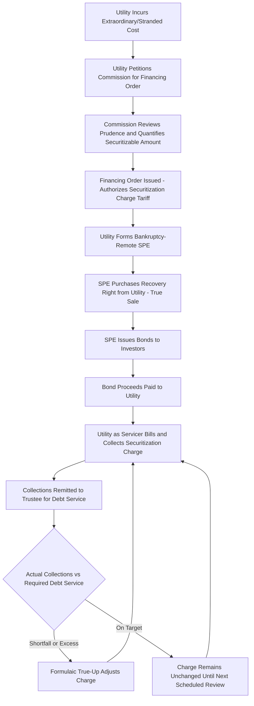

## Ratepayer Backed Bond Financing Structures

### Definition and Regulatory Context

Ratepayer Backed Bond (RBB) Financing Structures — also called utility securitization bonds, ratepayer-backed securities, or system restoration bonds — are financing arrangements in which a special-purpose entity issues bonds secured not by the utility's general credit but by a dedicated, statutorily authorized, irrevocable charge on customer bills. The bond proceeds are used to recover extraordinary or stranded utility costs, and the pledged charge (often called a "securitization charge" or "fixed recovery charge") is structured to guarantee bondholder debt service regardless of the utility's own financial condition.

**Key Points**

- The defining feature is legal and financial separation of the securitized bond from the utility's own balance sheet and credit risk — bondholders look to the dedicated charge and statutory protections, not to the utility as a general obligor.
- This structure achieves a lower cost of capital than traditional cost-of-service recovery (equity return plus conventional debt), because the pledged revenue stream is engineered to be extremely low-risk.
- Utility securitization requires specific enabling legislation in each jurisdiction; it is not available as a general-purpose ratemaking tool absent a statutory framework.

### Why Securitization Exists: The Core Economic Rationale

**Cost of Capital Arbitrage**

Traditional cost recovery for a large extraordinary cost (e.g., storm damage, stranded generation assets, wildfire liabilities) would otherwise be recovered through a surcharge or rate base treatment reflecting the utility's full weighted average cost of capital (WACC), including its authorized return on equity (ROE), often in the 9–11% range.

Securitization instead finances the same cost through bonds priced closer to AAA-rated asset-backed security yields, because the securitization charge is:

- **Non-bypassable**: All customers taking distribution service must pay it, regardless of their generation supplier choice (relevant in retail choice states) or later switching to another provider.
- **True-up protected**: A statutory mechanism automatically adjusts the charge (often without a full rate case) if actual collections deviate from what is needed for scheduled debt service, virtually eliminating collection risk for bondholders.
- **Irrevocable and legally insulated ("bondability")**: State legislation typically provides that the securitization order and the charge cannot be rescinded, altered, or impaired by subsequent legislative or regulatory action (a "non-impairment" pledge), and are typically also insulated from the utility's own bankruptcy (a "true sale" or similar legal separation).

$$Net\ Ratepayer\ Savings = (RR_{traditional,\ WACC-based} - RR_{securitized,\ bond-rate-based})$$

[Inference] Because the bond coupon rate is typically several percentage points below the utility's authorized ROE, securitization is generally expected to produce a lower total revenue requirement over the recovery period compared to traditional rate base treatment, even though customers commit to a fixed charge over a multi-year term; the actual magnitude of savings depends on prevailing bond market rates at issuance and is not guaranteed.

### Typical Structure and Parties

**Key Points**

- **Utility/Sponsor**: The regulated utility that has incurred the extraordinary cost and seeks to monetize the recovery right.
- **Special Purpose Entity (SPE)/Issuer**: A bankruptcy-remote subsidiary created solely to purchase the recovery right from the utility and issue bonds; legally separate from the utility to achieve "true sale" accounting and prevent the utility's general creditors from reaching the securitized assets.
- **Servicer**: Typically the utility itself, acting as a billing and collection agent for the securitization charge under a servicing agreement, remitting collections to the bond trustee.
- **Trustee**: Holds the pledged collateral (the right to collect the charge) on behalf of bondholders and administers debt service payments.
- **Bondholders/Investors**: Purchase the asset-backed securities, typically institutional fixed-income investors seeking stable, statutorily protected cash flows.
- **Public Utility Commission**: Issues the "financing order" (or equivalent) authorizing the securitization, approving the amount to be securitized, and approving the tariff mechanism for the securitization charge.

### The Financing Order

The financing order is the foundational regulatory document and typically specifies:

1. **The securitizable cost amount**: The specific, quantified extraordinary or stranded cost eligible for securitization (e.g., $500 million in storm restoration costs, or a specific undepreciated plant balance).
2. **Structuring and pricing flexibility**: Often gives the utility (subject to commission oversight) latitude to work with underwriters on bond structuring, tranching, and timing to obtain the lowest achievable cost of funds.
3. **The securitization charge tariff mechanism**: The formula and true-up frequency (often periodic, e.g., annually or semi-annually) for adjusting the charge to ensure it remains sufficient to service the bonds.
4. **Non-bypassability and non-impairment findings**: Legal findings that the charge applies to all existing and future customers taking service in the utility's service territory and that the state will not take action to impair the charge or bondholders' rights.
5. **True-up mechanics**: A streamlined, often ministerial (non-litigated) process for adjusting the charge, distinguishing it from a typical rate case.

### Cost Types Commonly Securitized

**Key Points**

- **Storm/Disaster Restoration Costs**: Extraordinary hurricane, ice storm, or wildfire restoration expenses exceeding normal budgets and reserves.
- **Stranded Generation Costs**: Undepreciated balances of generating plants retired early (e.g., coal plant retirements ahead of scheduled depreciation life) due to market restructuring or environmental/policy mandates.
- **Wildfire Liability and Mitigation Costs**: In wildfire-prone jurisdictions, costs associated with wildfire liability claims, system hardening, or wildfire mitigation capital programs.
- **Deferred Fuel or Purchased Power Balances**: Very large accumulated under-recoveries from a fuel adjustment clause, particularly following commodity price spikes, that would otherwise require an unmanageably large single-year surcharge.
- **Environmental Remediation**: Coal ash pond closure or other environmental compliance costs of a magnitude warranting securitization rather than a traditional rider.

### Typical Cash Flow and Charge Calculation

$$Securitization\ Charge_{\$/kWh} = \frac{Debt\ Service_{principal + interest} + Servicing\ Fees + Trustee\ Fees + True\text{-}Up\ Adjustment}{Forecast\ Billing\ Units}$$

**Example**

A utility receives a financing order to securitize $400 million in storm restoration costs.

- Bond structure: 15-year amortizing bonds, average coupon 5.2% (versus an authorized ROE of 9.8% and overall WACC of approximately 7.5% that would apply under traditional recovery).
- Annual debt service (principal + interest, levelized): approximately $39 million.
- Servicing and trustee fees: $1 million annually.
- Forecast annual sales: 12,000,000,000 kWh.

$$Securitization\ Charge = \frac{\$39M + \$1M}{12,000,000,000\ kWh} = \frac{\$40,000,000}{12,000,000,000} \approx \$0.0033/kWh$$

Compare this to the estimated traditional-recovery equivalent using full WACC over a similar period, which [Inference] would typically produce a materially higher annual revenue requirement due to the equity return component and different amortization profile — though a precise comparison requires a detailed net present value analysis specific to the bond terms and traditional recovery schedule ultimately proposed.

### True-Up Mechanism: The Key Structural Innovation

**Key Points**

- Unlike a conventional rate case, the true-up adjustment to the securitization charge is typically **non-discretionary and formulaic** — the utility (as servicer) calculates the adjustment needed to keep debt service fully funded, and the commission's role is largely ministerial verification rather than a new prudence or reasonableness proceeding.
- This feature is critical to bond credit ratings: rating agencies rely on the near-certainty that the charge will be adjusted promptly and automatically if actual collections (due to usage variance, weather, economic conditions) fall short of what is needed, insulating bondholders from volume/collection risk.
- True-up frequency varies (e.g., annual, semi-annual, or more frequent "true-up on demand" provisions if collections vary substantially from forecast).

$$True\text{-}up\ Adjustment = Debt\ Service\ Required_{t+1} - Projected\ Collections_{t+1}\ (based\ on\ current\ charge)$$

### Illustrative Process Flow

### Illustration: Securitization vs. Traditional Recovery Cost Comparison (svg_diagram)

<svg xmlns="http://www.w3.org/2000/svg" viewBox="0 0 760 340">
<text x="380" y="26" text-anchor="middle" font-size="15" font-weight="bold" fill="#1a1a1a">Securitized vs. Traditional Recovery Cost of Capital (svg_diagram)</text>
<line x1="80" y1="290" x2="680" y2="290" stroke="#333" stroke-width="1.5" />
<line x1="80" y1="60" x2="80" y2="290" stroke="#333" stroke-width="1.5" />
<text x="40" y="80" font-size="11">10%</text>
<text x="40" y="175" font-size="11">5%</text>
<text x="40" y="285" font-size="11">0%</text>

<rect x="180" y="90" width="100" height="200" fill="#4a7fb5" />
<text x="230" y="85" text-anchor="middle" font-size="12">~9.8% ROE</text>
<rect x="180" y="245" width="100" height="45" fill="#93c47d" />
<text x="230" y="308" text-anchor="middle" font-size="11">Traditional</text>
<text x="230" y="321" text-anchor="middle" font-size="11">WACC ~7.5%</text>

<rect x="420" y="200" width="100" height="90" fill="#e69138" />
<text x="470" y="195" text-anchor="middle" font-size="12">~5.2% Coupon</text>
<text x="470" y="308" text-anchor="middle" font-size="11">Securitized</text>
<text x="470" y="321" text-anchor="middle" font-size="11">Bond Rate</text>

<line x1="330" y1="150" x2="410" y2="150" stroke="#a61c1c" stroke-dasharray="4" />
<text x="370" y="140" text-anchor="middle" font-size="11" fill="#a61c1c">Rate Gap</text>
</svg>

### Credit and Legal Considerations

**Key Points**

- **Rating agency treatment**: Because of the non-bypassable, true-up protected structure, ratepayer-backed bonds typically receive very high credit ratings (often AAA or equivalent), close to the highest achievable rating tier, distinct from the utility's own corporate credit rating.
- **Off-balance-sheet/on-balance-sheet accounting**: [Inference] Utility securitization debt is generally still reflected on the utility's or parent's consolidated financial statements under standard accounting consolidation rules despite the SPE structure, though specific accounting treatment can depend on the precise structure and applicable accounting standards; this is a matter for the utility's accountants and auditors to determine for a specific transaction.
- **"State pledge" / non-impairment covenant**: Most enabling statutes include a commitment (sometimes framed as a contractual pledge to bondholders) that the state will not reduce, impair, or rescind the securitization charge, a feature designed to reassure investors against future political or regulatory reversal.
- **Bankruptcy remoteness**: Legal opinions (true sale and non-consolidation opinions) are typically required to confirm the SPE's assets (the collection right) would not be part of the utility's bankruptcy estate if the utility itself became insolvent.

### Regulatory Review and Oversight

1. **Upfront prudence/eligibility review**: The commission determines which costs qualify for securitization (as authorized by the enabling statute) and the eligible amount, generally before bond issuance.
2. **Pricing and structuring oversight**: Some financing orders require the commission (or a commission-designated advisor) to review or approve final bond pricing and structuring terms to ensure customers benefit from competitive execution, sometimes via a structured bidding or "pricing hearing" process.
3. **Post-issuance true-up review**: While the true-up itself is largely formulaic, the commission or its staff typically retains oversight to verify calculations are performed correctly and consistently with the financing order.
4. **Servicing standard oversight**: Commissions may require minimum servicing standards and remedies (e.g., replacement servicer provisions) to protect collection continuity if the utility-servicer experiences operational or financial distress.
5. **Use-of-proceeds tracking**: Verification that bond proceeds are applied to reduce the specific regulatory asset or cost recovery balance authorized in the financing order, rather than for general corporate purposes.

**Example**

A financing order might state: "The Commission finds that $350 million of the Company's wildfire mitigation capital costs are eligible for securitization. The Company shall competitively solicit underwriters and provide the Commission Financing Advisor an opportunity to review proposed pricing prior to issuance. The Securitization Charge shall be trued up annually, and more frequently if actual collections vary from projections by more than 5%, through a ministerial filing not subject to full rate case procedures."

### Common Analytical and Exam-Relevant Distinctions

| Feature | Ratepayer-Backed Securitization | Traditional Cost-of-Capital Recovery (Rider/Surcharge) |
| --- | --- | --- |
| Financing Vehicle | Bankruptcy-remote SPE issues bonds | Recovered directly through utility rates |
| Cost of Capital | Bond market rate (often near AAA) | Utility's authorized WACC (including ROE) |
| Ratepayer Impact | Lower total cost, but fixed multi-year non-bypassable charge | Potentially higher total cost, more rate-case flexibility |
| True-Up Process | Formulaic, ministerial, frequent | Often requires more substantive commission review |
| Legal Structure | True sale, non-impairment pledge, bankruptcy remote | Standard regulatory asset/rider treatment |
| Statutory Requirement | Requires specific enabling securitization statute | Can often be authorized under general ratemaking authority |
| Bypassability | Explicitly non-bypassable by statute | May be bypassable in retail choice contexts absent special provision |

### Jurisdictional Variation

**Key Points**

- [Unverified] Enabling legislation for utility securitization is jurisdiction-specific; not all states/provinces have adopted such statutes, and among those that have, eligible cost categories (storm costs, stranded costs, wildfire costs, environmental costs) and procedural requirements differ significantly.
- Some jurisdictions have adopted securitization statutes specifically in response to major storm or wildfire events, while others developed the framework originally for stranded cost recovery during electricity market restructuring in the 1990s–2000s.
- Because this is an evolving area of ratemaking law, especially regarding wildfire-related securitization, current statutory text and recent financing orders should be consulted for jurisdiction-specific mechanics.

### Next Steps

**Next Steps**

- Storm Cost Recovery Surcharges and Deferred Regulatory Assets
- Stranded Cost Recovery in Electricity Market Restructuring
- Wildfire Mitigation Cost Recovery and Liability Securitization
- Cost of Capital Determination and Authorized Return on Equity
- Bankruptcy-Remote Special Purpose Entity Structuring
- Credit Rating Agency Methodologies for Asset-Backed Utility Securities
- True-Up and Reconciliation Mechanisms in Tracker Design
- Interim Rate Relief and Surcharge Mechanisms