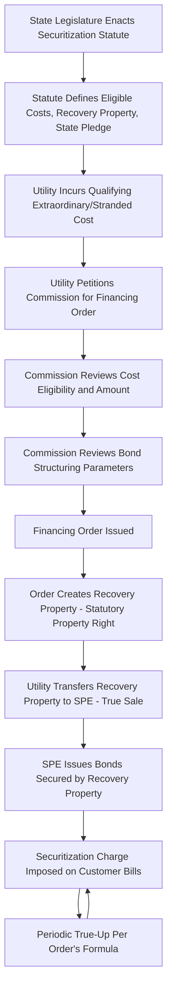

## Financing Orders and Statutory Authorization

### Definition and Regulatory Context

A Financing Order is the formal regulatory instrument — typically issued by a public utility commission pursuant to specific enabling legislation — that authorizes a utility to securitize a defined category of extraordinary or stranded costs through ratepayer-backed bonds. Statutory Authorization refers to the enabling legislation itself: the state or provincial statute that creates the legal framework permitting securitization, defines eligible cost categories, and establishes the irrevocability and non-impairment protections necessary to make the resulting bonds attractive to capital markets.

**Key Points**

- The financing order is the operative regulatory approval; the statute is the underlying legal authority without which no financing order can validly issue.
- Financing orders are structurally different from a typical rate order: they are largely irrevocable once issued and are designed to be immune from subsequent modification, appeal-driven reversal, or legislative reversal, a feature essential to achieving investment-grade bond pricing.
- Because a financing order is a precondition to bond issuance, its content directly determines the bonds' credit quality, coupon rate, and the resulting ratepayer charge.

### Why Statutory Authorization Is a Prerequisite

**Absence of Inherent Commission Authority**

Public utility commissions generally possess only the ratemaking authority granted to them by statute. Traditional ratemaking authority (setting just and reasonable rates through a general rate case) does not, by itself, include the power to:

- Create a legally irrevocable, non-impairable revenue stream immune from future rate case adjustment.
- Authorize a "true sale" transfer of a recovery right to a bankruptcy-remote special purpose entity (SPE).
- Bind future legislatures and commissions not to reduce or rescind the charge.

Because these features are what make securitization bonds achieve near-investment-grade or higher pricing, [Inference] a specific securitization statute is generally necessary rather than optional; commissions typically cannot manufacture these legal protections purely through an order issued under general ratemaking authority, since the "non-impairment" pledge in particular is understood to require a legislative commitment binding the state itself, not just the regulatory agency.

**The State Pledge Concept**

Enabling statutes typically include a "state pledge" or non-impairment covenant — a statutory statement, sometimes treated as a contract between the state and bondholders, that the state will not:

- Reduce, alter, or impair the securitization charge.
- Impair the rights of the SPE, the trustee, or bondholders.
- Take actions that would reduce the value of the recovery property, except through the statutorily provided true-up mechanism.

This pledge is a key input to rating agency analysis, since it addresses "political risk" — the risk that future legislative or regulatory action could undermine the dedicated revenue stream.

### Core Elements of Enabling Legislation

**Key Points**

- **Eligible Cost Categories**: The statute specifies which costs may be securitized (e.g., storm restoration costs, stranded generation costs, wildfire-related costs, environmental compliance costs, deferred fuel balances). A financing order cannot authorize securitization of a cost category not covered by the statute.
- **"Recovery Property" Definition**: The statute defines the intangible property right created by the financing order (the right to impose, collect, and receive the securitization charge) as a distinct, transferable, and pledgeable property interest — this legal characterization is what enables the "true sale" to the SPE.
- **Non-Bypassability Provision**: A statutory requirement that the charge applies to all customers taking distribution service in the relevant class, regardless of whether they switch generation suppliers (in retail choice jurisdictions) or take other service changes, ensuring collection certainty.
- **True-Up Mechanism Authorization**: Statutory authorization for a streamlined, non-litigated (or minimally litigated) periodic adjustment process, distinguishing the true-up from a full rate case.
- **Irrevocability Clause**: Statutory language establishing that once issued, a financing order (and the associated recovery property) cannot be rescinded, altered, or amended by the commission except pursuant to the true-up mechanism specified in the order itself.
- **Bankruptcy Remoteness Provisions**: Statutory characterization of the recovery property and its transfer to an SPE in terms designed to support "true sale" treatment and non-consolidation with the utility's bankruptcy estate.

### Anatomy of a Financing Order

A typical financing order contains the following components:

1. **Findings on Eligible Costs**: A determination that the specific costs proposed for securitization fall within the statutory eligible categories and a quantification of the securitizable amount (often following a prudence or reasonableness review of the underlying costs).
2. **Authorization to Issue Recovery Bonds**: Approval for the utility (or its SPE) to issue bonds up to a specified maximum amount, sometimes with parameters on structure (e.g., maximum term, amortization approach) but often with flexibility on final pricing terms to allow market-responsive execution.
3. **Approval of the Securitization Charge Tariff**: The rate mechanism and initial charge level, calculated to produce sufficient revenue to service the bonds (principal, interest, fees) over the life of the financing.
4. **True-Up Methodology**: The specific formula and schedule (e.g., annual, semi-annual, or trigger-based) for adjusting the charge to true up for over/under-collection relative to debt service requirements.
5. **Servicing Arrangements**: Designation of the utility as servicer (billing and collection agent), including standards of performance and provisions for replacement servicing if needed.
6. **Findings Supporting Bondability**: Explicit findings addressing the elements rating agencies and investors require — non-bypassability, irrevocability, the state pledge, and the true-up mechanism — often phrased to track statutory language precisely, since these specific recitations are what legal counsel relies upon in rendering "true sale" and enforceability opinions to investors.

### Illustrative Statutory-to-Order Relationship

### Prudence and Cost Eligibility Review

**Key Points**

- Before issuing a financing order, the commission typically conducts a prudence or reasonableness review of the underlying cost, similar in substance (though sometimes on an expedited timeline given the urgency often associated with extraordinary cost events) to review conducted for a traditional surcharge.
- The prudence review determines the "securitizable amount" — the specific dollar figure that becomes the basis for bond sizing. Costs not found prudent are excluded from the financing order and must be recovered (if at all) through other means, or are disallowed entirely.
- [Inference] Because the amount authorized becomes fixed and pledged to bondholders once the financing order is final and bonds are issued, commissions generally place significant emphasis on getting the prudence determination right at this stage, since subsequent adjustment mechanisms are designed for collection true-ups (matching charge to bond debt service) rather than for revisiting the underlying prudence finding itself.

$$Securitizable\ Amount = Total\ Claimed\ Cost - Disallowed\ Imprudent\ or\ Ineligible\ Cost$$

**Example**

A utility claims $600 million in wildfire mitigation capital costs for securitization. Following an audit, the commission disallows $50 million as costs incurred for general system improvements not specifically tied to wildfire risk reduction (and thus outside the statutory eligible cost category), and a further $20 million as imprudently incurred (e.g., costs from a vendor contract awarded without required competitive bidding). The financing order authorizes securitization of the remaining $530 million.

### Irrevocability and Its Limits

**Key Points**

- The irrevocability of a financing order is not absolute in the sense of freezing the *dollar charge* forever — the charge itself is expected to change via the true-up mechanism as actual collections and debt service needs evolve.
- What is irrevocable is the *underlying authorization and recovery property* — the commission cannot later decide to reduce the authorized recovery amount, rescind the charge mechanism, or otherwise impair the bondholders' expected cash flows outside the specified true-up process.
- This distinction (fixed authorization and mechanism vs. adjustable charge level) is central to how securitization achieves investment-grade credit quality while still remaining responsive to actual usage and cost variance.

### Judicial and Constitutional Considerations

**Key Points**

- [Unverified] Because financing orders bind future regulatory and sometimes legislative action, they have occasionally been subject to legal challenge on grounds such as improper delegation of legislative authority or the "contracts clause" implications of the state pledge; the specific case law and constitutional framework vary by jurisdiction and are subject to change through litigation.
- Well-drafted statutes typically include severability and clarity provisions intended to withstand such challenges, and rating agencies and bond counsel generally require a reasoned legal opinion on enforceability before bonds are issued.
- Utilities and their counsel typically obtain both a "true sale" opinion (confirming the SPE structure achieves genuine transfer of the recovery property, insulating it from the utility's potential bankruptcy) and a "non-impairment"/enforceability opinion (confirming the state pledge is legally binding) as conditions to bond closing.

### Regulatory Review and Process Milestones

1. **Statutory Threshold Determination**: Commission confirms the claimed cost category and amount fall within the statute's defined eligible costs.
2. **Prudence/Reasonableness Review**: Audit and evidentiary review of the underlying costs, often involving intervenors (ratepayer advocates, industrial customer groups) and independent financial advisors.
3. **Structuring and Cost-of-Funds Review**: Review of proposed bond structure, expected pricing, and any competitive process for selecting underwriters, sometimes with a post-issuance "true-up" hearing confirming actual pricing achieved matched market conditions at issuance.
4. **Issuance of the Financing Order**: Formal order with all required statutory findings, becoming final (often after any appeal period expires) before bonds can be marketed with full investor confidence.
5. **Post-Issuance Compliance**: Ongoing monitoring of servicing performance, true-up filings, and use-of-proceeds verification against the financing order's terms.

**Example**

A financing order might state: "Pursuant to [state] Securitization Act Section X, the Commission finds that $530,000,000 of the Company's wildfire mitigation costs constitute eligible costs and are found to have been prudently incurred, except as disallowed herein. The Commission authorizes the issuance of Recovery Bonds in an aggregate principal amount not to exceed $530,000,000, plus upfront financing costs. This Financing Order, and the Securitization Charge authorized herein, shall be irrevocable, and the State pledges that it will not reduce, impair, or alter the Securitization Charge except in accordance with the True-Up Mechanism described herein."

### Common Analytical and Exam-Relevant Distinctions

| Concept | General Rate Order | Financing Order |
| --- | --- | --- |
| Legal Basis | General ratemaking authority | Specific securitization enabling statute |
| Modifiability | Subject to change in next rate case | Irrevocable except via specified true-up mechanism |
| Duration of Effect | Until superseded by next rate case | Fixed bond term (often 10–30 years) |
| Underlying Property Right | None created (rates are not "property") | Creates statutory "recovery property," a transferable/pledgeable asset |
| Purpose | Sets overall just and reasonable rates | Authorizes securitized recovery of a specific, quantified cost |
| Investor Reliance | Not designed for direct capital markets reliance | Specifically designed to be relied upon by bond investors and rating agencies |

### Jurisdictional Variation

**Key Points**

- [Unverified] Not all states/provinces have enacted securitization-enabling statutes, and among those that have, the scope of eligible costs, the specific findings required in a financing order, and the strength of the non-impairment pledge differ; current statutory text should be consulted for any specific jurisdiction.
- Some jurisdictions have amended their original stranded-cost securitization statutes (enacted during 1990s–2000s electricity restructuring) to expand eligible cost categories to include storm costs, wildfire costs, or deferred fuel balances, reflecting evolving legislative priorities.
- The specific agency or reviewing body issuing the financing order (a public utility commission in most cases) and the availability of direct judicial review versus administrative appeal also vary by statute.

### Next Steps

**Next Steps**

- Ratepayer Backed Bond Financing Structures
- Storm Cost Recovery Surcharges and Deferred Regulatory Assets
- Stranded Cost Recovery in Electricity Market Restructuring
- Wildfire Mitigation Cost Recovery and Liability Securitization
- Bankruptcy-Remote Special Purpose Entity Structuring
- True-Up and Reconciliation Mechanisms in Tracker Design
- Prudence Review Standards in Extraordinary Cost Recovery
- Credit Rating Agency Methodologies for Asset-Backed Utility Securities