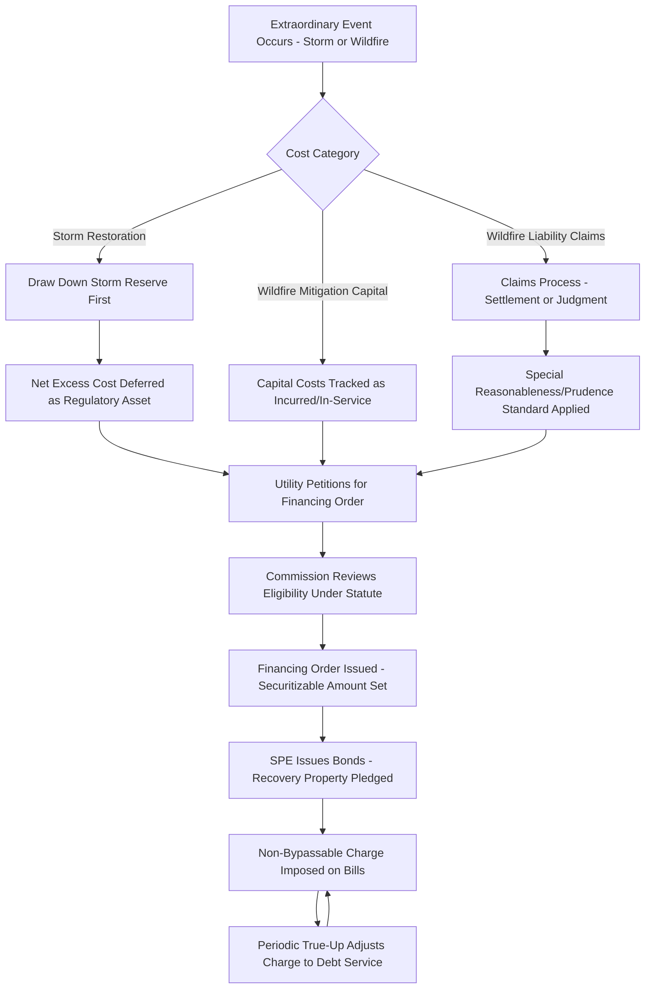

## Storm Cost and Catastrophic Wildfire Securitization

### Definition and Regulatory Context

Storm Cost and Catastrophic Wildfire Securitization is the application of ratepayer-backed bond financing specifically to two related categories of extraordinary utility cost: (1) restoration expenses following major storm events (hurricanes, ice storms, derechos) and (2) wildfire-related costs, which can include both wildfire mitigation capital investment and, in some jurisdictions, wildfire liability claims arising from utility equipment found to have caused or contributed to a wildfire. Both categories share the defining feature of securitization generally — recovery through a bankruptcy-remote special purpose entity (SPE) issuing bonds against a non-bypassable, true-up protected charge — but differ meaningfully in cost characterization, timing, and risk profile.

**Key Points**

- Storm cost securitization is typically the more procedurally mature and widely adopted category, often building on statutes originally enacted for stranded-cost recovery.
- Wildfire securitization is a comparatively newer and more legally complex application, particularly where it extends to liability costs rather than purely capital/restoration costs, and has expanded significantly in jurisdictions with material wildfire exposure.
- Both rely on the same core mechanics (financing order, recovery property, non-bypassable charge, formulaic true-up) described in the broader securitization and financing order topics, but the eligible cost definitions and prudence review standards differ.

### Storm Cost Securitization

**Cost Characterization**

Storm restoration costs eligible for securitization typically include:

- Emergency labor, mutual aid crew costs, and overtime incurred restoring service after a major storm.
- Replacement materials (poles, transformers, conductor) consumed in restoration, net of any capitalized betterment.
- Vegetation management and debris removal directly tied to storm response.
- Costs in excess of, or not covered by, an existing storm reserve or insurance recovery.

**Key Points**

- Storm costs are typically an O&M-type expense (rather than long-lived capital investment), which raises a distinct rate-design question: absent securitization, such costs would traditionally be expensed in the year incurred, potentially causing significant earnings volatility for a single extraordinary event.
- Securitization converts what would otherwise be a large, lumpy expense recognition into a smooth, multi-year amortized charge — similar in effect to how a traditional storm surcharge operates, but at a lower cost of capital.
- The "excess over reserve" concept is important: many jurisdictions require the utility to first draw down any pre-funded storm reserve before qualifying the remaining shortfall for securitization or surcharge treatment.

$$Securitizable\ Storm\ Cost = Total\ Restoration\ Cost - Storm\ Reserve\ Drawn - Insurance/FEMA\ Recoveries$$

**Example**

A utility incurs $280 million in hurricane restoration costs. Its existing storm reserve balance is $40 million, and it receives $15 million in federal disaster assistance reimbursement. The remaining $225 million is deferred as a regulatory asset and becomes the basis for a securitization financing order.

$$Securitizable\ Amount = \$280M - \$40M - \$15M = \$225M$$

### Wildfire Securitization

**Cost Characterization**

Wildfire-related securitization can address several distinct cost categories, which are important to distinguish because they carry different prudence review implications:

1. **Wildfire Mitigation Capital Costs**: Capital investment in system hardening (undergrounding, covered conductor, vegetation management programs, weather station networks, fault-detection technology) intended to reduce future ignition risk.
2. **Wildfire Liability/Claims Costs**: Costs arising from third-party claims, settlements, or judgments where utility equipment (e.g., a downed line, vegetation contact) is found to have caused or contributed to a wildfire.
3. **Insurance-Related Costs**: In some structures, costs associated with the increased expense or reduced availability of wildfire liability insurance coverage.

**Key Points**

- Mitigation capital costs (category 1) are conceptually closer to a traditional grid modernization or infrastructure tracker and are the least legally novel to securitize.
- Liability/claims costs (category 2) raise more complex policy and prudence questions, since securitizing a liability payment effectively shifts financial responsibility for wildfire damage onto ratepayers (via the bond charge) rather than utility shareholders, which is a significant departure from conventional tort and ratemaking principles and has been the subject of considerable public and legislative debate in wildfire-prone jurisdictions.
- [Unverified] The legal and policy framework for whether, and under what conditions (e.g., a finding that the utility acted reasonably/prudently despite the wildfire causation), liability costs can be securitized varies significantly by jurisdiction and is an actively evolving area of law; specific statutory criteria should be verified against current legislation for any given jurisdiction.

**Example — Mitigation Capital Securitization**

A utility undertakes a $1.2 billion, multi-year wildfire mitigation capital program (undergrounding high-risk circuits, installing covered conductor). Rather than recovering this large capital program through traditional rate base treatment (full WACC), the utility petitions for securitization of a tranche of this capital as it is placed in service, achieving a lower financing cost passed through to customers via the securitization charge.

**Example — Liability Cost Securitization**

Following a finding (via a commission-established framework or a legislatively created wildfire fund process) that a wildfire-related liability payment may be recovered from customers subject to specific conditions (e.g., a "reasonableness" rather than strict "prudence" standard, or a requirement that the utility demonstrate its wildfire mitigation plan compliance), a portion of the liability payment is securitized, with the associated financing order specifying the eligible amount and any conditions precedent established by the enabling statute.

### Illustrative Cost Category Comparison

| Cost Category | Typical Nature | Prudence Standard Complexity | Securitization Maturity |
| --- | --- | --- | --- |
| Storm Restoration (O&M) | Recurring, weather-driven, expense-type | Established, relatively routine | Mature, widely adopted |
| Wildfire Mitigation Capital | Long-lived infrastructure investment | Moderate (similar to capital tracker review) | Increasingly common |
| Wildfire Liability/Claims | Tort-adjacent, causation-linked | High — often requires special statutory standard | Emerging, jurisdiction-specific |

### Illustrative Process Flow

### Illustration: Storm vs. Wildfire Securitization Cost Flow (svg_diagram)

<svg xmlns="http://www.w3.org/2000/svg" viewBox="0 0 760 340">
<text x="380" y="26" text-anchor="middle" font-size="15" font-weight="bold" fill="#1a1a1a">Storm vs. Wildfire Securitizable Cost Flow (svg_diagram)</text>

<text x="180" y="55" text-anchor="middle" font-size="13" font-weight="bold">Storm Restoration</text>

<rect x="100" y="70" width="160" height="35" fill="`#4a7fb5`" />

<text x="180" y="92" text-anchor="middle" font-size="11" fill="white">Total Cost: $280M</text>

<rect x="100" y="110" width="160" height="30" fill="`#93c47d`" />

<text x="180" y="130" text-anchor="middle" font-size="11">Less: Reserve $40M</text>

<rect x="100" y="145" width="160" height="30" fill="`#93c47d`" />

<text x="180" y="165" text-anchor="middle" font-size="11">Less: Insurance $15M</text>

<rect x="100" y="185" width="160" height="45" fill="`#2e5f8a`" />

<text x="180" y="205" text-anchor="middle" font-size="11" fill="white">Securitizable</text>

<text x="180" y="220" text-anchor="middle" font-size="12" fill="white" font-weight="bold">$225M</text>

<text x="560" y="55" text-anchor="middle" font-size="13" font-weight="bold">Wildfire Mitigation</text>

<rect x="480" y="70" width="160" height="35" fill="`#e69138`" />

<text x="560" y="92" text-anchor="middle" font-size="11" fill="white">Capital Program: $1.2B</text>

<rect x="480" y="110" width="160" height="30" fill="`#f9cb9c`" />

<text x="560" y="130" text-anchor="middle" font-size="11">Placed-in-Service Tranche</text>

<rect x="480" y="145" width="160" height="30" fill="`#f9cb9c`" />

<text x="560" y="165" text-anchor="middle" font-size="11">Prudence Review</text>

<rect x="480" y="185" width="160" height="45" fill="`#b45f06`" />

<text x="560" y="205" text-anchor="middle" font-size="11" fill="white">Securitizable</text>

<text x="560" y="220" text-anchor="middle" font-size="12" fill="white" font-weight="bold">Tranche Amount</text>

<text x="380" y="270" text-anchor="middle" font-size="11" fill="#555">Both converge into the same SPE / recovery-property / bond structure</text>

<line x1="180" y1="240" x2="380" y2="290" stroke="#999" stroke-dasharray="4" />

<line x1="560" y1="240" x2="380" y2="290" stroke="#999" stroke-dasharray="4" />

</svg>

### Rate Design and Charge Allocation

**Key Points**

- Storm and wildfire securitization charges are typically allocated volumetrically ($/kWh) or on a per-customer basis, consistent with cost-causation studies, and are usually presented as a distinct, separately labeled bill line item (e.g., "Storm Recovery Charge," "Wildfire Recovery Charge") rather than folded into base distribution rates.
- Because these charges are non-bypassable, they typically apply even to customers who have switched generation suppliers in retail choice markets, since the underlying cost relates to the utility's distribution/transmission function rather than generation supply.
- Some wildfire securitization structures separate the mitigation-capital charge from any liability-related charge on the bill, to maintain public transparency about the distinct cost drivers.

### Regulatory Review and Prudence Standards

1. **Storm cost audits**: Independent audits typically review actual restoration costs against utility storm response plans and industry benchmarks (e.g., cost per damaged structure, crew-day costs relative to mutual aid market rates) to identify any imprudently incurred costs before inclusion in the financing order.
2. **Wildfire mitigation plan compliance review**: For mitigation capital costs, commissions often require the utility to demonstrate the investment was consistent with an approved wildfire mitigation plan (where such plans are a separate regulatory requirement).
3. **Liability cost review (where permitted)**: [Unverified] Where a jurisdiction's statute permits securitization of wildfire liability costs, the review standard and required findings (e.g., a "reasonableness" review distinct from ordinary prudence, or conditions tied to a utility's safety culture/compliance record) are typically specific to that jurisdiction's statute and should be verified directly rather than assumed to follow a uniform national standard.
4. **Interaction with wildfire funds**: In some jurisdictions, a state-created wildfire fund (funded by a combination of utility and ratepayer contributions) operates alongside or as an alternative to direct securitization of liability costs, and the interaction between the two mechanisms is statute-specific.
5. **Ongoing mitigation performance conditions**: Some financing orders or related statutes tie continued favorable liability cost treatment to demonstrated, ongoing compliance with wildfire safety and mitigation standards, creating an incentive structure beyond pure cost recovery.

**Example**

A financing order for wildfire mitigation might state: "The Commission finds that $530,000,000 of undergrounding and covered-conductor investment, having been constructed consistent with the Company's Commission-approved Wildfire Mitigation Plan, constitutes eligible costs for securitization under [state] Wildfire Recovery Act. The Securitization Charge shall be reflected as a separate line item, 'Wildfire Mitigation Recovery Charge,' on customer bills."

### Jurisdictional Variation

**Key Points**

- [Unverified] Storm cost securitization statutes are relatively more common and procedurally established across multiple jurisdictions with significant hurricane or severe weather exposure, while wildfire securitization frameworks — especially those addressing liability costs — have been enacted more recently and specifically in jurisdictions with material wildfire risk; current statutory text should be consulted for jurisdiction-specific eligible cost definitions.
- Some jurisdictions have amended existing storm securitization statutes to explicitly extend eligible cost categories to wildfire mitigation and, in some cases, liability costs, while others maintain entirely separate statutory frameworks for each.
- Given the evolving and often politically significant nature of wildfire cost allocation policy, recent legislative sessions in wildfire-exposed jurisdictions should be checked for updates to eligible cost categories, review standards, and interaction with any state wildfire fund.

### Common Analytical and Exam-Relevant Distinctions

**Key Points**

- Storm restoration costs are typically expense-type and event-driven with an established, relatively mechanical review process; wildfire mitigation costs are typically capital-type and plan-driven; wildfire liability costs are tort-adjacent and raise the most novel prudence/policy questions.
- All three categories can utilize the same underlying securitization mechanics (financing order, SPE, recovery property, non-bypassable charge, true-up), but the *eligibility determination and prudence standard* — not the bond structuring itself — is where these categories diverge most significantly.
- The public and legislative debate around wildfire liability securitization specifically centers on cost allocation between shareholders and ratepayers for utility-caused harm, a policy question with no single, universally adopted resolution across jurisdictions.

### Next Steps

**Next Steps**

- Ratepayer Backed Bond Financing Structures
- Financing Orders and Statutory Authorization
- Wildfire Mitigation Plans and Utility Safety Compliance Standards
- State Wildfire Funds and Liability Allocation Frameworks
- Storm Reserve Accounting and Deferred Regulatory Assets
- Prudence Review Standards in Extraordinary Cost Recovery
- Stranded Cost Recovery in Electricity Market Restructuring
- Interim Rate Relief and Surcharge Mechanisms