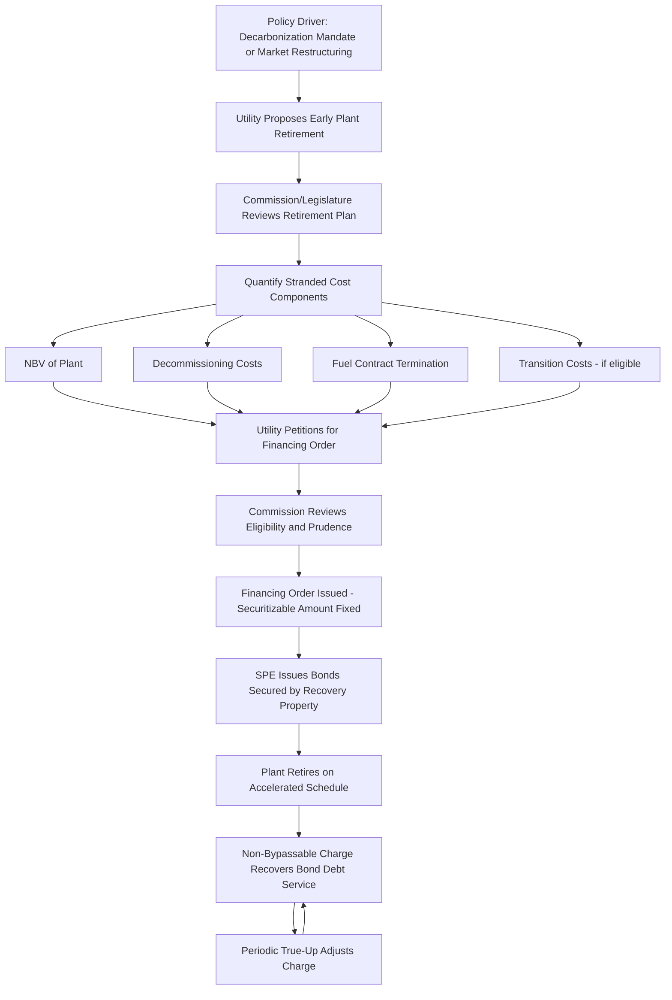

## Stranded Cost and Asset Retirement Securitization

### Definition and Regulatory Context

Stranded Cost and Asset Retirement Securitization is the application of ratepayer-backed bond financing to recover the undepreciated net book value and associated exit costs of utility generating assets that are retired before the end of their originally assumed useful life, or that become uneconomic or unrecoverable due to market restructuring, environmental regulation, or policy-driven decarbonization mandates. This was historically the original use case for utility securitization statutes, developed during electricity market restructuring in the 1990s–2000s, and remains highly relevant today as coal and other fossil generation units retire ahead of schedule for economic and environmental reasons.

**Key Points**

- "Stranded cost" refers to the portion of a utility's investment that cannot be recovered through market revenues (in a restructured/competitive generation market) or that would otherwise become an unrecovered regulatory asset if the plant is retired before full depreciation.
- Stranded cost securitization was the original template for the broader securitization mechanics later extended to storm and wildfire costs — the "financing order," "recovery property," and non-bypassable charge concepts all trace back to this application.
- Asset retirement securitization today is increasingly used as a tool to facilitate early coal plant retirement in support of decarbonization policy, distinguishing its modern policy rationale from its original 1990s restructuring-era purpose.

### Historical Origins: Market Restructuring Stranded Costs

**The Restructuring Context**

During electricity market restructuring, states that moved from vertically integrated, cost-of-service regulation to competitive generation markets faced a transition problem: utilities had built generation assets under the expectation of continued cost-of-service recovery, but once generation was opened to competition, the market price might be insufficient to recover the full embedded cost of those assets (particularly higher-cost nuclear or older fossil plants).

**Key Points**

- "Stranded cost" in this context represented the utility's legitimate, previously prudent investment that the new competitive market structure would not allow to be recovered through market-based generation prices.
- Securitization was developed as a mechanism to allow utilities to recover this legacy investment through a dedicated, non-bypassable transition/competitive transition charge (CTC) — applied to all distribution customers regardless of which generation supplier they chose — while achieving a lower cost of capital than continued rate base treatment.
- This addressed a fundamental restructuring policy tension: enabling generation competition while still honoring prior regulatory commitments to allow cost recovery for previously prudent investment.

$$Stranded\ Cost = Net\ Book\ Value_{asset} - Present\ Value\ of\ Expected\ Market\ Revenues_{remaining\ life}$$

### Modern Application: Early Retirement for Decarbonization

**Key Points**

- In the current context, stranded cost securitization is frequently used to facilitate early retirement of coal or other fossil generation plants that remain technically functional and only partially depreciated, but which utilities and regulators wish to retire ahead of schedule to meet emissions reduction, decarbonization, or clean energy portfolio goals.
- Without securitization, early retirement of a plant with substantial remaining net book value would either require continued rate base recovery of a non-operating asset (a "regulatory asset" for stranded plant), a lump-sum write-off (harming utility shareholders), or a traditional surcharge at the utility's full cost of capital.
- Securitization offers a middle path: recovering the remaining net book value at a bond-market financing cost, which can be lower than the traditional cost of capital, while still allowing the plant to retire on an accelerated timeline.

**Example**

A utility's coal plant has a remaining net book value of $450 million with 15 years of assumed remaining depreciable life. The utility and state policymakers wish to retire the plant in 3 years to meet a clean energy standard. Rather than accelerating depreciation (raising near-term rates sharply) or absorbing a write-off, the utility petitions for securitization of the $450 million net book value at retirement, to be recovered over a 15-year (or other legislatively/commission-approved) bond term at the bond coupon rate rather than the utility's authorized ROE.

$$Annual\ Savings_{ratepayer} \approx NBV \times (WACC_{traditional} - Bond\ Coupon\ Rate)$$

### Components of Securitizable Stranded/Retirement Cost

**Key Points**

- **Undepreciated Net Book Value**: The remaining, unrecovered original cost investment in the plant at the time of retirement.
- **Decommissioning and Remediation Costs**: Costs of physically decommissioning the plant, environmental remediation (e.g., coal ash pond closure), and site restoration, which may be included in the same securitization or handled under a separate mechanism (see Environmental Compliance Riders).
- **Fuel Contract Termination Costs**: Costs associated with terminating or buying out long-term fuel supply contracts (e.g., coal supply agreements) tied to the retiring plant.
- **Employee Transition Costs**: In some statutes, costs associated with employee retraining, severance, or community transition assistance for regions economically dependent on the retiring plant, reflecting a broader "just transition" policy objective sometimes embedded directly in securitization-enabling legislation.
- **Replacement Power Cost Differential**: [Unverified] Whether the incremental cost of replacement power (if the retiring plant is replaced by higher-cost generation in the near term) is itself securitizable, or must be recovered through ordinary fuel/purchased power mechanisms, depends on the specific statute and is not a universal feature of stranded cost securitization.

### Illustrative Cost Composition

$$Total\ Securitizable\ Amount = NBV_{plant} + Decommissioning + Fuel\ Contract\ Termination + Transition\ Costs\ (if\ statutorily\ eligible)$$

**Example**

| Component | Amount |
| --- | --- |
| Undepreciated net book value | $450 million |
| Decommissioning and site remediation | $60 million |
| Coal supply contract termination | $25 million |
| Community/worker transition fund (if statutorily eligible) | $15 million |
| **Total Securitizable Amount** | **$550 million** |

### Illustrative Process Flow

### Illustration: Stranded Cost Recovery — Traditional vs. Securitized Timeline (svg_diagram)

<svg xmlns="http://www.w3.org/2000/svg" viewBox="0 0 760 340">
<text x="380" y="26" text-anchor="middle" font-size="15" font-weight="bold" fill="#1a1a1a">Stranded Cost Recovery: Traditional vs. Securitized (svg_diagram)</text>
<line x1="80" y1="290" x2="700" y2="290" stroke="#333" stroke-width="1.5" />
<text x="80" y="308" font-size="10">Retirement</text>
<text x="680" y="308" font-size="10">Year 15</text>

<text x="200" y="60" text-anchor="middle" font-size="12" font-weight="bold">Traditional (Full WACC ~7.8%)</text>

<rect x="90" y="75" width="220" height="40" fill="`#4a7fb5`" />

<text x="200" y="100" text-anchor="middle" font-size="11" fill="white">Higher Annual Revenue Requirement</text>

<text x="560" y="150" text-anchor="middle" font-size="12" font-weight="bold">Securitized (Bond Rate ~5.0%)</text>

<rect x="450" y="165" width="220" height="40" fill="`#e69138`" />

<text x="560" y="190" text-anchor="middle" font-size="11" fill="white">Lower Annual Charge, Same NBV Recovered</text>

<line x1="310" y1="95" x2="450" y2="185" stroke="#a61c1c" stroke-dasharray="4" />
<text x="380" y="140" text-anchor="middle" font-size="11" fill="#a61c1c">Rate Differential = Ratepayer Savings</text>

<text x="380" y="260" text-anchor="middle" font-size="11" fill="#555">Both recover the same $450M NBV over the bond/recovery term</text>

</svg>

### Regulatory Review and Prudence Standards

1. **Retirement decision review**: Commissions typically review the underlying decision to retire the plant early — often as part of an Integrated Resource Plan (IRP) proceeding — to confirm the retirement is reasonable in light of economic, environmental, or policy considerations, before or concurrent with financing order review.
2. **Net book value verification**: An audit confirms the claimed NBV matches the utility's depreciation schedules and accounting records, and that no portion reflects previously disallowed or imprudent investment.
3. **Mitigation of shareholder windfall/harm concerns**: Because early retirement decisions affect the balance between shareholder and ratepayer interests, commissions may examine whether securitization terms (e.g., sharing of any decommissioning cost savings, treatment of accumulated deferred income taxes) are equitably allocated.
4. **Replacement resource planning**: Review of the utility's plan for replacing the retiring plant's capacity and energy, which may be a related but procedurally separate matter from the securitization financing order itself.
5. **Just transition / community impact provisions**: Where the statute includes worker or community transition funding as an eligible cost, commissions review whether proposed transition spending is consistent with statutory criteria and reasonably designed to achieve its stated purpose.

**Example**

A financing order might state: "The Commission finds that the Company's retirement of the [Plant Name] Generating Station three years ahead of its previously scheduled retirement date is reasonable and consistent with the state's Clean Energy Standard. The Commission authorizes securitization of $550,000,000, comprised of undepreciated net book value, decommissioning costs, and a Legislatively-authorized Energy Transition Fund contribution, pursuant to [State] Energy Transition Bond Act."

### Tax and Accounting Considerations

**Key Points**

- **Accumulated Deferred Income Taxes (ADIT)**: The treatment of ADIT balances associated with the retiring asset (which may need to be normalized or flowed back to customers) is a common point of financial complexity in stranded cost securitizations, since accelerated retirement can trigger tax timing differences requiring careful coordination with tax counsel and the IRS normalization rules applicable to utility ratemaking.
- **Loss Recognition**: [Inference] Retiring a plant before full depreciation generally creates an accounting and regulatory question of how to treat any difference between book value and any salvage or alternative-use value, though the specific accounting treatment depends on applicable accounting standards and the specific facts, and is properly a matter for the utility's accountants and tax advisors rather than a uniform rule.
- **Securitization as Tax-Neutral Financing Mechanism**: [Unverified] The federal tax treatment of securitization bonds (e.g., whether interest is treated similarly to other utility debt) is a specialized area of tax law; specific tax treatment should be verified with qualified tax counsel for any given transaction rather than assumed from general principles.

### Common Analytical and Exam-Relevant Distinctions

| Concept | Restructuring-Era Stranded Cost | Modern Decarbonization-Driven Retirement |
| --- | --- | --- |
| Policy Driver | Transition to competitive generation markets | Emissions reduction / clean energy mandates |
| Typical Era | 1990s–2000s | Ongoing, accelerating in recent years |
| Charge Name (typical) | Competitive Transition Charge (CTC) | Energy Transition Charge / Securitization Charge |
| Included Cost Scope | Primarily NBV and above-market contract costs | NBV, decommissioning, transition/worker costs |
| Underlying Legal Theory | Honoring prior prudent investment amid market restructuring | Facilitating policy-driven early retirement at lower financing cost |

### Jurisdictional Variation

**Key Points**

- [Unverified] Many original stranded-cost securitization statutes date to the restructuring era and were later amended or supplemented by newer "energy transition" or "securitization" statutes explicitly authorizing early coal plant retirement financing; current statutory text in any given jurisdiction should be consulted, since terminology and eligible cost scope vary considerably.
- Some jurisdictions' modern statutes explicitly require a showing that securitized retirement produces a net customer benefit compared to continued operation or traditional retirement recovery, sometimes quantified through a formal cost-benefit test specified in the statute.
- Worker and community transition funding provisions are a relatively recent legislative addition in some jurisdictions and are not universal; their presence, scope, and funding mechanism should be checked against the specific enabling statute.

### Next Steps

**Next Steps**

- Ratepayer Backed Bond Financing Structures
- Financing Orders and Statutory Authorization
- Storm Cost and Catastrophic Wildfire Securitization
- Integrated Resource Planning and Generation Retirement Decisions
- Accumulated Deferred Income Tax (ADIT) Normalization in Ratemaking
- Renewable Energy and Environmental Compliance Riders
- Depreciation Studies and Accelerated Depreciation for Retiring Assets
- Just Transition and Community Impact Policy in Utility Regulation