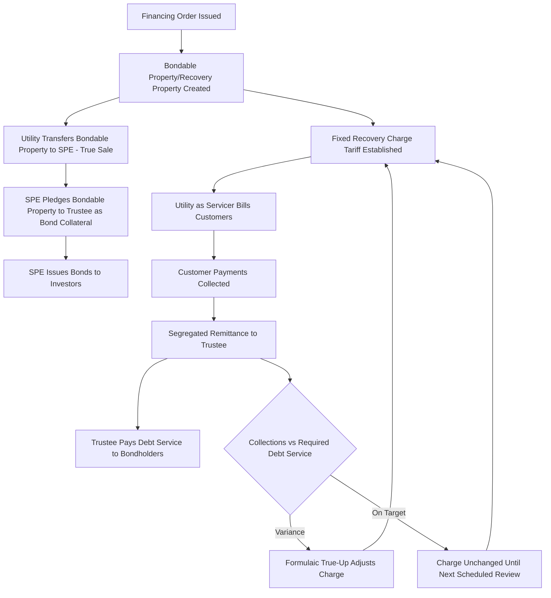

## Fixed Recovery Charges and Bondable Property

### Definition and Regulatory Context

Fixed Recovery Charges and Bondable Property are the two core legal-financial building blocks that make utility securitization possible. **Bondable property** (also called "recovery property" in many statutes) is the statutorily created intangible property right — established by a financing order — consisting of the right to impose, bill, collect, and receive a dedicated charge from customers. The **Fixed Recovery Charge** (also called a securitization charge, transition charge, or recovery charge) is the actual tariff mechanism through which that right is monetized on customer bills. Together, they transform a regulatory promise of cost recovery into a transferable, pledgeable financial asset that can be sold to a special purpose entity (SPE) and used to secure bonds.

**Key Points**

- Bondable property is a legal *creation* — it does not exist until a financing order is issued; it is not simply "the utility's right to collect money," but a distinctly defined statutory property interest designed to survive transfer, bankruptcy, and time.
- The Fixed Recovery Charge is the *operational mechanism* — the actual rate schedule, billing determinant, and true-up formula that generates the cash flows the bondable property represents.
- The word "fixed" in "Fixed Recovery Charge" refers to the fixed, contractually-committed *recovery amount and mechanism* established in the financing order — not to a static, unchanging dollar rate, which in fact adjusts periodically through the true-up process.

### Bondable Property (Recovery Property): Legal Characteristics

**Key Points**

- **Statutory Creation**: Bondable property comes into existence only upon issuance of a financing order under an enabling securitization statute; it has no existence under general common law or standard utility regulatory principles.
- **Present Property Interest**: Enabling statutes typically characterize bondable property as a present, existing property right (not a mere expectancy or future contingent interest) from the moment the financing order becomes final, which is essential to support a "true sale" characterization when transferred to the SPE.
- **Transferability and Pledgeability**: The statute must explicitly authorize the utility to sell, assign, or otherwise transfer the bondable property to an SPE, and to grant a security interest in it to a trustee for the benefit of bondholders — abilities not inherent in an ordinary regulatory right to collect rates.
- **Survives Utility Bankruptcy**: A central design feature is that, once properly transferred via a "true sale," the bondable property becomes an asset of the SPE, not the utility, and is intended to be legally insulated from the utility's own bankruptcy estate — meaning bondholders continue to be paid from the dedicated charge even if the utility itself becomes insolvent.
- **Distinguishable from General Utility Assets**: Bondable property is not the physical plant, the utility's general revenues, or its overall rate base — it is specifically and narrowly the defined right to collect the Fixed Recovery Charge as set out in the financing order.

### The "True Sale" Requirement

**Key Points**

- For the SPE structure to achieve its intended legal and accounting effect (isolating the bondable property from the utility's own credit and bankruptcy risk), the transfer of bondable property from the utility to the SPE must qualify as a "true sale" rather than merely a secured loan disguised as a sale.
- [Inference] Attorneys and courts generally analyze several factors in true sale determinations, such as whether the utility retains any residual interest in, or control over, the transferred property, and whether the SPE bears the economic risks and rewards of ownership; because this is a matter of complex commercial and bankruptcy law that varies by jurisdiction and specific transaction facts, definitive treatment for a specific transaction requires actual legal opinion rather than general principles.
- Many enabling statutes include explicit statutory language deeming the transfer a "true sale" (a "statutory true sale" provision) specifically to reduce the legal uncertainty that would otherwise exist under general commercial law principles, giving bond investors greater comfort.

### Fixed Recovery Charge: Structure and Mechanics

**Key Points**

- **Billing Determinant**: The charge is typically calculated on a volumetric basis ($/kWh, $/therm) or per-customer basis, consistent with how the underlying recovery amount was allocated across customer classes in the financing order.
- **Non-Bypassability**: The charge applies to all customers taking distribution service within the defined customer class, regardless of whether they switch electricity or gas suppliers (in a retail choice market), move within the service territory, or take alternative service arrangements — a feature essential to guaranteeing the revenue stream bondholders rely upon.
- **Servicing and Billing**: The utility typically continues to bill and collect the charge as "servicer" under a servicing agreement with the SPE, even though the SPE (not the utility) is the legal owner of the right to receive the revenue.
- **Segregation of Collections**: Amounts collected under the Fixed Recovery Charge are typically required to be tracked and remitted to the trustee on a defined schedule, often held to a higher standard of segregation than ordinary utility revenues, to reinforce the "true sale" characterization and protect bondholders.

$$Fixed\ Recovery\ Charge_{\$/kWh} = \frac{Scheduled\ Debt\ Service + Servicing\ Fee + Trustee/Admin\ Fee}{Forecast\ Billing\ Units}$$

### The True-Up Mechanism as Applied to the Fixed Recovery Charge

**Key Points**

- The true-up is what allows the charge to be called "fixed" in terms of its *purpose* (fully funding scheduled debt service) while the *rate* itself moves periodically.
- The financing order specifies a true-up methodology — typically formulaic, based on comparing actual collections to required debt service, without requiring a new prudence or reasonableness proceeding.
- Because the true-up is designed to be near-automatic, rating agencies treat this feature as central to eliminating "collection risk" or "volume risk" from the bond structure, which is a key reason ratepayer-backed bonds can achieve very high credit ratings.

$$Adjusted\ Charge_{t+1} = Charge_t + \frac{(Required\ Debt\ Service_{t+1} - Projected\ Collections_{t+1}\ at\ Charge_t)}{Forecast\ Billing\ Units_{t+1}}$$

**Example**

A Fixed Recovery Charge is initially set at $0.0033/kWh based on forecast annual sales of 12 billion kWh. Due to a mild weather year, actual sales come in at 11.5 billion kWh, producing a revenue shortfall relative to scheduled debt service of $1.65 million. The next scheduled true-up (say, annual) increases the charge to approximately $0.0034/kWh to recover the shortfall plus fund the following period's scheduled debt service, calculated per the formulaic methodology specified in the financing order — without a new rate case or prudence review of the underlying, previously-approved securitized amount.

### Illustrative Legal and Cash Flow Structure

### Illustration: Bondable Property vs. Fixed Recovery Charge — Conceptual Separation (svg_diagram)

<svg xmlns="http://www.w3.org/2000/svg" viewBox="0 0 760 340">
<text x="380" y="26" text-anchor="middle" font-size="15" font-weight="bold" fill="#1a1a1a">Bondable Property vs. Fixed Recovery Charge (svg_diagram)</text>

<rect x="60" y="70" width="280" height="180" fill="none" stroke="#4a7fb5" stroke-width="2" rx="8" />
<text x="200" y="95" text-anchor="middle" font-size="13" font-weight="bold" fill="#4a7fb5">Bondable Property</text>
<text x="80" y="120" font-size="11">• Statutory property right</text>
<text x="80" y="140" font-size="11">• Created by financing order</text>
<text x="80" y="160" font-size="11">• Transferable / pledgeable</text>
<text x="80" y="180" font-size="11">• Survives utility bankruptcy</text>
<text x="80" y="200" font-size="11">• Owned by SPE after true sale</text>
<text x="80" y="220" font-size="11">• The LEGAL ASSET</text>

<rect x="420" y="70" width="280" height="180" fill="none" stroke="#e69138" stroke-width="2" rx="8" />
<text x="560" y="95" text-anchor="middle" font-size="13" font-weight="bold" fill="#e69138">Fixed Recovery Charge</text>
<text x="440" y="120" font-size="11">• Tariff / billing mechanism</text>
<text x="440" y="140" font-size="11">• Non-bypassable rate</text>
<text x="440" y="160" font-size="11">• Billed by utility as servicer</text>
<text x="440" y="180" font-size="11">• Adjusted via formulaic true-up</text>
<text x="440" y="200" font-size="11">• Generates the cash flow</text>
<text x="440" y="220" font-size="11">• The OPERATIONAL MECHANISM</text>

<line x1="340" y1="160" x2="420" y2="160" stroke="#333" stroke-width="2" marker-end="url(#arrow)" />
<text x="380" y="150" text-anchor="middle" font-size="10">generates</text>
</svg>

### Rating Agency and Investor Perspective

**Key Points**

- Rating agencies evaluating ratepayer-backed bonds focus heavily on the legal robustness of the bondable property definition and the reliability of the Fixed Recovery Charge true-up mechanism, since these two elements together determine whether bondholders will be paid regardless of the utility's own financial condition or fluctuations in usage.
- Key legal opinions typically required include: (1) a "true sale" opinion confirming the bondable property transfer is not subject to recharacterization as a secured loan in the utility's bankruptcy, (2) a "non-consolidation" opinion confirming the SPE would not be substantively consolidated with the utility's bankruptcy estate, and (3) an enforceability opinion confirming the state's non-impairment pledge is legally binding.
- [Inference] The combination of a robust statutory bondable property definition, a non-bypassable Fixed Recovery Charge, a reliable formulaic true-up, and supporting legal opinions is generally understood to be what allows these bonds to achieve credit ratings largely delinked from, and often higher than, the issuing utility's own corporate credit rating; the specific rating achieved for any transaction depends on the rating agency's detailed analysis of the specific statute, financing order, and transaction documents.

### Regulatory and Servicing Oversight

1. **Servicing Agreement Standards**: The utility, acting as servicer, is typically held to defined performance standards (billing accuracy, timely remittance) with remedies (including replacement servicer provisions) if standards are not met, protecting the reliability of the Fixed Recovery Charge collection process.
2. **Segregation and Remittance Verification**: Periodic audits or reporting requirements confirm that Fixed Recovery Charge collections are properly segregated from general utility revenues and remitted to the trustee per the servicing agreement.
3. **True-Up Filing Review**: While largely ministerial, true-up calculations are typically subject to a filing and brief review period, allowing commission staff to verify the formula was applied correctly per the financing order's terms.
4. **Successor Utility Obligations**: Statutes and financing orders typically address what happens if the utility is sold, merges, or is replaced by another entity providing distribution service in the territory — ensuring the Fixed Recovery Charge and servicing obligations transfer appropriately to maintain bondholder protections.

**Example**

A servicing agreement might specify: "The Servicer shall remit all Fixed Recovery Charge collections to the Trustee within two Business Days of receipt. The Servicer shall calculate and file a True-Up Adjustment annually, or more frequently if actual collections vary from the projected amount by more than five percent (5%), following the methodology set forth in the Financing Order, without requirement for a general rate proceeding."

### Common Analytical and Exam-Relevant Distinctions

| Concept | Bondable Property / Recovery Property | Fixed Recovery Charge |
| --- | --- | --- |
| Nature | Legal/statutory property right | Tariff mechanism / rate |
| Created By | Financing order (pursuant to statute) | Same financing order, as the charge tariff |
| Function | Serves as collateral, is sold/pledged | Generates the actual cash collected from customers |
| Owner After Sale | SPE (via true sale) | N/A — charge is imposed on customers; collections flow to SPE via servicer |
| Adjustability | Fixed in scope/definition once created | Rate level adjusts via formulaic true-up |
| Key Legal Concern | True sale / bankruptcy remoteness | Non-bypassability / billing reliability |

### Jurisdictional Variation

**Key Points**

- [Unverified] Terminology varies by jurisdiction — "recovery property," "bondable property," "bondable transition property," and similar terms may be used interchangeably or with jurisdiction-specific technical meaning; the specific statutory definition in any given jurisdiction should be consulted directly rather than assumed from generic usage.
- The precise statutory language establishing the property right's characteristics (present interest, transferability, survival of bankruptcy) differs by statute, and the strength of this language is a key factor rating agencies and investors evaluate when pricing bonds in a given jurisdiction.
- Some jurisdictions have updated or clarified their bondable property statutes over time in response to rating agency feedback or investor concerns identified in earlier transactions, so more recently enacted or amended statutes may reflect more developed legal protections than older, original restructuring-era statutes.

### Next Steps

**Next Steps**

- Ratepayer Backed Bond Financing Structures
- Financing Orders and Statutory Authorization
- Stranded Cost and Asset Retirement Securitization
- Storm Cost and Catastrophic Wildfire Securitization
- Bankruptcy-Remote Special Purpose Entity Structuring
- Credit Rating Agency Methodologies for Asset-Backed Utility Securities
- True-Up and Reconciliation Mechanisms in Tracker Design
- Non-Bypassable Charges and Retail Choice Market Interactions