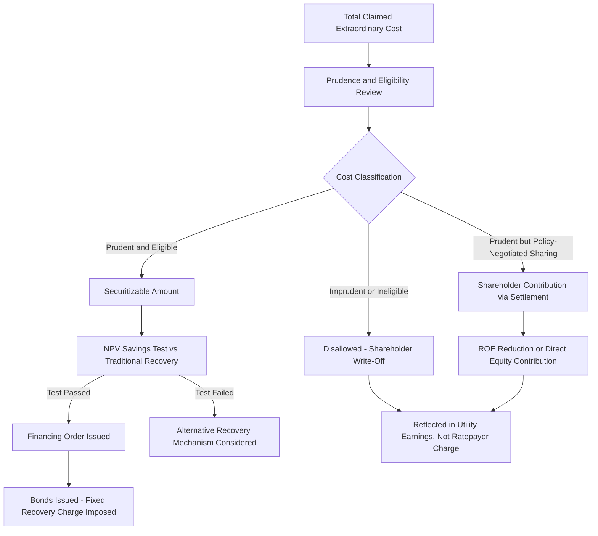

## Ratepayer Protections and Shareholder Contribution Mechanisms

### Definition and Regulatory Context

Ratepayer Protections and Shareholder Contribution Mechanisms are the policy safeguards and cost-sharing arrangements built into securitization statutes and financing orders to ensure that the benefits of low-cost bond financing are genuinely realized by customers, and that utility shareholders bear an appropriate share of risk or cost — particularly for extraordinary events where shareholder accountability (e.g., for imprudent conduct contributing to a wildfire or excessive storm costs) is a live policy concern. These mechanisms exist because securitization, left unchecked, could otherwise allow a utility to shift the full financial consequence of an extraordinary cost event onto ratepayers via a highly efficient financing tool, without any corresponding accountability check on utility conduct.

**Key Points**

- Ratepayer protections generally take the form of upfront cost eligibility limits, ongoing customer savings requirements, transparency/reporting mandates, and structural true-up safeguards.
- Shareholder contribution mechanisms are the converse: statutory or negotiated provisions requiring the utility's shareholders (rather than ratepayers) to absorb some portion of the extraordinary cost, typically applied where there is a finding of imprudence, safety failure, or as a negotiated condition of legislative/regulatory approval for a large securitization.
- These two categories work together: protections limit what can be charged to ratepayers, while contribution mechanisms determine what remains for shareholders to bear instead.

### Rationale for Ratepayer Protections

**The Core Policy Tension**

Securitization is attractive precisely because it is efficient — a well-designed statute makes it easy for a utility to recover a large extraordinary cost quickly, cheaply, and with minimal ongoing regulatory friction (via the formulaic true-up). [Inference] This same efficiency creates a policy risk: absent adequate safeguards, a utility might have reduced incentive to minimize costs, contest disputed claims, or avoid risk-creating conduct (e.g., inadequate wildfire mitigation or storm hardening) if it can reliably pass through resulting extraordinary costs via securitization; the degree to which this risk materializes in practice, and the specific protections needed to address it, is a matter of ongoing policy debate rather than settled consensus.

**Key Points**

- Ratepayer advocates and commission staff typically scrutinize securitization proposals specifically for whether adequate ratepayer protections are embedded, since the streamlined nature of securitization review (compared to a full rate case) provides fewer natural opportunities for downstream cost challenge.
- The tension is structurally similar to (but potentially more acute than) the tension present in any single-issue ratemaking mechanism: efficiency and cost-of-capital benefits must be balanced against reduced ongoing regulatory scrutiny.

### Common Ratepayer Protection Mechanisms

**1. Upfront Net Present Value (NPV) Savings Test**

Many statutes require the commission to find that securitized recovery will produce a demonstrable net customer benefit compared to traditional cost-of-capital recovery of the same cost, often expressed as a quantified NPV savings threshold.

$$NPV\ Savings = PV(Traditional\ Recovery\ Revenue\ Requirement) - PV(Securitized\ Recovery\ Revenue\ Requirement)$$

**Example**: A statute might require the commission to find that securitization will save customers "at least the net present value equivalent of the securitization transaction costs," ensuring the transaction is not pursued if issuance costs would erode most or all of the financing-rate advantage.

**2. Upfront Cost and Prudence Caps**

As discussed in the financing order topic, the securitizable amount is fixed through a prudence/reasonableness review before bond issuance, excluding imprudent or ineligible costs from the amount passed to ratepayers via the charge.

**3. Structuring and Pricing Advisor Requirements**

Some financing orders require the utility to engage, or allow the commission to appoint, an independent financial advisor to review or participate in bond structuring and pricing decisions, ensuring the utility does not simply accept unfavorable terms that increase issuance costs (which are ultimately borne by ratepayers) without adequate scrutiny.

**4. Cap on Upfront Financing Costs**

Statutes or financing orders often cap the amount of transaction costs (underwriting fees, legal fees, rating agency fees) that can be included in the securitized amount, to prevent excessive transaction costs from inflating the ratepayer-funded charge.

**5. Transparency and Reporting Requirements**

Ongoing reporting obligations (e.g., annual servicing reports, true-up filing transparency, public disclosure of the charge calculation) allow ongoing public and regulatory visibility into how the mechanism is functioning, even though the true-up itself is largely formulaic.

**6. Sunset and Non-Extension Provisions**

Structural limits ensuring the Fixed Recovery Charge terminates once the bonds are fully repaid, and cannot be extended or repurposed for unrelated costs without a new, separate financing order and prudence review.

### Shareholder Contribution Mechanisms

**Key Points**

- **Disallowance of Imprudent Costs**: The most basic shareholder contribution mechanism — costs found imprudent, unreasonable, or outside statutory eligible categories are simply excluded from the securitizable amount and must be absorbed by shareholders (typically through a write-off against earnings) rather than passed to customers at all.
- **Equity Contribution / Cost-Sharing Percentage**: Some financing orders or settlements require a utility to forgo securitization (or traditional recovery) of a specified percentage or dollar amount of the total cost, effectively requiring shareholders to absorb that portion directly.
- **Return on Equity (ROE) Adjustments**: In some settlements, a utility may agree to a temporary ROE reduction, or forgo an ROE adder it might otherwise be entitled to, as a condition of securitization approval, partially offsetting the ratepayer cost with reduced utility profitability elsewhere.
- **Safety/Performance-Linked Conditions**: Particularly in the wildfire context, financing orders or related settlements may condition full recovery (or the absence of further shareholder contribution requirements) on demonstrated compliance with safety and mitigation plan commitments going forward.
- **Excess Earnings Sharing**: Some structures require any savings realized by the utility from securitization's lower financing costs (relative to a benchmark traditional recovery cost) to be shared between shareholders and ratepayers according to a specified formula, rather than being fully retained as either a windfall for shareholders (via a servicing fee) or fully passed through as pure ratepayer savings.

$$Shareholder\ Contribution = Total\ Claimed\ Cost - Securitized\ Amount - Any\ Insurance/Other\ Recovery$$

**Example**

Following a major wildfire event where an investigation finds the utility's vegetation management practices fell short of applicable standards (though not to a degree warranting full disallowance), a negotiated settlement might provide: total claimed costs of $800 million, with $650 million found eligible for securitization following prudence review, $100 million disallowed as imprudent (absorbed by shareholders as a direct write-off), and $50 million addressed through a temporary ROE reduction over the securitization term as an additional shareholder contribution mechanism reflecting the safety shortfall finding.

### Illustrative Cost Allocation Waterfall

### Illustration: Cost Allocation Between Ratepayers and Shareholders (svg_diagram)

<svg xmlns="http://www.w3.org/2000/svg" viewBox="0 0 760 340">
<text x="380" y="26" text-anchor="middle" font-size="15" font-weight="bold" fill="#1a1a1a">Extraordinary Cost Allocation: Ratepayers vs. Shareholders (svg_diagram)</text>

<text x="200" y="55" text-anchor="middle" font-size="12" font-weight="bold">Total Claimed Cost: $800M</text>

<rect x="100" y="70" width="200" height="162" fill="`#4a7fb5`" />

<text x="200" y="150" text-anchor="middle" font-size="12" fill="white">Securitized</text>

<text x="200" y="167" text-anchor="middle" font-size="12" fill="white" font-weight="bold">$650M</text>

<rect x="100" y="232" width="200" height="25" fill="#e69138" />
<text x="200" y="249" text-anchor="middle" font-size="10" fill="white">ROE Reduction $50M</text>
<rect x="100" y="257" width="200" height="33" fill="#e06666" />
<text x="200" y="277" text-anchor="middle" font-size="10" fill="white">Disallowed/Write-Off $100M</text>

<line x1="310" y1="150" x2="450" y2="90" stroke="#4a7fb5" stroke-width="2" />
<text x="470" y="85" font-size="12" fill="#4a7fb5" font-weight="bold">Ratepayers</text>
<text x="470" y="102" font-size="11" fill="#4a7fb5">(via Fixed Recovery Charge)</text>
<line x1="310" y1="255" x2="450" y2="270" stroke="#e06666" stroke-width="2" />
<text x="470" y="265" font-size="12" fill="#a61c1c" font-weight="bold">Shareholders</text>
<text x="470" y="282" font-size="11" fill="#a61c1c">(via earnings/ROE impact)</text>
</svg>

### Regulatory Review and Oversight Process

1. **Independent Investigation/Audit**: For wildfire and major storm events in particular, an independent investigation (sometimes by commission staff, sometimes a third-party investigator) into causation and utility conduct typically precedes or runs parallel to the securitization prudence review, informing the eventual allocation between securitized recovery and shareholder contribution.
2. **NPV Savings Demonstration**: The utility typically must present, and the commission must find, that the securitized structure produces quantifiable customer savings relative to the counterfactual traditional recovery, often supported by third-party financial advisor testimony.
3. **Settlement Negotiation**: Given the complexity and stakes involved, many large securitization proceedings (especially wildfire-related) are resolved through negotiated settlements among the utility, commission staff, and ratepayer/consumer advocate intervenors, which are then presented to the commission for approval rather than fully litigated.
4. **Ongoing Compliance Monitoring**: Where shareholder contribution mechanisms are tied to forward-looking safety or performance conditions, commissions typically establish monitoring and reporting requirements to verify ongoing compliance over the multi-year term.
5. **Post-Issuance True-Up Transparency**: Even though the true-up mechanism is formulaic, protections often include public reporting requirements so that ratepayer advocates and the commission can verify the mechanism operates as designed over the life of the bonds.

**Example**

A settlement approved by a commission might state: "The Parties agree that of the Company's total claimed wildfire-related costs of $800,000,000, $650,000,000 shall be recovered through securitization, subject to the Commission's finding that securitization produces net customer savings compared to traditional recovery. The Company shall accept a 25 basis point reduction to its authorized Return on Equity for a period of five years, and shall forgo recovery of $100,000,000 in costs associated with vegetation management practices found to have fallen short of the Company's Wildfire Mitigation Plan commitments."

### Common Analytical and Exam-Relevant Distinctions

| Mechanism Type | Purpose | Typical Trigger |
| --- | --- | --- |
| NPV Savings Test | Ensures securitization itself is beneficial vs. alternative | Required for any securitization approval |
| Prudence Disallowance | Excludes imprudently incurred costs entirely | Finding of imprudence in cost incurrence |
| ROE Reduction | Shares consequence of safety/performance shortfall | Negotiated settlement or statutory condition |
| Cost Caps on Issuance Expenses | Prevents excessive transaction costs from inflating charge | Standard financing order term |
| Reporting/Transparency Requirements | Enables ongoing public/regulatory visibility | Standard financing order term |
| Sunset Provisions | Prevents charge from outliving its funding purpose | Built into bond term structure |

### Jurisdictional Variation

**Key Points**

- [Unverified] The specific mix of ratepayer protections and shareholder contribution mechanisms varies substantially by jurisdiction and by the specific circumstances of each securitization proceeding; some statutes mandate specific protections (e.g., a statutory NPV test), while others leave the balance largely to case-by-case commission discretion or negotiated settlement.
- Wildfire-related shareholder contribution mechanisms in particular have evolved significantly and differently across wildfire-prone jurisdictions, sometimes involving broader state-level wildfire fund contribution requirements that operate alongside individual securitization proceedings.
- Given the fact-specific and evolving nature of this area, recent commission orders and settlements in the relevant jurisdiction should be reviewed directly for current practice rather than relying on a generalized template.

### Next Steps

**Next Steps**

- Financing Orders and Statutory Authorization
- Storm Cost and Catastrophic Wildfire Securitization
- Fixed Recovery Charges and Bondable Property
- Prudence Review Standards in Extraordinary Cost Recovery
- State Wildfire Funds and Liability Allocation Frameworks
- Earnings Sharing Mechanisms and Return on Equity Adjustments
- Independent Investigation and Audit Practices in Utility Regulation
- Settlement Practice in Utility Rate Proceedings