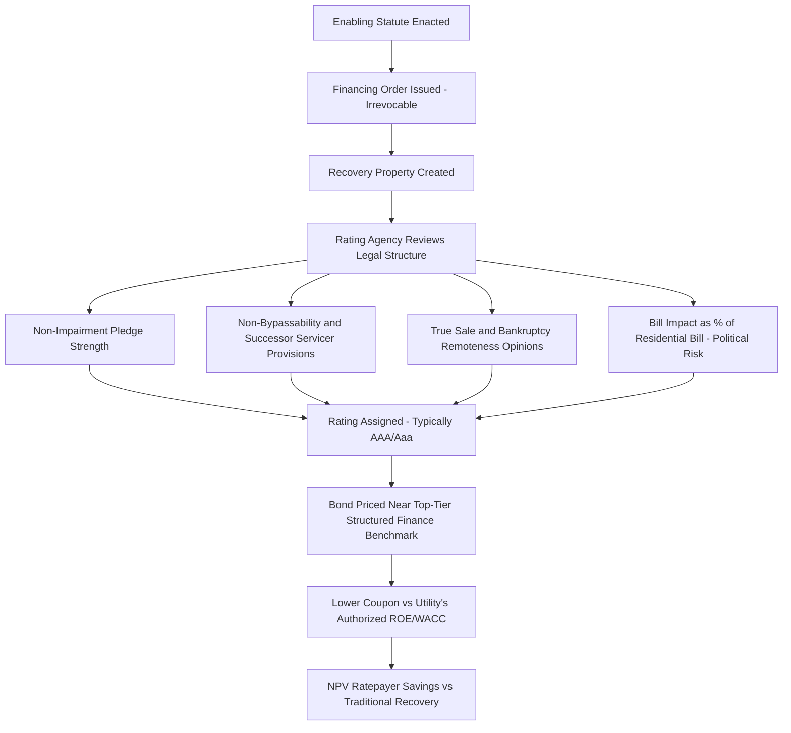

## Credit Rating and Capital Market Treatment of Recovery Bonds

### Definition and Regulatory Context

Credit Rating and Capital Market Treatment of Recovery Bonds concerns how rating agencies evaluate ratepayer-backed securitization bonds, and how index providers, regulators, and the broader fixed-income market classify and price these instruments. This topic sits downstream of the legal and statutory mechanics (financing orders, bondable property, fixed recovery charges) covered elsewhere in this chapter — it addresses how those legal protections translate into an actual credit rating and market execution, and how classification disputes in the capital markets can directly affect the ratepayer savings the securitization mechanism is designed to produce.

**Key Points**

- Recovery bonds (also called utility recovery bonds, ratepayer-backed bonds, or utility cost recovery bonds) are structured finance instruments rated primarily on transaction structure and legal protections rather than on the issuing utility's own corporate creditworthiness.
- These bonds have consistently achieved the highest achievable credit ratings from major agencies — state legislation authorizing utility recovery bonds provides investor protections including the right to collect revenue from irrevocable, non-bypassable charges regardless of which entity serves customers, and the right to periodic true-ups, which have allowed these bonds to achieve the highest possible credit ratings. [nasuca](https://nasuca.org/wp-content/uploads/2024/11/2024-01-Utility-Recovery-Bond-Classification-Resolution.pdf)
- A live and consequential capital-markets classification dispute — whether these bonds should be treated as corporate utility bonds or as asset-backed securities (ABS) — has emerged in recent years and materially affects the interest rates ratepayers ultimately pay.

### Rating Agency Methodology

**Key Factors in Rating Analysis**

Rating agencies evaluating recovery bonds generally focus on the legal and structural features established by the financing order and enabling statute, rather than on the utility's own financial condition:

1. **Strength of the enabling legislation and non-impairment pledge**: Ratings are based primarily on the strength of the state's legislation, including the state's non-impairment pledge, the irrevocable financing order authorizing the creation of securitizable property, and the remote likelihood of a successful legal, political, or regulatory challenge to the property rights transferred to the issuer for the benefit of bondholders. [lipower](https://www.lipower.org/wp-content/uploads/2016/11/UDSA-Moodys.pdf)
2. **Non-bypassability and successor servicer provisions**: Ratings on recovery bonds are based on the strength of the transaction's structure, the necessity of the service provided (electric distribution), and provisions in the enabling statute and financing order — including that a successor servicer is authorized or required to impose and collect the charge if the original servicer can no longer perform its duties. [spglobal](https://spglobal.com/ratings/en/research/articles/240304-credit-faq-the-rationale-behind-u-s-utility-securitization-and-reasons-for-recent-growth-12609481)
3. **True sale and bankruptcy-remoteness legal opinions**: Confirmation that the transfer of the recovery property to the SPE would withstand challenge in the utility's bankruptcy.
4. **Bill impact and political risk monitoring**: A key risk agencies monitor is the securitization charge as a percentage of the average residential bill — if the charge becomes excessive, it increases the possibility of politically driven challenges to the enabling legislation and financing order, so agencies model how high the projected charge becomes as a share of the bill and how long it remains elevated. [spglobal](https://spglobal.com/ratings/en/research/articles/240304-credit-faq-the-rationale-behind-u-s-utility-securitization-and-reasons-for-recent-growth-12609481)

**Typical Rating Outcomes**

To date, utility-related securitizations rated by at least one major agency have consistently achieved AAA (sf) ratings, and this asset class has consistently achieved higher ratings than the related utility or servicer's own corporate rating. This pattern is illustrated in actual transactions: a Long Island Power Authority-sponsored restructuring bond series received provisional Aaa ratings from Moody's, reflecting the strength of enabling state legislation including the non-impairment pledge, along with the irrevocable financing order. A more recent example: Moody's assigned definitive Aaa ratings to green energy market securitization bonds issued by a state agency, described at the time as that state's first utility cost recovery bond. [240304 credit faq the rationale behind u s utility securitization and reasons for recent growth 12609481 +2](https://spglobal.com/ratings/en/research/articles/240304-credit-faq-the-rationale-behind-u-s-utility-securitization-and-reasons-for-recent-growth-12609481)

### Quantifying the Ratepayer Savings from High Ratings

The rating achieved translates directly into the cost-of-capital advantage that justifies securitization as a policy tool. A recent, concrete example from a 2025 financing order proceeding: a utility demonstrated, using its then-current authorized rate of return of 7.66%, that issuance of recovery bonds would reduce consumer rates by approximately $606 million on a present value basis compared to recovering the approximately $1.629 billion authorized amount through traditional utility financing. [sec](https://www.sec.gov/Archives/edgar/data/92103/000119312525198426/d40400dex991.htm)

$$NPV\ Savings = PV(Traditional\ Recovery\ at\ Authorized\ ROE) - PV(Securitized\ Recovery\ at\ Bond\ Rate)$$

**Example**

Using the figures above: a $1.629 billion authorized cost, if recovered traditionally at a 7.66% rate of return, would produce a materially higher revenue requirement than recovering the same principal amount through AAA-rated recovery bonds priced closer to prevailing structured-finance benchmark rates — the gap between these two financing costs, on a present-value basis, produced the $606 million estimated customer savings in that proceeding.

### Multi-Series Issuance Structures

**Key Points**

- Utilities with recurring or large securitization needs often issue multiple, legally separate series of recovery bonds over time, each under its own financing order.
- Each series of recovery bonds is typically issued pursuant to a separate financing order and is secured by separate recovery property, a separate indenture, and separate bond collateral, including a separate capital contribution, distinct from other series. [sec](https://www.sec.gov/Archives/edgar/data/92103/000119312525198426/d40400dsf1.htm)
- Bondholders of one series typically have no recourse to the recovery property securing other series and have no claim against the issuer if revenue from that other series' fixed recovery charges is insufficient to pay those bonds in full. This series-by-series legal segregation is designed to allow each series to be rated and priced independently on its own dedicated collateral. [sec](https://www.sec.gov/Archives/edgar/data/92103/000119312525198426/d40400dsf1.htm)
- Governing documents typically preserve flexibility for the issuer to acquire additional recovery property and issue additional series under future financing orders, subject to conditions such as satisfying rating agency requirements before new issuances share infrastructure with existing ones.

### Illustrative Rating Determinants Flow

### The Corporate Bond vs. Asset-Backed Security Classification Dispute

**Key Points**

- Beyond the rating itself, how recovery bonds are *classified* by index providers and securities regulators has a direct, material effect on the investor base and pricing achieved.
- From June 2016 through August 2022, recovery bonds were recognized as corporate utility bonds by a major bond index provider, which greatly expanded the potential market for and competition among investors for the bonds, leading to lower borrowing rates. [nasuca](https://nasuca.org/wp-content/uploads/2024/11/2024-01-Utility-Recovery-Bond-Classification-Resolution.pdf)
- In August 2022, that index provider reclassified utility recovery bonds as asset-backed securities, and in July 2024, an interpretation by SEC Division of Corporation Finance staff on Form SF-1 eligibility for these bonds suggested a similar reclassification. [nasuca](https://nasuca.org/wp-content/uploads/2024/11/2024-01-Utility-Recovery-Bond-Classification-Resolution.pdf)

**Industry and State Response**

This reclassification has drawn sustained pushback from state consumer advocates and other stakeholders:

- A coalition including governors, state public utility commissioners, utility consumer advocates, and industry legal and financial analysts worked with SEC Division of Corporation Finance staff for over a year to address what they characterized as an inaccurate reclassification of utility recovery bonds from corporate bonds to asset-backed securities. [nasuca](https://www.nasuca.org/wp-content/uploads/2025/11/2025.11.10-Comment-on-SEC-Concept-Release-on-Residential-Mortgage-Backed-Securities.pdf)
- This coalition's position is that positions taken by SEC staff over nearly 28 years, along with independent legal analysis, show that these bonds are not properly characterized as ABS, and that the reclassification has no clear basis in law or policy while distorting bond market efficiency and imposing an interest-rate penalty that ultimately falls on electric ratepayers. [nasuca](https://www.nasuca.org/wp-content/uploads/2025/11/2025.11.10-Comment-on-SEC-Concept-Release-on-Residential-Mortgage-Backed-Securities.pdf)
- According to a cited news report, the ABS classification was estimated to have resulted in more than $3 billion in increased interest costs on SEC-registered recovery bonds sold between 2022 and 2024 alone, with these additional costs expected to continue affecting future issuances across multiple states. [nasuca](https://www.nasuca.org/wp-content/uploads/2025/05/2025.05.09-SEC-URB-Letter.pdf)

**Key Points**

- [Unverified] As of this writing, this classification dispute involves an ongoing dialogue between industry/state stakeholders and SEC staff, including a 2025 SEC concept release soliciting comment on related asset-backed securities disclosure questions; the current, authoritative classification status should be verified against the most recent SEC guidance or index provider methodology, since this is an actively evolving regulatory and market question rather than settled practice.
- This dispute is a useful illustration of a broader point: the *legal* structure of a recovery bond (non-bypassable charge, true-up, statutory property right) does not automatically determine its *regulatory securities-law classification* or *index treatment* — these are separate determinations made by different bodies (rating agencies, index providers, and securities regulators), each of which can independently affect the bonds' ultimate cost to ratepayers.

### Illustration: Classification Dispute Timeline and Rate Impact (svg_diagram)

<svg xmlns="http://www.w3.org/2000/svg" viewBox="0 0 760 320">
<text x="380" y="26" text-anchor="middle" font-size="15" font-weight="bold" fill="#1a1a1a">Recovery Bond Classification Timeline and Rate Impact (svg_diagram)</text>
<line x1="60" y1="180" x2="700" y2="180" stroke="#333" stroke-width="1.5" />
<circle cx="90" cy="180" r="5" fill="#4a7fb5" />
<text x="90" y="200" text-anchor="middle" font-size="10">2016</text>
<text x="90" y="214" text-anchor="middle" font-size="9">Classified as</text>
<text x="90" y="226" text-anchor="middle" font-size="9">corporate bonds</text>
<circle cx="350" cy="180" r="5" fill="#e69138" />
<text x="350" y="200" text-anchor="middle" font-size="10">Aug 2022</text>
<text x="350" y="214" text-anchor="middle" font-size="9">Reclassified as</text>
<text x="350" y="226" text-anchor="middle" font-size="9">ABS by index provider</text>
<circle cx="500" cy="180" r="5" fill="#e69138" />
<text x="500" y="200" text-anchor="middle" font-size="10">Jul 2024</text>
<text x="500" y="214" text-anchor="middle" font-size="9">SEC staff CDI</text>
<text x="500" y="226" text-anchor="middle" font-size="9">suggests similar view</text>
<circle cx="650" cy="180" r="5" fill="#999" />
<text x="650" y="200" text-anchor="middle" font-size="10">2025+</text>
<text x="650" y="214" text-anchor="middle" font-size="9">Ongoing dialogue /</text>
<text x="650" y="226" text-anchor="middle" font-size="9">status evolving</text>

<rect x="350" y="100" width="300" height="30" fill="#e06666" opacity="0.6" />
<text x="500" y="120" text-anchor="middle" font-size="11" fill="white">Est. $3B+ increased interest cost (2022–2024 issuances)</text>
<line x1="350" y1="130" x2="350" y2="175" stroke="#999" stroke-dasharray="3" />
<line x1="650" y1="130" x2="650" y2="175" stroke="#999" stroke-dasharray="3" />
</svg>

### Regulatory and Market Interaction

**Key Points**

- Rating agency review typically occurs alongside, but is analytically distinct from, the commission's own review of the financing order — the commission determines the *eligible amount and legal structure*, while rating agencies independently assess whether that structure will actually deliver on the promise of low-risk, timely bondholder payment.
- Commissions and utilities generally aim to structure financing orders to maximize the likelihood of top-tier ratings, since a weaker rating directly increases the coupon rate and thus the ratepayer-borne cost — meaning the quality of statutory drafting and financing order findings has a direct, quantifiable financial consequence for customers.
- The corporate-vs-ABS classification dispute illustrates that ratepayer costs can be affected by capital markets and securities-regulatory developments occurring entirely outside the state ratemaking process, making this an area utilities, commissions, and consumer advocates may monitor even after a financing order is finalized and bonds are issued.

### Common Analytical and Exam-Relevant Distinctions

| Concept | Credit Rating | Capital Markets Classification (Corporate vs. ABS) |
| --- | --- | --- |
| Determined By | Rating agencies (e.g., Moody's, S&P, others) | Index providers (e.g., Bloomberg) and securities regulators (e.g., SEC staff interpretation) |
| What It Reflects | Likelihood of timely principal/interest payment | How the instrument is categorized for indexing, disclosure, and investor eligibility purposes |
| Effect on Pricing | Determines the base credit spread/coupon | Affects the size and composition of the eligible investor base, independently influencing spread |
| Stability Over Time | Generally stable once transaction structure is set | Can change after issuance due to external index/regulatory reinterpretation |
| Current Status | Consistently AAA/Aaa achieved historically | Actively disputed and evolving as of recent years |

### Jurisdictional and Market Considerations

**Key Points**

- [Unverified] Rating agency methodologies, specific criteria documents, and the precise current classification status of recovery bonds are all subject to periodic revision; the specific, current methodology of any given rating agency or the current status of the SEC/index-provider classification question should be verified directly against that agency's or regulator's most recent published materials rather than assumed static.
- Not all recovery bond transactions are rated by the same set of agencies, and smaller or first-time issuances in a given state may have a more limited rating agency track record than larger, more established issuance programs.
- The classification dispute described here appears to be a United States capital-markets and securities-regulatory matter; treatment in other national contexts, if similar instruments exist, would depend on that jurisdiction's own securities regulatory framework and is not addressed by the U.S.-specific sources described above.

### Next Steps

**Next Steps**

- Ratepayer Backed Bond Financing Structures
- Financing Orders and Statutory Authorization
- Fixed Recovery Charges and Bondable Property
- Ratepayer Protections and Shareholder Contribution Mechanisms
- Cost of Capital Determination and Authorized Return on Equity
- Bankruptcy-Remote Special Purpose Entity Structuring
- Storm Cost and Catastrophic Wildfire Securitization
- Multi-Series Bond Issuance and Additional Recovery Bond Provisions