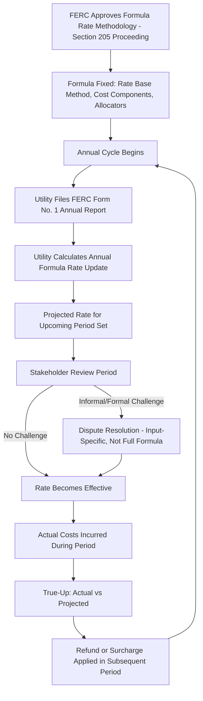

## FERC Formula Rate Mechanics for Transmission

### Definition and Regulatory Context

FERC Formula Rate Mechanics for Transmission refers to the methodology by which the Federal Energy Regulatory Commission (FERC) permits transmission-owning utilities to set and annually update their transmission rates through a pre-approved mathematical formula, rather than through a full, litigated rate case (a Section 205 filing under the Federal Power Act) each time costs change. Under a formula rate, the rate design and cost components are fixed and approved in advance, while the actual dollar inputs (rate base, expenses, rate of return) are updated annually using the utility's actual or projected financial data, producing a new transmission rate each year without a new general rate proceeding.

**Key Points**

- Formula rates are distinct from "stated" or "fixed" transmission rates, which remain unchanged until a new Section 205 filing is made.
- FERC-jurisdictional transmission formula rates commonly apply to transmission owners participating in Regional Transmission Organizations (RTOs) or Independent System Operators (ISOs), such as PJM, MISO, SPP, ISO-NE, and NYISO, where transmission cost recovery is embedded in the RTO's Open Access Transmission Tariff (OATT) or a transmission owner's own formula rate protocols.
- The formula itself, once approved by FERC, is generally not re-litigated annually; instead, the annual "true-up" process updates only the numerical inputs, subject to challenge only on the basis of whether the formula was correctly applied.

### Why Transmission Rates Commonly Use a Formula Structure

**Continuous, Large-Scale Capital Investment**

Transmission capital investment (new lines, substations, reliability and interconnection-related upgrades) is often ongoing and substantial, driven by system reliability needs, generation interconnection queues, and regional transmission planning processes. [Inference] A formula rate is generally understood to reduce the administrative burden of updating rates to reflect this continuous investment, since re-litigating a full transmission rate case annually for every transmission owner would impose significant regulatory and administrative costs on FERC, transmission owners, and stakeholders alike; the specific magnitude of this administrative benefit is not independently quantified here and should be understood as the commonly cited rationale rather than a precisely measured figure.

**RTO/ISO Market Design Compatibility**

In RTO/ISO regions, transmission formula rates integrate with the RTO's tariff structure, allowing:

- Multiple transmission owners within a single RTO footprint to have individually calculated, formula-based rates reflecting their own specific costs.
- The RTO to allocate and bill transmission costs to load-serving entities and other users based on a regionally consistent cost allocation methodology, while each transmission owner's underlying formula rate determines its own revenue requirement contribution.

**Reduced Litigation Frequency**

Once a formula rate methodology is approved by FERC (including the specific cost components, rate base treatment, and return calculation), subsequent years' rate changes are implemented through an administrative "annual update" process rather than a new full rate case, though the formula itself remains subject to challenge through complaint proceedings if a party believes it produces an unjust or unreasonable result.

### Core Components of a Transmission Formula Rate

**1. Rate Base**

The transmission formula rate typically calculates a "net transmission plant" rate base, generally following FERC Uniform System of Accounts conventions, including:

- Gross transmission plant in service, less accumulated depreciation.
- Construction Work in Progress (CWIP), where FERC permits inclusion (varies by specific formula rate protocol and whether the transmission owner has obtained CWIP incentive treatment).
- Working capital allowance, often calculated via a lead-lag study or a simplified formula (e.g., 1/8 of O&M expenses, a common convention though not universal).
- Less accumulated deferred income taxes (ADIT), which reduces rate base to reflect the cost-free capital represented by deferred tax liabilities.

$$Rate\ Base_{transmission} = Gross\ Plant - Accumulated\ Depreciation + CWIP\ (if\ eligible) + Working\ Capital - ADIT$$

**2. Return Component**

$$Return = Rate\ Base \times Weighted\ Average\ Cost\ of\ Capital\ (WACC)$$

Where WACC blends the FERC-approved capital structure (debt/equity ratio) and cost rates:

$$WACC = (D\% \times r_d) + (E\% \times ROE)$$

The Return on Equity (ROE) is typically the most contested formula input, often set through separate FERC ROE proceedings (which may apply a discounted cash flow or multi-model methodology) and incorporated into the formula rate as an approved percentage, sometimes with an incentive adder for specific FERC-incentivized investments (e.g., new technology deployment, RTO participation incentives).

**3. Depreciation Expense**

Calculated using FERC-approved depreciation rates by plant account, applied to the relevant gross plant balances.

**4. Operating and Maintenance (O&M) Expense**

Transmission-related O&M, typically derived from the utility's FERC Form No. 1 annual report data, allocated to transmission function using standard FERC cost allocation factors (e.g., the "transmission wages and salaries" or "plant" allocators common in Form No. 1-based formulas).

**5. Taxes**

Income tax expense (federal and state), calculated using the formula rate's specified tax rate and rate base/capital structure inputs, and other taxes (property tax, payroll tax) as applicable.

**6. Administrative and General (A&G) Expense Allocation**

A allocated share of the utility's general corporate overhead costs, typically allocated to the transmission function using a standard allocator (often a "wages and salary" or "labor-related" ratio between transmission and total company).

### The Formula Rate Revenue Requirement

$$RR_{transmission} = (Rate\ Base \times WACC) + Depreciation + O\&M_{transmission} + Taxes + A\&G\ Allocation$$

**Example**

A transmission owner's formula rate inputs for a given year:

- Net transmission rate base: $2.5 billion
- WACC: 7.2% (blending a 12.5% ROE and a 4.5% cost of debt at a 50/50 capital structure, illustrative figures)
- Depreciation expense: $110 million
- Transmission O&M: $45 million
- Income and other taxes: $60 million
- Allocated A&G: $20 million

$$RR = (\$2.5B \times 0.072) + \$110M + \$45M + \$60M + \$20M = \$180M + \$110M + \$45M + \$60M + \$20M = \$415M$$

This $415 million annual transmission revenue requirement is then divided by the billing determinant (typically coincident peak demand, or "CP," allocated across the transmission owner's zone) to produce the actual $/kW-month or $/MWh transmission rate charged to transmission customers.

$$Transmission\ Rate_{\$/kW\text{-}month} = \frac{RR_{transmission}}{12\text{-}CP\ or\ 1\text{-}CP\ Billing\ Demand}$$

### The Annual Update ("True-Up") Process

**Key Points**

- Most FERC-approved transmission formula rate protocols include an annual filing (often made each spring or summer, reflecting the prior calendar or fiscal year's actual data) that recalculates the formula rate inputs based on actual FERC Form No. 1 data, replacing the prior year's projected or "placeholder" rate.
- Many formulas use a **projected-then-trued-up structure**: the rate charged during a given year is based on a *projection* (often the prior year's actual data, escalated, or a current-year budget), and a subsequent true-up compares actual costs incurred to the projection, refunding or surcharging the difference (with interest) in a later period.
- This combination of projection and true-up is designed to balance rate stability and predictability (avoiding large swings based purely on trailing historical data) with accuracy (ensuring the utility ultimately recovers, but does not over-recover, its actual formula-calculated revenue requirement).

$$True\text{-}Up\ Adjustment = (Actual\ RR - Projected\ RR\ Billed) \times (1 + Interest\ Rate)$$

**Example**

A transmission owner's formula rate for Year 2 is initially set using a projection based on Year 1 actual costs escalated by expected capital additions, producing a projected annual revenue requirement of $400 million. Once Year 2 actual data becomes available (typically via the following year's FERC Form No. 1 filing), the true-up calculation shows actual Year 2 costs support a $415 million revenue requirement. The $15 million shortfall (plus FERC-specified interest) is recovered through an adjustment to a subsequent year's rate.

### Stakeholder Review Process

**Key Points**

- FERC-jurisdictional formula rates typically include a stakeholder review process, often involving an annual filing that is posted for review, with a defined period (e.g., 30–90 days) during which transmission customers, state commissions, and other stakeholders can review the inputs and raise informal or formal challenges.
- Challenges to a formula rate annual update are generally limited to whether the formula was *correctly applied* to the input data (a "formula rate protocol" or "implementation" dispute), as opposed to a broader challenge to whether the underlying formula itself (rate base treatment, cost allocators, ROE methodology) is just and reasonable — the latter requiring a separate Section 205 or Section 206 proceeding to change the formula itself.
- Many formula rate protocols include a structured Informal Challenge and, if unresolved, Formal Challenge process at FERC, which can result in a technical conference, settlement, or litigated resolution regarding a specific disputed input (e.g., a disputed A&G allocator, a disputed CWIP inclusion, or a disputed classification of a specific cost as transmission versus distribution function).

### Illustrative Annual Formula Rate Cycle

### Illustration: Formula Rate Revenue Requirement Build-Up (svg_diagram)

<svg xmlns="http://www.w3.org/2000/svg" viewBox="0 0 760 340">
<text x="380" y="26" text-anchor="middle" font-size="15" font-weight="bold" fill="#1a1a1a">Transmission Formula Rate Revenue Requirement (svg_diagram)</text>
<line x1="60" y1="290" x2="720" y2="290" stroke="#333" stroke-width="1.5" />
<rect x="80" y="150" width="90" height="140" fill="#4a7fb5" />
<text x="125" y="145" text-anchor="middle" font-size="11">$180M</text>
<text x="125" y="308" text-anchor="middle" font-size="10">Return</text>
<text x="125" y="320" text-anchor="middle" font-size="10">(RB × WACC)</text>
<rect x="190" y="105" width="90" height="45" fill="#6fa8dc" />
<text x="235" y="100" text-anchor="middle" font-size="11">+$110M</text>
<text x="235" y="308" text-anchor="middle" font-size="10">Depreciation</text>
<rect x="300" y="80" width="90" height="25" fill="#93c47d" />
<text x="345" y="75" text-anchor="middle" font-size="11">+$45M</text>
<text x="345" y="308" text-anchor="middle" font-size="10">O&amp;M</text>
<rect x="410" y="45" width="90" height="35" fill="#f6b26b" />
<text x="455" y="40" text-anchor="middle" font-size="11">+$60M</text>
<text x="455" y="308" text-anchor="middle" font-size="10">Taxes</text>
<rect x="520" y="30" width="90" height="15" fill="#c27ba0" />
<text x="565" y="25" text-anchor="middle" font-size="11">+$20M</text>
<text x="565" y="308" text-anchor="middle" font-size="10">A&amp;G Allocation</text>
<rect x="630" y="30" width="90" height="260" fill="#2e5f8a" />
<text x="675" y="25" text-anchor="middle" font-size="12" font-weight="bold">$415M</text>
<text x="675" y="308" text-anchor="middle" font-size="10" font-weight="bold">Total RR</text>
<line x1="170" y1="150" x2="190" y2="150" stroke="#999" stroke-dasharray="3" />
<line x1="280" y1="105" x2="300" y2="105" stroke="#999" stroke-dasharray="3" />
<line x1="390" y1="80" x2="410" y2="80" stroke="#999" stroke-dasharray="3" />
<line x1="500" y1="45" x2="520" y2="45" stroke="#999" stroke-dasharray="3" />
<line x1="610" y1="30" x2="630" y2="30" stroke="#999" stroke-dasharray="3" />
</svg>

### Regulatory Review and Complaint Standards

1. **Section 205 filing to establish/modify the formula**: The transmission owner bears the burden of demonstrating the proposed formula methodology (and any changes to it) is just and reasonable when first establishing or later modifying the formula itself.
2. **Section 206 complaint to challenge an existing formula**: A customer, state commission, or other stakeholder can file a complaint challenging an existing formula rate as no longer just and reasonable, in which case the *complainant* bears the burden of demonstrating the existing rate is unjust or unreasonable (a different, generally higher burden than in a Section 205 proceeding).
3. **Annual update implementation review**: A more limited review focused on whether the formula, as previously approved, was correctly applied to that year's actual data — not a re-examination of whether the formula itself remains just and reasonable.
4. **ROE-specific proceedings**: Because ROE is often the single most consequential and contested formula input, it is frequently the subject of separate, dedicated FERC proceedings and generic policy statements addressing ROE methodology across multiple transmission owners or regions, rather than being litigated fresh in each individual formula rate case.
5. **Protocols for cost classification disputes**: Ongoing disputes often arise over whether specific costs are properly classified as "transmission" function (recoverable under the formula) versus "distribution" or "generation" function (recovered elsewhere), particularly for shared facilities or personnel.

**Example**

A formula rate protocol might specify: "The Annual Update shall be filed no later than June 1 of each year, reflecting actual data from the Company's most recently filed FERC Form No. 1. Any Interested Party may submit an Informal Challenge within 30 days of posting. Unresolved challenges may be submitted as a Formal Challenge to the Commission within 90 days, limited to questions regarding correct application of the Formula Rate, and not questions regarding the justness and reasonableness of the Formula Rate itself."

### Common Analytical and Exam-Relevant Distinctions

| Concept | Stated/Fixed Rate | Formula Rate |
| --- | --- | --- |
| Update Mechanism | New Section 205 filing required for any change | Automatic annual update using formula and current data |
| Litigation Frequency | Each rate change potentially litigated | Formula litigated once; annual updates largely administrative |
| Challenge Scope (ongoing) | Full rate case scope | Limited to correct formula application, absent a new Section 205/206 |
| Data Source | Test year, often historical with adjustments | Current/projected actual data via FERC Form No. 1, trued up |
| Primary Disputed Input | Varies broadly across full case | Often concentrated on ROE, cost classification, specific allocators |

### Jurisdictional and Structural Variation

**Key Points**

- [Unverified] Specific formula rate protocol language, annual filing deadlines, and challenge procedures vary by individual transmission owner's FERC-approved tariff and by RTO/ISO region; the specific protocol governing any given transmission owner should be consulted directly (typically filed as an attachment to the RTO's OATT or the transmission owner's own FERC-filed tariff).
- Some transmission owners operate under a "forward-looking" (fully projected, with a true-up) formula, while others use a "historical test year" (trailing actual data) formula with less or no forward projection — the specific structure affects rate stability and true-up magnitude.
- FERC's approach to ROE methodology has evolved through multiple significant proceedings and policy statements over time; the currently applicable ROE methodology and any pending or recent FERC ROE policy developments should be verified against current FERC orders rather than assumed static, given this is one of the more actively litigated and evolving areas of federal utility ratemaking.

### Next Steps

**Next Steps**

- FERC Return on Equity Methodology and Incentive Adders
- Regional Transmission Organization Cost Allocation Methods
- Construction Work in Progress (CWIP) Incentive Treatment
- FERC Form No. 1 Reporting and Cost Classification
- Section 205 vs. Section 206 Proceedings at FERC
- Transmission Incentive Rate Treatments for New Technology
- Depreciation Studies and Rate Base Composition
- Interim Rate Relief and Surcharge Mechanisms (State Analog Comparison)