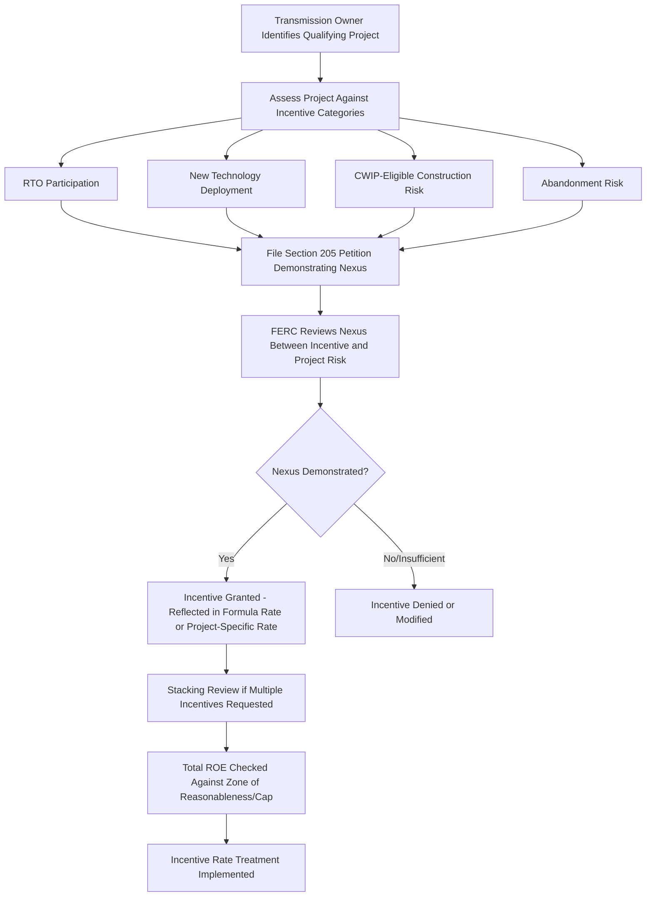

## Transmission Incentive Rate Treatments and ROE Adders

### Definition and Regulatory Context

Transmission Incentive Rate Treatments and ROE Adders are FERC-authorized mechanisms that provide financial incentives — most commonly an increase to a transmission owner's authorized Return on Equity (ROE) or favorable rate base/cost recovery treatment — to encourage specific categories of transmission investment or participation in beneficial regional transmission arrangements. These incentives were significantly expanded following the Energy Policy Act of 2005, which directed FERC to establish incentive-based rate treatments to promote capital investment in transmission infrastructure.

**Key Points**

- Incentives are applied on top of a transmission owner's "base" ROE (the return otherwise applicable to ordinary transmission investment under its formula rate or stated rate), functioning as an additive adjustment (an "adder") rather than a replacement methodology.
- The stated policy rationale is to address specific investment barriers or risks (e.g., project risk, participation disincentives, technology deployment risk) that ordinary cost-of-service ROE might not adequately compensate, thereby encouraging investment believed to provide broader reliability, economic, or public policy benefits.
- Incentive treatments require a specific, individualized showing (in a Section 205 filing) connecting the requested incentive to the qualifying project or activity, rather than being automatically available to all transmission investment.

### Statutory and Policy Foundation

**Energy Policy Act of 2005 Directive**

Congress directed FERC to establish, by rule, incentive-based rate treatments for the transmission of electric energy in interstate commerce for the purpose of benefiting consumers by ensuring reliability and reducing the cost of delivered power by reducing transmission congestion. This directive led to FERC's foundational incentives policy framework (commonly referenced by its originating order), which established the categories of available incentives and the "nexus" test connecting a requested incentive to specific investment risks or benefits.

**The Nexus Requirement**

**Key Points**

- A transmission owner seeking an incentive rate treatment must demonstrate a connection (a "nexus") between the specific incentive requested and the risks or challenges associated with the specific project for which the incentive is sought — incentives are not simply available upon request without this individualized justification.
- [Inference] This nexus requirement is understood to exist specifically to prevent incentives from becoming a routine or automatic ROE increase disconnected from any actual risk-mitigation or investment-promotion purpose, preserving the principle that incentive ROE should track a genuine, demonstrable need rather than functioning as a general rate enhancement; the specific evidentiary standard applied in any given FERC proceeding should be verified against current FERC precedent.
- FERC's approach to evaluating this nexus, and the specific categories of qualifying risk, has evolved over time through subsequent orders and policy statements.

### Common Categories of Transmission Incentives

**1. RTO/ISO Participation Adder**

An ROE adder (commonly a modest, fixed percentage addition, e.g., 50 basis points) granted to transmission owners that join and remain a member of an RTO or ISO, intended to compensate for the perceived reduction in a transmission owner's control over its own transmission assets and planning decisions that results from RTO/ISO membership, and to encourage the formation and maintenance of these regional structures.

$$ROE_{with\ RTO\ adder} = ROE_{base} + Adder_{RTO\ participation}$$

**2. New Technology / Advanced Transmission Technology Adder**

An incentive available for deployment of qualifying advanced technologies (e.g., dynamic line rating systems, advanced conductors, phase-shifting transformers, or other technologies that enhance transmission capacity, efficiency, or reliability), reflecting a policy goal of encouraging technology adoption that might otherwise be passed over in favor of conventional, lower-risk approaches.

**3. Construction Work in Progress (CWIP) in Rate Base**

Rather than (or in addition to) an ROE adder, some incentive treatments allow inclusion of Construction Work in Progress directly in rate base during construction, rather than waiting until the asset is placed in service, which improves the utility's cash flow and reduces Allowance for Funds Used During Construction (AFUDC) accrual, indirectly lowering the ultimate cost of the project.

$$Rate\ Base_{with\ CWIP\ incentive} = Net\ Plant\ in\ Service + CWIP$$

**4. Abandoned Plant Recovery**

An incentive allowing recovery of prudently incurred costs for a transmission project that is cancelled or abandoned for reasons beyond the utility's control (e.g., a siting denial, a change in regional need), addressing what would otherwise be a significant disincentive to pursuing large, higher-risk transmission projects, since ordinary ratemaking would typically not allow recovery of costs for a project never placed in service.

**5. Hypothetical Capital Structure or Accelerated Depreciation**

Less common than ROE adders, but some incentive packages have included a more favorable (higher equity ratio) hypothetical capital structure or accelerated depreciation schedule for a specific qualifying project, both of which increase near-term cost recovery relative to standard treatment.

**6. Independent Transmission Provider/Operator Incentives**

Additional adders historically available to transmission owners that turn over operational control of their transmission facilities to an independent entity (such as an RTO/ISO or an Independent Transmission Provider), reflecting an even greater relinquishment of control than ordinary RTO membership.

### Stacking of Incentives

**Key Points**

- Multiple incentives can potentially be requested and combined ("stacked") for a single qualifying project, subject to an overall reasonableness review and, in some FERC precedent, a cap on the *total* combined ROE (base ROE plus all stacked adders) to prevent an unreasonably high overall return.
- FERC has, in various proceedings, examined whether the cumulative effect of stacked incentives remains just and reasonable, particularly focusing on whether the total ROE (inclusive of all adders) stays within a "zone of reasonableness" informed by the applicable ROE methodology for comparable-risk companies.

$$Total\ Incentive\ ROE = ROE_{base} + Adder_{RTO} + Adder_{technology} + Adder_{other,\ if\ applicable} \leq Cap\ (if\ applicable)$$

**Example**

A transmission owner constructs a new extra-high-voltage transmission line to relieve regional congestion, involving deployment of qualifying advanced conductor technology. The company's base ROE (as determined through FERC's generic ROE methodology) is 10.2%. The company requests and receives:

- A 50 basis point RTO participation adder (already reflected in its ongoing formula rate).
- A 50 basis point advanced technology adder specific to this project.
- CWIP in rate base treatment during the multi-year construction period.

$$Project\ ROE = 10.2\% + 0.5\% + 0.5\% = 11.2\%$$

This 11.2% ROE, combined with CWIP inclusion (rather than AFUDC accrual) during construction, is applied specifically to the rate base associated with this project, while other, non-incentivized transmission investment by the same company continues to earn the base 10.2% ROE (plus any generally applicable RTO adder).

### Illustrative Incentive Application Process

### Illustration: Incentive ROE Stacking Structure (svg_diagram)

<svg xmlns="http://www.w3.org/2000/svg" viewBox="0 0 760 320">
<text x="380" y="26" text-anchor="middle" font-size="15" font-weight="bold" fill="#1a1a1a">Transmission Incentive ROE Stacking (svg_diagram)</text>
<line x1="80" y1="270" x2="700" y2="270" stroke="#333" stroke-width="1.5" />
<line x1="80" y1="60" x2="80" y2="270" stroke="#333" stroke-width="1.5" />
<text x="45" y="75" font-size="11">12%</text>
<text x="45" y="170" font-size="11">6%</text>
<text x="45" y="265" font-size="11">0%</text>
<rect x="250" y="120" width="120" height="150" fill="#4a7fb5" />
<text x="310" y="115" text-anchor="middle" font-size="12">10.2%</text>
<text x="310" y="288" text-anchor="middle" font-size="11">Base ROE</text>
<rect x="400" y="105" width="120" height="15" fill="#93c47d" />
<text x="460" y="100" text-anchor="middle" font-size="11">+0.5%</text>
<text x="460" y="288" text-anchor="middle" font-size="11">RTO Adder</text>
<rect x="550" y="90" width="120" height="15" fill="#e69138" />
<text x="610" y="85" text-anchor="middle" font-size="11">+0.5%</text>
<text x="610" y="288" text-anchor="middle" font-size="11">Technology Adder</text>
<line x1="370" y1="120" x2="400" y2="120" stroke="#999" stroke-dasharray="3" />
<line x1="520" y1="105" x2="550" y2="105" stroke="#999" stroke-dasharray="3" />
<line x1="610" y1="90" x2="700" y2="90" stroke="#a61c1c" stroke-dasharray="4" />
<text x="700" y="86" text-anchor="end" font-size="11" fill="#a61c1c">Total: 11.2%</text>
</svg>

### CWIP and AFUDC: A Closer Comparison

**Key Points**

- Absent a CWIP incentive, construction-period financing costs are typically capitalized as **AFUDC** (Allowance for Funds Used During Construction), which accrues (compounds) during construction and is added to the asset's rate base value once placed in service, deferring cash recovery until the asset is operational.
- With a CWIP incentive, a portion of construction costs enters rate base *during* construction, allowing the utility to earn a current cash return and begin depreciation-equivalent recovery earlier, which improves utility cash flow and can reduce the *total* eventual cost to ratepayers (since AFUDC compounding is avoided), though it shifts some cost recovery earlier in time from the ratepayer's perspective.

$$Total\ Capitalized\ Cost_{AFUDC\ method} = Construction\ Cost + Accrued\ AFUDC_{compounded}$$

$$Total\ Recovery_{CWIP\ method} = Construction\ Cost\ (recovered\ progressively,\ no\ AFUDC\ compounding)$$

### Regulatory Review and Ongoing Oversight

1. **Individualized Section 205 showing**: Each incentive request must be supported by project-specific evidence connecting the incentive to a demonstrated risk, benefit, or policy objective, rather than relying on generic industry-wide justifications.
2. **Periodic reassessment of RTO adders**: Because RTO participation is often ongoing rather than tied to a discrete project, adders tied to RTO membership are periodically reviewed, and complaints challenging the continued justification for such adders can be filed under Section 206 if circumstances change.
3. **Project completion and in-service monitoring**: For project-specific incentives, FERC and stakeholders may monitor whether the incentivized project proceeds as represented (e.g., whether a technology-adder project is actually deploying the qualifying technology as described in the original filing).
4. **Interaction with state siting/CPCN processes**: Transmission incentive proceedings at FERC are procedurally separate from state-level project siting or Certificate of Public Convenience and Necessity approvals, though the practical viability of a project often depends on both federal rate incentive treatment and state siting approval.
5. **Total return reasonableness**: FERC retains authority to review whether the cumulative incentive-adjusted ROE remains within a just and reasonable range, particularly as generic base ROE levels themselves change over time through separate ROE methodology proceedings.

**Example**

A FERC order granting incentives might state: "The Commission finds that Applicant has demonstrated the requisite nexus between the requested 50 basis point adder and the risks associated with deploying [qualifying technology] on the Project. The Commission grants CWIP in rate base treatment for the Project during its construction period, finding that this treatment will reduce the ultimate cost to customers by avoiding AFUDC accrual, consistent with the purposes of the Energy Policy Act of 2005."

### Common Analytical and Exam-Relevant Distinctions

| Incentive Type | What It Addresses | Effect on Rate |
| --- | --- | --- |
| RTO Participation Adder | Reduced utility control from joining RTO/ISO | ROE adder (ongoing) |
| New Technology Adder | Risk of deploying non-conventional technology | ROE adder (project-specific) |
| CWIP in Rate Base | Construction-period cash flow/financing cost | Rate base treatment (timing shift) |
| Abandoned Plant Recovery | Risk of non-recovery if project cancelled | Contingent cost recovery right |
| Hypothetical Capital Structure | Perceived project-specific financial risk | Capital structure treatment |

### Jurisdictional and Precedential Variation

**Key Points**

- [Unverified] FERC's specific incentive policy framework, the categories of available incentives, and the evidentiary standard for demonstrating "nexus" have evolved through multiple orders and policy statements since the Energy Policy Act of 2005's initial directive; the currently applicable policy framework and any pending reconsideration should be verified against current FERC orders and policy statements rather than assumed static, since this is an area of continuing FERC policy development.
- The availability and typical magnitude of specific adders (e.g., the RTO participation adder basis-point level) can vary based on FERC precedent applicable at the time of a given filing and may be affected by subsequent generic FERC proceedings addressing incentive policy broadly.
- Judicial review of FERC incentive orders (through appeals to federal circuit courts) has, in some instances, addressed the sufficiency of FERC's nexus findings, meaning the applicable legal standard can be refined through case law over time in addition to FERC's own orders.

### Next Steps

**Next Steps**

- FERC Formula Rate Mechanics for Transmission
- FERC Return on Equity Methodology and the Discounted Cash Flow Model
- Regional Transmission Organization Cost Allocation Methods
- Allowance for Funds Used During Construction (AFUDC) Accounting
- Section 205 vs. Section 206 Proceedings at FERC
- Transmission Siting and Certificate of Public Convenience and Necessity Processes
- Grid Modernization and AMI Cost Recovery Mechanisms (State Analog Comparison)
- Multi-Year Rate Plans and Capital Tracker Mechanisms