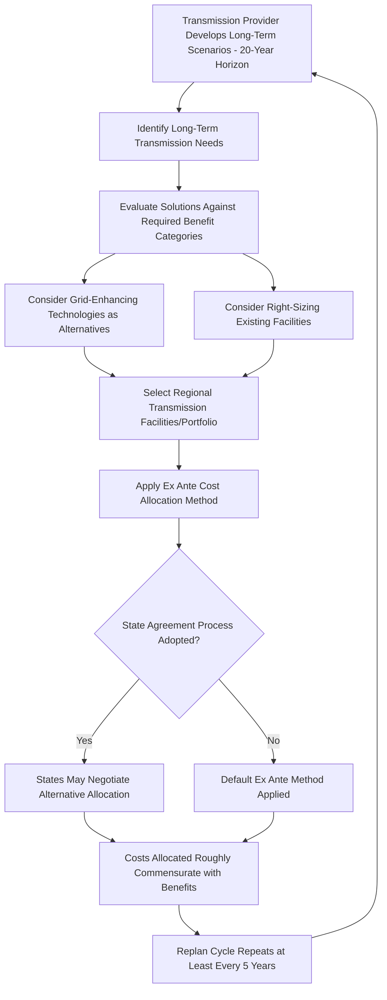

## Regional Transmission Planning and Cost Allocation Reform

### Definition and Regulatory Context

Regional Transmission Planning and Cost Allocation Reform refers to the evolving FERC framework governing how transmission providers must plan for future regional transmission needs and how the costs of new regional transmission facilities are allocated among beneficiaries. This area has been shaped historically by FERC Order No. 1000 (2011) and, most significantly and currently, by FERC Order No. 1920, issued May 13, 2024, which represents the most substantial revision to regional transmission planning and cost allocation requirements since Order No. 1000.

**Key Points**

- Order No. 1920 requires transmission providers to conduct long-term regional transmission planning over a 20-year horizon, a significant shift from the shorter planning horizons and more reactive, near-term reliability-driven planning that characterized the prior framework.
- The rule was adopted by a divided Commission on a 2-1 vote, and has been the subject of subsequent rehearing orders (Order Nos. 1920-A and 1920-B) and active judicial appeals as of early 2026 — this remains a live, evolving area of law rather than settled, uncontested policy.
- Cost allocation reform under Order 1920 centers on the principle that costs of selected transmission facilities must be allocated in a manner roughly commensurate with the benefits those facilities provide to different beneficiaries.

### Historical Foundation: Order No. 1000

**Key Points**

- Order No. 1000 (2011) established the baseline modern framework requiring transmission providers to participate in regional transmission planning processes and to have a method for allocating costs of regional transmission facilities, generally requiring that cost allocation be roughly commensurate with estimated benefits.
- Order No. 1000 also addressed elimination of a federal right of first refusal for incumbent transmission owners with respect to certain new regional transmission facilities selected in a regional plan for cost allocation purposes, opening competitive transmission development in many regions — a policy point later partially revisited by Order 1920's treatment of "right-sizing" existing facilities.
- Order No. 1920 builds upon, rather than replaces, this Order No. 1000 foundation, but substantially expands the required planning horizon, scenario analysis, and specificity of cost allocation methodology.

### Core Reforms Under Order No. 1920

**1. Mandatory Long-Term Planning Horizon**

Transmission providers must engage in long-term transmission planning over a 20-year horizon, conducted at least every five years using best available data, and must consider at least seven specified categories of factors, including state and local laws and policies relevant to future transmission needs.

**Key Points**

- This shifts planning from a predominantly short-term, reliability-driven exercise to a proactive, scenario-based approach intended to enhance grid flexibility and deliver long-term value while reducing system-wide costs.
- The long-term planning requirement is intended to better anticipate needs driven by changing resource mixes (e.g., renewable energy growth, generation retirements), demand growth (including large new loads such as data centers), and extreme weather resilience considerations.

**2. Scenario-Based Planning**

Transmission providers must develop long-term planning scenarios reflecting a range of plausible futures (e.g., varying assumptions about generation mix, demand growth, and policy developments) rather than relying on a single deterministic forecast.

**3. Benefit Evaluation and Project Selection**

Transmission providers must evaluate proposed regional transmission facilities against at least seven required categories of benefits (cost- and reliability-related) to determine whether they address identified long-term transmission needs, and must develop transparent evaluation processes and selection criteria for including projects in a long-term regional transmission plan.

**4. Right-Sizing of Existing Facilities**

The rule requires transmission providers to evaluate opportunities to meet long-term transmission needs by "right-sizing" existing transmission facilities (e.g., rebuilding an existing line to a higher voltage or capacity rather than building an entirely new facility), and establishes a federal right of first refusal for incumbent transmission owners specifically with respect to such right-sized facilities.

**5. Grid-Enhancing Technologies**

Transmission providers must consider grid-enhancing technologies — such as dynamic line ratings and advanced power control devices — as potential solutions to meet identified long-term transmission needs, reflecting a policy preference for evaluating lower-cost, faster-to-deploy alternatives alongside traditional new-build transmission.

**6. Ex Ante Cost Allocation Methods**

Transmission providers must file one or more ex ante (determined in advance, before specific projects are selected) cost allocation methods for allocating the costs of facilities, or portfolios of facilities, selected as solutions to identified long-term transmission needs, with costs allocated in a manner roughly commensurate with the benefits of the facilities.

**7. State Agreement Process**

The final rule permits, but does not require, transmission providers to include in their tariffs a "State Agreement Process" through which one or more states can agree on a separate, alternative cost allocation approach for particular projects — providing a mechanism for states to exercise greater influence over cost allocation outcomes affecting their citizens.

### Illustrative Long-Term Planning and Cost Allocation Cycle

### Illustration: Order 1000 vs. Order 1920 Planning Horizon Comparison (svg_diagram)

<svg xmlns="http://www.w3.org/2000/svg" viewBox="0 0 760 300">
<text x="380" y="26" text-anchor="middle" font-size="15" font-weight="bold" fill="#1a1a1a">Transmission Planning Horizon: Pre-1920 vs. Order 1920 (svg_diagram)</text>

<text x="180" y="60" text-anchor="middle" font-size="12" font-weight="bold">Prior Framework (Order 1000 era)</text>

<line x1="80" y1="100" x2="280" y2="100" stroke="`#4a7fb5`" stroke-width="8" />

<text x="180" y="125" text-anchor="middle" font-size="11">Shorter, more reactive</text>

<text x="180" y="140" text-anchor="middle" font-size="11">reliability-driven horizon</text>

<text x="560" y="60" text-anchor="middle" font-size="12" font-weight="bold">Order 1920 Framework</text>

<line x1="420" y1="100" x2="700" y2="100" stroke="`#2e5f8a`" stroke-width="14" />

<text x="560" y="125" text-anchor="middle" font-size="11">20-year, scenario-based,</text>

<text x="560" y="140" text-anchor="middle" font-size="11">re-evaluated at least every 5 years</text>

<text x="380" y="190" text-anchor="middle" font-size="11" fill="#555">Both retain benefit-commensurate cost allocation as a core principle</text>

<text x="380" y="210" text-anchor="middle" font-size="11" fill="#555">Order 1920 adds mandatory scenario analysis and ex ante allocation methods</text>

</svg>

### Cost Allocation: The "Roughly Commensurate with Benefits" Standard

**Key Points**

- Both Order No. 1000 and Order No. 1920 rely on the foundational principle that cost allocation must be "roughly commensurate" with benefits received — a standard that permits some approximation and flexibility rather than requiring precise, mathematically exact benefit quantification for each beneficiary.
- Order 1920's requirement for *ex ante* methods (established before specific projects are selected) is intended to increase predictability and reduce the contentious, project-by-project cost allocation disputes that had characterized implementation under the prior framework.
- Common cost allocation approaches applied within this standard include a "postage stamp" method (uniform allocation across a broad footprint, often used when benefits are diffuse and widely shared), a "beneficiary pays" or "usage-based" method tied to load flow or reliability benefit studies, and hybrid approaches (e.g., a "highway/byway" method distinguishing higher-voltage regional facilities from more localized facilities).

$$Allocated\ Cost_{beneficiary} = Total\ Project\ Cost \times \frac{Benefit_{beneficiary}}{Total\ Quantified\ Benefit_{all\ beneficiaries}}$$

### Voluntary Funding Mechanisms

**Key Points**

- Order 1920 includes provisions addressing voluntary funding, allowing certain parties (which can include state entities or other stakeholders) to fund transmission facilities or portions of facilities beyond what an involuntary, ex ante cost allocation method would otherwise assign to them.
- This is intended to provide additional flexibility where a state or other party sees value in a project beyond what a regional cost allocation formula captures, without requiring FERC to mandate that value be captured within the formula itself.

### Interaction with State Regulatory Authority

**Key Points**

- A central point of contention in Order 1920 concerns the balance between FERC's transmission planning and cost allocation authority and states' traditional role in transmission siting, resource planning, and consumer protection.
- The rule formalizes opportunities for "Relevant State Entities" to have input into planning and cost allocation processes, and the subsequent Order No. 1920-B rehearing order addressed and largely upheld the rule's requirement that transmission providers file state cost allocation agreements, rejecting arguments from some transmission owners that this requirement improperly impinges on their rights.
- [Unverified] One dissenting FERC commissioner argued at the time of adoption that the rule exceeds FERC's legal authority and does not adequately preserve the existing role of states in transmission planning, raising concerns about ratepayers being required to fund transmission expansion for commercial customers such as data centers; these are contested legal and policy positions actively being litigated on appeal, not settled conclusions, and the current status of these arguments should be verified against the most recent appellate developments.

### Current Implementation Status and Ongoing Developments

**Key Points**

- [Unverified] As of early 2026, Order No. 1920 has been subject to numerous rehearing requests — ranging from stakeholders seeking modest adjustments to those seeking wholesale rejection of the rule — and FERC has issued subsequent orders (1920-A and 1920-B) responding to these requests, including upholding the rule's state cost allocation agreement filing requirement.
- The order is also facing active judicial appeals, with FERC defending the rule's transmission planning and cost allocation changes as within its statutory authority, characterizing it as building on the precedent established by prior landmark rulemakings.
- Individual RTOs and ISOs (including MISO, SPP, NYISO, and ISO-NE) are in varying stages of developing and filing their own compliance proposals to implement Order 1920's requirements within their specific regional planning processes, and some subregions (for example, discussions regarding a distinct cost allocation design for certain MISO South subregion projects) are exploring subregion-specific approaches within the broader framework.
- Given the pace of ongoing rehearing orders, appellate litigation, and RTO-specific compliance filings, the current, authoritative implementation status in any specific region should be verified against the most recent FERC orders and that region's compliance filings rather than treated as fully settled.

### Regulatory Review and Compliance Process

1. **Compliance Filing Requirement**: Each affected transmission provider or RTO/ISO must submit a compliance filing to FERC demonstrating how its planning processes and tariff provisions satisfy Order 1920's requirements, which FERC then reviews and may accept, reject, or direct further modification.
2. **Stakeholder Process within RTOs/ISOs**: RTOs and ISOs typically develop their Order 1920 compliance proposals through their own stakeholder governance processes before filing with FERC, allowing transmission owners, state commissions, and other market participants to weigh in on regional-specific implementation choices.
3. **Rehearing and Appeal Process**: As with any FERC rulemaking, affected parties may seek rehearing at FERC and, following FERC's rehearing order, may pursue judicial review in federal appellate courts, a process actively underway for Order 1920 as of this writing.
4. **State Agreement Process Adoption Decisions**: Where a transmission provider's tariff includes the optional State Agreement Process, relevant states must engage in a defined process to reach agreement on an alternative cost allocation approach for qualifying projects, subject to FERC review of any resulting agreement.

### Common Analytical and Exam-Relevant Distinctions

| Concept | Order No. 1000 (2011) | Order No. 1920 (2024) |
| --- | --- | --- |
| Planning Horizon | Shorter-term, less standardized | Mandatory 20-year horizon, revisited at least every 5 years |
| Planning Approach | Less scenario-driven | Mandatory scenario-based planning |
| Cost Allocation Timing | Often determined project-by-project | Ex ante methods required in advance |
| Right of First Refusal | Largely eliminated for new regional facilities | Reinstated specifically for right-sized existing facilities |
| Technology Consideration | Not specifically mandated | Grid-enhancing technologies must be considered |
| State Role | General participation | Formalized "Relevant State Entity" input; optional State Agreement Process |
| Status as of Early 2026 | Settled, foundational precedent | Subject to active rehearing and judicial appeal |

### Next Steps

**Next Steps**

- FERC Formula Rate Mechanics for Transmission
- Transmission Incentive Rate Treatments and ROE Adders
- Order No. 1000 Foundational Principles and Competitive Transmission Development
- Grid-Enhancing Technologies and Dynamic Line Rating Adoption
- Federal Right of First Refusal and Right-Sizing of Existing Facilities
- State Agreement Process and Multi-State Cost Allocation Negotiation
- Large Load Interconnection and Data Center-Driven Transmission Demand
- Section 205 vs. Section 206 Proceedings at FERC