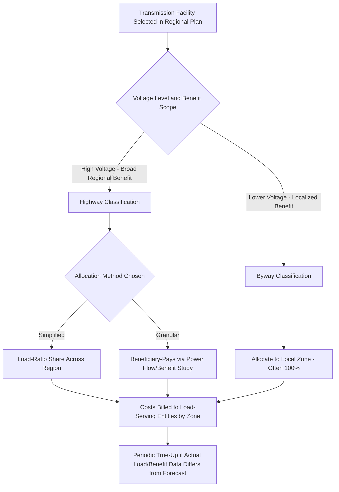

## Highway/Byway and Other Allocation Methodologies

### Definition and Regulatory Context

Highway/Byway and Other Allocation Methodologies are the specific cost-allocation formulas used to distribute transmission facility costs among beneficiaries (load-serving entities, states, or zones) within an RTO/ISO or across a broader planning region. These methodologies operationalize the general FERC standard that costs be allocated "roughly commensurate with benefits," translating that principle into a concrete mathematical formula applicable to specific voltage classes or facility types. Highway/byway is one of the most widely referenced approaches, but it exists alongside several other common methodologies, each reflecting different assumptions about how transmission benefits are distributed geographically.

**Key Points**

- No single cost allocation methodology is mandated by FERC across all regions — each RTO/ISO or transmission provider develops and files its own methodology (or methodologies, often varying by voltage level or project type) for FERC approval, subject to the "roughly commensurate with benefits" standard.
- Highway/byway is specifically a **voltage-tiered** approach, distinguishing higher-voltage "highway" facilities (presumed to provide broad, regional benefit) from lower-voltage "byway" facilities (presumed to provide more localized benefit).
- These methodologies are the practical mechanism through which the "ex ante cost allocation methods" required under FERC Order No. 1920 are actually defined and applied within a given region.

### The Highway/Byway Methodology

**Core Concept**

Highway/byway cost allocation is based on the premise that transmission facilities at different voltage levels serve fundamentally different geographic scopes of benefit:

- **"Highway" facilities** — typically very high-voltage transmission lines (e.g., 345 kV and above, though the specific threshold varies by region) — are presumed to provide broad, region-wide reliability and economic benefits (relieving congestion, enabling power transfers across a wide area, supporting regional resource integration) and are therefore allocated across a wide footprint, often the entire RTO/ISO region or a large sub-region, typically on a load-ratio share basis.
- **"Byway" facilities** — lower-voltage transmission facilities — are presumed to provide more localized benefit and are allocated to a narrower set of beneficiaries, often the specific transmission zone or utility area where the facility is located.

$$Allocated\ Highway\ Cost_{zone} = Total\ Highway\ Cost \times \frac{Zone\ Load\ Ratio\ Share}{Total\ Regional\ Load}$$

$$Allocated\ Byway\ Cost_{zone} = Total\ Byway\ Cost\ (typically\ allocated\ 100\%\ within\ the\ local\ zone)$$

**Example**

A regional planning entity approves a new 500 kV transmission line (a "highway" facility) costing $300 million, intended to relieve regional congestion and facilitate renewable resource integration across the broader footprint. Applying a load-ratio share allocation across the region's 10 load zones (each representing between 5% and 15% of total regional load), a zone representing 10% of total load would be allocated:

$$Allocated\ Cost_{zone} = \$300M \times 0.10 = \$30M$$

By contrast, a 138 kV upgrade (a "byway" facility) costing $20 million, built specifically to serve local load growth within a single utility's zone, would typically be allocated entirely (100%) to that zone, since its benefits are not regionally diffuse.

### Load-Ratio Share Allocation

**Key Points**

- Load-ratio share is one of the most common allocation bases for broadly beneficial ("highway"-type) facilities, allocating cost in proportion to each zone's or state's share of total system load (energy or coincident peak demand).
- This approach reflects a simplifying assumption that broad regional reliability and economic benefits scale roughly with the amount of load a zone represents, rather than requiring a detailed, facility-specific benefit study for every beneficiary.
- Load-ratio share can be calculated using different load measures (e.g., annual energy, single coincident peak, 12-month coincident peak average), and the specific measure chosen can meaningfully affect the resulting allocation, particularly for zones with different load shapes (e.g., a zone with a sharper summer peak versus one with a flatter load profile).

$$Load\ Ratio\ Share_{zone} = \frac{Zone\ Load\ (chosen\ measure)}{Total\ System\ Load\ (same\ measure)}$$

### Beneficiary-Pays / Usage-Based Allocation

**Key Points**

- A more granular alternative to load-ratio share, beneficiary-pays allocation attempts to directly measure and allocate cost according to each party's *quantified* benefit from a specific project, often derived from power flow studies, production cost modeling, or reliability benefit metrics specific to that facility.
- This approach is generally considered more precisely aligned with the "commensurate with benefits" standard but requires significantly more detailed technical analysis for each project, and can be more contentious since stakeholders may dispute the modeling assumptions underlying the benefit calculation.
- Common quantified benefit metrics include avoided production cost (savings from more efficient generation dispatch enabled by the new facility), reliability benefit (avoided reliability violations or reduced loss-of-load probability), and capacity benefit (reduced need for local capacity resources).

$$Allocated\ Cost_{beneficiary} = Total\ Project\ Cost \times \frac{Quantified\ Benefit_{beneficiary}}{\sum Quantified\ Benefit_{all\ beneficiaries}}$$

### Postage Stamp Allocation

**Key Points**

- The postage stamp method allocates cost uniformly across the entire footprint (often on a load-ratio share basis, similar to the highway component of highway/byway), regardless of a specific beneficiary's proximity to or direct usage of a given facility — much like a postage stamp costs the same regardless of the distance a letter travels.
- This approach is administratively simple and reflects a policy judgment that certain transmission investments (particularly high-voltage backbone infrastructure) provide diffuse, region-wide benefit that is impractical or unnecessary to precisely quantify beneficiary-by-beneficiary.
- Postage stamp allocation is sometimes criticized by parties in low-benefit zones as failing to reflect genuinely differentiated benefit, which is part of why hybrid approaches like highway/byway emerged — combining postage-stamp-like treatment for genuinely broad facilities with more localized allocation for narrower-benefit facilities.

### Hybrid and Region-Specific Variations

**Key Points**

- Many RTOs/ISOs use hybrid methodologies that combine elements of the above approaches, varying by voltage threshold, project type (reliability versus economic versus public policy-driven), or even by specific sub-regional agreement.
- Some regions apply different allocation percentages by voltage tier rather than a strict binary highway/byway split — for example, a facility at an intermediate voltage level might be allocated using a blended formula (e.g., a specified percentage allocated regionally via load-ratio share, with the remainder allocated locally).
- "Solution-based" or "portfolio-based" allocation, increasingly relevant under FERC Order 1920's ex ante methods requirement, may allocate the cost of an entire selected portfolio of facilities (rather than facility-by-facility) using a single methodology reflecting the portfolio's aggregate, diversified set of benefits.

### Illustrative Cost Allocation Decision Framework

### Illustration: Highway/Byway Allocation Structure (svg_diagram)

<svg xmlns="http://www.w3.org/2000/svg" viewBox="0 0 760 320">
<text x="380" y="26" text-anchor="middle" font-size="15" font-weight="bold" fill="#1a1a1a">Highway/Byway Cost Allocation Structure (svg_diagram)</text>

<line x1="60" y1="90" x2="700" y2="90" stroke="#2e5f8a" stroke-width="10" />
<text x="380" y="75" text-anchor="middle" font-size="12" font-weight="bold" fill="#2e5f8a">HIGHWAY (500 kV) — Regional, Load-Ratio Share Allocation</text>

<rect x="80" y="140" width="140" height="90" fill="none" stroke="#4a7fb5" stroke-width="2" />
<text x="150" y="165" text-anchor="middle" font-size="11" font-weight="bold">Zone A</text>
<text x="150" y="182" text-anchor="middle" font-size="10">10% load share</text>
<text x="150" y="198" text-anchor="middle" font-size="10">Highway: $30M</text>
<line x1="150" y1="90" x2="150" y2="140" stroke="#2e5f8a" stroke-width="3" />
<rect x="310" y="140" width="140" height="90" fill="none" stroke="#4a7fb5" stroke-width="2" />
<text x="380" y="165" text-anchor="middle" font-size="11" font-weight="bold">Zone B</text>
<text x="380" y="182" text-anchor="middle" font-size="10">15% load share</text>
<text x="380" y="198" text-anchor="middle" font-size="10">Highway: $45M</text>
<line x1="380" y1="90" x2="380" y2="140" stroke="#2e5f8a" stroke-width="3" />
<rect x="540" y="140" width="140" height="90" fill="none" stroke="#4a7fb5" stroke-width="2" />
<text x="610" y="165" text-anchor="middle" font-size="11" font-weight="bold">Zone C</text>
<text x="610" y="182" text-anchor="middle" font-size="10">8% load share</text>
<text x="610" y="198" text-anchor="middle" font-size="10">Highway: $24M</text>
<line x1="610" y1="90" x2="610" y2="140" stroke="#2e5f8a" stroke-width="3" />

<rect x="330" y="245" width="100" height="35" fill="#e69138" />
<text x="380" y="267" text-anchor="middle" font-size="10" fill="white">Byway (138kV)</text>
<text x="380" y="298" text-anchor="middle" font-size="10">Zone B only: 100% local — $20M</text>
</svg>

### Regulatory Review and Cost Allocation Disputes

**Key Points**

- FERC review of a proposed or existing cost allocation methodology under Section 205 (to establish or change it) versus Section 206 (to challenge an existing one as no longer just and reasonable) follows the same asymmetric burden-of-proof framework applicable to other FERC-jurisdictional rate matters, with the party proposing a change to an established methodology or challenging it as unjust bearing the relevant burden.
- Common disputes center on: the choice of voltage threshold separating "highway" from "byway" facilities; the specific load measure used for load-ratio share calculations; whether a specific facility's benefits are genuinely regional versus local (i.e., is the voltage-based classification actually a good proxy for benefit scope in this instance); and how to allocate the cost of facilities whose benefits are genuinely mixed (partly broad, partly localized).
- [Inference] Voltage-based proxies like highway/byway are administratively efficient because they avoid a detailed benefit study for every facility, but this efficiency comes at the cost of potential mismatch between the voltage-based classification and a given facility's actual benefit distribution in specific cases; this tradeoff is a recurring theme in stakeholder and judicial challenges to voltage-tiered allocation methods, though the degree to which any specific challenge succeeds depends on the specific facts and applicable FERC precedent.
- State regulators, particularly under FERC Order 1920's formalized "Relevant State Entity" input process and optional State Agreement Process, may seek to negotiate allocation outcomes that depart from a region's default ex ante methodology for specific projects.

**Example**

A state regulatory body might affirm a region's continued use of highway/byway cost allocation for long-term regional transmission projects while separately negotiating, through a State Agreement Process, an alternative allocation for a specific large project believed to have a benefit distribution not well captured by the default voltage-based classification.

### Common Analytical and Exam-Relevant Distinctions

| Methodology | Basis for Allocation | Administrative Complexity | Typical Use Case |
| --- | --- | --- | --- |
| Highway/Byway | Voltage tier as proxy for benefit scope | Moderate | Regions with clear voltage-based benefit distinction |
| Load-Ratio Share (pure) | Zone's share of total system load | Low | Broadly beneficial, region-wide facilities |
| Postage Stamp | Uniform allocation across footprint | Low | Backbone infrastructure with diffuse benefit |
| Beneficiary-Pays / Usage-Based | Quantified project-specific benefit study | High | Facilities with clearly differentiated, quantifiable benefits |
| Hybrid/Portfolio-Based | Blended or portfolio-level formula | Variable, often high | Complex regional plans with mixed facility types |

### Jurisdictional and Regional Variation

**Key Points**

- [Unverified] The specific voltage threshold distinguishing "highway" from "byway" facilities, the specific load measure used, and whether a region uses highway/byway at all (as opposed to a different primary methodology) vary significantly by RTO/ISO and are subject to the specific FERC-approved tariff provisions in that region; current tariff language should be consulted for any specific region rather than assuming a universal threshold or formula.
- Some regions have historically been associated with highway/byway-style approaches for certain voltage classes, while others rely more heavily on beneficiary-pays or hybrid approaches; regional practice can also change over time through FERC filings, particularly as regions develop their ex ante methodologies to comply with FERC Order No. 1920.
- Given the active, ongoing implementation of Order 1920 across multiple regions as of this writing, specific regions' cost allocation methodologies for long-term regional transmission facilities may be in the process of being revised, and the most current compliance filings for a given region should be consulted for up-to-date methodology details.

### Next Steps

**Next Steps**

- Regional Transmission Planning and Cost Allocation Reform
- FERC Formula Rate Mechanics for Transmission
- Transmission Incentive Rate Treatments and ROE Adders
- Order No. 1000 Foundational Principles and Competitive Transmission Development
- Load-Ratio Share Calculation Methods and Coincident Peak Measurement
- State Agreement Process and Multi-State Cost Allocation Negotiation
- Grid-Enhancing Technologies and Dynamic Line Rating Adoption
- Section 205 vs. Section 206 Proceedings at FERC