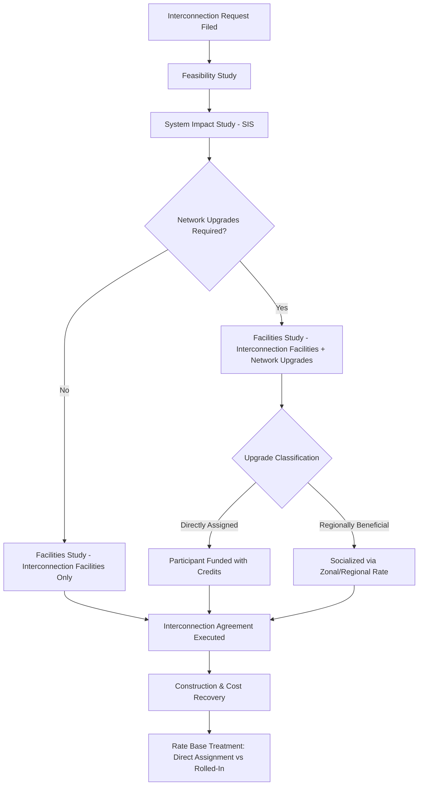

## Interconnection Cost Responsibility

### Definition and Regulatory Context

Interconnection cost responsibility refers to the framework governing how costs of connecting a new generation facility, load, or transmission asset to the transmission grid are allocated between the interconnecting party and the transmission owner/ratepayers. This determines which costs are borne by the interconnection customer directly and which are rolled into the transmission rate base for recovery from all transmission customers.

The framework sits at the intersection of FERC Order No. 2003 (generator interconnection), Order No. 845 (interconnection reform), Order No. 2023 (interconnection queue reform), and each transmission provider's Open Access Transmission Tariff (OATT) or Large/Small Generator Interconnection Agreement (LGIA/SGIA) procedures.

### Core Cost Categories

**Key Points**

- **Interconnection Facilities**: Equipment required solely to physically connect the customer's facility to the transmission system (e.g., a dedicated tap, switchyard, or radial line). Typically 100% customer-funded.
- **Network Upgrades**: Additions or modifications to the existing transmission system needed to accommodate the interconnection reliably (e.g., reconductoring, new breakers, substation upgrades). Often eligible for cost allocation beyond the single customer via crediting mechanisms.
- **Distribution Upgrades**: Analogous concept at the distribution level for smaller/distributed generation interconnections, governed by state-jurisdictional rules rather than FERC.
- **Direct Assignment Facilities**: Facilities that benefit only the interconnecting customer and are directly assigned regardless of whether they are technically classified as network upgrades.

### Cost Responsibility Models

$$\text{Total Interconnection Cost} = C_{IF} + C_{NU} - R_{credit}$$

Where $C_{IF}$ is interconnection facilities cost, $C_{NU}$ is network upgrade cost, and $R_{credit}$ is any refund/credit mechanism applied.

#### 1. Participant Funding (Traditional/"Causer Pays")

The interconnection customer funds 100% of both interconnection facilities and network upgrades upfront, typically through a security deposit and construction agreement. The customer may receive **transmission credits** — repayment over time (commonly 5 years under standard LGIA pro forma) if the network upgrades also benefit other transmission customers or are later used by others.

**Example**

A 200 MW wind facility requires $40 million in network upgrades to a shared 230 kV bus. Under participant funding:

- Customer pays $40M upfront as a condition of interconnection.
- Transmission owner credits the customer's transmission service payments over 5 years, or refunds the unused balance with interest if the facility does not consume the full credit through transmission usage.

#### 2. Postage-Stamp / Socialized Cost Allocation

Costs of network upgrades (particularly for regionally significant upgrades identified in RTO/ISO planning processes) are allocated across a broader zone or footprint via a uniform rate ($/MWh or $/kW-year), rather than assigned to the single interconnecting customer. This is common for upgrades meeting a "regional benefit" or reliability threshold under RTO Order No. 1000 frameworks.

#### 3. Hybrid / RTO-Specific Models

Most RTOs (MISO, PJM, SPP, CAISO, ERCOT) use hybrid frameworks distinguishing:

- **Attachment Facilities** — customer-funded, no refund.
- **Network Upgrades below a MW/cost threshold** — participant-funded with credits.
- **Baseline Reliability Projects / Network Upgrades identified independently of the interconnection request** — socialized across the region, since these would have been needed regardless of the specific interconnection.

[Inference] The specific threshold triggering socialization versus direct assignment varies significantly by RTO tariff and is subject to periodic FERC-approved revisions, so practitioners should verify current tariff language rather than assume a fixed MW threshold applies uniformly.

### Interconnection Queue and Cost Allocation Workflow

### Rate Base Treatment Implications

Once interconnection-related facilities are placed in service, their treatment in the transmission rate base diverges based on funding source:

- **Customer-funded facilities** (participant-funded, no future credit obligation): Typically **excluded** from rate base since the customer, not ratepayers, bore the capital cost — avoiding a double recovery where the utility would earn a return on assets it did not finance.
- **Utility-funded network upgrades** (via socialized allocation or upfront TO funding with customer reimbursement via transmission service rates): **Included** in rate base, generating a return on the depreciated original cost consistent with standard cost-of-service ratemaking.
- **Contributions in Aid of Construction (CIAC)**: Cash payments from the interconnection customer may be netted against gross plant investment, reducing the rate base addition dollar-for-dollar, subject to tax treatment under IRC Section 118 [Unverified — tax treatment of CIAC has shifted with legislative changes and IRS guidance and should be confirmed against current tax code].

### Illustrative Cost Responsibility Structure (SVG Diagram)

<svg xmlns="http://www.w3.org/2000/svg" viewBox="0 0 760 420">
<text x="380" y="30" text-anchor="middle" font-size="18" font-weight="bold" fill="#1a1a1a">Interconnection Cost Responsibility Structure (svg_diagram)</text>
<rect x="30" y="60" width="330" height="140" fill="#e8f0fe" stroke="#4285f4" stroke-width="2" rx="8" />
<text x="195" y="85" text-anchor="middle" font-size="14" font-weight="bold" fill="#1a1a1a">Interconnection Facilities</text>
<text x="195" y="110" text-anchor="middle" font-size="12" fill="#333">100% Customer Funded</text>
<text x="195" y="130" text-anchor="middle" font-size="12" fill="#333">No Refund/Credit</text>
<text x="195" y="150" text-anchor="middle" font-size="12" fill="#333">Excluded from Rate Base</text>
<text x="195" y="175" text-anchor="middle" font-size="11" fill="#666" font-style="italic">Tap lines, dedicated breakers</text>
<rect x="400" y="60" width="330" height="140" fill="#fef7e0" stroke="#f9ab00" stroke-width="2" rx="8" />
<text x="565" y="85" text-anchor="middle" font-size="14" font-weight="bold" fill="#1a1a1a">Direct-Assigned Network Upgrades</text>
<text x="565" y="110" text-anchor="middle" font-size="12" fill="#333">Customer Funded Upfront</text>
<text x="565" y="130" text-anchor="middle" font-size="12" fill="#333">5-Year Transmission Credit</text>
<text x="565" y="150" text-anchor="middle" font-size="12" fill="#333">Included in Rate Base (TO-owned)</text>
<text x="565" y="175" text-anchor="middle" font-size="11" fill="#666" font-style="italic">Substation upgrades, reconductoring</text>
<rect x="215" y="240" width="330" height="140" fill="#e6f4ea" stroke="#34a853" stroke-width="2" rx="8" />
<text x="380" y="265" text-anchor="middle" font-size="14" font-weight="bold" fill="#1a1a1a">Regionally Beneficial Upgrades</text>
<text x="380" y="290" text-anchor="middle" font-size="12" fill="#333">Socialized / Zonal Allocation</text>
<text x="380" y="310" text-anchor="middle" font-size="12" fill="#333">TO or Regional Funding</text>
<text x="380" y="330" text-anchor="middle" font-size="12" fill="#333">Included in Rate Base</text>
<text x="380" y="355" text-anchor="middle" font-size="11" fill="#666" font-style="italic">Order No. 1000 regional plans</text>
<line x1="195" y1="200" x2="300" y2="240" stroke="#999" stroke-width="1.5" />
<line x1="565" y1="200" x2="460" y2="240" stroke="#999" stroke-width="1.5" />
</svg>

### Transmission Credit Mechanics

**Example**

Interconnection customer pays $10M for network upgrades. Standard LGIA pro forma credit terms:

$$\text{Annual Credit} = \frac{\text{Transmission Revenue Attributable to Customer}}{\text{Credit Period (years)}}$$

If the customer's transmission service payments over 5 years total only $6M, the transmission owner refunds the remaining $4M (plus interest, per tariff formula rate) at the end of the credit period, since the customer is not entitled to receive more than its original contribution back — the credit mechanism prevents both under-recovery by the customer and over-recovery (double payment) by the transmission owner.

### Distributed Generation / Small Generator Considerations

For interconnections under state jurisdiction (typically <20 MW under FERC SGIA thresholds, though state net-metering/DG rules often apply lower thresholds independently):

- Cost responsibility is governed by state PUC interconnection procedures rather than FERC pro forma SGIA in many respects for small systems.
- "But-for" causation standards are common: the interconnecting customer pays for upgrades that would not be needed **but for** their interconnection request.
- Cost caps or safe-harbor thresholds (e.g., a fixed $/kW cap) are used in several state DG interconnection tariffs to prevent disproportionate upgrade costs from deterring small-scale interconnection. [Inference] Exact cap values and applicability vary by state utility commission and are periodically revised, so current tariff schedules should be consulted for specific jurisdictions.

### Rate Case Treatment and Prudence Review

When network upgrade costs reach the rate base (via TO funding or after credit period expiration on unrefunded balances), they are subject to standard prudence review in the utility's next general rate case:

- Regulators examine whether upgrade costs were reasonable and necessary, not merely "caused" by the interconnection request.
- Cost allocation methodology itself (participant funding vs. socialization) is periodically revisited in FERC Order No. 1000 compliance filings and regional transmission planning stakeholder processes, since misallocation creates cross-subsidization concerns between generation developers and existing ratepayers.

### Common Disputes and Reform Trends

- **Queue reform (Order No. 2023)**: Shifted many RTOs to cluster study processes, which reallocate network upgrade costs across a cohort of interconnecting projects studied together rather than serial "first-come, first-served" cost assignment — reducing the risk that an early-queue project bears disproportionate upgrade costs later shared by withdrawing or downstream projects.
- **Affected System studies**: Costs triggered on a neighboring transmission system (not the primary interconnecting utility's system) raise cross-jurisdictional cost responsibility questions, often resolved via interconnection agreements between multiple transmission owners.
- **Withdrawal and reallocation**: If a co-studied project in a cluster withdraws, remaining projects may be reallocated a share of previously shared network upgrade costs, a frequent source of interconnection customer disputes. [Unverified — specific reallocation mechanics differ materially by RTO tariff (e.g., MISO DPP vs. PJM's revised cluster study process) and should be verified against the applicable tariff.]

**Related Topics**

- Contributions in Aid of Construction (CIAC) and tax gross-up treatment
- FERC Order No. 2023 cluster study reform mechanics
- Order No. 1000 regional cost allocation methodologies
- Generator interconnection queue reform by RTO/ISO
- Distributed generation interconnection cost caps (state-jurisdictional)
- Used and useful standard applied to network upgrade rate base inclusion
- Affected system operator coordination agreements