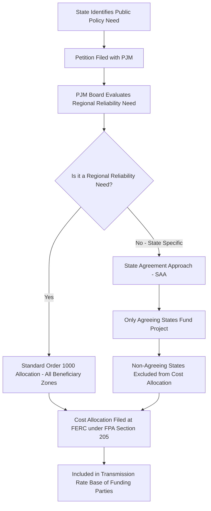

## State vs. Regional Cost Allocation Disputes

### Definition and Jurisdictional Framework

State vs. regional cost allocation disputes arise from the tension between FERC's jurisdiction over wholesale transmission rates and cost allocation methodology (under the Federal Power Act, Section 205/206) and state public utility commissions' jurisdiction over retail rates, resource planning, and siting. These disputes center on how the costs of regional transmission infrastructure — planned under FERC Order No. 1000 — are allocated across states, utility zones, and customer classes that may derive unequal benefit from a given project.

The core legal principle governing allocation is the **cost causation standard** established in *Illinois Commerce Commission v. FERC* (7th Cir. 2009, and subsequent related cases): costs must be allocated roughly commensurate with benefits received, and a "postage stamp" or purely load-ratio-share allocation that ignores disparate benefits is vulnerable to legal challenge.

### Sources of Dispute

**Key Points**

- **Benefit measurement asymmetry**: A transmission project may relieve congestion, improve reliability, or enable renewable integration disproportionately for one state/zone while nominally "regional" costs are spread broadly.
- **Public policy-driven projects**: Lines built to satisfy one state's renewable portfolio standard (RPS) may impose costs on neighboring states that receive minimal direct benefit, creating allocation friction under Order No. 1000's public policy requirements provision.
- **Free-ridership concerns**: States with weaker RPS mandates argue they subsidize the policy goals of more aggressive states when regional cost sharing is applied uniformly.
- **Reliability vs. economic vs. public policy project classification**: Each RTO/ISO tariff defines separate cost allocation methodologies per project driver category, and classification disputes (is this project "reliability" or "public policy"?) directly determine the allocation formula applied.

### Order No. 1000 Allocation Principles

FERC Order No. 1000 (2011) requires each transmission planning region to establish an ex ante cost allocation method satisfying six regional principles, later summarized as adherence to:

$$\text{Cost Share}_i \approx \frac{\text{Benefit}_i}{\sum_{j=1}^{n} \text{Benefit}_j} \times \text{Total Project Cost}$$

Where $\text{Benefit}_i$ is the quantified benefit (avoided congestion cost, reliability value, capacity value, etc.) accruing to zone or state $i$.

Order No. 1000 principles relevant to state/regional disputes:

1. Costs allocated must be roughly commensurate with estimated benefits.
2. Parties that receive no benefit may not be involuntarily allocated costs.
3. A benefit-to-cost threshold ratio (commonly 1.25:1, varies by RTO) may be used as a participation gate.
4. The allocation method must be transparent and produce comparable results across similarly situated projects.
5. A single allocation method may apply regionally, but different methods can apply to different project types (reliability, economic, public policy) within the same region.
6. Interregional cost allocation requires a separate agreed-upon method between adjacent planning regions.

### RTO-Specific Allocation Approaches

**Example**

| RTO/ISO | Reliability Projects | Economic Projects | Public Policy Projects |
| --- | --- | --- | --- |
| MISO | Load-ratio share (regional or subregional) | Adjusted production cost (APC) benefit-based | MTEP-specific benefit metrics; often zonal |
| PJM | Solution-based DFAX (Distribution Factor) allocation by beneficiary | Similar DFAX / license plate hybrid | State Agreement Approach (SAA) — voluntary, opt-in |
| SPP | Postage stamp (highway/byway: >300kV regional, <100kV local, 100-300kV split) | Similar highway/byway split | Limited framework; evolving |
| CAISO | Statewide postage stamp (single-state, limited interstate dispute exposure) | Statewide | Statewide, RPS-integrated |

[Inference] Exact benefit-to-cost thresholds, voltage-tier splits, and DFAX methodology parameters are periodically revised through FERC compliance filings; current values should be verified against each RTO's effective tariff rather than assumed static.

### PJM's State Agreement Approach — Illustrative Mechanism

PJM's SAA was specifically designed to resolve the state-vs-regional tension by allowing a subset of states to voluntarily agree to fund a public-policy-driven project without imposing costs on non-participating states, avoiding the free-ridership objection.

### Legal and Regulatory Precedent

- ***Illinois Commerce Commission v. FERC*** (2009, 2010): Vacated and remanded a MISO cost allocation scheme for allocating 100% of certain project costs via license-plate/postage-stamp method without adequate benefit justification, establishing that cost causation requires demonstrable nexus between cost and benefit — not merely proximity or interconnection.
- **South Carolina Public Service Authority v. FERC** and related Order No. 1000 challenges: Petitioners argued FERC's principles-based (rather than prescriptive) approach to allocation left excessive discretion to individual RTOs, upheld by the D.C. Circuit as within FERC's authority to require regional flexibility.
- **MISO MVP (Multi-Value Project) litigation**: Challenged MISO's 100% load-ratio-share allocation of Multi-Value Projects (largely justified by renewable integration and public policy benefits) across the entire footprint; courts largely upheld MISO's methodology given the documented region-wide reliability and economic benefits, distinguishing it from the vacated scheme in *ICC v. FERC*.

### Interregional Allocation Disputes

Interregional projects (crossing RTO/ISO seams, e.g., MISO-PJM or SPP-MISO) face an additional layer of dispute because Order No. 1000 does not mandate a specific interregional allocation formula — it only requires that adjacent regions have *some* coordinated process.

**Key Points**

- Interregional cost allocation requires both regions' cost allocation methods to independently satisfy cost causation for their respective portions of a shared project.
- Disputes commonly arise over which region's benefit-cost model captures cross-seam benefits (e.g., a MISO-side reliability improvement enabling PJM-side economic dispatch savings).
- Few interregional projects have been successfully cost-allocated and constructed under Order No. 1000's interregional provisions, reflecting the practical difficulty of reconciling divergent regional methodologies. [Unverified — the count and status of completed interregional projects changes over time and should be verified against current RTO/ISO joint planning filings.]

### State Opt-Out and Cost-Shifting Concerns

Several state commissions have intervened at FERC or in federal appellate courts specifically to argue against being allocated costs for projects perceived as primarily benefiting other states' policy goals:

**Example**

A Midwestern state with a coal-heavy generation mix challenges allocation of MVP-category transmission costs justified substantially by wind integration benefits accruing to states with high RPS targets, arguing:

1. Benefit quantification methodology (production cost modeling under various future scenarios) is speculative and favors renewable-heavy states' assumptions.
2. The 100% load-ratio-share method fails cost causation because benefit distribution is not uniform across the footprint.

FERC and reviewing courts have generally deferred to RTOs' stakeholder-vetted benefit-cost methodologies where a rational basis and adequate factual record exist, reflecting substantial regulatory deference to the planning process rather than requiring precise benefit-cost equivalence.

### Rate Base and Ratemaking Implications

Once an interregional or regional cost allocation dispute is resolved (via FERC order, settlement, or SAA-style opt-in), the allocated cost share becomes part of each participating transmission owner's formula rate base, recovered through:

- **Regional transmission rate** (e.g., MISO's Schedule 26/26-A, PJM's Regional Transmission Expansion Plan cost recovery via Schedule 12).
- Cost allocated to a specific zone flows into that zone's transmission rate base and is recovered from load-serving entities within that zone via the RTO's OATT formula rate, ultimately reaching retail ratepayers through each state's retail rate proceedings — creating the retail/wholesale cost-shifting concern at the heart of state objections.

$$\text{Zonal Rate}_z = \frac{\text{Rate Base}_{allocated,z} \times (r_{ROE} + r_{debt} \cdot (1 - t)) + \text{O\&M}_z + \text{Depreciation}_z}{\text{Zonal Load}_z}$$

### Emerging Trends

- **FERC Order No. 1920** (2024 transmission planning reform) reinforces long-term regional planning requirements and revisits cost allocation transparency, requiring transmission providers to consider a broader set of benefits (including extreme weather resilience) in benefit-cost analysis, which may reshape state-regional allocation disputes going forward. [Inference] Compliance filing outcomes and state responses to Order No. 1920 were still developing as of standard reference materials and should be checked against current FERC docket activity for the latest procedural status.
- Growing use of **state opt-in frameworks** (modeled on PJM's SAA) as a dispute-avoidance mechanism, since voluntary participation sidesteps the involuntary-cost-allocation objection at its root.

**Related Topics**

- FERC Order No. 1000 six regional cost allocation principles in depth
- Multi-Value Project (MVP) cost allocation litigation history
- FERC Order No. 1920 long-term transmission planning reform
- Production cost modeling methodologies for benefit quantification
- Interregional transmission coordination agreements (JOAs)
- License plate vs. postage stamp rate design
- Retail rate impact of wholesale cost allocation orders