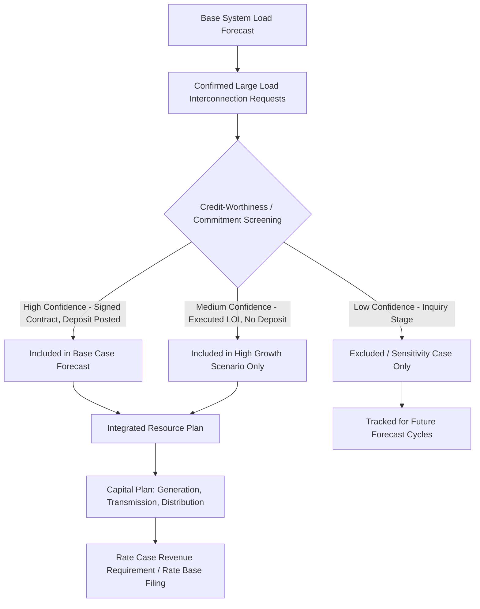

## Load Growth Forecasting and System Planning Implications

### Definition and Regulatory Context

Load growth forecasting is the process by which utilities and system planners project future electricity demand — including peak demand (MW), energy consumption (MWh), and load shape — to drive capital investment decisions, integrated resource planning (IRP), transmission expansion planning, and rate case revenue requirement calculations. In the context of large loads and data centers, forecasting has become a first-order ratemaking issue because a small number of very large, discrete customers can materially shift a utility's entire system load forecast, capital plan, and cost allocation exposure.

Forecasting outputs feed directly into rate base determinations: forecasted load drives the "used and useful" justification for new generation, transmission, and distribution investment, and errors in either direction (over- or under-forecasting) create asymmetric ratemaking risk — stranded cost exposure on one side, reliability/service adequacy failures on the other.

### Traditional Load Forecasting Methodology

**Key Points**

- **Econometric/end-use models**: Combine macroeconomic drivers (GDP, population, employment) with end-use appliance/equipment saturation and efficiency trends to project energy and peak demand.
- **Trend/time-series models**: Extrapolate historical load growth patterns (e.g., ARIMA, exponential smoothing) — generally inadequate alone for large discrete load additions since they assume continuity of historical patterns.
- **Coincident vs. non-coincident peak forecasting**: System planning requires coincident peak (the load at the moment of system-wide peak) rather than each customer's individual peak, since large loads (particularly data centers) often have flat, non-coincident load shapes that reduce their marginal contribution to system peak relative to their average consumption.

$$\text{Load Factor} = \frac{\text{Average Demand}}{\text{Peak Demand}}$$

Data centers typically exhibit load factors approaching 0.90–0.98 [Inference — actual load factor depends heavily on facility type, cooling architecture, and workload variability; AI/ML training workloads in particular have shown more volatile, spiky power draw profiles than traditional enterprise data centers, and current published figures should be checked against recent utility interconnection studies], compared to typical system-wide load factors of 0.55–0.65, meaning a data center's contribution to system capacity requirements can be disproportionately high relative to a residential or commercial load of similar energy consumption.

### The Large Load Forecasting Problem

**Example**

A utility's traditional 10-year load forecast projects 1.5% annual peak growth based on population and GDP trends. A single hyperscale data center campus requesting 500 MW of interconnection — larger than the utility's entire prior-decade net load growth — arrives mid-forecast-cycle. This creates:

1. **Forecast discontinuity**: The econometric model's underlying assumptions (smooth, broad-based growth) do not capture discrete, lumpy, customer-specific additions.
2. **Speculative load risk**: Data center developers frequently submit interconnection requests to multiple utilities/sites simultaneously ("phantom load" or speculative queuing), inflating aggregate forecasted load beyond what will materialize.
3. **Queue-position gaming**: Without credible-commitment requirements, low-cost queue positions can be held by developers who never commercially proceed, distorting system planning signals.

### Load Forecasting Uncertainty and Scenario Planning

Given large-load volatility, utilities increasingly supplement point forecasts with probabilistic or scenario-based ranges:

### System Planning Implications

**Key Points**

- **Generation capacity planning**: Large load additions accelerate the need for new dispatchable or firm capacity, particularly where data center load factors are high and largely non-dispatchable/inflexible, straining reserve margin calculations.
- **Transmission planning**: A single large load can trigger dedicated transmission facilities and network upgrades analogous to generator interconnection (see Interconnection Cost Responsibility), requiring System Impact Studies specific to load interconnection in jurisdictions that have adopted such processes.
- **Distribution planning**: Substation capacity, feeder loading, and voltage support investments scale directly with confirmed large load additions in a given service territory.
- **Resource adequacy**: RTO/ISO capacity markets (e.g., PJM's Reliability Pricing Model, MISO's Planning Resource Auction) incorporate utility load forecasts into system-wide capacity requirement calculations; systematic large-load under-forecasting can understate regional capacity needs.

### Speculative Load Mitigation Mechanisms

Emerging utility and RTO practices to address forecast distortion from non-committed large load requests:

**Example**

- **Minimum take-or-pay contracts**: Requiring large load customers to commit to a minimum demand charge regardless of actual usage, discouraging speculative multi-site queuing.
- **Collateral/security deposit requirements**: Scaled to the cost of dedicated infrastructure, forfeited if the customer withdraws after triggering utility investment commitments — mirroring generator interconnection security deposit practices.
- **Site control and permitting milestones**: Requiring demonstrated land control, air/water permits, or other regulatory milestones before a load request advances in queue priority.
- **Tariff-specific large load classes**: Several utilities have filed (or proposed) dedicated large-load or data-center-specific tariff schedules with distinct contract terms, exit fees, and cost responsibility provisions separate from standard commercial/industrial rate classes.

[Unverified — the specific large-load tariff mechanisms adopted (e.g., Georgia Power's, AEP Ohio's, or various utilities' data-center-specific tariff filings) vary by jurisdiction and are subject to ongoing regulatory proceedings; current status should be verified against each utility's most recent tariff filings and commission orders.]

### Forecast Risk and Rate Base Asymmetry

$$\text{Stranded Cost Risk} = \sum_{t=1}^{n} \frac{\text{Capacity}_{built,t} - \text{Capacity}_{utilized,t}}{(1+r)^t} \times \text{Unit Cost}$$

If a utility builds generation, transmission, or distribution capacity to serve a forecasted large load that subsequently withdraws, relocates, or scales back (a documented risk given data center site-shopping practices across multiple utility territories), the utility faces a prudence review question in its next rate case: was the investment "used and useful" and reasonably forecasted at the time it was made, even if the load did not materialize as projected?

Conversely, under-forecasting creates:

- Reliability risk (inadequate reserve margins, potential for service curtailment).
- Rushed/premium-cost capital investment to catch up, which itself faces heightened prudence scrutiny for imprudent haste or emergency procurement costs.

### Load Growth Forecasting in Integrated Resource Planning

Most IRP frameworks now require utilities to file large-load-adjusted scenarios explicitly:

| Scenario | Treatment | Planning Use |
| --- | --- | --- |
| Base Case | Only signed/high-confidence large loads included | Primary resource plan, drives rate case revenue requirement |
| High Growth | Base + medium-confidence large load pipeline | Sensitivity analysis, informs contingency resource options |
| Low Growth | Base minus loads showing withdrawal risk indicators | Downside stranded-cost risk assessment |
| Stress Test | Rapid, concentrated large-load cluster arrival | Transmission/generation lead-time adequacy testing |

### Cost Allocation Between Large Loads and General Ratepayers

A central ratemaking question distinct from forecasting itself but directly downstream of it: once large-load-driven capacity is built and enters rate base, how are the associated costs allocated between the large load customer class and general ratepayers?

- **Direct assignment**: Infrastructure serving only the large load customer is assigned entirely to that customer's rate class.
- **Rolled-in/socialized treatment**: Infrastructure with broader system benefit (e.g., a transmission upgrade that also improves regional reliability) is rolled into system-wide rate base and recovered from all customer classes via standard class cost-of-service allocation.
- **Cost-of-service studies** increasingly segment large-load/data-center classes separately to isolate their specific demand and energy cost causation from other commercial and industrial classes, given their distinct load shape and capacity contribution characteristics.

[Inference] The appropriate direct-assignment threshold and rolled-in treatment boundary is an active area of rate case litigation in jurisdictions experiencing significant data center growth (e.g., Virginia, Georgia, Ohio, Texas), and outcomes vary materially by state commission precedent rather than following a uniform national standard.

**Related Topics**

- Large Load Interconnection Cost Responsibility and Security Deposits
- Data Center-Specific Tariff Design and Take-or-Pay Provisions
- Integrated Resource Planning (IRP) Scenario Methodology
- Resource Adequacy and Capacity Market Implications of Large Load Growth
- Used and Useful Standard Applied to Forecast-Driven Capital Investment
- Class Cost-of-Service Studies for Large Load/Data Center Rate Classes
- Prudence Review Standards for Forecast Error in Rate Cases