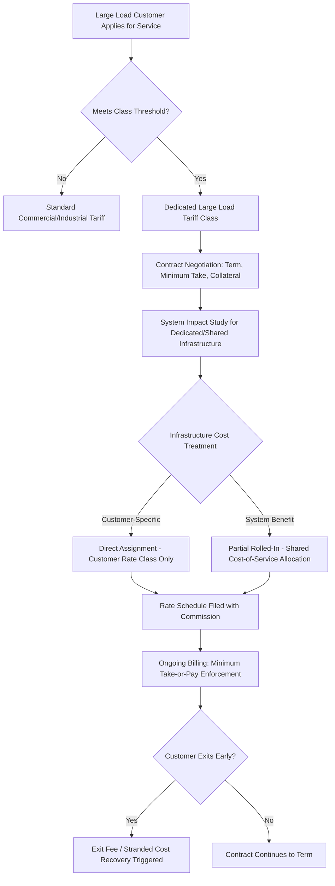

## Dedicated Large Load and Data Center Tariff Design

### Definition and Regulatory Rationale

Dedicated large load and data center tariff design refers to the creation of a distinct customer class, rate schedule, and contract framework specifically for very large electricity consumers — most prominently hyperscale data centers, but also crypto-mining and heavy industrial loads — separate from standard commercial and industrial rate classes. The design objective is to align cost responsibility with cost causation: ensuring that infrastructure built to serve a discrete large load is paid for by that load, rather than socialized across the general ratepayer base, while still providing the load certainty large customers need to site and finance facilities.

Adoption has accelerated rapidly: as of May 2026, twenty-three states have approved at least one large load tariff, with another seven states having pending large load tariffs, according to Edison Electric Institute tracking. [Columbia Law School](https://blogs.law.columbia.edu/climatechange/2026/06/02/data-center-regulation-what-local-governments-should-know-about-large-load-tariffs-and-clean-transition-tariffs/)

### Core Design Elements

**Key Points**

- **Class-defining demand threshold**: Tariffs typically apply above a minimum monthly or contracted peak demand, commonly in the 25–100 MW range depending on jurisdiction and utility size.
- **Minimum take-or-pay / demand ratchet**: Customer pays a contractually fixed percentage of contracted demand regardless of actual usage, preventing under-recovery if the customer's actual load runs below forecast.
- **Minimum contract term**: Long-term commitments (often 10–14+ years) matched roughly to the depreciable life of dedicated infrastructure, so the utility recovers its capital investment even if the customer later reduces load or exits.
- **Collateral/security requirements**: Upfront financial collateral scaled to $/MW of contracted capacity, protecting the utility (and ratepayers) against customer default or facility non-completion.
- **Exit fees / early termination charges**: Compensate the utility for stranded investment if the customer terminates before contract expiration.

### Illustrative Tariff Structures by Jurisdiction

**Example**

| Jurisdiction / Utility | Threshold | Minimum Take | Contract Term | Collateral |
| --- | --- | --- | --- | --- |
| Virginia (Dominion, GS-5) | ≥25 MW | 85% of contracted transmission demand, 60% of contracted generation demand | Minimum 14-year terms | $1.5 million per MW of capacity |
| Ohio (AEP Ohio) | Monthly maximum energy demand of 25 MW or greater | At least 85% of contracted capacity or billing demand | Minimum of twelve years | Utility-specified, case-by-case |
| Missouri (SB4, utilities >250k customers) | Above 100 MW annual peak demand | Cost-of-service representative share | Utility-proposed | Utility-proposed |
| Delaware (Delmarva, GS-LL) | ≥50 MW measured demand | Contract-defined | Matched to line extension/facility cost recovery period | Utility-proposed |
| South Dakota (South Dakota Power / NorthWestern, LLPS) | 75 MW minimum demand | Contract-defined | Contract-defined | Contract-defined |

[Inference] Specific dollar figures, percentages, and thresholds are subject to ongoing state commission dockets and periodic tariff amendments; the table reflects terms reported as of mid-2026 and should be verified against each utility's currently effective tariff before use in analysis.

### Campus Aggregation and Load Definition

A key structural design question is how to define the "customer" for threshold purposes when a single corporate entity operates multiple geographically proximate facilities. Virginia's GS-5 tariff addresses this through "campus aggregation," which allows certain geographically proximate facilities to be treated as a single load for tariff applicability and cost allocation purposes — preventing a developer from artificially subdividing a large campus into sub-threshold facilities to avoid the dedicated tariff class. [Columbia Law School](https://blogs.law.columbia.edu/climatechange/2026/06/02/data-center-regulation-what-local-governments-should-know-about-large-load-tariffs-and-clean-transition-tariffs/)

### Rate Design Mechanics

### Cost Causation and Ratepayer Protection Framing

Legislative and commission mandates consistently frame dedicated tariffs around preventing cost-shifting to residential and small commercial customers. Oregon's enabling legislation requires that any large-load tariff "allocate the costs of serving the class of retail electricity consumers that are large energy use facilities to the class in a manner that is equal or proportional to the costs of serving the class," or "directly assign the costs of serving a retail electricity consumer that is a large energy use facility to the retail electricity consumer", while mitigating the risk of other customer classes "paying unwarranted costs" or costs being shifted in an unwarranted manner. [Sierra Club](https://www.sierraclub.org/sites/default/files/2026-01/policies-for-data-centers-2026.pdf)[Sierra Club](https://www.sierraclub.org/sites/default/files/2026-01/policies-for-data-centers-2026.pdf)

Missouri's SB4 similarly requires that large-load tariff schedules "ensure such customers' rates will reflect a representative share of the costs incurred to serve the customers and prevent other customer classes' rates from reflecting any unjust or unreasonable costs arising from service to such customers." [Sierra Club](https://www.sierraclub.org/sites/default/files/2026-01/policies-for-data-centers-2026.pdf)

### Demand Forecast Discipline as a Design Objective

Beyond cost recovery, dedicated tariffs are explicitly designed to discourage speculative interconnection requests (see Load Growth Forecasting and System Planning Implications). The Ohio AEP Ohio experience illustrates this: after the tariff's approval, AEP's large-load forecast decreased by half, suggesting that the tariff's introduction shapes cost recovery and market behavior by discouraging speculative or inflated interconnection requests. [Columbia Law School](https://blogs.law.columbia.edu/climatechange/2026/06/02/data-center-regulation-what-local-governments-should-know-about-large-load-tariffs-and-clean-transition-tariffs/)

### Flexibility and Demand-Response Provisions

More recent tariff proposals incorporate load flexibility mechanisms that trade rate discounts for curtailment rights, reflecting growing recognition that data center load — particularly for training workloads — may have more operational flexibility than assumed:

**Example**

Pennsylvania's proposed statewide model tariff (November 2025) includes a provision to allow customers to reduce load by up to 20%, with adequate notice, after the initial contract term, along with lower charges for customers with onsite generation, unused interconnection capacity, or interruptible service. The proposal also requires annual contributions to the host utility's hardship fund, with the minimum amount to be contributed based on the customer's peak demand, an explicit low-income ratepayer protection mechanism embedded directly in tariff design. [U.S. Data Center Gold Rush Drives Surge in New Utility Tariffs | SEPA +2](https://sepapower.org/knowledge/u-s-data-center-gold-rush-drives-surge-in-new-utility-tariffs/)

### Customer-Funded Infrastructure and Accelerated Interconnection

Some tariffs offer expedited interconnection timelines in exchange for customers funding infrastructure upfront:

**Example**

Under Colorado's proposed Xcel Energy large-load tariff structure, applicants who agree to fund necessary transmission infrastructure upfront can benefit from accelerated interconnection processing — directly linking tariff design to the interconnection cost responsibility framework, since customer-funded facilities are typically excluded from rate base while utility-funded facilities recovered through the tariff's cost-of-service structure are included. [EEI](https://www.eei.org/-/media/Project/EEI/Documents/Issues%20and%20Policy/List%20of%20Large%20Customer%20Projects%20and%20Tariffs)

### Clean Energy Procurement Riders

Several tariffs pair cost-recovery protections with options for large customers to fund incremental clean generation directly:

**Example**

Delaware's Customer Identified Resource (CIR) program enables large customers to pay for clean energy resources in exchange for renewable energy credit or attribute rights, allowing data center customers pursuing sustainability commitments to fund dedicated generation without socializing that cost to other ratepayers. [EEI](https://www.eei.org/-/media/Project/EEI/Documents/Issues%20and%20Policy/List%20of%20Large%20Customer%20Projects%20and%20Tariffs)

### Rate Freezes and Political/Regulatory Backdrop

Dedicated tariff design has emerged in some jurisdictions alongside broader ratepayer-protection measures responding to data-center-driven load growth pressure. In Georgia, the Commission ordered a freeze of Georgia Power base rates through 2028, explicitly framed around the Commission's mission to prevent new data centers from shifting costs to residential customers, following extensive evidentiary hearings — nearly 25 hours of testimony with 17 sworn witnesses subject to cross examination, and 1,921 pages of pre-filed documents — on how much new generation capacity should be built to serve large-load customers. [March 2026 DATA CENTER FACT SHEET +2](https://psc.ga.gov/site/downloads/datacenterfactsheet.pdf)

### Investor and Rate Base Implications

Approval of a large-load tariff framework can materially affect a utility's investment case by de-risking large-load-driven capital expansion. Following Oregon's approval of Portland General Electric's tariff framework, analysts noted the order provides regulatory certainty for PGE's future data center-related investments while establishing cost allocation measures intended to reduce cross-subsidization concerns and political pressure around load growth, while also expecting the framework to increase service costs and interconnection risks for hyperscale customers — illustrating the fundamental tariff design trade-off between attracting large-load investment and protecting ratepayers and utility credit quality. [Utility Dive](https://www.utilitydive.com/news/oregon-puc-approves-pges-large-load-tariff-framework-for-data-centers/821361/)[Utility Dive](https://www.utilitydive.com/news/oregon-puc-approves-pges-large-load-tariff-framework-for-data-centers/821361/)

Notably, tariff frameworks are frequently utility-specific rather than automatically statewide: Oregon's order applies only to PGE, while a separate proceeding involving PacifiCorp and its Pacific Power operations remains unresolved and has faced challenges from consumer advocates, illustrating that even within a single state, large-load tariff design can diverge significantly by utility and docket. [Utility Dive](https://www.utilitydive.com/news/oregon-puc-approves-pges-large-load-tariff-framework-for-data-centers/821361/)

### Multi-State Investigative and Model-Tariff Approaches

Some states are pursuing investigatory or model-tariff approaches rather than utility-specific dockets:

- **California**: Legislation (S.B. 57) enacted in October 2025 directs the California Public Utilities Commission to investigate whether utility costs associated with new loads from data centers result in cost shifts to other customers and to publish its findings by January 1, 2027, with recommendations expected to cover large-load tariffs, "Bring Your Own Capacity" and alternative capacity procurement methods, demand-side management tools, and large-load and generation interconnection processes and advanced transmission and grid-enhancing technologies. [SEPA](https://sepapower.org/knowledge/u-s-data-center-gold-rush-drives-surge-in-new-utility-tariffs/)[SEPA](https://sepapower.org/knowledge/u-s-data-center-gold-rush-drives-surge-in-new-utility-tariffs/)
- **Pennsylvania**: Pursuing a statewide framework to help ensure that large-load customers can connect to the grid quickly and responsibly, while also supporting long-term reliability, grounded in stakeholder consensus around cost causation and the need to protect ratepayers from unreasonable cost shifting. [SEPA](https://sepapower.org/knowledge/u-s-data-center-gold-rush-drives-surge-in-new-utility-tariffs/)[SEPA](https://sepapower.org/knowledge/u-s-data-center-gold-rush-drives-surge-in-new-utility-tariffs/)
- **New York**: In February 2026, the New York Public Service Commission launched a new proceeding addressing large-load tariff policy. [Unverified — the specific scope and outcome of this proceeding were still developing as of available reference material and should be checked against the current PSC docket.] [SEPA](https://sepapower.org/knowledge/u-s-data-center-gold-rush-drives-surge-in-new-utility-tariffs/)

### "Bring Your Own Capacity" and Alternative Procurement Models

An emerging design variant shifts generation procurement responsibility (not just cost responsibility) to the large-load customer, allowing the customer to arrange its own generation capacity to serve incremental load rather than relying entirely on utility-procured system resources. [Inference] Implementation mechanics — including how such customer-procured capacity interacts with resource adequacy accounting, interconnection queue treatment, and rate base exclusion — are still being defined in most jurisdictions exploring this model and vary by RTO/ISO market rules.

**Related Topics**

- Interconnection Cost Responsibility (generator- vs. load-side parallels)
- Load Growth Forecasting and System Planning Implications
- Minimum Take-or-Pay Contract Design and Stranded Cost Risk
- Campus Aggregation Rules and Load Class Definition
- Demand Flexibility and Curtailable Load Rate Design
- Class Cost-of-Service Studies for Large Load Customer Classes
- Customer-Funded Interconnection and Accelerated Service Options
- Resource Adequacy Treatment of Customer-Procured ("Bring Your Own") Capacity