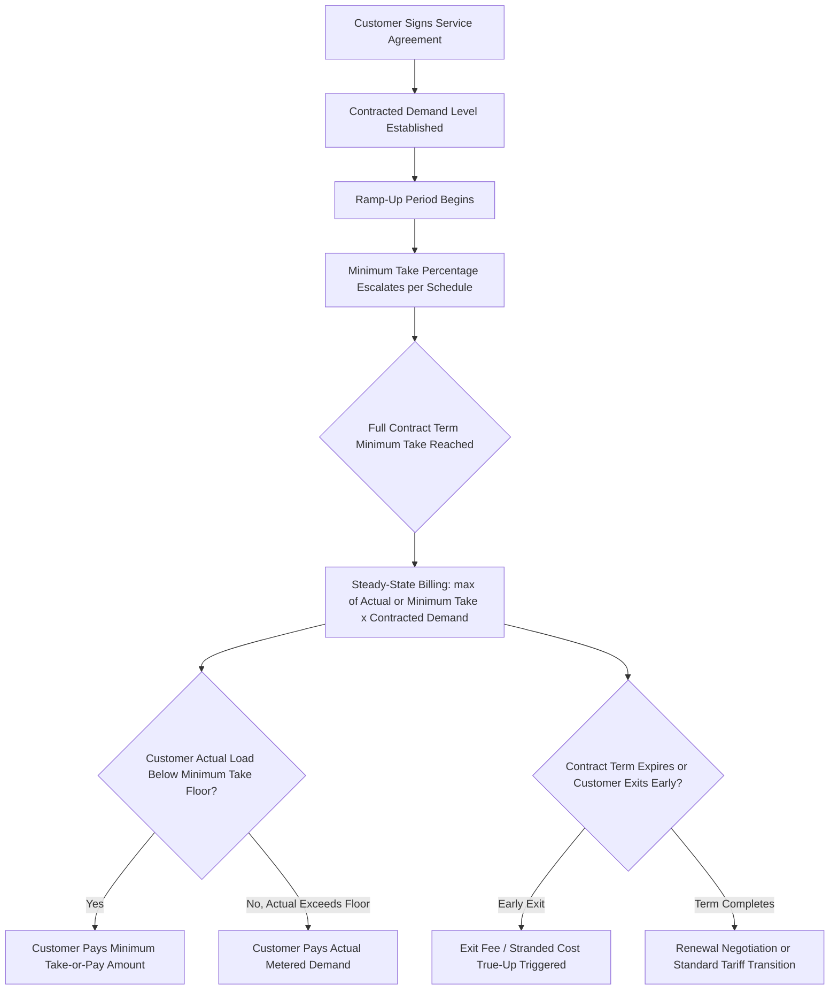

## Minimum Demand and Take or Pay Contract Provisions

### Definition and Purpose

Minimum demand and take-or-pay (TOP) contract provisions are billing mechanisms embedded in dedicated large load and data center tariffs that require a customer to pay for a contractually specified level of demand or energy regardless of actual usage. These provisions shift volumetric risk from the utility and general ratepayer base to the large load customer, ensuring the utility recovers the capital cost of dedicated and allocated infrastructure even if the customer's realized load falls short of its initial projection.

The provisions directly address the forecast risk and stranded cost exposure discussed in Load Growth Forecasting and System Planning Implications: without a minimum payment obligation, a utility that builds generation, transmission, or distribution capacity to serve a forecasted large load bears full financial exposure if that load fails to materialize as projected, is delayed, or is later scaled back.

### Core Mechanics

**Key Points**

- **Contracted demand**: The MW level a customer commits to in its service agreement, used as the basis for both infrastructure sizing and billing calculations — distinct from actual metered/measured demand.
- **Minimum take percentage**: The floor percentage of contracted demand (or contracted energy) the customer must pay for even if actual usage is lower, commonly expressed as a ratchet on billing demand.
- **Billing demand**: The demand figure actually used to calculate the customer's bill in a given period — set as $\max(\text{Actual Demand}, \text{Minimum Take} \times \text{Contracted Demand})$.
- **Ramp-up period**: A phased schedule (often multi-year) during which the minimum take percentage escalates from a lower initial level to the full contractual floor, accommodating the reality that large facilities (particularly data centers) build out load gradually rather than reaching full contracted demand from day one.

$$\text{Billing Demand} = \max\left(D_{actual},\ \tau \times D_{contracted}\right)$$

Where $\tau$ is the minimum take percentage (e.g., 0.85) and $D_{contracted}$ is the contractually committed demand level.

### Illustrative Minimum Take Structures

**Example**

Under Virginia's GS-5 tariff (Dominion Energy), customers with 25 MW or more of demand are required to pay 85% of contracted transmission demand and 60% of contracted generation demand — using two separate minimum take percentages tied to different cost categories (transmission infrastructure vs. generation capacity), reflecting that these cost components have different fixed-cost recovery profiles and different degrees of shared/system benefit.

Under Ohio's AEP Ohio tariff, data centers with a monthly maximum energy demand of 25 MW or greater must pay at least 85% of their contracted capacity or billing demand even if they use less, applying a single unified minimum take threshold across the customer's full billing demand.

### Billing Calculation Walkthrough

**Example**

A data center contracts for 200 MW of demand under an 85% minimum take provision.

- **Month 1** (ramp-up, actual demand 40 MW): If a ramp-up schedule applies at, say, 30% of the full minimum take in year one, billing demand = $\max(40, 0.30 \times 0.85 \times 200) = \max(40, 51) = 51$ MW.
- **Month 24** (full minimum take in effect, actual demand 150 MW): Billing demand = $\max(150, 0.85 \times 200) = \max(150, 170) = 170$ MW — customer pays for 170 MW despite using only 150 MW.
- **Month 36** (actual demand exceeds contracted level, 210 MW): Billing demand = $\max(210, 170) = 210$ MW — customer pays actual usage since it exceeds the minimum floor; contract renegotiation for a higher contracted demand level may be triggered depending on tariff terms for exceeding contracted capacity.

### Contract Term and Minimum Take Interaction

### Rationale: Cost Causation and Fixed Cost Recovery

Minimum demand provisions exist because the majority of a utility's cost to serve a large load is fixed (capacity-related) rather than variable (energy-related): transmission lines, substations, and generation capacity must be sized to the customer's peak contracted demand regardless of how much energy the customer ultimately consumes.

$$\text{Utility Fixed Cost Exposure} = D_{contracted} \times (\text{Unit Capacity Cost})$$

Without a minimum take provision, a customer that contracts for 200 MW but only ever uses 50 MW would cause the utility to recover capacity costs for only 50 MW of billing demand, while the utility (and by extension, ratepayers, if costs are rolled into general rate base) bore the capital cost of building to 200 MW — the precise cost-shifting scenario dedicated large-load tariffs are designed to prevent, as reflected in statutory language such as Missouri's SB4 requirement that large-load tariff schedules "ensure such customers' rates will reflect a representative share of the costs incurred to serve the customers and prevent other customer classes' rates from reflecting any unjust or unreasonable costs."

### Minimum Term Requirements

Minimum contract term provisions work alongside minimum take percentages, and are typically set to approximate the depreciable or cost-recovery life of dedicated infrastructure:

**Example**

- Virginia GS-5: minimum 14-year contract terms.
- Ohio AEP Ohio: minimum of twelve years.
- Delaware Delmarva (GS-LL): contract terms specified to match rate schedules or longer, to ensure cost recovery and to ensure large-load customers pay any costs the utility incurs in serving the customer if it terminates its contract.

[Inference] The specific alignment between minimum contract term length and the underlying asset depreciation schedule is generally a deliberate ratemaking design choice intended to prevent stranded cost exposure at contract expiration, though exact matching methodology (straight-line depreciation life vs. a shorter negotiated term with residual value true-up) varies by tariff and is not uniformly documented across jurisdictions.

### Collateral and Security as a Complementary Mechanism

Minimum take-or-pay provisions are typically paired with upfront collateral requirements, since a minimum payment obligation is only as reliable as the customer's financial capacity and willingness to honor it over a multi-year (often multi-decade) term:

**Example**

Virginia's GS-5 tariff requires collateral worth $1.5 million per MW of capacity, providing the utility a financial backstop if the customer defaults on minimum take-or-pay obligations or exits the contract prematurely without paying agreed exit fees.

### Load Reduction and Flexibility Carve-Outs

More recent tariff designs incorporate limited flexibility provisions that create a bounded exception to the strict minimum take floor, reflecting growing recognition that large loads — particularly AI/ML training workloads — may have legitimate operational needs to reduce demand without being treated as a contract breach:

**Example**

Pennsylvania's proposed statewide model tariff includes a provision allowing customers to reduce load by up to 20%, with adequate notice, after the initial contract term, alongside lower charges for customers with onsite generation, unused interconnection capacity, or interruptible service — effectively creating a negotiated de-escalation path for the minimum take obligation tied to demonstrated flexibility value rather than unilateral customer discretion.

### Interaction with Exit Fees and Stranded Cost True-Ups

Minimum take-or-pay provisions address the "customer stays but uses less" scenario; exit fee provisions address the distinct "customer terminates the contract entirely" scenario. Both are necessary because they cover different risk profiles:

- **Minimum take-or-pay**: Ongoing periodic payment floor during the active contract term.
- **Exit fee / early termination charge**: A typically lump-sum or accelerated payment obligation triggered specifically by contract termination before the minimum term expires, calculated to recover the utility's undepreciated investment in dedicated or allocated infrastructure.

$$\text{Exit Fee} \approx \text{Undepreciated Capital Cost} - \text{PV(Remaining Minimum Take Payments Already Committed)}$$

[Unverified — exact exit fee calculation methodologies differ by tariff and commission order; some jurisdictions apply a straightforward undepreciated-balance approach while others incorporate a negotiated liquidated-damages framework, and the applicable formula should be confirmed against the specific tariff or service agreement in question.]

### Ratemaking and Rate Case Treatment

Revenue collected under minimum take-or-pay provisions is treated as firm revenue for revenue requirement and cost-of-service purposes, reducing the amount that must be recovered from other customer classes. In a general rate case, this has two downstream implications:

1. **Class revenue allocation**: The large-load class's guaranteed minimum payments provide more predictable test-year revenue than a purely usage-based billing structure would, reducing forecast risk in the utility's revenue requirement calculation.
2. **Class cost-of-service justification**: Regulators scrutinize whether the minimum take percentage set in the tariff is itself cost-causation-justified — i.e., whether 85% (or whatever the applicable floor is) genuinely approximates the load factor and cost responsibility the class should bear, rather than being an arbitrary number that either over- or under-protects ratepayers.

**Related Topics**

- Dedicated Large Load and Data Center Tariff Design
- Exit Fees and Early Termination Charge Methodology
- Collateral and Security Deposit Requirements for Large Load Interconnection
- Load Growth Forecasting and System Planning Implications
- Class Cost-of-Service Studies and Revenue Allocation
- Ramp-Up Schedules and Phased Demand Commitment Structures
- Demand Flexibility and Curtailable Load Rate Design