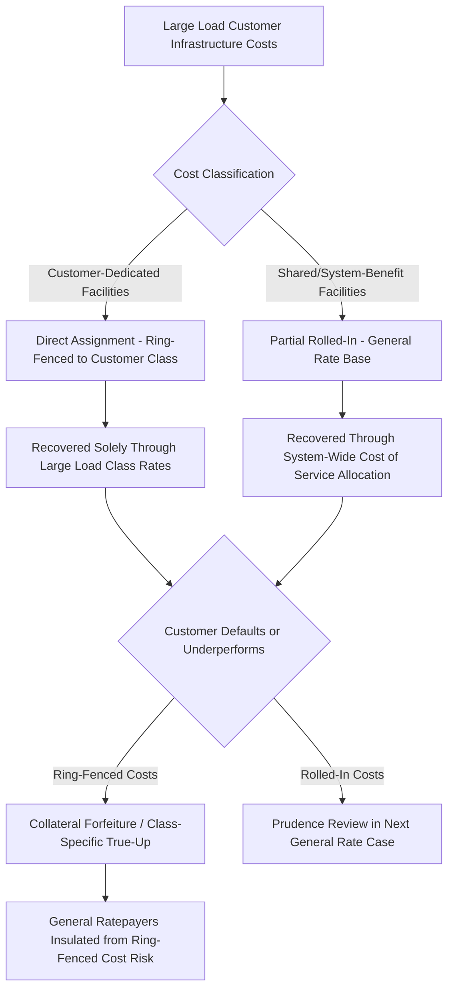

## Collateral Requirements and Cost Ring Fencing

### Definition and Purpose

Collateral requirements and cost ring fencing are complementary risk-mitigation mechanisms in dedicated large load and data center tariffs. Collateral requirements obligate the customer to post upfront financial security against the risk of default, non-completion, or early termination. Cost ring fencing structurally isolates large-load-driven costs — and the associated financial risk — from the general ratepayer rate base, ensuring that if the large load customer's project fails, delays, or underperforms, the financial consequences fall on the customer and its posted security rather than on residential and small commercial ratepayers.

Together, these mechanisms operationalize the cost-causation principle underlying dedicated large-load tariffs (see Dedicated Large Load and Data Center Tariff Design): infrastructure built to serve a specific large customer should be financially backstopped by that customer, not implicitly guaranteed by the broader rate base.

### Collateral Requirement Mechanics

**Key Points**

- **Collateral basis**: Typically expressed as a dollar amount per MW of contracted capacity, scaled to reflect the utility's expected capital exposure in serving the customer.
- **Posting timing**: Commonly required at multiple project milestones — application/queue entry, System Impact Study completion, facilities agreement execution, and construction commencement — with escalating amounts as the utility's sunk cost exposure grows.
- **Acceptable collateral forms**: Cash deposits, letters of credit, surety bonds, or parent company guarantees, depending on tariff terms and customer creditworthiness.
- **Forfeiture triggers**: Customer withdrawal after a specified milestone, failure to meet construction or energization deadlines, or default on minimum take-or-pay obligations.
- **Return/release conditions**: Collateral is typically returned or reduced once the customer demonstrates sustained load at or near contracted levels, or upon reaching a point in the contract term where remaining exposure is adequately covered by accrued minimum take-or-pay payments.

$$\text{Required Collateral} = C_{\$/MW} \times D_{contracted}$$

### Illustrative Collateral Structures

**Example**

Virginia's GS-5 tariff (Dominion Energy) requires large-load customers with 25 MW or more of demand to put up collateral worth $1.5 million per MW of capacity — for a 200 MW data center campus, this represents $300 million in required security, directly proportional to the scale of dedicated and allocated transmission and generation infrastructure the utility must commit to build.

[Inference] Collateral amounts are calibrated by each utility/commission to approximate a reasonable estimate of stranded infrastructure cost exposure in the event of customer default, though the precise engineering-cost basis behind specific per-MW figures is not always published in detail alongside the tariff order itself.

### Cost Ring Fencing Mechanics

Ring fencing operates at the accounting and cost-allocation level, distinct from collateral's function as a financial security instrument:

**Key Points**

- **Direct assignment as the primary ring-fencing tool**: Costs of facilities serving only the large load customer are assigned entirely to that customer's dedicated rate class or contract, never entering the general rate base calculation used to set rates for residential/small commercial classes.
- **Separate accounting treatment**: Some jurisdictions require utilities to track large-load-related capital additions, O&M, and revenue in segregated regulatory accounts, enabling the commission to audit whether cost recovery from the large-load class is tracking actual cost incurrence.
- **Class-specific true-up mechanisms**: Periodic reconciliation between costs incurred to serve the large-load class and revenue collected from that class, with any shortfall recovered from the class itself (via rate adjustment or collateral draw) rather than spread to other classes.

### Legislative and Regulatory Framing of Ring Fencing

State legislative mandates increasingly codify ring-fencing intent directly into statute, requiring commissions to structure tariffs so that large-load costs cannot flow into general rate base calculations without a cost-causation justification:

**Example**

Oregon's HB 3546 ("Power Act") requires that any tariff schedule adopted for the large energy use facility class must allocate costs to the class in a manner that is equal or proportional to the costs of serving the class, or directly assign costs of serving a specific large energy use facility consumer to that consumer, while mitigating the risk of other classes of retail electricity consumers paying unwarranted costs and cost-shifting occurring in an unwarranted manner.

Missouri's SB4 requires that large-load tariff schedules "ensure such customers' rates will reflect a representative share of the costs incurred to serve the customers and prevent other customer classes' rates from reflecting any unjust or unreasonable costs arising from service to such customers" — language that functions as a statutory ring-fencing directive even without using that specific term.

### Interaction with Rate Base and Prudence Review

Ring fencing has a direct bearing on how large-load-related capital additions are treated in the utility's next general rate case:

- **Ring-fenced (directly assigned) costs**: Generally excluded from the pool of assets subject to general prudence review for rate base inclusion, since they are recovered through the dedicated class's contract terms rather than general rates — though the commission may still audit whether the direct assignment itself was correctly classified.
- **Rolled-in (shared benefit) costs**: Subject to standard "used and useful" and prudence review, since these costs are recovered from the broader ratepayer base and the customary evidentiary burden applies.
- **Stranded cost risk if ring fencing fails**: If a large load customer defaults or exits and posted collateral is insufficient to cover the utility's remaining undepreciated investment in customer-dedicated facilities, the utility may seek to recover the shortfall through a general rate case — at which point the commission's prudence review turns on whether the original collateral level, contract term, and minimum take provisions were themselves prudently designed to prevent this outcome.

$$\text{Residual Ratepayer Exposure} = \max\left(0,\ \text{Undepreciated Investment} - \text{Collateral Recovered} - \text{PV(Committed Minimum Take Payments)}\right)$$

### Ring Fencing as a Credit and Investment Signal

Effective ring fencing has implications beyond ratepayer protection — it materially affects both the utility's credit profile and the perceived investment risk of large-load-driven capital expansion. Following Oregon's approval of a large-load tariff framework for Portland General Electric, analysts noted the order provides regulatory certainty for future data center-related investments while establishing cost allocation measures intended to reduce cross-subsidization concerns and political pressure around load growth, while also expecting the framework to increase service costs and interconnection risks for hyperscale customers — reflecting that robust ring fencing simultaneously de-risks the utility's credit exposure and imposes a real cost/risk burden that large-load customers must underwrite.

### Ring Fencing Limitations and Open Design Questions

**Key Points**

- **Shared infrastructure ambiguity**: Facilities that serve both the large load customer and provide incidental system-wide reliability benefit (e.g., a transmission upgrade that also relieves pre-existing congestion) resist clean ring-fencing classification, since a purely binary direct-assignment/rolled-in split may not accurately reflect mixed cost causation.
- **Collateral adequacy over time**: A fixed $/MW collateral figure set at contract signing may not track actual cost escalation (construction cost inflation, supply chain costs) over a 12–14+ year build-and-operate horizon, creating a residual adequacy question.
- **Aggregation and campus treatment**: Ring-fencing calculations must account for campus aggregation provisions (see Dedicated Large Load and Data Center Tariff Design), since improperly aggregated or disaggregated load definitions can distort which costs are correctly attributed to which ring-fenced customer class.
- **Multi-utility/multi-state large customers**: A hyperscale developer with facilities across several utility service territories or states creates coordination challenges for consistent ring-fencing treatment, particularly where the customer's overall creditworthiness (relevant to collateral sizing) is evaluated differently by each jurisdiction. [Unverified — the degree to which state commissions currently coordinate or share collateral/ring-fencing assessments for multi-jurisdictional large-load customers is not well documented in available reference material and likely varies significantly by case.]

**Related Topics**

- Dedicated Large Load and Data Center Tariff Design
- Minimum Demand and Take-or-Pay Contract Provisions
- Direct Assignment vs. Rolled-In Cost Treatment
- Used and Useful Standard and Prudence Review in Rate Cases
- Exit Fees and Early Termination Charge Methodology
- Class Cost-of-Service Studies for Large Load Customer Classes
- Interconnection Cost Responsibility (generator-side parallels to load-side ring fencing)