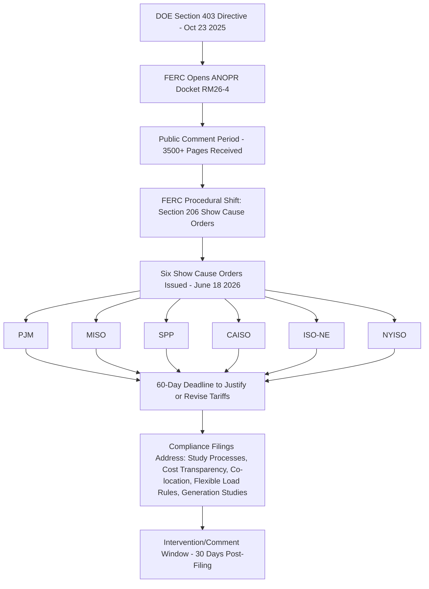

## Interconnection Queue Reform for Large Loads

### Definition and Regulatory Context

Interconnection queue reform for large loads refers to the evolving set of FERC, RTO/ISO, and utility-level procedural changes governing how large electricity demand — data centers, advanced manufacturing, and other large commercial/industrial loads — is studied and processed for transmission-level interconnection. Historically, FERC's interconnection queue framework (Order No. 2003, and its major overhaul in Order No. 2023) governed *generator* interconnection almost exclusively; large *load* interconnection had no comparably standardized federal process, leaving each utility and RTO to apply widely varying, often informal procedures. The rapid acceleration of data center demand has made this gap a first-order reliability and cost-allocation issue, prompting a fast-moving, distinct reform track separate from generator queue reform.

### The Load-Side Reform Track vs. Generator-Side Reform

**Key Points**

- FERC is running two separate interconnection reform tracks concurrently: the multi-year generation-side reform under Order No. 2023, and a substantially faster, more aggressive load-side track specifically targeting data centers and large loads, moving on a timeline of months rather than years.
- Generator interconnection reform under Order No. 2023 changed the process from first-come, first-served to a cluster study, "first-ready" model with higher financial commitments and escalating withdrawal penalties, and targets roughly a 315-day cluster study design timeline — though PJM's actual average interconnection timeline stretched from under two years in 2008 to over eight years in 2025, illustrating the gap between design targets and observed performance.
- Large loads are not directly subject to the generator interconnection queue for their own demand, but the power plants they depend on (particularly for co-located or dedicated generation arrangements) are, meaning data center developers must plan around generator-side cluster study timelines even when their load interconnection is handled through a separate process.

### Federal Directive Origin: DOE Section 403 Action

On October 23, 2025, the Secretary of Energy, acting under Section 403 of the Department of Energy Organization Act, directed FERC to initiate a rulemaking proceeding to "rapidly accelerate the interconnection of large loads," attaching an Advance Notice of Proposed Rulemaking (ANOPR) titled "Ensuring the Timely and Orderly Interconnection of Large Loads." The Secretary's letter notably conceded that FERC "has not exerted jurisdiction over load interconnections" historically, but argued that interconnection of large loads directly into the interstate transmission system should fall under FERC's purview — a significant jurisdictional assertion given FERC's traditional focus on generation-side interconnection.

The ANOPR, docketed as RM26-4-000, sought public input on potential reforms related to how large loads — generally defined as electricity demand greater than 20 megawatts (MW), matching the long-standing generator threshold established in Order No. 2003 — interconnect to the transmission system, and also covers hybrid facilities where generation and load are co-located.

The Secretary directed FERC to act by no later than April 30, 2026; FERC subsequently announced on April 16, 2026 that it would take action by June 2026.

### FERC's June 2026 Show Cause Orders

On June 18, 2026, in a late procedural shift, FERC struck the originating rulemaking agenda item and instead issued six show cause orders under Section 206 of the Federal Power Act, one for each FERC-jurisdictional RTO/ISO: PJM, MISO, SPP, CAISO, ISO-NE, and NYISO. This moved FERC away from a generic industry-wide rulemaking and toward individualized tariff proceedings, placing the immediate burden on each RTO and its transmission owners to formally defend their existing large-load interconnection procedures or submit compliance filings.

**Key Points**

- FERC defined large loads, for purposes of the show cause orders, as those with a peak load in excess of 50 MW that interconnect to transmission lines greater than 69 kV — a narrower operative threshold than the 20 MW figure used in the original ANOPR.
- The orders preliminarily find that existing tariffs may be unjust and unreasonable because they do not adequately address the integration of large loads and co-located loads, including data centers, manufacturing facilities, and other large loads.
- In a unanimous, bipartisan vote, FERC's five commissioners agreed that current tariffs are generally lagging behind the surge of data center load seeking to interconnect, but the Commission declined to assert direct federal jurisdiction over reforming the process itself, instead requiring each RTO to justify or revise its own tariff.
- ERCOT — not FERC-jurisdictional — was excluded from the show cause orders, reflecting ERCOT's status outside FERC's traditional wholesale market jurisdiction.
- RTO compliance filings were due within 60 days and are required to address five areas of reform: study processes, cost transparency, co-location, flexible load rules, and generation studies.
- FERC signaled that its orders are not intended to disrupt existing or pending agreement negotiations that large loads have for the provision of transmission service, requiring RTOs to allow reasonable time to finalize agreements nearing completion when tariff revisions are filed.

### Regional Baseline: Reforms Already Underway

The show cause orders build on regional reform efforts that predate the June 2026 action, meaning some RTOs entered the process closer to compliance than others:

**Example**

- **PJM**: A December 2025 FERC order directed PJM to adopt transparent tariff rules for loads co-located with generation, addressing the widely publicized co-location arrangements (e.g., generation facilities pairing directly with data center load behind the meter) that raised novel cost-allocation and transmission-service questions.
- **SPP**: FERC approved SPP's High Impact Large Load initiative, establishing new study processes specifically for large loads and electrically proximate generation — one of the more developed region-specific large-load frameworks referenced as a partial model for other regions.
- **Pacific Northwest (non-RTO)**: The Bonneville Power Administration, which is not covered by an ISO or RTO structure, is separately undertaking its Grid Access Transformation Project to reform the agency's own transmission upgrade and interconnection processes, and may draw on frameworks developed by the ISOs/RTOs as models even though BPA falls outside FERC's show cause order scope.

FERC noted that in some regions, recently approved large load and co-location rules may put those regions closer to desired compliance, while other regions may have more work to do — an explicit region-by-region differentiation rather than a uniform national standard.

### Proposed Reform Mechanisms Under Consideration

**Key Points**

- **Fast-track queue priority for curtailable large loads**: One proposal argued that large loads willing to accept curtailability should be able to jump to the front of the interconnection queue and speed through study procedures in as little as 60 days — reflecting the core trade-off that flexible/interruptible load imposes materially lower marginal reliability risk than firm load and can therefore be integrated faster.
- **Joint co-located load and generation interconnection requests**: The DOE's ANOPR proposed enabling customers to file joint, co-located load and generation interconnection requests directly with FERC, reducing study duplication for hybrid facility arrangements — and additionally targeted reduced overall study times.
- **Cost transparency requirements**: Compliance filings are required to address how network upgrade costs triggered by large load interconnection are disclosed and allocated, connecting directly to the interconnection cost responsibility and ring-fencing frameworks covered elsewhere in this chapter.
- **Reliability coordination**: NERC has indicated a reliability guideline addressing large load management is forthcoming, with a potential Reliability Standard to follow, intended to leverage NERC's own analysis to establish a best-practice framework for large load integration alongside the FERC/RTO tariff reforms.

### Co-location as a Structural Reform Driver

A significant share of large-load queue reform activity is driven by co-location arrangements, where a data center pairs directly with a generation facility (often behind the meter or via a dedicated interconnection), reducing reliance on the broader transmission system but raising novel questions about transmission service classification and cost responsibility:

**Example**

High-profile co-located arrangements — such as those involving major hyperscale/nuclear or hyperscale/gas pairings — have demonstrated that workable co-location structures are achievable, but the precise rates and terms governing such arrangements were, as of mid-2026, still being actively developed and negotiated within regional tariff processes rather than settled into a standardized template. [Unverified — specific commercial terms of individual co-location deals are generally confidential or only partially disclosed in public filings, and any characterization of "standard" co-location terms should be checked against current RTO tariff language rather than any single deal's reported structure.]

### Interconnection Backlog Context

The urgency behind large-load queue reform is compounded by the pre-existing generator interconnection backlog: the national interconnection backlog stood at roughly 2,200 GW, with 111 GW of hybrid solar-plus-storage capacity added to queues in the past year alone. Because large load integration frequently depends on new or accelerated generation (whether co-located, contracted, or system-wide), congestion in the generator-side queue directly constrains how quickly large-load interconnection reform can translate into actual grid connections regardless of how efficient the load-side procedural reforms become.

[Inference] The relationship between generator-queue backlog relief and large-load interconnection speed is structural rather than merely coincidental — even a fully reformed, rapid load-interconnection process cannot outpace the generation capacity needed to serve that load if generator-side interconnection remains the binding constraint, meaning the two reform tracks are functionally interdependent even though FERC is administering them on separate procedural timelines.

### Ratemaking and Rate Base Implications

Large-load queue reform intersects with rate base treatment in several ways relevant to this chapter:

- **Faster study timelines** reduce the multi-year carrying-cost and forecast-uncertainty exposure discussed in Load Growth Forecasting and System Planning Implications, potentially narrowing the gap between confirmed and speculative load in utility capital plans.
- **Cost transparency requirements** mandated in the show cause compliance filings are expected to clarify which large-load-triggered network upgrades qualify for direct assignment versus regional/socialized cost allocation, directly informing the ring-fencing and direct-assignment determinations covered in Collateral Requirements and Cost Ring Fencing.
- **Flexible/curtailable load fast-tracking**, if adopted, could create a new tariff-design lever: large loads accepting curtailability in exchange for expedited interconnection may justify differentiated minimum take-or-pay terms reflecting their lower system cost impact relative to firm load.

**Related Topics**

- Dedicated Large Load and Data Center Tariff Design
- Minimum Demand and Take-or-Pay Contract Provisions
- Collateral Requirements and Cost Ring Fencing
- Co-Location Arrangements and Behind-the-Meter Generation Pairing
- Generator Interconnection Queue Reform (FERC Order No. 2023)
- Load Growth Forecasting and System Planning Implications
- NERC Reliability Standards for Large Load Management