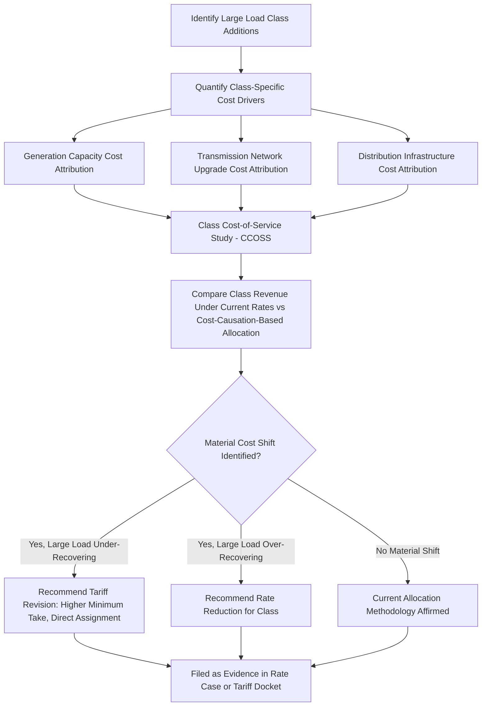

## Cost Shifting Analysis and Ratepayer Protection Studies

### Definition and Purpose

Cost shifting analysis and ratepayer protection studies are the analytical and evidentiary processes utility commissions, utilities, and intervenors use to determine whether — and to what extent — costs driven by large load and data center growth are being disproportionately borne by residential and small commercial ratepayers rather than by the large loads causing those costs. These studies form the evidentiary backbone underlying the cost-causation mandates embedded in dedicated large-load tariffs (see Dedicated Large Load and Data Center Tariff Design), minimum take-or-pay provisions, and ring-fencing mechanisms, translating the general legal principle of cost causation into quantified, case-specific findings a commission can act on.

### Core Analytical Framework

**Key Points**

- **Cost causation testing**: The foundational question — would this cost have been incurred "but for" the large load's addition to the system? Costs failing this test cannot be justifiably assigned to the large-load class alone; costs passing it are candidates for direct assignment or class-specific allocation.
- **Class cost-of-service study (CCOSS)**: Disaggregates total revenue requirement by customer class (residential, commercial, industrial, large load/data center) based on each class's demand, energy, and customer-related cost drivers, producing a class-specific rate of return that reveals whether any class is subsidizing another.
- **Marginal vs. embedded cost comparison**: Marginal cost studies estimate the incremental system cost caused by adding a specific increment of large load; embedded (historical/average) cost studies reflect the utility's existing revenue requirement. A gap between what a large-load class pays under embedded-cost allocation and what marginal cost analysis suggests it causes is the quantitative signature of cost shifting.
- **Load factor and coincidence factor analysis**: Because large loads (especially data centers) often have high, flat load factors and may or may not be coincident with system peak, their true capacity cost responsibility can diverge significantly from a simple energy-consumption-based allocation.

$$\text{Cost Shift}_{class} = \text{Embedded Cost Allocation}_{class} - \text{Marginal/Causation-Based Cost}_{class}$$

A positive value indicates the class is under-recovering its caused costs (i.e., being subsidized by other classes); a negative value indicates over-recovery (the class is subsidizing others).

### Legislative Mandates for Cost Shift Analysis

Several states have codified requirements for utilities or commissions to formally study and report on large-load cost shifting as a precondition to, or ongoing oversight of, dedicated tariff design:

**Example**

California's S.B. 57 (enacted October 2025) directs the California Public Utilities Commission to investigate whether utility costs associated with new loads from data centers result in cost shifts to other customers and to publish its findings by January 1, 2027 — explicitly mandating an investigatory cost-shift study as a statutory precursor to tariff or policy action, with the resulting task force recommendations expected to cover large-load tariffs, "Bring Your Own Capacity" and alternative capacity procurement methods, demand-side management tools, and interconnection process reform.

Oregon's HB 3546 requires any large-load tariff to mitigate the risk of other classes of retail electricity consumers paying unwarranted costs and unwarranted cost-shifting — embedding an implicit ongoing cost-shift analysis obligation into the commission's tariff oversight function rather than a one-time study.

Missouri's SB4 requires large-load tariff schedules to ensure customers' rates reflect a representative share of the costs incurred to serve them and prevent other customer classes' rates from reflecting any unjust or unreasonable costs arising from service to those customers — again functioning as a statutory cost-shift prevention standard that utilities must demonstrate compliance with in their tariff filings.

### Study Methodology Workflow

### Evidentiary Record Development in Rate Proceedings

Cost shifting analysis is typically developed through extensive contested-case evidentiary processes, reflecting the technical complexity and high financial stakes involved:

**Example**

Georgia's Public Service Commission held several public hearings in fall 2025 to determine how much new generation capacity should be built to serve large-load customers including data centers, with the hearings including nearly 25 hours of testimony from 17 sworn witnesses subject to cross-examination and 1,921 pages of pre-filed documents — illustrating the scale of technical and financial evidence typically required to support commission findings on cost causation and allocation for large-load-driven capital investment. Following these proceedings, the Commission ordered a freeze of Georgia Power base rates through 2028, explicitly framed around preventing new data centers from shifting costs to residential customers.

### Key Cost Categories Subject to Shift Analysis

**Key Points**

- **Generation capacity costs**: Whether new dispatchable or firm capacity built to serve large-load reliability needs is appropriately allocated to the large-load class versus rolled into system-wide generation rate base.
- **Transmission network upgrade costs**: Building on the interconnection cost responsibility framework — whether upgrades triggered by (or primarily benefiting) large load interconnections are directly assigned or socialized, and whether the socialization threshold is being applied consistently.
- **Distribution system costs**: Substation and feeder capacity additions specific to serving a large load's service territory.
- **Stranded cost risk premium**: An implicit or explicit cost category reflecting the risk that ratepayers bear if a large load defaults, underperforms, or exits — addressed primarily through collateral and ring-fencing mechanisms, but relevant to cost-shift studies evaluating whether those mechanisms are adequately sized.
- **Rate freeze and affordability offsets**: Some jurisdictions treat a rate freeze or moratorium (as in Georgia) as a direct ratepayer protection tool functioning alongside, rather than instead of, a formal cost-shift study, providing near-term ratepayer insulation while longer-term tariff and cost-allocation methodology is developed.

### Load Factor as a Central Analytical Variable

Because data centers typically exhibit high load factors — often cited in the 0.90–0.98 range [Inference — actual load factor varies materially by facility type, workload mix, and cooling architecture, and AI training workloads in particular have exhibited more volatile power draw profiles than traditional enterprise data centers; current facility-specific figures should be verified rather than assumed uniform] — compared to typical system-wide load factors of roughly 0.55–0.65, cost-shift studies must carefully distinguish energy-based cost causation from demand/capacity-based cost causation. A large load with a high load factor consumes a large share of total system energy relative to its contribution to system peak demand, meaning:

$$\text{Capacity Cost Responsibility Ratio} = \frac{\text{Class Contribution to Coincident Peak}}{\text{Class Share of Total Energy Consumption}}$$

A ratio significantly below 1 suggests the class may be over-allocated capacity-related costs under a simple energy-based allocation method, while other cost categories (transmission losses, certain fixed distribution costs) may show the opposite pattern — underscoring why cost-shift studies require granular, cost-category-specific analysis rather than a single blended allocation factor.

### Interaction with Demand Flexibility Analysis

Emerging cost-shift studies increasingly incorporate the ratepayer benefit of large-load demand flexibility as an offsetting factor:

**Example**

Pennsylvania's proposed statewide model tariff pairs cost-shift protection with incentive structures — including a provision allowing customers to reduce load by up to 20%, with adequate notice, after the initial contract term, and lower charges for customers with onsite generation, unused interconnection capacity, or interruptible service — reflecting an analytical conclusion that flexible large loads impose materially lower system cost than firm, inflexible load and should be priced accordingly to avoid over-allocating costs to loads that in fact reduce net system risk.

The same tariff proposal requires annual contributions to the host utility's hardship fund, with the minimum amount based on the customer's peak demand — an explicit mechanism linking cost-shift analysis findings directly to a low-income ratepayer protection instrument rather than solely to rate design.

### Consumer Advocate and Intervenor Role

Cost-shift analysis is frequently contested territory between utilities (which may have incentive to expand rate base through large-load-driven capital investment) and consumer/ratepayer advocates:

**Key Points**

- Utility-sponsored cost-shift studies may be challenged by independent consumer advocate staff or intervenor experts presenting alternative marginal cost methodologies or load forecast assumptions.
- Disputes frequently center on forecast credibility (see Load Growth Forecasting and System Planning Implications) — since a cost-shift finding is only as reliable as the underlying load forecast used to project future large-load cost drivers.
- Not all utility-specific proceedings resolve uniformly even within a single state: Oregon's large-load tariff order applied only to Portland General Electric, while a separate PacifiCorp/Pacific Power proceeding remained unresolved and faced challenges from consumer advocates — illustrating that cost-shift analysis outcomes and ratepayer protection adequacy can diverge significantly utility-by-utility even under a common statutory framework.

### Ongoing Monitoring and True-Up Mechanisms

Because load forecasts and large-load commercial outcomes evolve over multi-year contract terms, ratepayer protection increasingly requires periodic re-analysis rather than a single point-in-time study:

- **Class-specific true-up mechanisms**: Periodic reconciliation between large-load class cost causation and actual revenue collected, correcting for forecast error without waiting for a full general rate case.
- **Segregated regulatory accounting**: Tracking large-load-related capital additions, O&M, and revenue separately enables ongoing audit of whether cost-shift protections embedded in tariff design are functioning as intended over the life of long-term contracts (often 12–14+ years).

[Unverified — the frequency and formal procedural mechanism for periodic cost-shift re-analysis (annual filing, triennial review, or ad hoc upon material forecast deviation) is not standardized across jurisdictions and should be verified against each state commission's specific tariff or docket requirements.]

**Related Topics**

- Dedicated Large Load and Data Center Tariff Design
- Class Cost-of-Service Studies and Revenue Allocation Methodology
- Minimum Demand and Take-or-Pay Contract Provisions
- Collateral Requirements and Cost Ring Fencing
- Load Growth Forecasting and System Planning Implications
- Marginal Cost vs. Embedded Cost Ratemaking Methodologies
- Low-Income Ratepayer Protection Mechanisms in Rate Design