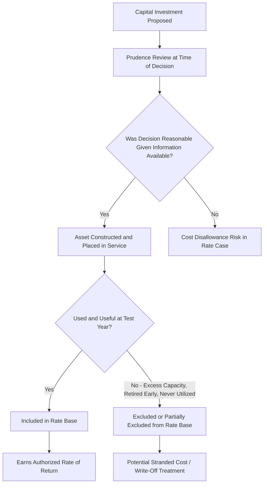

## Electric Utility Rate Base Characteristics

### Definition and Foundational Role

Electric utility rate base is the value of invested capital upon which a regulated utility is permitted to earn a return, forming the core input to the cost-of-service ratemaking formula. It represents the net investment in plant and equipment that is "used and useful" in providing electric service, and its determination directly drives the revenue requirement a utility is authorized to collect from ratepayers.

$$\text{Revenue Requirement} = (\text{Rate Base} \times \text{Rate of Return}) + \text{Operating Expenses} + \text{Depreciation} + \text{Taxes}$$

### Core Rate Base Components

**Key Points**

- **Gross plant in service**: The original cost of all utility plant — generation, transmission, distribution, and general plant — currently used and useful in providing service.
- **Accumulated depreciation**: Deducted from gross plant to reflect the portion of asset value already recovered through prior depreciation expense.
- **Construction Work in Progress (CWIP)**: Capital invested in facilities not yet placed in service; treatment varies significantly by jurisdiction (see below).
- **Working capital allowance**: An allowance for cash, materials and supplies, and prepayments needed to operate the utility day-to-day, typically calculated via a lead-lag study.
- **Deferred taxes and other rate base offsets**: Accumulated deferred income taxes (ADIT) are typically subtracted from rate base since they represent cost-free capital effectively provided by taxpayers/ratepayers through timing differences between book and tax depreciation.

$$\text{Rate Base} = \text{Gross Plant} - \text{Accumulated Depreciation} + \text{Working Capital} + \text{CWIP (if allowed)} - \text{ADIT} - \text{Contributions in Aid of Construction}$$

### Generation, Transmission, and Distribution Segmentation

**Example**

| Segment | Typical Rate Base Share | Key Characteristics |
| --- | --- | --- |
| Generation | Historically largest component for vertically integrated utilities; declining share where generation is deregulated or divested | Highly asset-specific; subject to fuel type risk, environmental compliance capital, and stranded cost exposure in restructured states |
| Transmission | Growing share, particularly with renewable interconnection and regional planning buildout | FERC-jurisdictional (formula rates common); subject to interconnection cost responsibility and regional cost allocation frameworks |
| Distribution | Stable, granular, customer-count-driven growth | State-jurisdictional; increasingly affected by DER integration, grid modernization, and large-load service territory upgrades |

[Inference] The relative share of each segment in total rate base varies substantially by utility structure (vertically integrated vs. restructured/deregulated) and by region, and no single "typical" percentage split applies uniformly across the industry.

### Used and Useful Standard

The foundational prudence and rate base inclusion standard requires that an asset be both:

1. **Used**: Actually placed in service and operating to provide utility service.
2. **Useful**: Reasonably necessary and not excessive or imprudent given demand and reliability needs at the time the investment decision was made.

### CWIP Treatment: A Jurisdiction-Specific Divergence

**Key Points**

- **CWIP excluded from rate base (traditional approach)**: The utility earns Allowance for Funds Used During Construction (AFUDC) instead — a non-cash accounting return capitalized into the asset's cost basis, recovered once the asset is placed in service and enters rate base.
- **CWIP included in rate base (some jurisdictions, particularly for large capital projects)**: The utility earns a current cash return during construction, improving cash flow and reducing financing costs, but shifting construction-period risk more directly onto current ratepayers rather than deferring it to future rate base recovery.
- Nuclear and other large, multi-year capital projects have historically been the primary drivers of CWIP-in-rate-base statutory authorization, given the scale of financing costs at stake during extended construction periods.

$$\text{AFUDC} = \text{CWIP Balance} \times \text{AFUDC Rate (approximating WACC)}$$

### Formula Rates vs. Traditional Rate Case Ratemaking

**Example**

- **Traditional (stated) rate case**: Rate base and revenue requirement are litigated and fixed in a formal proceeding, with rates remaining static until the next rate case is filed — creating regulatory lag between cost changes and rate recovery.
- **Formula rate**: Common for FERC-jurisdictional transmission rate base, where rate base and revenue requirement are recalculated annually (or more frequently) based on a pre-approved formula and updated actual cost data, reducing regulatory lag but requiring robust true-up and protest mechanisms to prevent over- or under-collection.

### Depreciation and Rate Base Erosion

Rate base is a net (depreciated) concept, meaning it naturally erodes over time as assets age unless offset by new capital additions:

$$\text{Rate Base}_{t+1} = \text{Rate Base}_t + \text{Capital Additions}_t - \text{Depreciation Expense}_t - \text{Retirements}_t$$

Depreciation rates and asset service lives are themselves subject to regulatory approval via depreciation studies, creating an important secondary ratemaking dispute distinct from rate base valuation itself: a longer assumed service life spreads recovery over more years (lower annual depreciation expense, slower rate base erosion), while a shorter assumed life accelerates recovery (higher annual expense, faster erosion) — with direct implications for both current rates and the pace of rate base decline for aging generation assets, particularly fossil generation facing early retirement pressure.

### Stranded Cost and Early Retirement Exposure

Electric utility rate base carries distinctive exposure to stranded cost risk when generation assets are retired before the end of their assumed depreciable life — increasingly relevant amid accelerating coal and, in some cases, gas plant retirements driven by economic, environmental, or policy factors:

**Key Points**

- **Securitization**: A growing mechanism allowing utilities to recover undepreciated plant balances for retired generation through utility-issued, ratepayer-backed bonds at a lower cost of capital than the utility's authorized ROE, reducing the total cost burden on ratepayers relative to continued cost-of-service recovery of the stranded balance.
- **Regulatory asset treatment**: Alternatively, undepreciated balances may be reclassified as a regulatory asset earning a (often reduced) return outside of traditional rate base, spreading recovery over a defined amortization period.
- **Prudence review of the original investment decision** remains relevant even at retirement — a plant prudently built decades earlier is not automatically disqualified from cost recovery merely because market or policy conditions later changed, though the specific recovery mechanism and allowed return may differ from standard rate base treatment.

### Contributions in Aid of Construction (CIAC) and Rate Base Netting

Cash or property contributed by customers (including large-load customers, per Interconnection Cost Responsibility) toward the cost of utility plant is generally netted against gross plant investment, reducing the rate base addition:

$$\text{Net Rate Base Addition} = \text{Gross Plant Cost} - \text{CIAC}$$

[Unverified — the tax treatment of CIAC under IRC Section 118 has been subject to legislative and IRS guidance changes over time, and whether a given contribution is treated as taxable income to the utility (requiring a "tax gross-up" from the contributing customer) should be verified against current tax code and IRS guidance rather than assumed uniform.]

### Weather Normalization and Test Year Selection

Rate base determination occurs within the context of a selected "test year" — historical, current, or forward-looking (future test year) — with generation and demand data normalized for weather to avoid basing revenue requirement calculations on atypical conditions:

**Key Points**

- **Historical test year**: Uses actual, completed-year data, often adjusted ("known and measurable changes") for changes occurring after the test year but before rates take effect.
- **Future/forecast test year**: Uses projected data for a future period, common in jurisdictions experiencing rapid load growth (including large-load-driven growth) where historical data would understate the utility's actual capital needs.
- The choice of test year methodology directly affects how large-load additions and associated capital investment are reflected in rate base — a historical test year may lag behind rapid data-center-driven capital deployment, creating pressure toward forecast test year adoption or interim rate mechanisms in high-growth service territories.

### Rate Base Offsets and Reductions

Beyond ADIT and CIAC, several other items commonly reduce gross rate base in the standard calculation:

- **Customer advances for construction**: Similar to CIAC but often refundable, requiring different accounting treatment than permanent contributions.
- **Excess deferred income taxes**: Arising from statutory tax rate changes (e.g., following federal corporate tax rate reductions), often amortized back to ratepayers over a prescribed period, temporarily affecting rate base and revenue requirement calculations.
- **Materials and supplies inventory**: Included as a working capital component, but subject to reasonableness review to prevent over-accumulation of inventory earning an unwarranted return.

**Related Topics**

- Used and Useful Standard and Prudence Review
- Construction Work in Progress (CWIP) Ratemaking Treatment
- Formula Rate Design for FERC-Jurisdictional Transmission
- Depreciation Studies and Asset Service Life Determination
- Securitization of Stranded Generation Costs
- Test Year Selection Methodology (Historical vs. Forecast)
- Accumulated Deferred Income Taxes (ADIT) in Rate Base Calculation
- Contributions in Aid of Construction and Tax Gross-Up Treatment