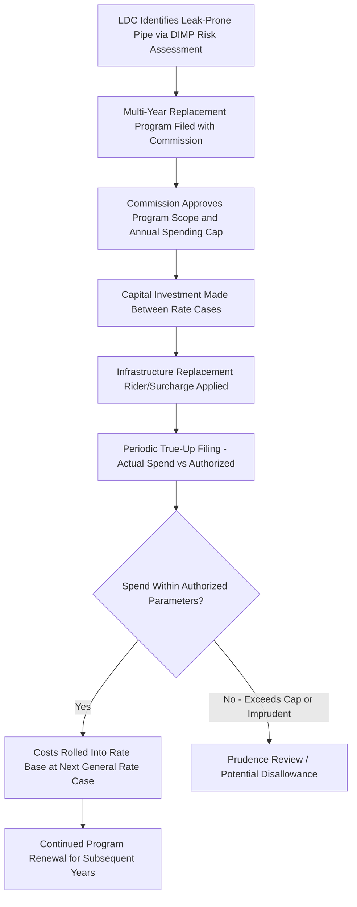

## Natural Gas Utility Rate Base and Pipeline Safety Cost Recovery

### Definition and Sector-Specific Context

Natural gas utility rate base follows the same core cost-of-service ratemaking framework as electric utilities — net invested capital earning an authorized return — but with distinctive characteristics driven by the physical nature of gas distribution infrastructure (buried pipe, much of it aging cast iron or bare steel) and a regulatory landscape heavily shaped by federal pipeline safety law. Pipeline safety cost recovery mechanisms have become one of the most significant rate base and revenue requirement drivers for gas local distribution companies (LDCs) over the past two decades, largely in response to high-profile pipeline incidents and subsequent federal and state safety mandates.

### Core Gas Rate Base Components

**Key Points**

- **Distribution mains and services**: The pipe network connecting the LDC's system to individual customers — the dominant rate base category for most gas LDCs, given the capital intensity of buried infrastructure.
- **Gate stations and pressure regulation equipment**: Facilities where gas transitions from transmission-level to distribution-level pressure.
- **Meters and regulators**: Customer-level equipment, often a target of accelerated replacement programs (e.g., AMI/smart meter deployment) with distinct cost recovery treatment.
- **Storage facilities**: Underground storage assets used for seasonal supply management, present in LDC rate base for utilities owning or operating storage directly rather than purchasing storage service from third parties.
- **General plant**: Administrative and operational support assets, analogous to the electric utility category.

$$\text{Gas Rate Base} = \text{Gross Distribution Plant} - \text{Accumulated Depreciation} + \text{Working Capital} - \text{ADIT} - \text{CIAC}$$

### Pipeline Safety Regulatory Framework

**Key Points**

- **Federal baseline**: The Pipeline and Hazardous Materials Safety Administration (PHMSA), under the Pipeline Safety Act and its amendments, sets minimum federal safety standards for gas distribution and transmission pipelines, including integrity management program requirements.
- **State delegation**: Most states operate PHMSA-certified state pipeline safety programs, giving state commissions direct regulatory authority (and often direct enforcement responsibility) over LDC safety compliance, distinct from — but coordinated with — their economic ratemaking authority.
- **Distribution Integrity Management Programs (DIMP)**: Federally mandated risk-based programs requiring LDCs to identify, assess, and mitigate risks across their distribution systems, including leak-prone pipe identification and replacement prioritization.
- **Post-incident regulatory tightening**: Major incidents (such as the 2010 San Bruno transmission pipeline explosion and the 2018 Merrimack Valley distribution over-pressurization incidents) have historically driven significant expansions in both federal PHMSA rulemaking and state-level safety-driven capital program mandates.

### Leak-Prone Pipe Replacement as a Rate Base Driver

**Example**

Cast iron and bare (unprotected) steel distribution pipe, much of it installed in the early-to-mid 20th century, represents a disproportionate share of gas system leaks and safety risk relative to its share of total system mileage. Accelerated replacement of this legacy infrastructure has become one of the largest sustained capital investment categories for many gas LDCs, particularly in older Northeast and Midwest urban gas systems with extensive pre-World War II distribution networks.

$$\text{Annual Replacement Rate Base Addition} = \text{Miles Replaced}_t \times \text{Unit Cost per Mile}$$

### Infrastructure Replacement Cost Recovery Mechanisms

Because leak-prone pipe replacement is capital-intensive, ongoing, and driven by safety compliance rather than discretionary growth, most states have authorized a dedicated cost recovery mechanism distinct from the traditional rate case cycle:

**Key Points**

- **Infrastructure replacement riders/trackers**: Allow the LDC to recover safety-driven capital investment through a surcharge mechanism between general rate cases, reducing regulatory lag for this specific, largely non-discretionary capital category — commonly termed DSIC (Distribution System Improvement Charge), SAVE (System Safety and Valve Enhancement), or similar state-specific naming conventions.
- **Spending caps and program scope limits**: Commissions typically bound rider-eligible spending to a defined annual cap (often expressed as a percentage of base rates) and a defined project scope (leak-prone pipe replacement, specific safety-related categories), preventing the rider mechanism from becoming a vehicle for general capital cost recovery outside normal rate case scrutiny.
- **True-up and reconciliation**: Periodic (often annual) reconciliation between rider revenue collected and actual eligible costs incurred, correcting for forecast error and preventing sustained over- or under-collection.
- **Eventual rate base roll-in**: Rider-recovered investment is typically incorporated into rate base at the next general rate case, at which point standard prudence and used-and-useful review applies to the accumulated investment.

### Prudence Review Distinctive to Safety-Driven Investment

Pipeline safety capital investment occupies a somewhat distinctive prudence review posture compared to discretionary growth capital: because the investment is substantially compelled by federal or state safety mandates (DIMP requirements, PHMSA integrity management rules, or state-specific leak-prone pipe replacement statutes), commissions generally apply a presumption of prudence to well-documented, mandate-compliant replacement spending, while still scrutinizing:

- **Cost per mile reasonableness**: Whether unit replacement costs are consistent with reasonable industry benchmarks and competitively procured contractor pricing.
- **Prioritization methodology**: Whether the LDC's risk-based prioritization (which pipe segments are replaced first) reflects genuine risk assessment rather than convenience or cost-minimization at the expense of higher-risk segments.
- **Pace of replacement**: Whether the replacement timeline appropriately balances safety urgency against ratepayer affordability, particularly in jurisdictions with aggressive multi-decade full-system replacement mandates.

[Inference] The specific balance between safety urgency and ratepayer cost impact in setting replacement pace targets is an area of ongoing policy tension in several states with large remaining leak-prone pipe inventories, and legislatively or commission-mandated completion timelines vary significantly by state rather than following a single national standard.

### Methane Emissions and Climate Policy Intersection

Leak-prone pipe replacement programs increasingly carry a dual justification beyond safety: methane leakage from aging distribution infrastructure is a growing focus of both federal EPA methane regulation and state climate policy, creating an additional (and sometimes contested) policy rationale layered onto traditional safety-driven cost recovery:

**Key Points**

- Some states have begun evaluating leak-prone pipe replacement programs partly through a greenhouse gas reduction lens, potentially affecting how aggressively replacement is mandated or how program costs are weighed against alternative decarbonization investments (e.g., electrification incentives, targeted pipe abandonment in lieu of replacement in certain low-density areas).
- This creates an emerging tension in some jurisdictions between "replace" and "manage decline" policy approaches for gas distribution systems facing long-term demand uncertainty tied to building electrification trends. [Unverified — the prevalence and specific regulatory posture of "managed decline" or targeted non-replacement policies varies significantly by state and is an actively evolving area of gas utility regulation that should be checked against current state commission proceedings.]

### Depreciation and Stranded Cost Considerations Specific to Gas

Gas LDC rate base faces a distinctive long-term risk profile relative to electric utility rate base: sustained, capital-intensive infrastructure replacement programs are being executed against a backdrop of longer-term demand uncertainty in jurisdictions pursuing aggressive electrification or building decarbonization policy, raising questions about whether newly replaced pipe will remain used and useful for its full assumed depreciable life:

$$\text{Potential Stranded Cost Exposure} = \text{Net Book Value of Replaced Pipe} \times P(\text{Premature System Retirement})$$

- **Accelerated depreciation proposals**: Some LDCs and stakeholders have proposed shortening assumed depreciable lives for newly installed gas infrastructure to reduce long-term stranded cost exposure, trading higher near-term depreciation expense (and rates) for reduced long-term risk.
- **Securitization and alternative recovery mechanisms**: Mechanisms analogous to electric utility stranded generation cost securitization have been discussed as potential tools for gas system cost recovery in a long-term managed-decline scenario, though [Unverified — as of available reference material, widespread adoption of gas-specific securitization mechanisms for this purpose was still nascent and should be verified against current state legislative and regulatory activity].

### Weatherization and Peak Demand-Driven Capital

Distinct from safety-driven replacement, gas LDCs also incur rate base additions tied to peak-day deliverability — pipeline capacity, compression, and storage sized to meet coldest-day demand rather than average demand, creating a capacity-cost-allocation dynamic conceptually similar to electric utility peak-demand-driven rate base additions, though gas systems typically exhibit more pronounced seasonal (winter-peaking) load shape extremes than electric systems in most regions.

**Related Topics**

- Electric Utility Rate Base Characteristics
- Distribution Integrity Management Programs (DIMP) and PHMSA Compliance
- Infrastructure Replacement Riders and Tracker Mechanisms (DSIC/SAVE)
- Used and Useful Standard and Prudence Review
- Methane Emissions Regulation and Gas System Decarbonization Policy
- Depreciation Studies and Accelerated Recovery for Stranded Cost Mitigation
- Securitization Mechanisms for Utility Cost Recovery